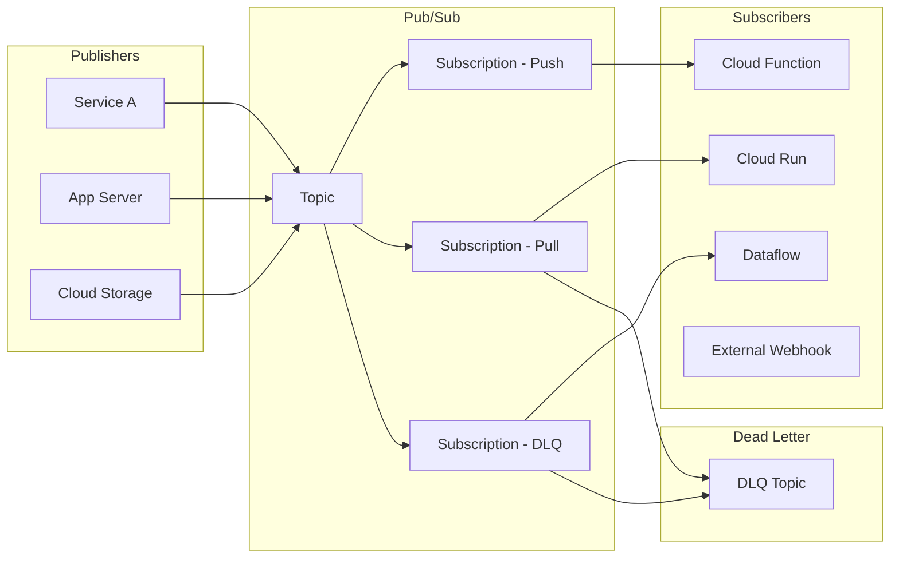

# Pub/Sub

## What is it?
Pub/Sub is a fully managed asynchronous messaging service that decouples publishers and subscribers. It provides at-least-once delivery, support for push and pull subscriptions, and global message routing.

## Why it was created
Distributed systems need reliable, scalable message delivery between services without tight coupling. Pub/Sub provides Google-scale messaging infrastructure (used internally by Google for billions of messages/day) with global routing and automatic scaling.

## When should you use it
- Decoupling microservices in event-driven architectures
- Streaming data ingestion (logging, events, metrics)
- Fan-out: deliver the same message to multiple subscribers
- Asynchronous workflows and background processing
- Triggering downstream processing via push endpoints
- Financial transactions requiring exactly-once delivery
- Integrating with Dataflow, Cloud Functions, and other GCP services

## Architecture



## Topics
- Named resource to which messages are published
- Messages can contain any binary data (max 10MB)
- A topic can have multiple subscriptions
- Topics are regional but can be configured with cross-region message storage
- No message ordering guarantee by default (enable ordering key for per-key ordering)

## Subscriptions (Push vs Pull)

| Feature | Pull | Push |
|---------|------|------|
| **Delivery** | Subscriber pulls messages | Pub/Sub pushes to endpoint |
| **Endpoint** | Any gRPC/REST client | HTTP/S endpoint (must be public or use auth) |
| **Auth** | IAM-based | IAM + OIDC tokens, service accounts |
| **Backpressure** | Flow control via modAck | Automatic (endpoint responds 200 or Pub/Sub retries) |
| **Scale** | Up to 10,000 pulls/sec per subscriber | Depends on endpoint capacity |
| **Best for** | Streaming, batch processing | Webhooks, Cloud Functions, serverless |

## Message Ordering
- **Ordering key**: Ensures messages with the same key are delivered in order within a region
- **Exactly-once delivery**: Guarantees no duplicates (topic + subscription level both need enabling)
- Ordering is per-key, not global
- Enabling ordering may reduce throughput (sequential delivery per key)

## Exactly-Once Delivery
- Prevents message duplication to subscribers
- Requires exactly-once delivery enabled on the subscription
- Each message gets a unique ID; Pub/Sub deduplicates
- Higher latency overhead than at-least-once
- Use for: payments, financial transactions, inventory updates

## Dead-Letter Topics
- Forward undeliverable messages to a dead-letter topic after N delivery attempts
- Maximum attempts configurable (5-100)
- Messages are not automatically removed from DLQ; must be replayed or archived
```bash
gcloud pubsub subscriptions create my-sub \
  --topic=my-topic \
  --dead-letter-topic=my-dlq \
  --max-delivery-attempts=10
```

## Retention
- **Message retention**: Unacknowledged messages retained up to 7 days
- **Topic retention**: Published messages retained in topic for replay (up to 31 days)
- By default, acknowledged messages are deleted; with topic retention, they can be replayed

## Schema Registry
- Define schemas for messages (Avro, Protocol Buffers)
- Enforce schema on publish or subscribe
- Backward/Forward compatibility checks
- Integrates with IAM for access control

## Pub/Sub Lite
- Zonal, lower cost, with configurable storage and throughput
- Designed for high-volume, predictable workloads
- No global routing, no cross-region replication
- Use when: throughput requirements are known and fixed, cost savings are needed
- Not: global event distribution, unpredictable scale

## Pub/Sub vs Kafka vs SQS

| Feature | Pub/Sub | Kafka | SQS |
|---------|---------|-------|-----|
| **Managed** | Fully managed | Self-hosted or Confluent (managed) | Fully managed |
| **Delivery** | At-least-once / exactly-once | At-least-once | At-least-once |
| **Ordering** | Per ordering key | Per partition | FIFO queues (per group) |
| **Retention** | Up to 7 days (sub) / 31 days (topic) | Configurable (days/weeks) | Up to 14 days |
| **Replay** | Yes (snapshots/seek) | Yes (offset reset) | No (can't re-consume) |
| **Auto-scaling** | Yes (infinite throughput) | Manual partition management | Configurable max |
| **Global** | Native (cross-region topics) | Cluster-bound | Per-region |
| **Latency** | <100ms | <10ms | <50ms |
| **Max message** | 10MB | 1MB | 256KB |

## Throughput Quotas
- **Publish**: 10,000 messages/second per topic (can be increased)
- **Pull**: 10,000 requests/second per subscription
- **Push**: 8,000 requests/second per subscription
- Default project quota: 10 MB/s publish, 10 MB/s subscribe
- Can request quota increases via GCP Console

## IAM Roles

| Role | Permissions |
|------|-------------|
| `roles/pubsub.publisher` | Publish to topics |
| `roles/pubsub.subscriber` | Pull messages, ack/nack messages |
| `roles/pubsub.viewer` | List topics, subscriptions, messages (metadata only) |
| `roles/pubsub.admin` | Full control |

## Hands-on Example

```bash
# Create topic
gcloud pubsub topics create my-topic

# Create pull subscription
gcloud pubsub subscriptions create my-sub \
  --topic=my-topic \
  --ack-deadline=60 \
  --message-retention-duration=7d

# Publish message
gcloud pubsub topics publish my-topic \
  --message="Hello, World!" \
  --attribute="key1=value1,key2=value2"

# Pull messages
gcloud pubsub subscriptions pull my-sub \
  --auto-ack \
  --limit=10

# Create push subscription to Cloud Run
gcloud pubsub subscriptions create push-sub \
  --topic=my-topic \
  --push-endpoint=https://my-service-uid-reg.a.run.app/push \
  --push-auth-service-account=sa@project.iam.gserviceaccount.com

# Create subscription with exactly-once delivery
gcloud pubsub subscriptions create eo-sub \
  --topic=my-topic \
  --enable-exactly-once-delivery

# Seek (replay) subscription to specific time
gcloud pubsub subscriptions seek my-sub \
  --time="2024-06-01T00:00:00Z"
```

## Pricing Model
- **Publish**: $40 per million messages (first 10GB/month free)
- **Subscribe**: Pull: $0 (free), Push: $40 per million messages
- **Data volume**: $0.04/GB for ingestion (first 10GB/month free)
- **Ack/nack**: $0 per million (free)
- **Snapshot/seek**: $10 per million operations
- **Pub/Sub Lite**: Lower, predictable per-throughput pricing (reserved capacity)

## Best Practices
- Use exactly-once delivery for financial transactions and inventory updates
- Use ordering keys when message order matters (per key)
- Set up dead-letter topics for all production subscriptions
- Use schema registry to enforce message compatibility
- Monitor subscription backlog (unacked message count) with Cloud Monitoring
- Use pull subscriptions for high-throughput workloads
- Use push subscriptions for serverless endpoints (Cloud Functions, Cloud Run)
- Enable topic retention for message replay capability
- Use Pub/Sub Lite for predictable, cost-sensitive workloads

## Interview Questions
1. Compare Pub/Sub vs Kafka for event streaming architectures
2. How does exactly-once delivery work in Pub/Sub?
3. What is the difference between push and pull subscriptions and when to use each?
4. How do dead-letter topics work and how should you configure them?
5. Design an event-driven microservices architecture using Pub/Sub with ordering and dead-letter handling

## Real Company Usage
- **Spotify**: Uses Pub/Sub for event-driven data pipelines and recommendations
- **Twitter**: Real-time event processing with Pub/Sub for notifications
- **Niantic**: Pokémon GO uses Pub/Sub for player event streaming
- **eBay**: Uses Pub/Sub for inventory update distribution across services
