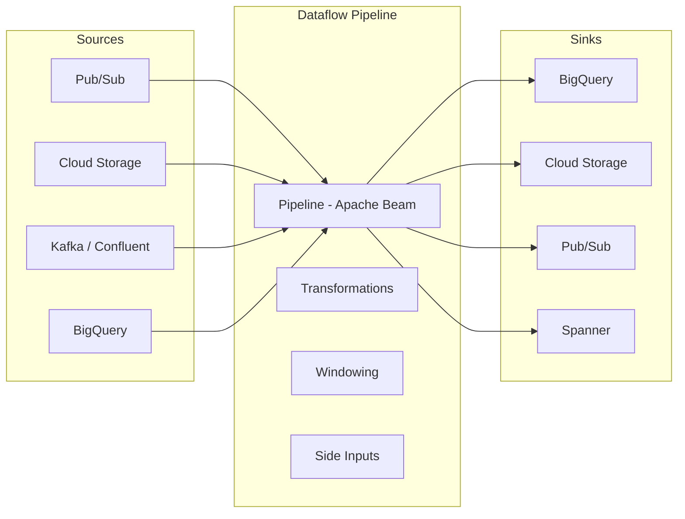

# Dataflow

## What is it?
Dataflow is a fully managed, unified stream and batch data processing service based on Apache Beam. It provides autoscaling, exactly-once processing, and horizontal auto-scaling across distributed workers.

## Why it was created
Batch and stream processing historically required separate systems (MapReduce for batch, Flink/Storm for stream). Apache Beam, originated by Google, unified the programming model. Dataflow provides a serverless execution engine for Beam pipelines.

## When should you use it
- ETL/ELT pipelines for data warehousing
- Real-time data processing from Pub/Sub, Cloud Storage, or Kafka
- Data enrichment and transformation
- Event-driven processing (real-time fraud detection, monitoring)
- Streaming analytics with windowing and aggregations
- Batch data processing at scale (Cloud Storage → BigQuery)
- Data migration and re-processing

## Architecture



## Batch vs Streaming

| Aspect | Batch | Streaming |
|--------|-------|-----------|
| **Input** | Bounded (file, table) | Unbounded (Pub/Sub, Kafka) |
| **Trigger** | Once | Continuous |
| **Windowing** | Global | Sliding, Fixed, Session, Global |
| **Watermarks** | Not needed | Required (late data handling) |
| **Pipeline type** | Batch | Streaming |
| **Cost** | Pay for duration | Pay for running + streaming premium |
| **When** | Nightly, hourly jobs | Real-time, sub-second |

## Autoscaling
- Automatically adjusts number of workers based on throughput, CPU, and backlog
- Batch: Starts with initial workers, scales up during processing, scales down at end
- Streaming: Scales continuously based on input rate and processing lag
- Can set min/max workers to control cost
- Scale-down based on CPU utilization < 75%

## Exactly-Once Processing
- Dataflow guarantees each record is processed exactly once
- Checkpointing: Periodic snapshots of pipeline state (streaming)
- Idempotent sinks (BigQuery, Spanner) support deduplication
- For non-idempotent sinks, use insert ID or deduplication logic

## Side Inputs
- Additional data (dict, list, PCollectionView) that enriches main pipeline data
- Loaded once and broadcast to all workers
- Good for: reference data, lookup tables, configuration data
```java
PCollectionView<Map<String, String>> sideInput = p.apply(...)
    .apply(View.asMap());
mainPCollection.apply(ParDo.of(new DoFn<>() {
    @ProcessElement
    public void process(@Element String elem, OutputReceiver<String> out,
                        ProcessContext c) {
        Map<String, String> lookup = c.sideInput(sideInput);
        out.output(lookup.get(elem));
    }
}).withSideInputs(sideInput));
```

## Windowing
- **Fixed windows**: Tumbling windows of fixed duration (e.g., every 5 minutes)
- **Sliding windows**: Overlapping windows (e.g., every minute over last 10 minutes)
- **Session windows**: Windows defined by activity gaps (e.g., user session with 30-min timeout)
- **Global window**: All data in one window (batch processing)

## Watermarks
- Estimated time when all data for a window is expected to arrive
- Dataflow estimates watermark based on source (Pub/Sub) and processing progress
- **Allowed lateness**: How long to wait for late-arriving data (in human-time, e.g., 10 minutes)
- Late data after the allowed period is dropped or sent to a dead-letter

## Dataflow vs Kafka Streams vs Kinesis Data Analytics

| Feature | Dataflow | Kafka Streams | Kinesis Data Analytics |
|---------|----------|---------------|------------------------|
| **Model** | Unified batch & stream | Stream-only | Stream-only (Flink) |
| **Programming** | Apache Beam SDK | Kafka Streams DSL | SQL, Java (Flink) |
| **Execution** | Serverless (Dataflow) | Embedded in app | Managed Flink |
| **Windowing** | Fixed, sliding, session | Fixed, sliding, session | Fixed, sliding, session |
| **Exactly-once** | Yes | Yes | Yes (Flink) |
| **State management** | Beam state API | RocksDB backed | Flink state |
| **Auto-scaling** | Automatic (up/down) | Manual (rebalancing) | Automatic |
| **Service integration** | Native GCP | Kafka ecosystem | AWS ecosystem |
| **Cost model** | Per worker hour | No infra cost | Per KPU (Kinesis Processing Unit) |

## FlexRS Pricing
- Discounted pricing for batch jobs with delayed execution (up to 6 hours)
- Up to 40% discount compared to on-demand
- Jobs are queued and executed when resources are available
- Best for: non-urgent batch processing, nightly ETL, backfills

## Hands-on Example

```python
# Python - Apache Beam pipeline (Word Count)
import apache_beam as beam
from apache_beam.options.pipeline_options import PipelineOptions

options = PipelineOptions([
    '--runner=DataflowRunner',
    '--project=my-project',
    '--region=us-central1',
    '--temp_location=gs://my-bucket/tmp',
])

with beam.Pipeline(options=options) as p:
    (p
     | 'Read' >> beam.io.ReadFromText('gs://my-bucket/input/*.txt')
     | 'Split' >> beam.FlatMap(lambda x: x.split())
     | 'Count' >> beam.combiners.Count.PerElement()
     | 'Write' >> beam.io.WriteToText('gs://my-bucket/output/counts')
    )
```

```bash
# Run Dataflow pipeline
python wordcount.py \
  --runner=DataflowRunner \
  --project=my-project \
  --region=us-central1 \
  --temp_location=gs://my-bucket/tmp/
```

```python
# Streaming pipeline from Pub/Sub to BigQuery
import apache_beam as beam

with beam.Pipeline(options=options) as p:
    (p
     | 'Read from Pub/Sub' >> beam.io.ReadFromPubSub(
           subscription='projects/my-project/subscriptions/my-sub')
     | 'Parse JSON' >> beam.Map(lambda x: json.loads(x.decode('utf-8')))
     | 'Window' >> beam.WindowInto(beam.window.FixedWindows(60))
     | 'Write to BigQuery' >> beam.io.WriteToBigQuery(
           table='my-project:dataset.table',
           schema='SCHEMA_AUTODETECT',
           write_disposition=beam.io.BigQueryDisposition.WRITE_APPEND,
           create_disposition=beam.io.BigQueryDisposition.CREATE_IF_NEEDED)
    )
```

## Pricing Model
- **Worker cost**: Per worker (vCPU + memory) per hour based on machine type
- **Streaming premium**: $0.01 - $0.06 per GB processed (in addition to worker cost)
- **FlexRS**: Up to 40% discount for batch jobs (queued execution)
- **Shuffle service**: $0.006/GB for batch (reduces worker disk I/O needs)
- **Data processed**: Free inter-service data transfer within same region
- **Minimum**: 1 worker streaming pipeline runs 24/7 (costs ~$500-1000/month)

## Best Practices
- Separate batch and streaming pipeline templates
- Use side inputs for reference data (not CoGroupByKey)
- Set appropriate disk size per worker (250GB default, increase for shuffle-heavy jobs)
- Use Pub/Sub for streaming source (native integration)
- Monitor with Dataflow Monitoring UI (step-level metrics)
- Use Cloud Profiler to identify bottlenecks
- Set max workers to control costs
- Use FlexRS for non-urgent batch workloads
- Avoid hot keys by salting (distribute processing across keys)

## Interview Questions
1. How does Dataflow achieve exactly-once processing in streaming pipelines?
2. Explain the difference between fixed, sliding, and session windows with examples
3. How do watermarks and allowed lateness handle late-arriving data?
4. Compare Dataflow vs Kafka Streams for a real-time event processing use case
5. Design a real-time fraud detection pipeline using Dataflow, Pub/Sub, and BigQuery

## Real Company Usage
- **Spotify**: Uses Dataflow for music recommendation pipeline processing
- **Twitter**: Real-time tweet processing and analytics with Dataflow
- **PayPal**: Fraud detection and transaction analytics on Dataflow
- **eBay**: ETL pipelines for data warehouse ingestion via Dataflow
