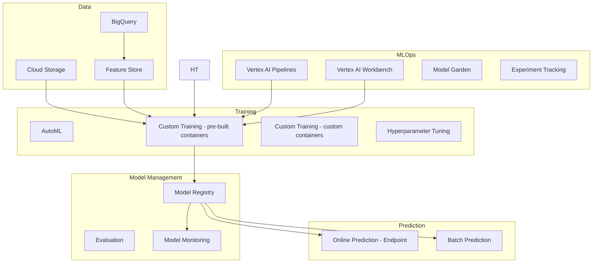

# Vertex AI

## What is it?
Vertex AI is Google Cloud's unified ML platform that integrates the entire ML workflow—from data preparation and training to deployment and monitoring—in a single service with AutoML, custom training, and MLOps capabilities.

## Why it was created
ML workflows previously required stitching together multiple services (AI Platform, AutoML, Data Labeling, etc.). Vertex AI unified these into a single platform with a consistent API, reducing complexity and improving developer productivity.

## When should you use it
- Building custom ML models from scratch
- Using AutoML for non-experts to create models without coding
- Deploying models for online (real-time) or batch prediction
- Managing the full ML lifecycle (experiment tracking, model registry, pipelines)
- Feature engineering and feature storage at scale
- Model monitoring for drift, fairness, and explainability

## Architecture



## AutoML
- Train high-quality models with minimal ML expertise (no-code)
- Supported types:
  - **Image**: classification, object detection, segmentation
  - **Text**: classification, entity extraction, sentiment analysis
  - **Tabular**: regression, classification, forecasting
  - **Video**: classification, action recognition, object tracking
- Automatically searches architectures, hyperparameters, and data splits
- Typically 20-50 training hours per model

## Custom Training
- **Pre-built containers**: Python, R, scikit-learn, XGBoost, TensorFlow, PyTorch
- **Custom containers**: Any ML framework or environment via Docker
- Machine types: Standard (n1/n2), GPU (A100, V100, T4, L4), TPU (v3, v4)
- Distributed training across multiple workers and GPUs

## Prediction (Online vs Batch)

| Feature | Online (Endpoint) | Batch |
|---------|-------------------|-------|
| **Latency** | < 100ms | Minutes to hours |
| **Input** | Single request (JSON) | File (JSONL, CSV, Avro) |
| **Output** | Real-time response | File-based output |
| **Scaling** | Auto-scale to zero | Parallel workers |
| **Cost** | Per prediction hour | Per worker hour |
| **Best for** | APIs, real-time inference | ETL, model evaluation |

## Model Registry
- Central repository for versioning models
- Track model lineage (training run → dataset → metrics)
- Deploy/undeploy specific model versions to endpoints
- Set default version for production
- Compare model versions by metrics (AUC, precision, recall)

## Vertex AI Pipelines
- Execute ML workflows as DAGs using Kubeflow Pipelines (TFX-compatible)
- Pre-built components for AutoML, custom training, BigQuery, Dataflow
- Each execution is tracked with metadata (parameters, metrics, artifacts)
- Can be scheduled, triggered by events, or run on demand
- Fully managed execution (no Kubernetes required)

## Feature Store
- Centralized feature repository for ML features
- **Online serving**: Low-latency access (Memorystore-backed, <10ms)
- **Offline serving**: BigQuery-backed for batch training
- Feature sharing across models reduces duplication
- Point-in-time correct lookups for training data
- Feature monitoring for drift and skew

## Model Monitoring
- **Feature drift**: Distribution changes in input features
- **Prediction drift**: Changes in model output distribution
- **Training-serving skew**: Difference between training data and live data
- Configurable alerting (email, Pub/Sub, Slack)
- Requires: training dataset snapshot, serving data logging

## Model Garden
- Curated collection of pre-trained foundation models
- Includes: Gemini, Gemma, Llama 2, Claude, Stable Diffusion, GPT-like models
- Models can be used as-is, fine-tuned, or deployed via Vertex AI
- Managed APIs for generative AI (text, chat, code, image)
- Pricing: per-character or per-image input/output

## Vertex AI Workbench
- Managed Jupyter notebooks with pre-installed ML frameworks
- Supports: JupyterLab, VS Code, RStudio
- Integrated with BigQuery, Dataflow, Cloud Storage
- Collaborative notebooks with version control
- Pre-built kernels for TensorFlow, PyTorch, R, Scikit-learn

## Hands-on Example

```bash
# Upload training data to Cloud Storage
gsutil cp training.csv gs://my-bucket/ml-data/

# Train AutoML tabular model
gcloud ai datasets create \
  --region=us-central1 \
  --display-name=my-dataset \
  --metadata-schema=gs://google-cloud-aiplatform/schema/dataset/ioformat/... \
  --data-item-schema=gs://google-cloud-aiplatform/schema/dataset/... \
  gs://my-bucket/ml-data/training.csv

# Create and run training pipeline
gcloud ai custom-jobs create \
  --region=us-central1 \
  --display-name=my-training-job \
  --worker-pool-spec=machine-type=n1-standard-4,replica-count=1,container-image-uri=gcr.io/cloud-aiplatform/training/tf-cpu.2-11:latest

# Deploy model to endpoint
gcloud ai endpoints create --region=us-central1 --display-name=my-endpoint

gcloud ai endpoints deploy-model my-endpoint \
  --region=us-central1 \
  --model=MODEL_ID \
  --display-name=my-model-deployment \
  --machine-type=n1-standard-2 \
  --min-replica-count=1 \
  --max-replica-count=5

# Online prediction
gcloud ai endpoints predict my-endpoint \
  --region=us-central1 \
  --json-request='{"instances": [[1.0, 2.0, 3.0, 4.0]]}'

# Batch prediction
gcloud ai batch-prediction-jobs create \
  --region=us-central1 \
  --model=MODEL_ID \
  --input-config=instancesFormat=jsonl,inputFile=gs://my-bucket/input.jsonl \
  --output-config=gcsDestination=outputDir=gs://my-bucket/predictions/
```

## Pricing Model
- **Training**: Per compute hour (vCPU + GPU + TPU) for custom training
- **AutoML**: Per hour of training time (varies by task type)
- **Prediction**: Per node hour for online endpoints; per worker hour for batch
- **Data labeling**: Per item labeled (images, text, video)
- **Model Garden**: Per character (text models) or per image (image models)
- **Vertex AI Pipelines**: Per execution
- **Feature Store**: Per node hour for online serving; per query for offline

## Best Practices
- Start with AutoML for quick baselines, then switch to custom training for optimization
- Use Vertex AI Pipelines for reproducible ML workflows
- Monitor models in production for drift and skew
- Use Feature Store to share features across models
- Version models in Model Registry and use rollout with traffic splitting
- Prefer custom containers for complex training environments
- Use batch prediction for large-scale offline inference
- Enable explainability for regulated industries (tabular models)

## Interview Questions
1. How does Vertex AI differ from AWS SageMaker and Azure Machine Learning?
2. Explain the difference between AutoML and custom training in Vertex AI
3. How does Vertex AI Model Monitoring detect training-serving skew?
4. What is the Feature Store and how does it support both online and offline serving?
5. Design an end-to-end ML pipeline using Vertex AI, including data prep, training, deployment, and monitoring

## Real Company Usage
- **Spotify**: Uses Vertex AI for music recommendation models
- **Twitter**: ML models for content moderation on Vertex AI
- **Niantic**: Trains and deploys ML models for augmented reality features
- **Walmart**: Uses Vertex AI for demand forecasting models
