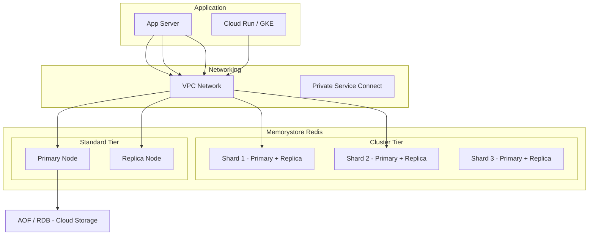

# Memorystore

## What is it?
Memorystore provides fully managed in-memory data stores for Redis and Memcached, supporting high-throughput, low-latency caching and data serving on GCP.

## Why it was created
Applications require sub-millisecond data access for caching, session management, and real-time analytics. Running Redis or Memcached yourself requires managing replication, failover, patching, and backups. Memorystore automates these tasks.

## When should you use it
- **Redis**: Session stores, caches, message queues, rate limiters, leaderboards (Sorted Sets), pub/sub messaging
- **Memcached**: Simple key-value caching for web applications (no persistence needed)
- Applications needing sub-millisecond read/write performance
- Offloading database reads with caching
- Real-time leaderboards and counters

## Architecture



## Redis vs Memcached

| Feature | Redis | Memcached |
|---------|-------|-----------|
| **Data structures** | Strings, lists, sets, sorted sets, hashes, streams, bitmaps | Simple key-value (strings) |
| **Persistence** | AOF (append-only file), RDB (snapshots) | None (ephemeral) |
| **Replication** | Primary-replica; Cluster mode for sharding | Memcached only (no replication) |
| **Transactions** | MULTI/EXEC, optimistic locking (WATCH) | None |
| **Lua scripting** | Yes | No |
| **Use case** | Caching + data structures + pub/sub | Simple caching only |
| **GCP tier options** | Standard (HA), Basic (standalone), Cluster | Single tier |

## Redis Cluster
- Horizontally shards data across multiple nodes (shards)
- Each shard has a primary + replica (in HA mode)
- Up to 300 shards (clusters up to 5TB+)
- Supports Redis Cluster API (client-side routing using hash slots)
- Use when: single node memory limit (300GB) is insufficient

## Persistence (AOF / RDB)

| Feature | AOF (Append-Only File) | RDB (Snapshot) |
|---------|------------------------|-----------------|
| **Granularity** | Per-write (append) | Periodic snapshot |
| **Data loss** | Minimal (1 sec of writes) | Last snapshot since |
| **Performance** | Writes slower | Snapshot overhead periodic |
| **Recovery** | Full replay on restart | Load snapshot file |
| **Default** | Recommended for production | Good for lower RPO |

- Memorystore enables AOF by default for Standard tier
- RDB backup can be exported to Cloud Storage
- Persistence must be enabled before use

## Maintenance Windows
- Automatic patching for Redis/Memcached version upgrades
- Configurable maintenance window (day + time)
- Maintenance for HA instances: primary-replica swap (seconds of latency spike)
- Maintenance for Basic instances: brief downtime (minutes)
- Notifications sent before scheduled maintenance

## Scaling

| Direction | How It Works | Downtime |
|-----------|-------------|----------|
| **Vertical (Redis)** | Increase node size (e.g., 1GB → 5GB) | None (HA) / brief (Basic) |
| **Vertical (Memcached)** | Increase node size | Brief |
| **Horizontal (Redis Cluster)** | Add shards | None (online resharding) |
| **Horizontal (Memcached)** | Can't add nodes to existing instance | Must create new instance |

- Vertical scaling: memory doubles (1 → 2 → 5 → 10 → 20 → 50 → 100 → 200 → 300 GB)
- Horizontal scaling: Redis Cluster only (add shards)

## Redis Labs Integration
- Redis Enterprise (by Redis Labs) available in GCP Marketplace
- Advanced features: Active-Active geo-replication, Redis on Flash, built-in search, JSON, graph modules
- Higher throughput and lower latency than Memorystore for specific workloads
- Use when: Memorystore feature set is insufficient (geo-replication, modules)

## VPC-Based Access
- Memorystore instances are accessible only within the same VPC network
- Not publicly accessible (no public IP) — security by design
- Access from other VPCs: use VPC peering or Shared VPC
- Access from on-premises: Cloud VPN or Cloud Interconnect
- Client must be in the same region (or closest region with higher latency)

## Hands-on Example

```bash
# Create Redis instance (Standard HA)
gcloud redis instances create my-redis \
  --size=5 \
  --region=us-central1 \
  --tier=standard \
  --redis-version=redis_7_0 \
  --maintenance-window-day=MONDAY \
  --maintenance-window-hour=03:00

# Get IP address
gcloud redis instances describe my-redis \
  --region=us-central1 \
  --format="value(host)"

# Create Redis Cluster
gcloud redis clusters create my-cluster \
  --region=us-central1 \
  --shard-count=3 \
  --replicas-per-shard=1 \
  --node-type=STANDARD_HA

# Export RDB backup to Cloud Storage
gcloud redis instances export my-redis \
  gs://my-bucket/redis-backup.rdb \
  --region=us-central1

# Import RDB backup
gcloud redis instances import my-redis \
  gs://my-bucket/redis-backup.rdb \
  --region=us-central1

# Create Memcached instance
gcloud memcache instances create my-memcache \
  --node-count=5 \
  --node-cpu=4 \
  --node-memory=6.5 \
  --region=us-central1
```

Connect from application:
```python
import redis

r = redis.Redis(
    host='10.0.0.3',  # Memorystore IP
    port=6379,
    decode_responses=True
)
r.set('key', 'value')
print(r.get('key'))
```

## Memorystore vs ElastiCache vs Azure Cache for Redis

| Feature | Memorystore | ElastiCache | Azure Cache for Redis |
|---------|-------------|-------------|-----------------------|
| **Redis Cluster** | Yes (native) | Yes (shards) | Yes (Premium tier) |
| **Geo-replication** | No (Redis Labs needed) | Global Datastore (Global Cluster) | Yes (Geo-replication) |
| **Persistence** | AOF + RDB (to Cloud Storage) | AOF + RDB (to S3) | AOF + RDB (to Blob) |
| **Maintenance window** | Configurable | Configurable | Configurable |
| **Access** | VPC-only (no public) | VPC + public (optional) | VNet + public (optional) |
| **Memcached** | Yes | Yes | No |
| **Max memory** | 300 GB (single) / 5TB+ (cluster) | 332 GB (single), 50TB+ (cluster) | 1.2 TB (Premium Cluster) |

## Pricing Model
- **Redis Standard (HA)**: Primary + replica; 2x cost of Basic tier
- **Redis Basic (standalone)**: Single node; lower cost, no HA
- **Redis Cluster**: Per-shard pricing + data transfer between shards
- **Memcached**: Per-node pricing
- **Storage**: Included in node cost (memory-based)
- **Egress**: Standard network egress charges
- **Backups**: Exported RDB files in Cloud Storage incur storage cost

## Best Practices
- Use Redis Standard tier for production (HA with replication)
- Use Redis Cluster when data exceeds 300GB or for higher write throughput
- Enable persistence (AOF) for production workloads
- Keep Memorystore in same region and VPC as application
- Use connection pooling (redis-py with pool, Lettuce with pool)
- Set eviction policy (`allkeys-lru` for caching, `noeviction` for data serving)
- Enable TLS for in-transit encryption
- Monitor with Cloud Monitoring (CPU, memory, connections)
- Use smaller keys (< 10KB) for better Redis performance

## Interview Questions
1. Compare Memorystore Redis Standard tier vs Basic tier vs Cluster tier
2. How does Redis persistence (AOF vs RDB) work and what are the trade-offs?
3. How do you connect to Memorystore from Compute Engine, GKE, and Cloud Run?
4. Compare Memorystore vs ElastiCache vs Azure Cache for Redis for a multi-region app
5. Design a caching strategy for a web application using Memorystore with Redis Cluster

## Real Company Usage
- **Snapchat**: Uses Memorystore for user session caching
- **PayPal**: Caches transaction data and session state in Memorystore
- **Niantic**: Pokémon GO uses Memorystore for real-time player state and leaderboards
- **Electronic Arts**: Game state caching with Memorystore Redis Cluster
