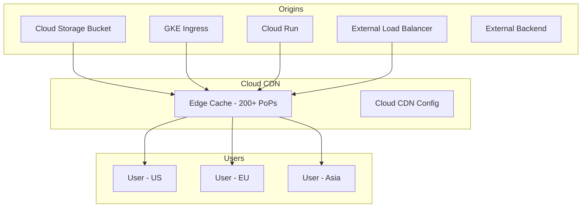

# Cloud CDN

## What is it?
Cloud CDN uses Google's globally distributed edge network to cache and deliver content close to users, reducing latency and offload from origin backends.

## Why it was created
Global applications need to deliver content (images, video, APIs) to users worldwide with minimal latency. Cloud CDN leverages Google's extensive edge network (200+ points of presence) to cache content at the network edge.

## When should you use it
- Accelerating delivery of static assets (images, CSS, JS, videos)
- Global API acceleration (caching API responses)
- Video streaming (on-demand or live)
- Software downloads (large files, installers, updates)
- Reducing load on backend origins
- DDoS mitigation and content delivery for web applications

## Architecture



## Cache Modes

| Mode | Behavior | Use Case |
|------|----------|----------|
| **FORCE_CACHE_ALL** | Cache all responses regardless of origin headers | Static content, media files |
| **USE_ORIGIN_HEADERS** | Respect Cache-Control headers from origin | Mixed content, cache TTL per object |
| **CACHE_DISABLED** | No caching | Dynamic APIs, personalized content |

## Cache Keys
- By default: URL (scheme + host + path + query string)
- **Cache key templates**: Customize what parts of the URL form the cache key
  - Include/exclude specific query parameters
  - Include protocol (HTTP vs HTTPS)
  - Include hostname
- **Cache key normalization**: Lowercase URL, strip trailing slash, etc.

## Signed URLs & Signed Cookies
- **Signed URLs**: Time-limited access to cached content; used per-file
- **Signed cookies**: Time-limited access to multiple files; set at domain level
- Require a CDN key (symmetric or asymmetric)
- Use for: paywalled content, user-specific downloads, temporary sharing
```bash
# Generate signed URL (using Cloud CDN key)
gcloud compute url-sign create \
  --key-name=my-key \
  --key-type=ed25519 \
  --expires=$(date -d "+1 hour" +%s) \
  https://cdn.example.com/file.zip
```

## CDN Interconnect
- Direct peering for high-volume content delivery
- Reduces egress costs for large-scale content publishers
- Requires Google Cloud Interconnect or Carrier Peering
- Use when: serving >10 TB/month from Cloud CDN

## Cloud CDN vs CloudFront vs Azure CDN

| Feature | Cloud CDN | CloudFront | Azure CDN |
|---------|-----------|------------|-----------|
| **Edge locations** | 200+ (Google network) | 600+ (AWS network) | 130+ (Microsoft + Verizon/Akamai) |
| **Origin types** | GCS, GKE, Cloud Run, LB, HTTP(s) | S3, EC2, ELB, Lambda, HTTP(s) | Blob, Azure App, VM, HTTP(s) |
| **Cache invalidation** | By URL pattern (wildcard) | By URL pattern / invalidation path | By URL pattern |
| **Signed URLs** | Yes (CDN keys, IAM) | Yes (CloudFront Key Pair) | Yes (CDN keys) |
| **DDoS protection** | Cloud Armor integrated | AWS Shield Standard/Advanced | Azure DDoS Protection |
| **Custom domains** | Yes (via LB) | Yes (CNAME + cert) | Yes (CNAME + cert) |
| **WebSockets** | Yes | Yes | Yes |
| **Lambda@Edge** | No | Yes (compute at edge) | No (Azure Front Door rules engine) |

## Origin Configurations

| Origin | Configuration | Notes |
|--------|---------------|-------|
| **Cloud Storage** | GCS bucket as NEG backend | Bucket must be public or have IAM for CDN |
| **GKE** | Ingress with GKE NEG | GKE Service with NEG enabled |
| **Cloud Run** | Serverless NEG | Cloud Run service as LB backend |
| **Load Balancer** | External HTTPS LB | Enables Cloud CDN on LB backend |
| **External** | Internet NEG | Any external HTTP(S) endpoint |

## Cache Invalidation
- Remove cached content from all edge locations
- By URL pattern: `/*`, `/images/*`, `/videos/*`
- Rate limit: ~250 invalidations/minute per project (default)
- Wildcard patterns supported (e.g., `/static/css/*`)
- Max 10,000 invalidations per month free; after that, cost per invalidation

## Hands-on Example

```bash
# Create external HTTPS load balancer with Cloud CDN
# 1. Create backend bucket (Cloud Storage origin)
gcloud compute backend-buckets create my-backend-bucket \
  --gcs-bucket-name=my-cdn-bucket \
  --enable-cdn \
  --cache-mode=FORCE_CACHE_ALL \
  --ttl=3600

# 2. Create URL map and target proxy
gcloud compute url-maps create my-cdn-lb \
  --default-backend-bucket=my-backend-bucket

gcloud compute target-https-proxies create my-https-proxy \
  --url-map=my-cdn-lb \
  --ssl-certificates=my-cert

# 3. Create forwarding rule
gcloud compute forwarding-rules create my-cdn-rule \
  --global \
  --target-https-proxy=my-https-proxy \
  --ports=443

# Invalidate cache
gcloud compute url-maps invalidate-cdn-cache my-backend-bucket \
  --path="/videos/*" \
  --async

# Create CDN key for signed URLs
gcloud compute backend-buckets add-signed-url-key my-backend-bucket \
  --key-name=my-key \
  --key-file=path/to/key.pem
```

## Pricing Model
- **Cache egress**: $0.02 - $0.08/GB depending on region (lower in Americas, higher in Asia/Australia)
- **Cache fill**: Standard egress pricing from origin to edge
- **Cache invalidation**: First 10,000/month free; $0.005 per path thereafter
- **Requests**: $0.0075 - $0.06 per 10,000 requests
- **No charge**: Cache storage (no per-GB cache storage cost)

## Best Practices
- Use FORCE_CACHE_ALL mode for static content
- Set appropriate cache TTLs (shorter for frequently changing content, longer for assets)
- Use signed URLs for private or paywalled content
- Enable Gzip/Brotli compression at origin for text content (10-20% larger cache)
- Invalidate cache selectively (wildcard patterns) not everything
- Use Cloud Armor in front of Cloud CDN for security policies
- Monitor cache hit ratio with Cloud Monitoring (target: >80%)
- Set up cache key templates to vary by important query params only

## Interview Questions
1. How does Cloud CDN caching work and what are the different cache modes?
2. Compare signed URLs vs signed cookies for access control with Cloud CDN
3. How do you set up Cloud CDN with Cloud Storage and an external HTTPS load balancer?
4. Compare Cloud CDN vs CloudFront vs Azure CDN for a global video streaming platform
5. How do you handle cache invalidation and what are its limitations?

## Real Company Usage
- **Niantic**: Pokémon GO uses Cloud CDN for game asset delivery globally
- **Spotify**: Album art and audio streaming via Cloud CDN
- **Genius**: Uses Cloud CDN for music lyrics and article delivery
- **King**: Game assets delivered via Cloud CDN (Candy Crush)
