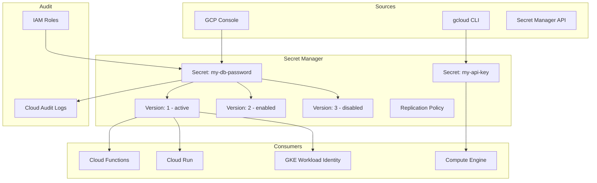

# Secret Manager

## What is it?
Secret Manager is a secure, convenient way to store and manage sensitive data such as API keys, database passwords, certificates, and other secrets.

## Why it was created
Hardcoding secrets in source code, config files, or environment variables is a major security risk. Secret Manager provides a centralized, audited, and access-controlled repository for secrets with automatic rotation and versioning.

## When should you use it
- Storing database passwords, API keys, TLS certificates
- Application configuration requiring secret injection at runtime
- CI/CD pipelines needing access to deployment secrets
- Multi-service environments sharing secrets across GCP services
- Compliance requirements requiring secrets to be encrypted and audited

## Architecture



## Secrets, Versions, and Replication

| Concept | Description |
|---------|-------------|
| **Secret** | Logical container for a secret (contains versions) |
| **Version** | Immutable payload; each version has state: enabled, disabled, destroyed |
| **Replication policy** | Where the secret material is stored: automatic (multi-region) or user-managed (specific regions) |

- Secrets have unique names per project
- Max 10,000 versions per secret
- Disabled/destroyed versions cannot be re-enabled
- 30-day grace period before destroyed versions are permanently deleted

## Replication Policies

| Policy | Description | Use Case |
|--------|-------------|----------|
| **Automatic** | Replicates to all GCP regions automatically | Global apps, simple setup |
| **User-managed** | Specify exact regions for replication | Compliance (GDPR, data residency) |

User-managed replication supports:
- `us-central1`, `europe-west1`, `asia-east1` (and other regions)
- Custom KMS keys per location

## Automatic Rotation
- Rotate secrets on a schedule (e.g., every 30, 60, 90 days)
- Rotation triggers Pub/Sub notifications to a rotation topic
- Application must watch for new secret versions and use them
- Rotation period configurable per secret
- Not automatic rotation of payload — application handles read of new version
```bash
gcloud secrets create my-secret \
  --replication-policy=automatic \
  --rotation-period=2592000s \
  --next-rotation-time="2025-01-01T00:00:00Z"
```

## IAM Integration
- Fine-grained roles: `secretmanager.secretAccessor`, `secretmanager.secretVersionManager`, `secretmanager.admin`
- Access at project level, secret level, or version level
- Conditional IAM: grant access based on resource name prefix, attributes
- Workload identity for GKE to access secrets without service account keys

## Secret Access Logging
- All access to secret data (not metadata) is logged in Cloud Audit Logs
- `Data Access` audit logs show who accessed which secret version
- Essential for compliance and security investigations
- Can be exported to BigQuery or Pub/Sub for analysis

## Secret Manager vs AWS Secrets Manager vs Azure Key Vault

| Feature | Secret Manager | AWS Secrets Manager | Azure Key Vault |
|---------|---------------|-------------------|------------------|
| **Secret storage** | API keys, passwords, certs | API keys, passwords, DB creds | Keys, secrets, certificates |
| **Automatic rotation** | Schedule-based (Pub/Sub notification) | Lambda-based rotation | Built-in cert rotation |
| **Replication** | Automatic or user-managed | Regional (Multi-region option) | Regional (paired region backup) |
| **Pricing** | $0.06 per secret/month + $0.03 per 10K operations | $0.40 per secret/month + $0.05 per 10K operations | $0.03 per 10K operations (secrets) |
| **Versioning** | Yes (immutable versions) | Yes (staging labels) | Yes (multiple versions) |
| **Integration** | Cloud Functions, Cloud Run, GKE, Compute Engine | Lambda, ECS, RDS, CodeBuild | Azure Functions, App Service, VMs |
| **Audit** | Cloud Audit Logs | CloudTrail | Azure Monitor / Log Analytics |

## Hands-on Example

```bash
# Create a secret
gcloud secrets create my-db-password \
  --replication-policy=automatic \
  --labels=env=prod,app=web

# Add a version
echo -n "SuperSecret123!" | gcloud secrets versions add my-db-password --data-file=-

# Add version from file
gcloud secrets versions add tls-cert --data-file=./cert.pem

# Access latest version
gcloud secrets versions access latest --secret=my-db-password

# Access specific version
gcloud secrets versions access 1 --secret=my-db-password

# Disable a version
gcloud secrets versions disable 2 --secret=my-db-password

# Destroy a version
gcloud secrets versions destroy 3 --secret=my-db-password

# Set IAM policy
gcloud secrets add-iam-policy-binding my-db-password \
  --member=serviceAccount:my-sa@project.iam.gserviceaccount.com \
  --role=roles/secretmanager.secretAccessor

# Reference in Cloud Run
gcloud run deploy my-service \
  --image=gcr.io/my-project/my-image \
  --update-secrets=DB_PASSWORD=my-db-password:latest
```

```python
# Python - Access Secret
from google.cloud import secretmanager

client = secretmanager.SecretManagerServiceClient()
response = client.access_secret_version(
    request={"name": "projects/PROJECT/secrets/my-secret/versions/latest"}
)
secret_string = response.payload.data.decode("UTF-8")
```

## Pricing Model
- **Secrets**: $0.06 per secret per month (active secrets with versions)
- **Operations**: $0.03 per 10,000 operations (access, add, list)
- **Replication**: No additional charge for automatic replication
- **Backup**: No separate backup charge (versions are immutable and durable)
- **Egress**: Standard network egress for cross-region access

## Best Practices
- Use Secret Manager for ALL secrets (no env variables, no config files)
- Enable automatic rotation for service account keys and DB passwords
- Use IAM conditions to scope access to specific secrets
- Monitor secret access with Cloud Audit Logs
- Never log or print secret values
- Use Workload Identity (GKE) instead of mounting secrets as env vars
- Replicate to only required regions (user-managed) for compliance
- Use labels to organize secrets by environment and application

## Interview Questions
1. How does Secret Manager handle versioning and what are the version states?
2. Compare Secret Manager vs AWS Secrets Manager vs Azure Key Vault
3. How does automatic rotation work and what is the application's role in rotation?
4. How would you securely inject secrets into Cloud Run, Cloud Functions, and GKE?
5. Design a secrets management strategy for a multi-environment GCP deployment

## Real Company Usage
- **Spotify**: Stores API keys and database credentials in Secret Manager
- **HSBC**: Uses Secret Manager with VPC Service Controls for compliance
- **Wix**: Manages TLS certificates and service account keys via Secret Manager
- **Niantic**: Game server credentials stored and rotated in Secret Manager
