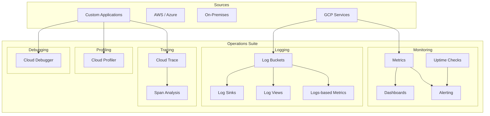

# Operations Suite (formerly Stackdriver)

## What is it?
Google Cloud Operations Suite is a comprehensive set of observability tools for monitoring, logging, tracing, profiling, and debugging applications running on GCP, AWS, Azure, or on-premises.

## Why it was created
Distributed systems and microservices generate massive amounts of telemetry data. Traditional monitoring tools (Nagios, Zabbix, JMX) couldn't scale or handle the complexity of modern architectures. Operations Suite provides unified observability across clouds.

## When should you use it
- Monitoring GCP resource health and performance
- Centralized logging for applications and infrastructure
- Alerting on metrics and log-based conditions
- Distributed tracing for microservices latency analysis
- CPU/memory profiling for performance optimization
- Debugging production code without stopping it
- Compliance logging (audit logs, access transparency)

## Architecture



## Cloud Monitoring

### Metrics
- **Platform metrics**: Pre-defined for all GCP services (CPU, memory, disk I/O, network, etc.)
- **Custom metrics**: Send application-specific metrics via API or agent
- **Metric types**: Gauge, Delta, Cumulative
- **Workspaces**: Monitoring data for multiple projects aggregated in a single view
- **Metric explorer**: Interactive tool for querying and charting metrics

### Dashboards
- Pre-built dashboards for common GCP services
- Custom dashboards with charts, tables, and scorecards
- Configurable time ranges (1h, 6h, 1d, 7d, 30d, custom)
- Geo-maps for visualizing data by region

### Alerting
- **Conditions**: Threshold (above/below), absence (missing data), rate of change, forecast
- **Notification channels**: Email, SMS, Pub/Sub, PagerDuty, Slack, Webhooks
- **Alert policies**: One policy can have multiple conditions and notification channels
- **Duration**: How long condition must be true before triggering
- **Documentation**: Attach runbook or incident response instructions
- **Notification rate limit**: Configurable minimum interval between notifications

### Uptime Checks
- HTTP/HTTPS, TCP, or SSL checks from multiple locations worldwide
- Check intervals: 1, 5, 10, or 15 minutes
- Locations: 20+ global regions (Americas, Europe, Asia, Australia)
- Latency and status code tracking

## Cloud Logging

### Log Buckets, Sinks, and Views

| Feature | Description |
|---------|-------------|
| **Log bucket** | Storage container for logs (_Default, _Required, custom) |
| **Log sink** | Route logs to Cloud Storage, BigQuery, Pub/Sub, or Splunk |
| **Log view** | Filtered subset of logs in a bucket (IAM-controlled) |
| **Log analytics** | SQL-based analysis of logs in BigQuery-enabled buckets |

- _Required bucket: Retention is 400 days (admin activity, data access, system events)
- _Default bucket: Retention is 30 days (all other logs)
- Custom buckets can have retention up to 3650 days (10 years)
- _Required bucket cannot be modified or deleted

### Logs-Based Metrics
- **Counter**: Count log entries matching a filter
- **Distribution**: Histogram of values extracted from log entries
- Can be used in alerting conditions or dashboards

## Cloud Trace

### Distributed Tracing
- End-to-end latency analysis for requests across services
- **Spans**: Individual operation within a trace; sent to Cloud Trace
- **Trace sampling**: Configurable rate (default 1/1000 requests)
- **Trace view**: Waterfall chart showing service call chain and latency
- **Analysis reports**: Latency distributions, throughput, error rate per service

### Latency Analysis
- Automatic instrumentation for: Google Cloud client libraries, gRPC, HTTP
- Manual instrumentation via OpenTelemetry or Trace API
- Identify bottlenecks, slow dependencies, and p99 latency
- Compare traces from different deployments or versions

## Cloud Profiler

### CPU / Memory Profiling
- Continuous, low-overhead profiling of CPU and memory usage
- Supported languages: Go, Java, Python, Node.js
- **CPU time**: Where the application spends CPU cycles
- **Heap memory**: Object allocations and memory consumption
- Wall time profiling (all Go, some Java)
- No code changes required (add agent to runtime)

### Profile Types

| Type | Description |
|------|-------------|
| **CPU Time** | Time spent in functions (sampling) |
| **Allocated Heap** | Objects allocated by function |
| **Heap (in-use)** | Memory currently in use |
| **Threads** | Thread count per function |
| **Contention** | Lock contention (Java only) |

## Cloud Debugger

### Snapshot Debugger
- Capture call stack and local variables of a running application at a specific line
- No stopping or slowing the application
- Supported: Java, Python, Node.js, Go, .NET, Ruby, PHP
- Useful for: investigating production bugs that are hard to reproduce
- Snapshots can capture up to 10 stack frames with local variables

### Limitations
- Only available for Compute Engine and GKE (not Cloud Run or Cloud Functions)
- Not suitable for high-throughput debug of every request (use for targeted investigation)
- Snapshots expire after 1 hour by default

## Hands-on Example

```bash
# Create custom dashboard
gcloud monitoring dashboards create \
  --config-from-file=dashboard.json

# Create alert policy
gcloud alpha monitoring policies create \
  --policy-from-file=alert-policy.json

# Simple alert policy (CPU > 80%)
cat > cpu-alert.yaml <<EOF
displayName: High CPU Alert
conditions:
- displayName: CPU > 80%
  conditionThreshold:
    filter: resource.type="gce_instance" AND metric.type="compute.googleapis.com/instance/cpu/utilization"
    thresholdValue: 0.8
    duration: 120s
  aggregations:
  - alignmentPeriod: 60s
    perSeriesAligner: ALIGN_MEAN
notificationChannels: []
EOF

gcloud alpha monitoring policies create --policy-from-file=cpu-alert.yaml

# Create log sink to BigQuery
gcloud logging sinks create my-bq-sink \
  bigquery.googleapis.com/projects/PROJECT/datasets/MY_DATASET \
  --log-filter="severity>=ERROR"

# Create logs-based metric
gcloud logging metrics create api-error-count \
  --description="Count of API errors" \
  --log-filter="httpRequest.status>=500"

# List logs
gcloud logging read "resource.type=gce_instance AND severity>=ERROR" \
  --limit=10 \
  --format=json

# Write custom log entry
gcloud logging write my-log "Hello from gcloud CLI" \
  --severity=NOTICE \
  --payload-type=json

# Enable trace for Cloud Run
gcloud run deploy my-service \
  --image=IMAGE \
  --set-env-vars=GOOGLE_CLOUD_TRACE_ENABLED=true

# Enable debugger (Python)
pip install google-cloud-debugger
# Add to code:
# import googleclouddebugger
# googleclouddebugger.enable(module='my-module', version='v1')
```

## Pricing Model
| Service | Free Tier | Paid Tier |
|---------|-----------|-----------|
| **Cloud Monitoring** | Metrics up to 150 GB | $0.025/GB for custom metrics; dashboards/alerting free |
| **Cloud Logging** | First 50 GB/month free ingestion | $0.50/GB ingestion; $0.01/GB storage |
| **Cloud Trace** | First 2 GB/month free (spans) | $0.12/GB ingested spans |
| **Cloud Profiler** | Free | Free |
| **Cloud Debugger** | 120 snapshots/day free | $0.01/additional snapshot |

## Best Practices
- Use log sinks to export logs to BigQuery for long-term analysis
- Set up alerting with notification channels for critical metrics (CPU > 80%, error rate > 1%)
- Enable Cloud Trace for all production services (low overhead, high value)
- Use Cloud Profiler during load testing to identify performance bottlenecks
- Use log-based metrics for application-level monitoring without custom code
- Create custom dashboards for each service team
- Use uptime checks for external-facing endpoints
- Monitor golden signals: latency, traffic, errors, saturation
- Set up log alerts for error rate spikes, security events

## Interview Questions
1. How do Cloud Monitoring, Cloud Logging, Cloud Trace, and Cloud Profiler work together for observability?
2. What are log sinks and log buckets, and how do you route logs to BigQuery or Pub/Sub?
3. How does Cloud Profiler work and why is it considered low-overhead?
4. What is Cloud Debugger and how does it help debug production applications?
5. Design an observability strategy for a microservices application running on GKE

## Real Company Usage
- **Twitter**: Monitors GCP workloads with Cloud Monitoring and Logging
- **PayPal**: Uses Cloud Trace for distributed tracing across payment services
- **Walmart**: Cloud Profiler for optimizing retail application performance
- **HSBC**: Cloud Logging with sinks to BigQuery for audit compliance
