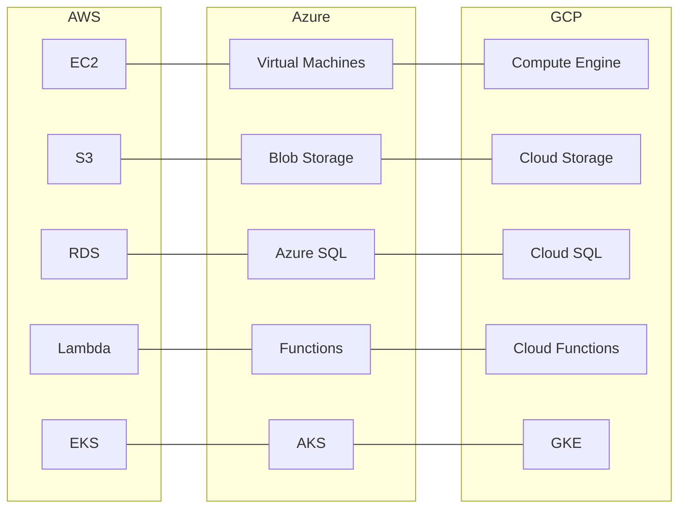

# Multi-Cloud Service Mapping

## Overview
A comprehensive mapping of equivalent services across AWS, Azure, and GCP. Essential for multi-cloud strategies, migrations, and certification studies.

## Compute

| Service | AWS | Azure | GCP |
|---------|-----|-------|-----|
| **Virtual Machines** | EC2 | Virtual Machines | Compute Engine |
| **Serverless Functions** | Lambda | Azure Functions | Cloud Functions |
| **Container Orchestration** | EKS | AKS | GKE |
| **Managed Containers** | ECS/Fargate | Container Instances | Cloud Run |
| **Auto Scaling** | Auto Scaling Groups | Scale Sets | Managed Instance Groups |
| **Spot/Preemptible Instances** | Spot Instances | Spot VMs | Preemptible/Spot VMs |
| **Bare Metal** | Bare Metal EC2 | Bare Metal VMs | Bare Metal Solution |
| **Edge Compute** | AWS Outposts | Azure Stack | Google Distributed Cloud |

## Storage

| Service | AWS | Azure | GCP |
|---------|-----|-------|-----|
| **Object Storage** | S3 | Blob Storage | Cloud Storage |
| **Block Storage** | EBS | Managed Disks | Persistent Disk |
| **File Storage** | EFS | Azure Files | Filestore |
| **Archival Storage** | S3 Glacier | Blob Archive Tier | Cloud Storage Archive |
| **Backup** | AWS Backup | Azure Backup | Backup and DR Service |
| **Transfer Appliance** | Snowball Edge | Data Box | Transfer Appliance |
| **Hybrid Storage** | Storage Gateway | StorSimple | — |

## Databases

| Service | AWS | Azure | GCP |
|---------|-----|-------|-----|
| **Relational (MySQL/Postgres)** | RDS | Azure SQL | Cloud SQL |
| **Managed Oracle** | RDS for Oracle | Oracle on Azure | Bare Metal |
| **NoSQL Document** | DynamoDB | Cosmos DB | Firestore |
| **NoSQL Wide Column** | Keyspaces (Cassandra) | Cosmos DB Cassandra API | Bigtable |
| **In-Memory Cache** | ElastiCache | Azure Cache for Redis | Memorystore |
| **Data Warehouse** | Redshift | Synapse Analytics | BigQuery |
| **Graph Database** | Neptune | Cosmos DB Gremlin | — |
| **Time Series** | Timestream | Time Series Insights | — |
| **Ledger Database** | QLDB | SQL Ledger | — |

## Networking

| Service | AWS | Azure | GCP |
|---------|-----|-------|-----|
| **Virtual Network** | VPC | Virtual Network | VPC |
| **Load Balancer (Layer 4)** | NLB | Load Balancer | External/Internal TCP/UDP LB |
| **Load Balancer (Layer 7)** | ALB | Application Gateway | HTTP(S) Load Balancer |
| **Global Load Balancer** | Route53 + CloudFront | Front Door | Global HTTP(S) LB |
| **CDN** | CloudFront | Azure CDN | Cloud CDN |
| **DNS** | Route53 | Azure DNS | Cloud DNS |
| **VPN** | VPN Gateway | VPN Gateway | Cloud VPN |
| **Direct Connection** | Direct Connect | ExpressRoute | Cloud Interconnect |
| **Firewall** | WAF + Shield | WAF + DDoS Protection | Cloud Armor |
| **API Gateway** | API Gateway | API Management | Apigee |

## Messaging & Streaming

| Service | AWS | Azure | GCP |
|---------|-----|-------|-----|
| **Queue** | SQS | Service Bus (Queue) | Pub/Sub |
| **Pub/Sub** | SNS | Service Bus (Topic) | Pub/Sub |
| **Event Bus** | EventBridge | Event Grid | Eventarc |
| **Streaming** | Kinesis | Event Hubs | Pub/Sub + Dataflow |
| **Workflow** | Step Functions | Logic Apps | Workflows |
| **Orchestration** | MWAA (Airflow) | Data Factory | Composer (Airflow) |

## Monitoring & Observability

| Service | AWS | Azure | GCP |
|---------|-----|-------|-----|
| **Metrics & Monitoring** | CloudWatch | Azure Monitor | Cloud Monitoring |
| **Logging** | CloudWatch Logs | Log Analytics | Cloud Logging |
| **Distributed Tracing** | X-Ray | Application Insights | Cloud Trace |
| **Profiling** | CodeGuru Profiler | Application Insights Profiler | Cloud Profiler |
| **Audit Logging** | CloudTrail | Activity Log | Cloud Audit Logs |
| **Uptime Monitoring** | Route53 Health Checks | Application Insights | Cloud Monitoring Uptime |
| **Incident Management** | AWS Incident Manager | — | — |

## Security & Identity

| Service | AWS | Azure | GCP |
|---------|-----|-------|-----|
| **Identity & Access** | IAM | Entra ID | Cloud IAM |
| **Directory Service** | Directory Service | Entra ID (Azure AD) | Cloud Identity |
| **Secrets Management** | Secrets Manager | Key Vault | Secret Manager |
| **HSM** | CloudHSM | Managed HSM | Cloud HSM |
| **KMS** | KMS | Key Vault (Keys) | Cloud KMS |
| **Certificate Manager** | ACM | Key Vault (Certs) | Certificate Authority Service |
| **Web App Firewall** | WAF | WAF | Cloud Armor |
| **DDoS Protection** | Shield | DDoS Protection | Cloud Armor |
| **Security Posture** | Security Hub | Defender for Cloud | Security Command Center |
| **Vulnerability Scanning** | Inspector | Defender Vulnerability Mgmt | Web Security Scanner |
| **Compliance** | Audit Manager | Compliance Manager | Assured Workloads |
| **SIEM** | — | Microsoft Sentinel | Chronicle |

## Developer Tools

| Service | AWS | Azure | GCP |
|---------|-----|-------|-----|
| **CI/CD** | CodePipeline | DevOps (Boards/Pipelines) | Cloud Build |
| **Infrastructure as Code** | CloudFormation | ARM Templates | Deployment Manager |
| **Terraform Support** | Native | Native | Native |
| **Git Repositories** | CodeCommit | Repos | Cloud Source Repos |
| **Artifact Registry** | ECR + CodeArtifact | Artifacts | Artifact Registry |
| **Configuration Mgmt** | Systems Manager (SSM) | Automation (Config) | — |

## Machine Learning & AI

| Service | AWS | Azure | GCP |
|---------|-----|-------|-----|
| **ML Platform** | SageMaker | Azure ML | Vertex AI |
| **Speech to Text** | Transcribe | Speech | Speech-to-Text |
| **Text to Speech** | Polly | TTS | Text-to-Speech |
| **Translation** | Translate | Translator | Translation AI |
| **Vision AI** | Rekognition | Computer Vision | Vision AI |
| **NLP** | Comprehend | Language | Natural Language |
| **Chatbots** | Lex | Bot Service | Dialogflow |
| **Document AI** | Textract | Form Recognizer | Document AI |
| **Search** | Kendra | Cognitive Search | Discovery Engine |
| **Recommendations** | Personalize | — | Recommendations AI |

## Migration

| Service | AWS | Azure | GCP |
|---------|-----|-------|-----|
| **Migration Hub** | Migration Hub | Azure Migrate | Migration Center |
| **Database Migration** | DMS | DMS | Database Migration Service |
| **Server Migration** | Server Migration Service | Azure Migrate | Migrate for Compute |
| **Data Transfer** | DataSync | AzCopy | Transfer Service |
| **Physical Transfer** | Snow Family | Data Box | Transfer Appliance |

## Interview Questions

1. How would you design a multi-cloud strategy to avoid vendor lock-in?
2. What factors influence the decision to use AWS vs Azure vs GCP for a given workload?
3. How do you handle data consistency across multiple cloud providers?
4. Design a disaster recovery solution spanning 2 cloud providers
5. What are the cost implications of a multi-cloud approach?
6. How do you manage IAM policies consistently across AWS, Azure, and GCP?
7. Compare the serverless offerings across the three major cloud providers
8. How would you migrate a monolith application from AWS to GCP with minimal downtime?
9. What networking challenges arise in multi-cloud architectures?
10. Compare the managed Kubernetes services (EKS vs AKS vs GKE)

## Related Topics
- [AWS Module](../10-AWS/README.md)
- [Azure Module](../11-Azure/README.md)
- [GCP Module](../12-GCP/README.md)
- [Terraform](../13-Terraform/01-iac-basics.md) — Multi-cloud IaC
- [DevOps](../14-DevOps/01-git-workflows.md) — Multi-cloud CI/CD
