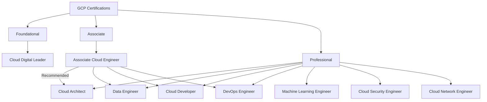

# GCP Certifications

## Learning Paths

### Foundational
| Certification | Code | Duration | Cost | Target |
|--------------|------|----------|------|--------|
| Cloud Digital Leader | — | 2-3 weeks | $99 | Beginners, non-technical |

### Associate Level
| Certification | Code | Duration | Cost | Target |
|--------------|------|----------|------|--------|
| Associate Cloud Engineer | — | 8-12 weeks | $125 | Engineers, operations |

### Professional Level
| Certification | Code | Duration | Cost | Target |
|--------------|------|----------|------|--------|
| Cloud Architect | — | 12-16 weeks | $200 | Architects |
| Data Engineer | — | 12-16 weeks | $200 | Data engineers |
| Cloud Developer | — | 12-16 weeks | $200 | Developers |
| DevOps Engineer | — | 12-16 weeks | $200 | DevOps engineers |
| Machine Learning Engineer | — | 12-16 weeks | $200 | ML engineers |
| Cloud Security Engineer | — | 12-16 weeks | $200 | Security engineers |
| Cloud Network Engineer | — | 12-16 weeks | $200 | Network engineers |
| Collaboration Engineer | — | 12-16 weeks | $200 | Workspace admins |

### Beta/Late Stage
| Certification | Duration | Cost |
|--------------|----------|------|
| Cloud Database Engineer | 12-16 weeks | $200 |
| LookML Developer | 8-12 weeks | $200 |
| Apigee API Engineer | 12-16 weeks | $200 |

## Recommended Study Order
1. Cloud Digital Leader → Associate Cloud Engineer → Professional Cloud Architect
2. Professional Cloud Developer → Professional DevOps Engineer
3. Specialty path based on domain

## Related Topics
- [AWS Certifications](../10-AWS/32-certifications.md)
- [Azure Certifications](../11-Azure/19-certifications.md)
