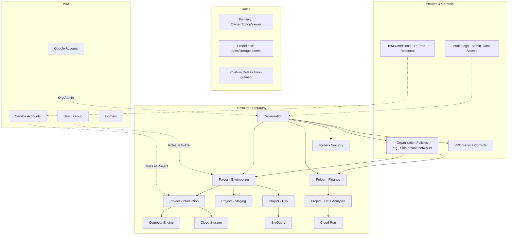

# GCP IAM & Resource Hierarchy

## What is it?
GCP's resource hierarchy (Organization → Folders → Projects → Resources) provides a tree structure for organizing cloud resources with inherited IAM policies at each level. IAM (Identity and Access Management) manages who (identity) has what access (role) to which resource, supporting primitive, predefined, and custom roles, service accounts, IAM conditions, and organization policies.

## Why it was created
As organizations scale their GCP usage, they need a structured way to organize projects, enforce policies, and manage access. Without a hierarchy, every project is isolated with no inheritance, making organization-wide policy enforcement impossible. The resource hierarchy enables policy inheritance, organizational structure mirroring, and centralized governance through Organization Policies and VPC Service Controls.

## When should you use it
- **Multi-project governance**: Enforce organization-wide policies across hundreds of projects
- **Access control**: Grant roles at the organization, folder, or project level with inheritance
- **Service-to-service auth**: Use service accounts for application authentication
- **Conditional access**: Restrict access based on IP address, time, resource attributes
- **Data exfiltration prevention**: Use VPC Service Controls to prevent data access from outside the perimeter
- **Quota management**: Monitor and manage API quota usage across the organization

## Architecture



## IAM Roles Comparison

| Type | Granularity | Example | Customizable |
|------|-------------|---------|--------------|
| **Primitive** | Broad — Owner, Editor, Viewer | roles/owner | No |
| **Predefined** | Service-specific — roles/storage.objectViewer | roles/bigquery.dataViewer | No |
| **Custom** | Fine-grained — user-defined permissions | myCompany.customRole | Yes |

## IAM Conditions

```bash
# Grant role with condition — only allow access from corporate IP range
gcloud projects add-iam-policy-binding my-project \
    --member=user:developer@company.com \
    --role=roles/compute.instanceAdmin \
    --condition='expression=request.time < timestamp("2025-12-31T23:59:59Z") && request.auth.claims.email.endswith("@company.com"),title=corp-access,description=Restrict to company email'

# Resource-based condition — only allow access to specific resources
gcloud projects add-iam-policy-binding my-project \
    --member=serviceAccount:deploy-sa@my-project.iam.gserviceaccount.com \
    --role=roles/storage.objectAdmin \
    --condition='expression=resource.name.startsWith("projects/_/buckets/prod-"),title=prod-buckets-only'
```

## Organization Policies

Organization policies provide centralized constraints that apply to all projects under a folder or organization.

```bash
# List available constraints
gcloud org-policies list --organization=123456789

# Set organization policy (disable serial port access)
gcloud org-policies set-policy policy.yaml --organization=123456789

# policy.yaml
constraint: constraints/compute.disableSerialPortAccess
listPolicy:
  allValues: DENY

# Set policy at folder level
gcloud org-policies set-policy policy.yaml --folder=987654321

# Create custom organization policy
gcloud org-policies set-custom-constraint \
    --organization=123456789 \
    --custom-constraint-file=custom-constraint.yaml
```

## Service Accounts

```bash
# Create a service account
gcloud iam service-accounts create deploy-sa \
    --display-name="Deployment Service Account"

# Grant service account roles
gcloud projects add-iam-policy-binding my-project \
    --member=serviceAccount:deploy-sa@my-project.iam.gserviceaccount.com \
    --role=roles/cloudbuild.builds.builder

# Create and download key
gcloud iam service-accounts keys create key.json \
    --iam-account=deploy-sa@my-project.iam.gserviceaccount.com

# Impersonate service account
gcloud compute instances create my-vm \
    --service-account=deploy-sa@my-project.iam.gserviceaccount.com \
    --scopes=https://www.googleapis.com/auth/cloud-platform

# Grant service account usage to user
gcloud iam service-accounts add-iam-policy-binding \
    deploy-sa@my-project.iam.gserviceaccount.com \
    --member=user:admin@company.com \
    --role=roles/iam.serviceAccountUser
```

## VPC Service Controls

Prevent data exfiltration by creating a secure perimeter around Google-managed services.

```bash
# Create access policy
gcloud access-context-manager policies create \
    --organization=123456789 \
    --title="My Perimeter"

# Create service perimeter
gcloud access-context-manager perimeters create prod-perimeter \
    --policy=policy-id \
    --title="Production Perimeter" \
    --resources="projects/12345,projects/67890" \
    --restricted-services="storage.googleapis.com,bigquery.googleapis.com" \
    --vpc-allowed-services="restricted.googleapis.com"
```

## Hands-on Example

```bash
# List organization
gcloud organizations list

# Create folder
gcloud resource-manager folders create \
    --display-name="Engineering" \
    --organization=123456789

# Create project in folder
gcloud projects create my-app-prod \
    --folder=987654321 \
    --name="My App Production"

# Set IAM policy
gcloud projects set-iam-policy my-app-prod policy.json

# Get IAM policy
gcloud projects get-iam-policy my-app-prod --format=json

# Create custom role
gcloud iam roles create customStorageAdmin \
    --project=my-app-prod \
    --title="Custom Storage Admin" \
    --description="Custom role for storage management" \
    --permissions=storage.objects.list,storage.objects.get,storage.buckets.get \
    --stage=GA

# Enable audit logs
gcloud projects add-iam-policy-binding my-app-prod \
    --member=group:auditors@company.com \
    --role=roles/logging.viewer

# View quotas
gcloud compute project-info describe --project=my-app-prod

# List all service accounts
gcloud iam service-accounts list --project=my-app-prod
```

## vs AWS IAM vs Azure RBAC

| Feature | GCP IAM | AWS IAM | Azure RBAC |
|---------|---------|---------|------------|
| **Resource hierarchy** | Org → Folder → Project → Resource | Organization → OU → Account → Resource | MG → Subscription → RG → Resource |
| **Policy inheritance** | Inherited down hierarchy | Through OUs and SCPs | Inherited through MG/Sub/RG scope |
| **Role types** | Primitive, Predefined, Custom | AWS managed, Customer managed | Built-in, Custom |
| **Organization policy** | Organization Policies (deny list) | SCPs (allow/deny list) | Azure Policy (deny/audit/modify) |
| **Service identities** | Service Accounts | IAM Roles | Managed Identities |
| **Conditions** | IAM Conditions (CEL) | IAM Conditions (JSON) | Azure Policy Conditions |
| **Audit** | Cloud Audit Logs | CloudTrail | Activity Log |
| **Data exfiltration** | VPC Service Controls | Not available | Azure Perimeter? |

## Pricing Model

- **IAM**: Free (no charge for roles, policies, or conditions)
- **Organization policies**: Free
- **Service accounts**: Free (up to 100 per project; 300 per project quota)
- **VPC Service Controls**: $0.05 per perimeter per hour ($36/month)
- **Audit logs**: Admin audit logs free; Data access logs: $0.01/GB ingested
- **IAM Recommendations**: Free (based on machine learning analysis)

## Best Practices
- **Use folders to mirror org structure**: Organize by team, environment, and business unit
- **Grant roles at the lowest level needed**: Prefer project or folder level over organization level
- **Use predefined roles over primitive roles**: Avoid Owner/Editor/Viewer — use service-specific roles
- **Use service accounts for applications**: Never use user credentials for service-to-service auth
- **Use IAM Conditions for just-in-time access**: Restrict access by IP, time, or resource attributes
- **Enable Organization Policies**: Set guardrails like disabling default VPCs and enforcing CMEK
- **Use VPC Service Controls**: Protect managed services from data exfiltration
- **Monitor IAM changes with Audit Logs**: Track all IAM policy changes for security review

## Interview Questions
1. What is the GCP resource hierarchy and how does IAM policy inheritance work?
2. Compare primitive, predefined, and custom IAM roles — when would you use each?
3. How do service accounts work and how do they differ from user accounts?
4. How do IAM Conditions restrict access based on IP, time, or resource attributes?
5. What are Organization Policies and what constraints can they enforce?
6. How do VPC Service Controls prevent data exfiltration?
7. Compare GCP IAM with AWS IAM and Azure RBAC
8. How do audit logs track IAM changes and data access?

## Real Company Usage
**Google** uses the GCP resource hierarchy to organize its own internal projects, with thousands of folders and projects governed by organization policies and IAM conditions. **Twitter** uses service accounts with IAM conditions for automated deployment pipelines. **Spotify** uses VPC Service Controls to protect their BigQuery data warehouse from data exfiltration.
