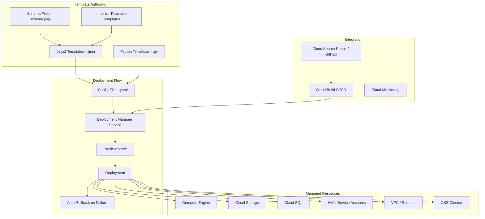

# GCP Deployment Manager

## What is it?
Cloud Deployment Manager is an Infrastructure as Code (IaC) service that allows you to define, deploy, and manage Google Cloud resources using declarative templates. It supports Jinja2 and Python template languages, provides preview mode for change validation, and manages resources as deployments with automatic rollback on failure.

## Why it was created
Manually provisioning GCP resources through the Console or CLI leads to configuration drift, inconsistent environments, and inability to reproduce infrastructure. Deployment Manager brings software engineering practices — version control, code review, and automated deployment — to GCP infrastructure management, similar to how CloudFormation works for AWS.

## When should you use it
- **Infrastructure as Code**: Define all GCP resources in version-controlled templates
- **Repeatable environments**: Create identical dev, staging, production environments
- **Modular deployments**: Use template imports and composition for reusable components
- **CI/CD for infrastructure**: Integrate with Cloud Build for automated deployments
- **Preview deployments**: Validate changes before applying them

## Architecture



## Template Example (Jinja2)

```jinja


resources:
  - name: {{ BASE_NAME }}-vpc
    type: compute.v1.network
    properties:
      autoCreateSubnetworks: false
      routingConfig:
        routingMode: REGIONAL

  - name: {{ BASE_NAME }}-subnet
    type: compute.v1.subnetwork
    properties:
      network: $(ref.{{ BASE_NAME }}-vpc.selfLink)
      region: {{ properties["region"] }}
      ipCidrRange: {{ properties["subnet_cidr"] }}
      privateIpGoogleAccess: true
    metadata:
      dependsOn:
        - {{ BASE_NAME }}-vpc

  - name: {{ BASE_NAME }}-instance
    type: compute.v1.instance
    properties:
      zone: {{ properties["zone"] }}
      machineType: zones/{{ properties["zone"] }}/machineTypes/{{ properties["machine_type"] }}
      disks:
        - deviceName: boot
          type: PERSISTENT
          boot: true
          autoDelete: true
          initializeParams:
            sourceImage: projects/debian-cloud/global/images/family/debian-12
      networkInterfaces:
        - network: $(ref.{{ BASE_NAME }}-vpc.selfLink)
          subnetwork: $(ref.{{ BASE_NAME }}-subnet.selfLink)
      serviceAccounts:
        - email: {{ properties["service_account"] }}
          scopes:
            - https://www.googleapis.com/auth/cloud-platform
    metadata:
      dependsOn:
        - {{ BASE_NAME }}-subnet
```

## Config File

```yaml
imports:
  - path: network.jinja
  - path: instance.jinja

resources:
  - name: network-template
    type: network.jinja
    properties:
      region: us-central1
      subnet_cidr: 10.0.0.0/24

  - name: instance-template
    type: instance.jinja
    properties:
      zone: us-central1-a
      region: us-central1
      machine_type: e2-medium
      subnet_cidr: 10.0.0.0/24
      service_account: my-sa@project.iam.gserviceaccount.com
```

## Python Template

```python
"""Generate Deployment Manager template for a managed instance group."""
def GenerateConfig(context):
    resources = []
    name = context.env['deployment']
    project = context.env['project']
    
    # Instance template
    resources.append({
        'name': f'{name}-template',
        'type': 'compute.v1.instanceTemplate',
        'properties': {
            'properties': {
                'machineType': context.properties.get('machineType', 'e2-medium'),
                'disks': [{
                    'boot': True,
                    'autoDelete': True,
                    'initializeParams': {
                        'sourceImage': 'projects/debian-cloud/global/images/family/debian-12'
                    }
                }],
                'networkInterfaces': [{
                    'network': context.properties['network']
                }]
            }
        }
    })
    
    # Managed instance group
    resources.append({
        'name': f'{name}-mig',
        'type': 'compute.v1.regionInstanceGroupManager',
        'properties': {
            'baseInstanceName': name,
            'region': context.properties['region'],
            'versions': [{
                'instanceTemplate': f'$(ref.{name}-template.selfLink)'
            }],
            'targetSize': context.properties.get('size', 3)
        }
    })
    
    return {'resources': resources}
```

## Hands-on Example

```bash
# Create deployment from config file
gcloud deployment-manager deployments create my-deployment \
    --config deployment.yaml

# Preview deployment (validate without creating resources)
gcloud deployment-manager deployments create my-deployment \
    --config deployment.yaml \
    --preview

# Update deployment
gcloud deployment-manager deployments update my-deployment \
    --config updated-deployment.yaml

# Cancel preview
gcloud deployment-manager deployments cancel-preview my-deployment

# List deployments
gcloud deployment-manager deployments list

# Describe deployment
gcloud deployment-manager deployments describe my-deployment

# Delete deployment and all resources
gcloud deployment-manager deployments delete my-deployment

# Delete but preserve resources
gcloud deployment-manager deployments delete my-deployment \
    --delete-policy ABANDON

# Create from Python template
gcloud deployment-manager deployments create advanced-deploy \
    --template template.py \
    --properties "region:us-central1,machineType:e2-standard-2"

# View logs
gcloud logging read "resource.type=deployment"
```

## vs Terraform

| Feature | Deployment Manager | Terraform |
|---------|-------------------|-----------|
| **Platform** | GCP-only | Multi-cloud (1500+ providers) |
| **Language** | Jinja2, Python, YAML | HCL (HashiCorp Configuration Language) |
| **State management** | GCP-managed (no state file) | Remote state (GCS, Terraform Cloud) |
| **Preview** | Built-in preview mode | plan command |
| **Rollback** | Automatic on failure | Manual or with custom scripts |
| **Modularity** | Template imports | Registry modules |
| **Versioning** | No built-in versioning | State versioning, provider constraints |
| **Testing** | No built-in testing | Terratest, OPA, Sentinel |
| **Community** | Small (GCP-only) | Large (multi-cloud) |
| **Best for** | GCP-only environments | Multi-cloud or multi-provider |

## Pricing Model

- **Deployment Manager**: **Free** — no charge for creating, updating, or deleting deployments
- **API calls**: Standard GCP API charges apply for resource provisioning
- **Preview mode**: No additional charge

## Best Practices
- **Use Jinja2 or Python templates**: Parameterize templates for reusability across environments
- **Use schema files**: Define input validation and constraints for template properties
- **Use imports**: Break complex deployments into reusable template modules
- **Preview before deploying**: Always use --preview to validate changes before applying
- **Version control templates**: Store all templates in Git with proper review process
- **Use environment-specific configs**: Maintain separate config files for dev/staging/prod
- **Set appropriate timeouts**: Use timeoutMinutes property for long-running resource creation
- **Integrate with Cloud Build**: Automate deployment validation and execution in CI/CD pipeline

## Interview Questions
1. How does Deployment Manager compare to GCP Terraform and AWS CloudFormation?
2. What template languages does Deployment Manager support and how do they differ?
3. How does preview mode work and how does it differ from Terraform plan?
4. How do template imports enable modular infrastructure composition?
5. How does Deployment Manager handle deployment failures and rollback?
6. What is the difference between delete and abandon on deployment deletion?
7. How would you parameterize a Deployment Manager template for multiple environments?
8. How does Deployment Manager handle dependencies between resources?

## Real Company Usage
**Google** uses Deployment Manager internally for provisioning many of its own GCP infrastructure components. **Niantic** (Pokemon GO) used Deployment Manager for managing their GCP game infrastructure before migrating to Terraform for multi-cloud support. **Evernote** uses Deployment Manager for their core GCP infrastructure with reusable template libraries.
