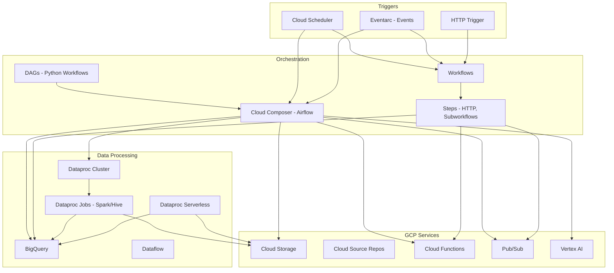

# GCP Composer, Dataproc & Workflows

## What is it?
Cloud Composer is a fully managed Apache Airflow service for workflow orchestration. Cloud Dataproc is a managed Spark/Hive service for big data processing. Workflows is a serverless orchestration service for connecting GCP services in sequential or parallel steps with built-in error handling and retries.

## Why they were created
Composer eliminates the operational burden of managing Airflow infrastructure (schedulers, workers, databases, monitoring). Dataproc provides a fast, managed environment for Spark/Hive/Trino without cluster management overhead. Workflows was created for simple, serverless service orchestration when a full Airflow deployment is overkill — it handles HTTP calls, branching, and error handling without any infrastructure.

## When should you use them
- **Composer**: Complex DAGs with dependencies, sensors, GCP operators, SLA monitoring
- **Dataproc**: Spark/SparkSQL batch processing, machine learning pipelines, ETL jobs
- **Workflows**: Lightweight orchestration of HTTP APIs, services, and conditional branching
- **Combined**: Workflows for simple pipelines, Composer for complex DAG orchestration, Dataproc for big data processing

## Architecture



## Composer — DAG Example

```python
from airflow import DAG
from airflow.providers.google.cloud.operators.dataproc import DataprocSubmitJobOperator
from airflow.providers.google.cloud.operators.gcs import GCSListObjectsOperator
from airflow.providers.google.cloud.sensors.gcs import GCSObjectExistenceSensor
from datetime import datetime, timedelta

default_args = {
    'owner': 'data-team',
    'depends_on_past': False,
    'start_date': datetime(2025, 1, 1),
    'email_on_failure': True,
    'retries': 2,
    'retry_delay': timedelta(minutes=5),
}

with DAG(
    'daily_sales_etl',
    default_args=default_args,
    schedule_interval='0 2 * * *',
    catchup=False,
    tags=['etl', 'sales'],
) as dag:

    # Wait for source files
    wait_for_source = GCSObjectExistenceSensor(
        task_id='wait_for_source_files',
        bucket='sales-raw',
        object='daily/sales_{{ ds_nodash }}.csv',
    )

    # Submit Spark job to Dataproc
    spark_job = {
        'reference': {'job_id': 'sales-etl-{{ run_id }}'},
        'placement': {'cluster_name': 'etl-cluster'},
        'spark_job': {
            'main_class': 'com.company.SalesETL',
            'jar_file_uris': ['gs://code-artifacts/sales-etl.jar'],
            'args': ['--input=gs://sales-raw/daily/sales_{{ ds_nodash }}.csv',
                     '--output=gs://sales-transformed/daily/',
                     '--date={{ ds }}']
        }
    }

    run_spark = DataprocSubmitJobOperator(
        task_id='run_sales_etl',
        job=spark_job,
        region='us-central1',
    )

    # Load to BigQuery
    load_to_bq = GCSToBigQueryOperator(
        task_id='load_to_bigquery',
        bucket='sales-transformed',
        source_objects=['daily/sales_{{ ds_nodash }}/*.parquet'],
        destination_project_dataset_table='analytics.sales_daily',
        source_format='PARQUET',
        write_disposition='WRITE_TRUNCATE',
        autodetect=True,
    )

    wait_for_source >> run_spark >> load_to_bq
```

## Dataproc — Clusters, Jobs, Serverless

```bash
# Create Dataproc cluster
gcloud dataproc clusters create etl-cluster \
    --region us-central1 \
    --zone us-central1-a \
    --master-machine-type n2-standard-4 \
    --worker-machine-type n2-standard-4 \
    --num-workers 5 \
    --image-version 2.1-debian11 \
    --optional-components DOCKER,JUPYTER \
    --properties spark:spark.executor.cores=4,spark.executor.memory=8g \
    --enable-component-gateway

# Submit Spark job
gcloud dataproc jobs submit spark \
    --region us-central1 \
    --cluster etl-cluster \
    --class com.company.SalesETL \
    --jars gs://code-artifacts/sales-etl.jar \
    -- --input=gs://sales-raw/input.csv --date=2025-01-15

# Submit Hive job
gcloud dataproc jobs submit hive \
    --region us-central1 \
    --cluster etl-cluster \
    --execute "
        CREATE EXTERNAL TABLE IF NOT EXISTS sales_raw (
            order_id STRING, amount DOUBLE, order_date DATE
        ) STORED AS PARQUET LOCATION 'gs://sales-raw/';
        
        INSERT OVERWRITE TABLE analytics.daily_sales
        SELECT order_date, SUM(amount) as total
        FROM sales_raw
        WHERE order_date = '2025-01-15'
        GROUP BY order_date;
    "

# Dataproc Serverless (no cluster management)
gcloud dataproc batches submit spark \
    --region us-central1 \
    --batch-id sales-batch \
    --class com.company.SalesETL \
    --jars gs://code-artifacts/sales-etl.jar \
    --deps-bucket gs://dependencies \
    --history-server-cluster projects/my-project/regions/us-central1/clusters/history \
    -- --input=gs://sales-raw/input.csv

# Delete cluster
gcloud dataproc clusters delete etl-cluster --region us-central1
```

## Workflows — Steps, Conditions, Subworkflows

```yaml
main:
  params: [input]
  steps:
    - init:
        assign:
          - input_file: ${input.file}
          - output_bucket: "gs://transformed-data"
          - status: "pending"
    
    - validate_input:
        try:
          call: sys.log
          args:
            severity: INFO
            text: ${"Processing file: " + input_file}
        except:
          as: e
          steps:
            - handle_validate_error:
                raise: ${e}
    
    - check_file_exists:
        call: googleapis.storage.v1.objects.get
        args:
          bucket: raw-data
          object: ${input_file}
        result: file_metadata
    
    - process_data:
        call: run_dataproc_job
        args:
          input_file: ${input_file}
          output_bucket: ${output_bucket}
          date: ${input.date}
        result: job_result
    
    - load_to_bigquery:
        call: googleapis.bigquery.v2.jobs.insert
        args:
          projectId: ${sys.get_env("GOOGLE_CLOUD_PROJECT_ID")}
          body:
            configuration:
              load:
                destinationTable:
                  projectId: ${sys.get_env("GOOGLE_CLOUD_PROJECT_ID")}
                  datasetId: analytics
                  tableId: daily_sales
                sourceUris: ["${output_bucket + '/' + input.date + '/*.parquet'}"]
                sourceFormat: PARQUET
                writeDisposition: WRITE_TRUNCATE
    
    - notify:
        call: googleapis.cloudfunctions.v1.projects.locations.functions.call
        args:
          name: projects/my-project/locations/us-central1/functions/notify
          data:
            status: "success"
            file: ${input_file}

    - return_result:
        return:
          status: "success"
          job_id: ${job_result}

## Subworkflow
subworkflows:
  run_dataproc_job:
    params: [input_file, output_bucket, date]
    steps:
      - submit_job:
          call: googleapis.dataproc.v1.projects.regions.jobs.submit
          args:
            projectId: ${sys.get_env("GOOGLE_CLOUD_PROJECT_ID")}
            region: us-central1
            body:
              job:
                placement:
                  clusterName: etl-cluster
                sparkJob:
                  mainClass: com.company.SalesETL
                  jarFileUris: ["gs://code-artifacts/sales-etl.jar"]
                  args: ["--input=gs://raw-data/${input_file}",
                         "--output=${output_bucket}",
                         "--date=${date}"]
          result: job_response
      - return:
          ${job_response.jobId}
```

## Hands-on Example

```bash
# Create Composer environment
gcloud composer environments create my-composer \
    --location us-central1 \
    --image-version composer-3-airflow-2.9.1 \
    --node-count 3 \
    --environment-size small \
    --network default \
    --subnetwork default

# Upload DAG to Composer
gcloud composer environments storage dags import \
    --environment my-composer \
    --location us-central1 \
    --source daily_sales_etl.py

# Create Workflow
gcloud workflows deploy daily-sales-pipeline \
    --source=workflow.yaml \
    --service-account=wf-sa@project.iam.gserviceaccount.com

# Execute Workflow
gcloud workflows execute daily-sales-pipeline \
    --data='{"file":"sales_2025-01-15.csv","date":"2025-01-15"}'

# List Workflow executions
gcloud workflows executions list daily-sales-pipeline

# Composer Airflow CLI
gcloud composer environments run my-composer \
    --location us-central1 \
    list_dags -- -dt
```

## Pricing Model

| Service | Pricing |
|---------|---------|
| **Composer** | $0.15–$2.20/hr per environment + Airflow infra costs |
| **Dataproc (standard)** | $0.01/vCPU/hr + compute cost (min 1/hr per cluster) |
| **Dataproc Serverless** | $0.05/1K vCPU-seconds (min 10 vCPU-min) |
| **Workflows** | $0.01/step execution + $0.01/active hour (first 5K steps free/month) |

## Best Practices
- **Composer**: Use Airflow variables and connections for config, not hardcoded values
- **Composer**: Set appropriate retry policies on tasks that depend on external services
- **Dataproc**: Use preemptible/spot VMs for worker nodes to reduce costs by 60-80%
- **Dataproc**: Enable auto-scaling based on YARN memory utilization
- **Dataproc**: Use Dataproc Serverless for batch ETL jobs to eliminate cluster management
- **Workflows**: Use subworkflows for reusable orchestration patterns
- **Workflows**: Implement error handling with try/except/retry for HTTP call failures
- **Workflows**: Keep execution time under 30 minutes for long-running operations

## Interview Questions
1. Compare Cloud Composer (Airflow), Workflows, and Cloud Functions for orchestration
2. How do Dataproc clusters differ from Dataproc Serverless?
3. How does Composer's Airflow DAG define dependencies and scheduling?
4. What are Dataproc workflow templates and how do they simplify job submission?
5. How does Workflows handle error handling and retries?
6. How would you design a data pipeline that uses Composer + Dataproc + BigQuery?
7. What are the benefits of using Dataproc with preemptible VMs?
8. How does Workflows integrate with Cloud Scheduler for scheduled execution?

## Real Company Usage
**Spotify** uses Dataproc for large-scale music recommendation processing, running thousands of Spark jobs daily. **Twitter** uses Composer to orchestrate their data pipeline DAGs, managing complex dependencies across BigQuery, Dataproc, and Dataflow. **GitLab** uses Workflows for automating operational runbooks and service orchestration across their GCP infrastructure.
