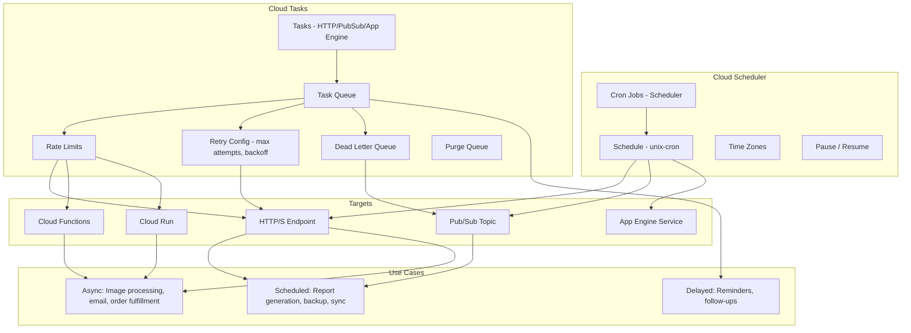

# GCP Cloud Scheduler & Cloud Tasks

## What is it?
Cloud Scheduler is a fully managed cron job service that triggers actions on a schedule. Cloud Tasks is a fully managed distributed task queue service for asynchronous work execution with configurable rate limits, retry policies, and target dispatch.

## Why they were created
**Scheduler**: Operating systems have cron, but cloud applications need a reliable, distributed cron service that can trigger HTTP endpoints, Pub/Sub messages, and App Engine services without managing servers. **Tasks**: Background task processing requires queuing, retries with backoff, rate limiting, and at-least-once delivery guarantees. Building this from scratch with Pub/Sub or databases is complex. Cloud Tasks provides a managed queue with exactly these capabilities.

## When should you use them
- **Scheduler**: Scheduled API calls (daily report generation, nightly maintenance, hourly sync jobs)
- **Scheduler**: Recurring Pub/Sub message publishing, App Engine cron replacement
- **Tasks**: Asynchronous processing (order fulfillment, image resizing, email sending)
- **Tasks**: Distributed task queues with rate limiting and retry logic
- **Tasks**: Delayed execution (send reminder after 24 hours)

## Architecture



## Cloud Scheduler — Cron Jobs

```bash
# Create a scheduler job (HTTP target)
gcloud scheduler jobs create http daily-report \
    --schedule="0 6 * * *" \
    --uri="https://report-api.mycompany.com/generate" \
    --http-method=POST \
    --message-body='{"type":"daily","format":"pdf"}' \
    --oidc-service-account-email=scheduler-sa@project.iam.gserviceaccount.com \
    --oidc-token-audience="https://report-api.mycompany.com" \
    --time-zone="America/New_York" \
    --attempt-deadline=30m \
    --description="Generate daily sales report at 6 AM EST"

# Create a scheduler job (Pub/Sub target)
gcloud scheduler jobs create pubsub nightly-cleanup \
    --schedule="0 2 * * *" \
    --topic=cleanup-tasks \
    --message-body='{"action":"cleanup","retention_days":30}' \
    --time-zone="Etc/UTC" \
    --description="Nightly data cleanup"

# Create a scheduler job (App Engine target)
gcloud scheduler jobs create app-engine daily-import \
    --schedule="0 3 * * *" \
    --relative-url=/admin/import \
    --service=backend \
    --version=v1 \
    --description="Daily data import job"

# Pause a job
gcloud scheduler jobs pause daily-report

# Update job schedule
gcloud scheduler jobs update http daily-report \
    --schedule="0 7 * * *" \
    --time-zone="America/New_York"

# Force run a job
gcloud scheduler jobs run daily-report

# List jobs
gcloud scheduler jobs list --location=us-central1
```

## Cloud Tasks — Queues, Rate Limits, Retry

```bash
# Create a task queue
gcloud tasks queues create order-processing \
    --location=us-central1 \
    --max-dispatches-per-second=50 \
    --max-concurrent-dispatches=10 \
    --max-attempts=5 \
    --min-backoff=10s \
    --max-backoff=300s \
    --max-retry-duration=86400s \
    --max-task-retry-count=5 \
    --routing-override=service:worker,version:v1

# Create HTTP task
gcloud tasks create-http-task process-order \
    --queue=order-processing \
    --location=us-central1 \
    --url="https://worker.mycompany.com/orders" \
    --method=POST \
    --body-file=order.json \
    --oidc-service-account-email=tasks-sa@project.iam.gserviceaccount.com \
    --oidc-token-audience="https://worker.mycompany.com"

# Create task with scheduled delivery (delay)
gcloud tasks create-http-task send-reminder \
    --queue=notifications \
    --location=us-central1 \
    --url="https://api.mycompany.com/reminders" \
    --method=POST \
    --body='{"user_id": 123, "reminder": "Appointment in 1 hour"}' \
    --schedule-time="2025-01-15T10:00:00Z"

# Create task via JSON
cat > task.json << EOF
{
  "task": {
    "httpRequest": {
      "url": "https://worker.example.com/process",
      "httpMethod": "POST",
      "body": "eyJvcmRlcklkIjogIjEyMyJ9",
      "oidcToken": {
        "serviceAccountEmail": "tasks-sa@project.iam.gserviceaccount.com",
        "audience": "https://worker.example.com"
      }
    },
    "scheduleTime": "2025-01-15T10:00:00Z"
  }
}
EOF

gcloud tasks create-task --queue=order-processing --location=us-central1 --task-file=task.json

# Configure dead letter queue
gcloud tasks queues update order-processing \
    --location=us-central1 \
    --dead-letter-topic=dead-letter-orders \
    --max-attempts=5 \
    --max-retry-duration=604800s

# Purge all tasks from queue
gcloud tasks queues purge order-processing --location=us-central1

# Pause queue (stop dispatching)
gcloud tasks queues pause order-processing --location=us-central1

# Resume queue
gcloud tasks queues resume order-processing --location=us-central1

# List queues
gcloud tasks queues list

# Get queue details
gcloud tasks queues describe order-processing --location=us-central1
```

## OIDC Authentication for Tasks

```python
# Python client to create authenticated task
from google.cloud import tasks_v2
from google.protobuf import timestamp_pb2
import datetime

client = tasks_v2.CloudTasksClient()
parent = client.queue_path(PROJECT, LOCATION, QUEUE)

task = {
    'http_request': {
        'http_method': tasks_v2.HttpMethod.POST,
        'url': 'https://worker.mycompany.com/process',
        'oidc_token': {
            'service_account_email': 'tasks-sa@project.iam.gserviceaccount.com',
            'audience': 'https://worker.mycompany.com'
        },
        'headers': {'Content-Type': 'application/json'},
    },
}

# Schedule 24 hours from now
tomorrow = datetime.datetime.utcnow() + datetime.timedelta(days=1)
timestamp = timestamp_pb2.Timestamp()
timestamp.FromDatetime(tomorrow)
task['schedule_time'] = timestamp

response = client.create_task(parent=parent, task=task)
```

## vs Pub/Sub vs Cloud Functions

| Feature | Cloud Scheduler | Cloud Tasks | Pub/Sub | Cloud Functions |
|---------|----------------|-------------|---------|-----------------|
| **Trigger** | Time-based (cron) | Programmatic enqueue | Event-based push | Event/HTTP triggers |
| **Delivery** | At-least-once | At-least-once | At-least-once | Synchronous invoke |
| **Retry** | Configurable per job | Exponential backoff | Configurable push/sub | Configurable retries |
| **Rate limiting** | N/A | Yes (per-second, concurrency) | Throughput limits | Concurrency per function |
| **Scheduling** | Unix cron | Schedule time per task | N/A | N/A |
| **Ordering** | N/A | Best-effort | Ordering key | N/A |
| **Dead letter** | N/A | Yes | Yes | N/A |
| **Use case** | "Run every day at 2 AM" | "Process order asynchronously" | "Event broadcast" | "React to event" |

## Hands-on Example

```bash
# Full example: Scheduled task handler
# 1. Create a task queue
gcloud tasks queues create email-queue --location=us-central1

# 2. Create Cloud Scheduler that enqueues tasks daily
gcloud scheduler jobs create http daily-email-digest \
    --schedule="0 8 * * *" \
    --uri="https://email-service.run.app/generate-digest" \
    --http-method=POST \
    --oidc-service-account-email=scheduler-sa@project.iam.gserviceaccount.com \
    --oidc-token-audience="https://email-service.run.app" \
    --max-retry-attempts=3 \
    --min-backoff=30s

# 3. The email service creates individual tasks per user
# Task handler receives each task and sends email

# Monitor queues
gcloud tasks queues describe email-queue --location=us-central1

# View scheduler executions
gcloud scheduler jobs describe daily-email-digest --location=us-central1

# Delete scheduler job
gcloud scheduler jobs delete daily-email-digest

# Delete task queue (must be empty)
gcloud tasks queues delete email-queue --location=us-central1
```

## Pricing Model

| Service | Pricing |
|---------|---------|
| **Cloud Scheduler** | $0.10 per job per month (first 3 free) |
| **Cloud Tasks** | $0.40 per 1M task operations (first 1M free/month) |
| **API calls** to targets | Standard GCP API/ingress charges |

## Best Practices
- **Scheduler**: Use OIDC authentication for HTTP targets — never use unauthenticated endpoints
- **Scheduler**: Set appropriate timeouts based on expected job duration
- **Scheduler**: Use time zones correctly (America/New_York vs Etc/UTC)
- **Tasks**: Use exponential backoff for retries — start with short backoff, increase with each retry
- **Tasks**: Configure dead letter queues to capture failed tasks after max retries
- **Tasks**: Use OIDC tokens for authenticating task HTTP requests
- **Tasks**: Set rate limits based on downstream service capacity
- **Tasks vs Pub/Sub**: Use Tasks for targeted, individual work items; use Pub/Sub for event broadcast

## Interview Questions
1. What is the difference between Cloud Scheduler and Cloud Tasks?
2. How does Cloud Tasks implement retry with exponential backoff?
3. How would you schedule a task to run 24 hours in the future?
4. How does OIDC authentication work for Cloud Tasks and Scheduler HTTP targets?
5. Compare Cloud Tasks vs Pub/Sub for asynchronous processing
6. How do you configure rate limiting on a Cloud Tasks queue?
7. What is a dead letter queue and how does it work with Cloud Tasks?
8. How would you integrate Cloud Scheduler with Cloud Tasks for scheduled async processing?

## Real Company Usage
**GitLab** uses Cloud Tasks for processing background jobs in their GCP-based architecture. **Niantic** uses Cloud Scheduler for triggering game server maintenance and event scheduling for Pokemon GO. **Squarespace** uses Cloud Tasks for asynchronous task processing in their website building platform, handling millions of queued operations daily.
