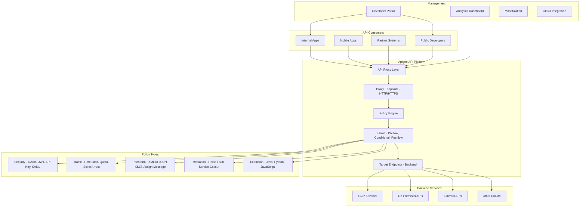

# Apigee API Management

## What is it?
Apigee is Google Cloud's full-lifecycle API management platform for designing, securing, deploying, monitoring, and monetizing APIs. It provides an API proxy runtime with policy enforcement, analytics, developer portal, and hybrid deployment options (GCP, on-premises, multi-cloud).

## Why it was created
As organizations expose APIs to internal teams, partners, and external developers, they need consistent security (OAuth, JWT, API keys), traffic management (rate limiting, spike arrest), transformation (XML to JSON, SOAP to REST), analytics, and developer onboarding. Apigee provides a unified gateway layer that decouples API management from backend implementation, enabling consistent policies across all APIs.

## When should you use it
- **API proxy and gateway**: Abstract backend implementation details from API consumers
- **Security enforcement**: OAuth, JWT validation, SAML, API key verification, IP filtering
- **Traffic management**: Rate limiting, quota enforcement, spike arrest for backend protection
- **API monetization**: Package APIs into products with pricing tiers and developer billing
- **Analytics and monitoring**: API usage metrics, latency tracking, error rates, developer analytics
- **Hybrid deployment**: Run Apigee runtime on-premises or in other clouds alongside GCP

## Architecture



## Proxy Design — Flows and Policies

An Apigee proxy consists of flows that process API requests and responses through policy execution:

```xml
<?xml version="1.0" encoding="UTF-8" standalone="yes"?>
<ProxyEndpoint name="default">
    <PreFlow>
        <!-- Rate limiting applied to all requests -->
        <Request>
            <Step><Name>Spike-Arrest-1</Name></Step>
            <Step><Name>Rate-Limit-1</Name></Step>
        </Request>
    </PreFlow>
    <Flows>
        <Flow name="CreateOrder">
            <Condition>request.verb == "POST" AND proxy.pathsuffix MatchesPath "/orders"</Condition>
            <Request>
                <!-- Validate OAuth token for write operations -->
                <Step><Name>OAuth-v2-Validate-Token</Name></Step>
                <!-- Validate request body -->
                <Step><Name>Validate-JSON-Schema</Name></Step>
            </Request>
            <Response>
                <!-- Transform response -->
                <Step><Name>Remove-Internal-Headers</Name></Step>
            </Response>
        </Flow>
        <Flow name="GetOrders">
            <Condition>request.verb == "GET" AND proxy.pathsuffix MatchesPath "/orders/**"</Condition>
            <Request>
                <!-- API key validation for read operations -->
                <Step><Name>Verify-API-Key-1</Name></Step>
            </Request>
            <Response>
                <!-- Cache responses -->
                <Step><Name>Response-Cache-1</Name></Step>
            </Response>
        </Flow>
    </Flows>
    <PostFlow>
        <Response>
            <!-- Add CORS headers to all responses -->
            <Step><Name>Add-CORS-Headers</Name></Step>
        </Response>
    </PostFlow>
    <RouteRule name="default">
        <TargetEndpoint name="backend-service"/>
    </RouteRule>
    <DefaultFaultRule name="fault-handler">
        <Step><Name>Set-Error-Message</Name></Step>
    </DefaultFaultRule>
</ProxyEndpoint>
```

## Security — OAuth, JWT, SAML

```xml
<!-- OAuth 2.0 token validation -->
<OAuthV2 name="OAuth-v2-Validate-Token">
    <Operation>VerifyAccessToken</Operation>
    <AccessToken>request.header.Authorization</AccessToken>
    <Scope>read write</Scope>
</OAuthV2>

<!-- Generate JWT -->
<GenerateJWT name="Generate-JWT-Access">
    <Algorithm>RS256</Algorithm>
    <PrivateKey>
        <Value ref="private.jwtkey"/>
    </PrivateKey>
    <Subject>access-token</Subject>
    <Issuer>https://api.mycompany.com</Issuer>
    <Audience>myapp</Audience>
    <ExpiresIn>1h</ExpiresIn>
    <AdditionalClaims>
        <Claim name="user_id" ref="request.queryparam.user_id"/>
        <Claim name="role" ref="request.queryparam.role"/>
    </AdditionalClaims>
</GenerateJWT>

<!-- SAML assertion validation -->
<SAMLAssertionValidator name="Validate-SAML">
    <SAML>
        <XPath>saml:Assertion</XPath>
    </SAML>
    <Source>request</Source>
    <TrustStore ref="truststore"/>
    <RemoveEmptyElements>false</RemoveEmptyElements>
    <RemoveNullAttributes>false</RemoveNullAttributes>
</SAMLAssertionValidator>
```

## Analytics and Developer Portal

```bash
# Get API analytics
curl -X POST "https://apigee.googleapis.com/v1/organizations/my-org/environments/prod/analytics/reports" \
    -H "Authorization: Bearer $(gcloud auth print-access-token)" \
    -H "Content-Type: application/json" \
    -d '{
        "dimensions": ["apiproxy", "response_status_code"],
        "metrics": [{"name": "message_count", "function": "sum"},
                    {"name": "total_latency", "function": "avg"}],
        "timeRange": {"start": "2025-01-01T00:00:00Z", "end": "2025-01-15T00:00:00Z"},
        "sortBy": [{"name": "message_count", "order": "DESC"}]
    }'

# Create API product for monetization
curl -X POST "https://apigee.googleapis.com/v1/organizations/my-org/apiproducts" \
    -H "Authorization: Bearer $(gcloud auth print-access-token)" \
    -H "Content-Type: application/json" \
    -d '{
        "name": "enterprise-plan",
        "displayName": "Enterprise API Plan",
        "approvalType": "manual",
        "apiResources": ["/orders/**", "/inventory/**"],
        "environments": ["prod"],
        "proxies": ["order-api", "inventory-api"],
        "quota": "100000",
        "quotaInterval": "1",
        "quotaTimeUnit": "month",
        "scopes": ["read", "write"]
    }'
```

## Hands-on Example

```bash
# Create Apigee organization (if not existing)
gcloud services enable apigee.googleapis.com

# Create Apigee instance
gcloud apigee instances create prod-instance \
    --location=us-central1 \
    --disk-encryption-key-name=projects/my-project/locations/us-central1/keyRings/apigee/cryptoKeys/apigee-key

# Import API proxy
gcloud apigee apis create orders-api-v1 \
    --name="order-service" \
    --proxy-bundle=orders-api.zip

# Deploy to environment
gcloud apigee apis deploy \
    --api=order-service \
    --environment=prod \
    --revision=1

# Create developer
gcloud apigee developers create \
    --email=partner@company.com \
    --first-name=Partner \
    --last-name=Company \
    --user-name=partner_company

# Create app and generate credentials
gcloud apigee apps create \
    --name=partner-app \
    --api-products=enterprise-plan \
    --developer=partner@company.com

# Enable analytics
gcloud apigee datastores create \
    --name=analytics-store \
    --display-name="Analytics Data Store" \
    --target-project=analytics-project \
    --target-dataset=apigee_analytics

# View proxy deployment status
gcloud apigee apis get --api=order-service

# Export analytics report
gcloud apigee analytics export \
    --datastore=analytics-store \
    --date=2025-01-15
```

## Pricing Model

| Tier | Features | Price |
|------|----------|-------|
| **Evaluation** | Full feature set, dev/test only | Free (temporary org) |
| **Standard** | API proxy, security, traffic management | Pay-as-you-go per API call |
| **Enterprise** | Full features + analytics, portal, monetization | Custom pricing (annual contract) |
| **Hybrid** | On-premises / multi-cloud runtime | Custom pricing |
| **Apigee X (GCP-native)** | Integrated with GCP, Cloud Run, Anthos | Per-call + instance-based |

Approximate costs: Starting at $0.05/1K API calls for Enterprise tier. Instance-based pricing for Apigee X varies by capacity.

## Best Practices
- **Use proxy endpoints to abstract backends**: API consumers never see direct backend URLs
- **Apply policies at the right flow**: PreFlow for global policies, conditional Flows for specific operations
- **Use quota and spike arrest together**: Quota for long-term limits, spike arrest for burst protection
- **Validate tokens early**: Validate OAuth/JWT/API keys in PreFlow before reaching backend
- **Use response caching**: Cache GET responses to reduce backend load and improve latency
- **Implement error handling**: Use FaultRules and DefaultFaultRule for standardized error responses
- **Use shared flows**: Reuse common policies (CORS, auth, rate limiting) across multiple proxies
- **Enable analytics**: Configure custom analytics reports for API usage, errors, and latency

## Interview Questions
1. What is the difference between a ProxyEndpoint and a TargetEndpoint in Apigee?
2. How does Apigee's policy engine work with flows (PreFlow, conditional, PostFlow)?
3. How does Apigee validate OAuth tokens and JWT tokens?
4. What is the difference between spike arrest and quota policies?
5. How does Apigee support hybrid deployment (on-premises + cloud)?
6. How does the developer portal work with API products and monetization?
7. How does Apigee compare to Azure API Management and AWS API Gateway?
8. How would you implement a custom policy in Apigee using JavaScript or Python?

## Real Company Usage
**Legrand** uses Apigee to expose IoT device management APIs with OAuth security and developer portal for partner integration. **AT&T** uses Apigee on their internal API platform, managing hundreds of APIs across business units. **Walgreens** uses Apigee for their pharmacy API platform, handling prescription refill APIs with HIPAA-compliant security and analytics.
