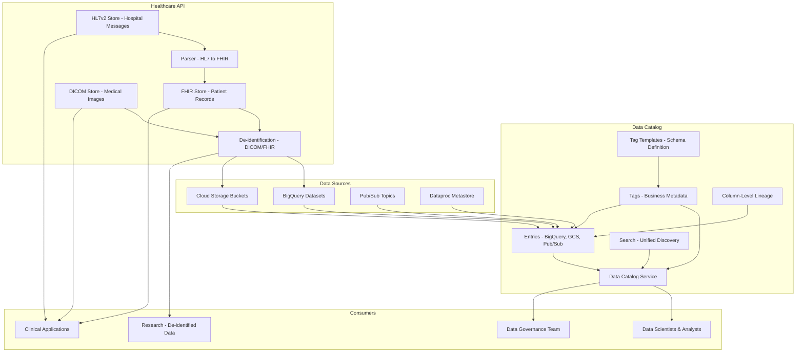

# GCP Data Catalog & Healthcare API

## What is it?
Data Catalog is a fully managed metadata management service for discovering, managing, and understanding data assets across GCP. It provides a unified view of datasets with entries, tags, templates, search, and column-level lineage. The Healthcare API is a managed service for ingesting, storing, and analyzing healthcare data using FHIR, HL7v2, and DICOM standards with built-in de-identification.

## Why they were created
**Data Catalog**: Organizations struggle to find and understand their data across BigQuery, Pub/Sub, GCS, and other services. Data without metadata is unusable. Data Catalog provides a searchable inventory of all data assets with business context, technical metadata, and data lineage. **Healthcare API**: Healthcare organizations need HIPAA-compliant infrastructure for FHIR, HL7, and DICOM data. Building custom parsers, storage, and de-identification for each healthcare standard is impractical. The Healthcare API provides managed ingestion, storage, and de-identification for all three standards.

## When should you use them
- **Data Catalog**: Data discovery, data governance, business glossary, lineage tracking, compliance (GDPR/CCPA)
- **Healthcare API**: FHIR-based patient records, HL7v2 hospital system integration, DICOM medical imaging, de-identification for research and analytics

## Architecture



## Data Catalog — Entries, Tags, Templates

```bash
# Enable Data Catalog
gcloud services enable datacatalog.googleapis.com

# Search for data assets
gcloud data-catalog search "type=dataset AND project=my-project" \
    --limit=50 \
    --include-gcp-public-datasets=false

# Create tag template
gcloud data-catalog tag-templates create data_quality_template \
    --location=us-central1 \
    --field=id=is_verified,type=bool,display-name="Is Verified" \
    --field=id=source_system,type=string,display-name="Source System" \
    --field=id=pii_type,type=enum(SSN|EMAIL|PHONE|NONE),display-name="PII Type" \
    --display-name="Data Quality Template"

# Lookup entry (BigQuery table)
gcloud data-catalog entries lookup \
    --resource="//bigquery.googleapis.com/projects/my-project/datasets/sales/tables/orders"

# Create tag on entry
gcloud data-catalog tags create \
    --entry=$(gcloud data-catalog entries lookup \
        --resource="//bigquery.googleapis.com/projects/my-project/datasets/sales/tables/orders" \
        --format="value(name)") \
    --tag-template=data_quality_template \
    --tag-file=tag.yaml

# tag.yaml
is_verified: true
source_system: "POS System"
pii_type: NONE

# List tags
gcloud data-catalog tags list \
    --parent=$(gcloud data-catalog entries lookup \
        --resource="//bigquery.googleapis.com/projects/my-project/datasets/sales/tables/orders" \
        --format="value(name)")

# Create entry group
gcloud data-catalog entry-groups create custom-sources \
    --location=us-central1 \
    --display-name="Custom Data Sources"

# Create custom entry
gcloud data-catalog entries create custom-entry \
    --entry-group=custom-sources \
    --location=us-central1 \
    --type=FILESET \
    --display-name="On-Premises Files" \
    --description="File share from on-premises data lake" \
    --gcs-bucket-patterns="gs://onprem-mirror/**"

# Get column-level lineage
gcloud data-catalog lineage \
    --project=my-project \
    --location=us-central1 \
    --entity=//bigquery.googleapis.com/projects/my-project/datasets/analytics/tables/report
```

## Healthcare API — FHIR, HL7, DICOM

```bash
# Enable Healthcare API
gcloud services enable healthcare.googleapis.com

# Create a FHIR store
gcloud healthcare fhir-stores create patient-records \
    --dataset=healthcare-dataset \
    --location=us-central1 \
    --version=R4 \
    --enable-update-create=false \
    --disable-referential-integrity=false \
    --pubsub-topic=projects/my-project/topics/fhir-notifications \
    --default-search-handling=strict

# Create a DICOM store
gcloud healthcare dicom-stores create imaging-store \
    --dataset=healthcare-dataset \
    --location=us-central1 \
    --pubsub-topic=projects/my-project/topics/dicom-notifications \
    --notification-config=send-for-bulk-import

# Create a HL7v2 store
gcloud healthcare hl7v2-stores create hospital-messages \
    --dataset=healthcare-dataset \
    --location=us-central1 \
    --pubsub-topic=projects/my-project/topics/hl7-notifications \
    --parser-version=2

# Import FHIR resources from NDJSON
gcloud healthcare fhir-stores import gcs patient-records \
    --dataset=healthcare-dataset \
    --location=us-central1 \
    --gcs-uri=gs://fhir-data/patients.ndjson \
    --content-structure=resource

# Search FHIR resources
curl -X GET "https://healthcare.googleapis.com/v1/projects/my-project/locations/us-central1/datasets/healthcare-dataset/fhirStores/patient-records/fhir/Patient?family=Smith" \
    -H "Authorization: Bearer $(gcloud auth print-access-token)"

# Import DICOM instances
gcloud healthcare dicom-stores import gcs imaging-store \
    --dataset=healthcare-dataset \
    --location=us-central1 \
    --gcs-uri=gs://dicom-images/study-123/*.dcm

# Ingest HL7v2 message
gcloud healthcare hl7v2-messages ingest hospital-messages \
    --dataset=healthcare-dataset \
    --location=us-central1 \
    --message-file=admission.hl7

# HL7v2 message example (ADT - Admit)
# MSH|^~\&|HOSPITAL|SENDING|RECEIVING|RECEIVER|202501150830||ADT^A01|MSG001|P|2.6
# PID|1||12345^^^HOSPITAL||DOE^JOHN^A||19800115|M|||123 MAIN ST^^NY^NY^10001
# PV1|1|I|ICU^WEST^3^1^BED01||||ATTENDING^SMITH^M^DR^12345
```

## De-identification

```python
# De-identify FHIR data using the Healthcare API
deidentify_config = {
    'dataset': {
        'fhirStoreConfig': {
            'fieldMetadataList': [
                {'paths': ['Patient.name'], 'deIdentifiedType': 'DEFAULT_MASK'},
                {'paths': ['Patient.birthDate'], 'deIdentifiedType': 'DATE_SHIFT'},
                {'paths': ['Patient.telecom'], 'deIdentifiedType': 'DEFAULT_MASK'},
                {'paths': ['Observation.valueQuantity'], 'deIdentifiedType': 'KEEP'}
            ]
        }
    },
    'imageConfig': {
        'textRedactionMode': 'REDACT_NO_TEXT'  # For DICOM images
    }
}

# Create de-identified copy of FHIR store
gcloud healthcare fhir-stores deidentify patient-records \
    --dataset=healthcare-dataset \
    --location=us-central1 \
    --destination-dataset=deidentified-dataset \
    --destination-fhir-store=deidentified-patient-records \
    --config-file=deidentify.json \
    --default-time-zone=UTC
```

## Hands-on Example

```bash
# Data Catalog: Tag sensitive data
gcloud data-catalog tag-templates create pii_template \
    --location=us-central1 \
    --field=id=has_pii,type=bool \
    --field=id=pii_categories,type=enum(SSN|CREDIT_CARD|EMAIL|PHONE|ADDRESS|NONE) \
    --field=id=data_classification,type=enum(PUBLIC|INTERNAL|CONFIDENTIAL|RESTRICTED)

# Apply tag to column
gcloud data-catalog tags create --tag-file=pii_tag.yaml \
    --entry=ENTRY_ID

# Healthcare: Create dataset
gcloud healthcare datasets create healthcare-dataset \
    --location=us-central1

# Healthcare: Export FHIR to BigQuery (for analytics)
gcloud healthcare fhir-stores export bq patient-records \
    --dataset=healthcare-dataset \
    --location=us-central1 \
    --bq-dataset=bq://my-project:analytics.fhir_export \
    --schema-type=analytics \
    --write-disposition=write-truncate

# Healthcare: Export DICOM to GCS
gcloud healthcare dicom-stores export gcs imaging-store \
    --dataset=healthcare-dataset \
    --location=us-central1 \
    --gcs-uri-prefix=gs://exported-dicom/studies/

# View API audit logs
gcloud logging read "resource.type=fhir_store" --limit=10
```

## Pricing Model

### Data Catalog
| Feature | Pricing |
|---------|---------|
| **Tag templates** | Free |
| **Tags** | Free (up to 100K tags/month) |
| **Search** | Free |
| **Lineage** | $0.05 per 1K lineage records |
| **API calls** | $0.10 per 10K calls |

### Healthcare API
| Feature | Pricing |
|---------|---------|
| **FHIR store** | $0.30 per 10K API calls + storage ($0.02/GB) |
| **HL7v2 store** | $0.15 per 10K messages + storage |
| **DICOM store** | $0.25 per 10K instances + storage |
| **De-identification** | $0.05 per operation (DICOM), $0.02 per FHIR resource |
| **Data egress** | Standard GCP egress rates |

## Best Practices
- **Data Catalog**: Apply tags at column level for fine-grained PII/classification metadata
- **Data Catalog**: Create tag templates for standard metadata (data quality, ownership, classification)
- **Data Catalog**: Enable column-level lineage for BigQuery to trace data transformations
- **Healthcare**: Use FHIR R4 for new projects — most widely adopted standard
- **Healthcare**: Configure Pub/Sub notifications for real-time healthcare data change tracking
- **Healthcare**: Use de-identification before exporting clinical data to analytics/research environments
- **Healthcare**: Store DICOM metadata in BigQuery via Healthcare API export for image analytics
- **Healthcare**: Integrate HL7v2 messages with Cloud Functions for real-time clinical alerting

## Interview Questions
1. How does Data Catalog provide unified metadata management across BigQuery, GCS, and Pub/Sub?
2. What are tag templates and how do they enforce consistent metadata governance?
3. How does column-level lineage help troubleshoot data pipeline issues?
4. Compare FHIR, HL7v2, and DICOM standards and when each is used
5. How does Healthcare API de-identification handle PHI in both structured and imaging data?
6. How would you search for all datasets containing PII using Data Catalog?
7. How does the Healthcare API integrate with BigQuery for clinical analytics?
8. How does Data Catalog support compliance use cases like GDPR data mapping?

## Real Company Usage
**Aetna** uses Healthcare API with FHIR stores for patient data management, integrating with their clinical applications. **Philips** uses Healthcare API for DICOM image storage and de-identification for their medical imaging platform. **Google** uses Data Catalog internally to manage metadata across its vast BigQuery data warehouse, enabling data discovery and governance at scale.
