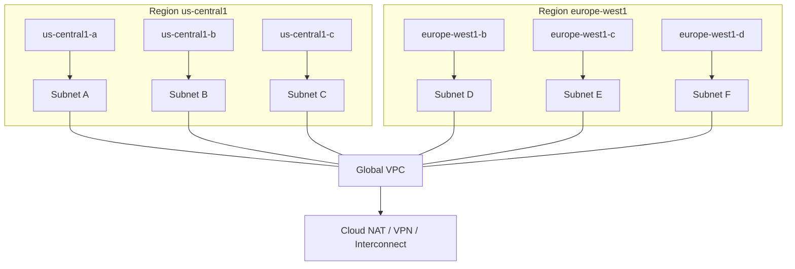
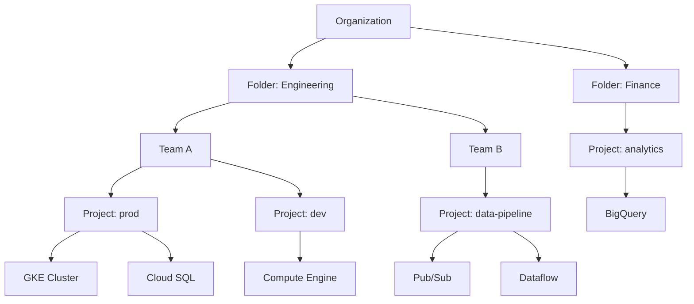

# GCP Module Overview

## What is it?
Google Cloud Platform (GCP) is a cloud computing platform offering IaaS, PaaS, and SaaS solutions built on the same infrastructure that powers Google's own products (Search, YouTube, Gmail). GCP excels in data analytics, machine learning, and container-native services.

## Key Differentiators from AWS/Azure
- **Google Network**: Largest private cloud network globally, with 200+ countries/territories reachable via Google's fiber backbone
- **Container-Native**: Kubernetes (GKE) is a first-party service, not an add-on; Cloud Run is the most mature serverless container platform
- **Data & ML**: BigQuery (serverless data warehouse), Vertex AI (unified ML), and Dataflow (serverless stream/batch) are category leaders
- **Pricing**: Per-second billing with sustained-use discounts (no 1-hour minimum); committed use discounts up to 70%
- **Open Source Leadership**: Kubernetes, TensorFlow, Apache Beam, Go, gRPC, and GraphQL were all originated at Google
- **Global VPC**: Single VPC spans the entire globe; subnets are not region-scoped (unlike AWS/Azure)

## Global Infrastructure
- **Regions**: 40+ regions, 120+ zones worldwide
- **Zones**: Each region has 3+ zones (minimum 3), isolated from each other for fault tolerance
- **Edge Points**: 200+ edge locations for Cloud CDN and Google Cloud Interconnect
- **Network Tiers**: Premium Tier (global, Google-backed network) vs Standard Tier (ISP-based, regional)



## Management Tools
- **GCP Console**: Web-based UI at console.cloud.google.com
- **Cloud Shell**: Browser-based terminal with gcloud, kubectl, bq, and SDKs preinstalled, 5GB persistent storage
- **gcloud CLI**: Primary CLI tool for managing GCP resources
- **REST & gRPC APIs**: All services accessible via API

## Resource Hierarchy



- **Organization**: Root node, maps to your company (requires Google Workspace or Cloud Identity)
- **Folders**: Logical grouping (by team, environment, or product)
- **Projects**: Billing and resource boundary; every resource belongs to exactly one project
- **Resources**: Individual services (VMs, buckets, databases, etc.)

IAM policies are inherited downward: Organization → Folder → Project → Resource.

## Learning Path
1. **Start here**: [GCP Overview](01-gcp-overview.md) — core services and comparison
2. **Compute**: [Compute Engine](02-compute-engine.md) → [GKE](03-gke.md) → [Cloud Run](04-cloud-run.md) → [Cloud Functions](05-cloud-functions.md)
3. **Storage**: [Cloud Storage](06-cloud-storage.md)
4. **Databases**: [BigQuery](07-bigquery.md) → [Spanner](08-spanner.md) → [Cloud SQL](09-cloud-sql.md) → [Memorystore](13-memorystore.md)
5. **Messaging**: [Pub/Sub](10-pubsub.md)
6. **Data Processing**: [Dataflow](11-dataflow.md)
7. **ML/AI**: [Vertex AI](12-vertex-ai.md)
8. **Networking**: [VPC](15-vpc.md) → [Cloud CDN](14-cloud-cdn.md) → [Cloud Armor](16-cloud-armor.md)
9. **Security**: [Secret Manager](17-secret-manager.md)
10. **Operations**: [Operations Suite](18-operations-suite.md)

## Hands-on Example

### Set up gcloud CLI
```bash
gcloud init
gcloud config set project my-project-id
gcloud auth login
```

### List resources
```bash
gcloud compute instances list
gcloud storage buckets list
gcloud container clusters list
```

## Pricing Model
- **Per-second billing**: Compute Engine, Cloud Run, GKE (most AWS services bill per-hour minimum)
- **Sustained-use discounts**: Automatic 20-30% discount for running a VM the full month
- **Committed-use discounts**: 1- or 3-year commitments (up to 70% off for compute, memory, GPU)
- **Free Tier**: $300 free credits for 90 days, 20+ services always-free tier
- **No data egress between GCP services**: Ingress is free; egress to internet costs $0.08-$0.23/GB

## Best Practices
- Organize resources using the resource hierarchy (Org → Folder → Project)
- Use separate projects for prod, staging, and development
- Budget alerts and quota monitoring via the GCP Console
- Prefer Premium Network Tier for latency-sensitive workloads
- Enable VPC Service Controls for data exfiltration prevention
- Use Cloud Audit Logs for all admin activity and data access

## Interview Questions
1. How does GCP's resource hierarchy differ from AWS's account structure and Azure's management groups?
2. Explain the difference between Premium and Standard Network Tiers
3. What is the benefit of GCP's global VPC model compared to AWS's region-scoped VPCs?
4. How do sustained-use discounts and committed-use discounts differ?
5. Design a multi-project GCP organization structure for a company with 5 product teams and 3 environments each

## Real Company Usage
- **Spotify**: Uses GCP for data analytics with BigQuery and Pub/Sub for real-time recommendations
- **Twitter**: Migrated analytics and ML workloads to GCP (BigQuery, Dataflow)
- **PayPal**: Uses GKE and Cloud SQL for payment processing infrastructure
- **HSBC**: Runs global banking applications on GCP with multi-region Spanner
- **eBay**: Migrated to GCP for data warehousing and ML workloads

---
Previous: [11 — Azure](../11-Azure/README.md)
Next: [13 — Terraform](../13-Terraform/README.md)
