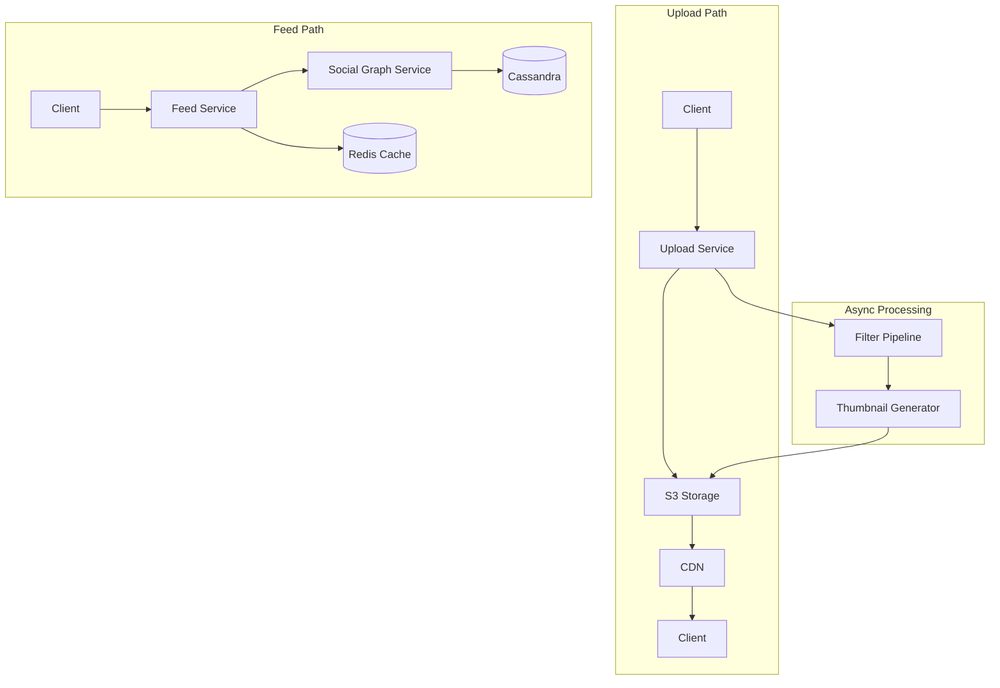

# Design Instagram

## Requirements

- Photo/video uploads with filters
- Follow/unfollow users
- News feed generation (chronological + algorithmic)
- Likes and comments
- 800M users, 100M daily uploads

## Capacity Estimation

```
Uploads:    100M photos/day × 2MB = 200TB/day
Feed reads: 500M daily active users × 50 refreshes = 25B reads/day
Likes:      5B/day
Follows:    10B edges in social graph
Storage:    200TB/day → 73PB/year
CDN egress: ~100 Gbps peak
```

## High-Level Design



## Comparison: Fanout Approaches

| Approach | Pros | Cons | Best For |
|----------|------|------|----------|
| **Fanout-on-write** | Fast reads (~5ms) | Write amplification for celebrities | Users < 10K followers |
| **Fanout-on-read** | Efficient writes | Slow reads for popular users | Celebrities > 10K followers |
| **Hybrid** | Best of both | Complex implementation | Instagram's actual approach |

## Key Design Decisions

1. **Hybrid feed**: Push for users < 10K followers, pull for influencers
2. **Media pipeline**: Async image processing (thumbnail, filter, compress)
3. **Social graph**: Cassandra for high write throughput (follows/unfollows)
4. **Feed cache**: Redis sorted sets, keep last 1000 items per user

## Interview Questions

1. How does the hybrid fanout approach work for feed generation?
2. How would you handle the celebrity follow problem?
3. Design Instagram Stories (ephemeral content)
4. How does Instagram optimize image upload and delivery?
5. How would you implement Explore tab recommendations?
