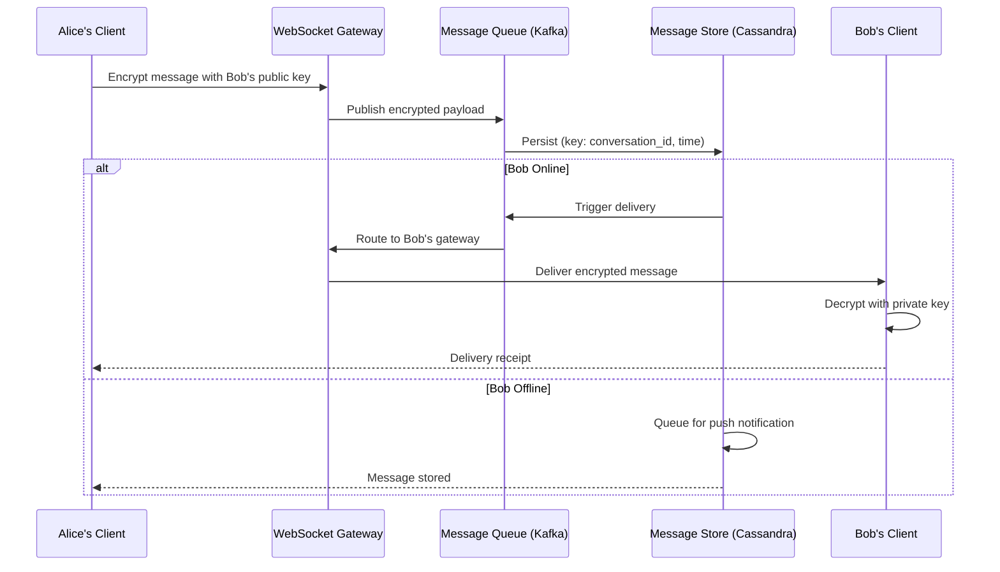

# Design WhatsApp

## Requirements

- Real-time messaging (1-on-1 and group)
- Read receipts, typing indicators
- Media sharing (images, video, documents)
- End-to-end encryption
- Online/offline presence
- 2B users, 100B messages/day

## Capacity Estimation

```
Messages:    100B/day ≈ 1.2M writes/sec (peak 4M)
Storage:     100B × 500B avg = 50TB/day → 18PB/year
Media:       5B/day × 200KB = 1PB/day
WebSocket:   500M concurrent connections
Presence:    500M status updates/minute
```

## High-Level Design



## End-to-End Encryption Design

```
Key Exchange (Signal Protocol):
1. Each client generates: Identity Key Pair (signed, long-term)
2. Each client generates: Signed Pre-Key (medium-term, rotated)
3. Clients upload public keys to server
4. To send first message:
   a. Fetch recipient's pre-key bundle
   b. Perform X3DH key agreement
   c. Derive shared secret (ratchet)
   d. Encrypt with AES-256-GCM

Server never has access to plaintext
```

## Key Design Decisions

| Decision | Choice | Rationale |
|----------|--------|-----------|
| **Message ordering** | Each message has a server timestamp + client sequence | Handle clock skew |
| **Group messaging** | Sender-fanout (not server fanout) for E2E encryption | Each message encrypted N times |
| **Media transfer** | Upload to S3, share encrypted link | Bandwidth efficiency |
| **Presence** | Redis pub/sub per connection gateway | Low latency status updates |

## Storage Schema (Cassandra)

```sql
-- Messages by conversation (for chat history)
CREATE TABLE messages_by_conversation (
    conversation_id TEXT,
    message_id TIMEUUID,
    sender_id TEXT,
    encrypted_payload BLOB,
    content_type TEXT,  -- text, image, video, etc
    media_url TEXT,       -- encrypted reference
    created_at TIMESTAMP,
    PRIMARY KEY (conversation_id, message_id)
) WITH CLUSTERING ORDER BY (message_id DESC);
```

## Interview Questions

1. How does WhatsApp's end-to-end encryption work (Signal Protocol)?
2. How does WhatsApp handle message delivery for offline users?
3. How does WhatsApp achieve high availability with 2B users?
4. Design group messaging with E2E encryption
5. How does WhatsApp handle presence (online/offline) at scale?
