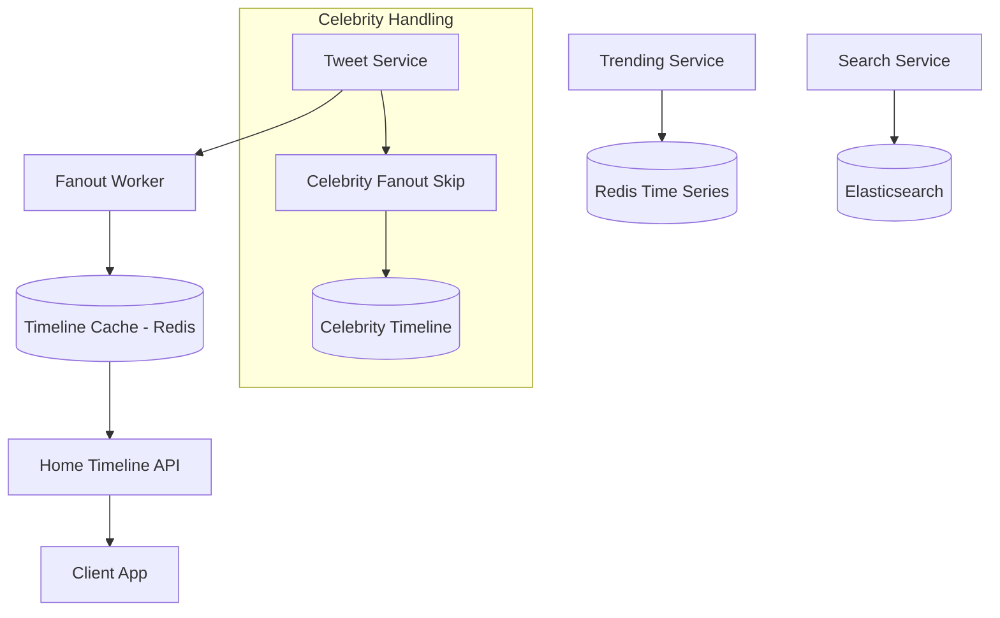

# Design Twitter

## Requirements

- Post tweets (280 chars + media)
- Timeline: home feed (chronological + ranked)
- Follow/unfollow
- Retweet, like, reply
- Trending topics
- 500M users, 500M tweets/day

## Capacity Estimation

```
Tweets:         500M/day ≈ 6000 writes/sec peak
Timeline reads: 200B/day ≈ 2.3M reads/sec
Likes:          2B/day
Fanout writes:  500M tweets × ~200 avg followers = 100B fanout writes/day
Storage:        500M × 500B = 250GB/day → 90TB/year
```

## High-Level Design



## Fanout Strategy (Hybrid)

```
Write Path (for users with < 50K followers):
  1. User posts tweet
  2. Fetch follower list from social graph
  3. Write tweet_id to each follower's timeline in Redis
  4. Batch writes in groups of 100

Read Path (for users following celebrities with > 50K followers):
  1. Fetch user's timeline (pushed content)
  2. Fetch recent tweets from followed celebrities (pulled)
  3. Merge, sort by time, return top N
  4. Cache merged result

Fanout Optimization:
  - A-list (> 10M followers): Skip fanout entirely, pull on read
  - B-list (50K-10M): Fanout to currently online followers only
  - Regular (< 50K): Full fanout
```

## Key Design Decisions

| Decision | Choice | Rationale |
|----------|--------|-----------|
| **Timeline storage** | Redis sorted sets by timestamp | ~3ms read latency |
| **Tweets DB** | PostgreSQL sharded by user_id | Strong consistency per user |
| **Social graph** | Cassandra (graph DB) | High write throughput |
| **Trending** | Sliding window in Redis, recalculate every 5min | Real-time |
| **Search** | Elasticsearch with tweet tokens | Full-text search |

## Interview Questions

1. How does Twitter's fanout work and how do you handle celebrities?
2. How do you implement trending topics at scale?
3. How would you redesign Twitter for real-time (Elon Musk's X)?
4. How do you generate ranked (algorithmic) timelines?
5. Design Twitter search with typeahead suggestions
