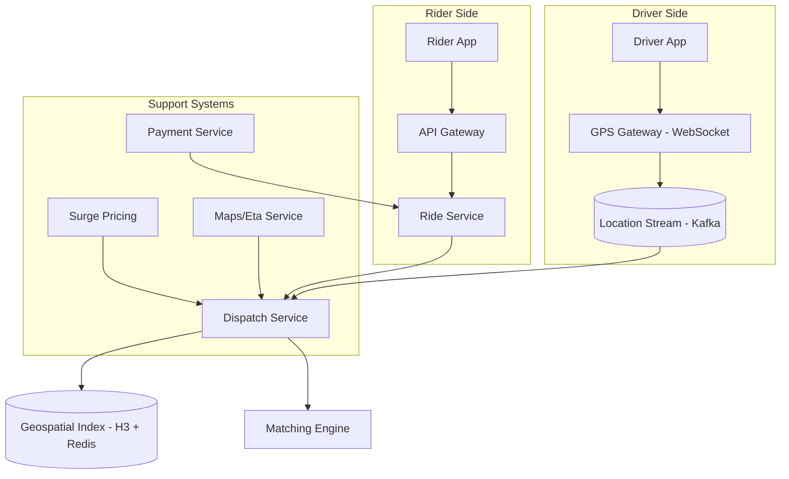

# Design Uber

## Requirements

- Real-time rider-driver matching
- GPS tracking with location updates
- Fare estimation and surge pricing
- Ride lifecycle management
- 200M users, 25M trips/day, 5M drivers

## Capacity Estimation

```
Trips:           25M/day ≈ 290 trips/sec peak
GPS updates:     5M drivers × 1 update/5s = 1M writes/sec
Ride requests:   500/sec peak (urban rush hour)
Geospatial reads: For each ride request, 10K candidate drivers
Storage:         25M × 2KB = 50GB/day (trips only)
Location stream: 1M/sec × 200B = 200GB/day
```

## High-Level Design



## Geospatial Indexing (H3 Hexagon Grid)

```
Architecture:
  1. Divide world into hierarchical hexagonal grid (H3)
  2. Each hexagon: ~2km² at resolution 9
  3. Redis stores: H3_CELL → [driver_ids_online]
  4. When rider requests:
     a. Map rider location to H3 cell
     b. Query rider's cell + adjacent cells
     c. Filter drivers by: distance, rating, direction
     d. Score and return top 3 candidates

Consistent Hashing:
  - H3 cells → dispatched across Redis cluster
  - Hot areas (downtown, airports) → more virtual nodes
  - Driver moves between cells → atomic REM/SADD
```

## Key Design Decisions

| Decision | Choice | Rationale |
|----------|--------|-----------|
| **Geospatial index** | H3 grid + Redis | Sub-millisecond queries vs PostGIS (50ms+) |
| **GPS pipeline** | Kafka → streaming processor | Reliable, replayable, high throughput |
| **Dispatch** | Region-partitioned workers | Each worker handles disjoint H3 regions |
| **Fare estimation** | Pre-compute per region (not per request) | < 50ms response time |
| **Surge pricing** | Supply/demand ratio per H3 cell, updated every 5min | Real-time market adjustment |

## Interview Questions

1. How does Uber match riders with nearby drivers efficiently?
2. How does H3 geospatial indexing work?
3. How does surge pricing work algorithmically?
4. How would you design the real-time GPS tracking pipeline?
5. Design ride fare estimation (distance, time, surge)
