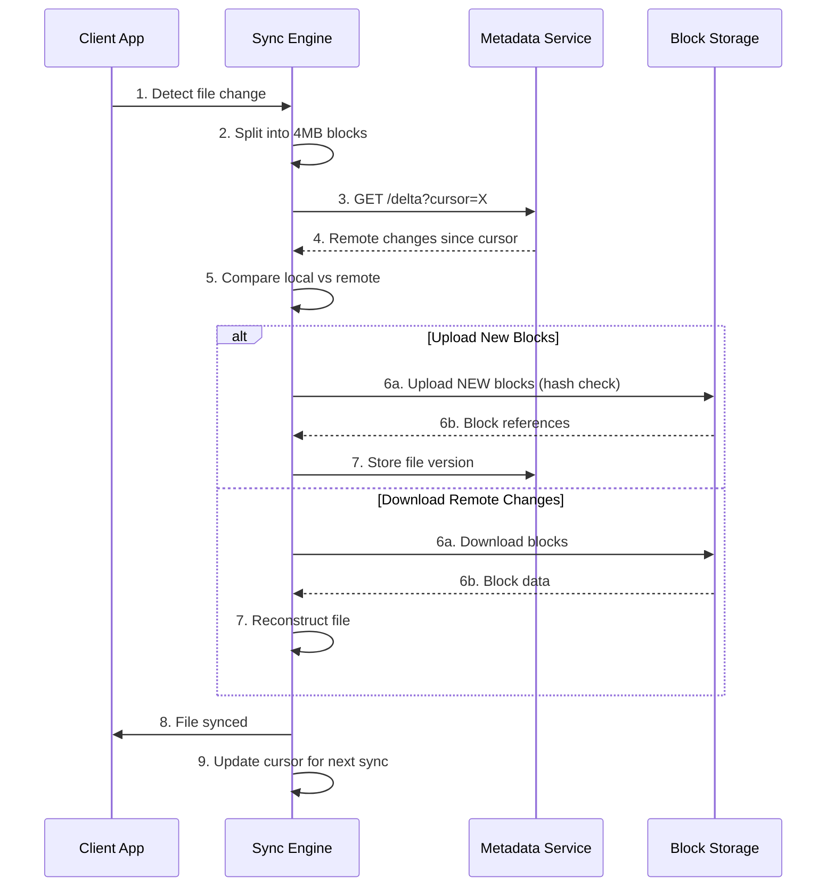

# Design Dropbox

## Requirements

- File upload, download, and sync across devices
- File versioning and history
- Sharing with permissions
- Cross-platform sync (Windows, Mac, iOS, Android)
- 500M users, 10TB/day uploads

## Capacity Estimation

```
Uploads:      10TB/day ≈ 116 MB/s average
Storage:      3.65PB/year (10TB × 365)
Versioning:   2x storage overhead → ~7.3PB/year
Dedup ratio:  30-50% effective → ~2-3PB/year real
Sync traffic: 500M × 10 files/day × 1MB = 5PB/day (read)
Metadata:     100B files × 256B = 25TB
```

## High-Level Design



## Block-Level Dedup Algorithm

```
File Upload Flow:
  1. Client splits file into 4MB blocks
  2. For each block, compute SHA-256 hash
  3. Send hashes to server (block check API)
  4. Server responds with list of NEW block hashes
  5. Client uploads ONLY new blocks
  6. Server stores block and increments ref_count
  7. File version record stores list of block references

Delete Flow:
  1. On file delete, decrement ref_count for each block
  2. If ref_count hits 0, block is eligible for garbage collection
  3. GC runs nightly, deletes unreferenced blocks
```

## Key Design Decisions

| Decision | Choice | Rationale |
|----------|--------|-----------|
| **Block size** | 4MB | Balances dedup granularity vs metadata overhead |
| **Hash algorithm** | SHA-256 | Collision-resistant for billions of blocks |
| **Delta sync** | Client sends cursor, server returns changes | Minimizes bandwidth |
| **Conflict resolution** | Last-writer-wins + conflicted copy | Simple, predictable behavior |
| **Chunk storage** | S3 with content-addressable keys | hash → path (e.g., ab/cd/ef/abcdef... ) |
| **Metadata** | PostgreSQL sharded by user_id | Strong consistency for file operations |

## Conflict Resolution Types

| Scenario | Resolution |
|----------|------------|
| Same file edited on 2 devices | Create "Conflicted Copy" file |
| Deleted on A, edited on B | Keep B's edit, restore from trash |
| Renamed folder vs added inside | Server orders operations, client retries |
| Offline edits come online | Merge if possible, conflict copy otherwise |

## Interview Questions

1. How does block-level deduplication work for file sync?
2. How does the delta sync protocol minimize bandwidth?
3. How would you handle conflict resolution?
4. Design the versioning system with storage efficiency
5. How would you implement file sharing with permissions?
