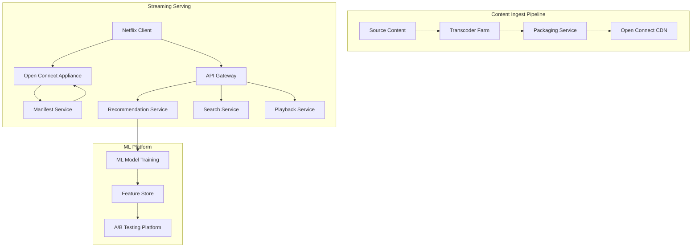
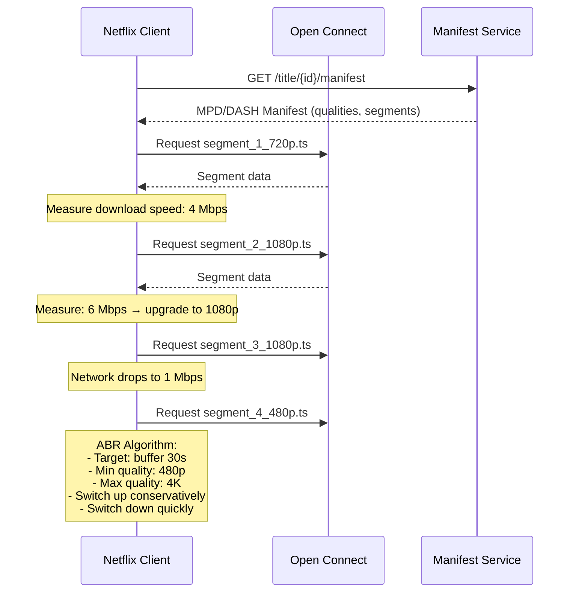

# Design Netflix

## Requirements

- Video streaming with adaptive bitrate
- 200M+ subscribers streaming simultaneously
- Video upload and transcoding pipeline
- Personalized recommendations
- Global CDN delivery (Open Connect)
- 99.99% uptime, < 200ms startup latency

## Capacity Estimation

```
Catalog:       20K titles, 100K hours of content
Transcoding:   100K hours × 5 qualities = 500K hours encoded
Streaming:     200M subscribers × 3 hrs/day avg = 600M hrs/day
Bandwidth:     15% of global internet traffic (~15 Tbps peak)
CDN:           17K Open Connect appliances in ISPs
Recommendations: 200M personalized feeds, computed daily
```

## High-Level Design



## Adaptive Bitrate Streaming



## Key Netflix Innovations

| Innovation | What It Is | Impact |
|------------|-----------|--------|
| **Open Connect** | CDN appliances inside ISP networks | 95%+ of traffic served from edge, < 20ms latency |
| **Chaos Monkey** | Randomly kill production instances | Built failure resilience, zero-downtime deployments |
| **Chained Encoding** | Per-shot encoding parameters | 40% bandwidth savings without quality loss |
| **Video Multimethod Assessment Fusion (VMAF)** | Perceptual quality metric | 50% improvement in quality at same bitrate |
| **Personalized Artwork** | Different artwork per user based on taste | 30% increase in content discovery |

## Key Design Decisions

| Decision | Choice | Rationale |
|----------|--------|-----------|
| **CDN strategy** | Owner-operated (Open Connect) | Full control, bypass CAF markup, ISP cost savings |
| **Streaming protocol** | DASH over HTTP/2 | Adaptive, efficient, widely supported |
| **Encoding** | Per-shot (not per-title) optimization | Human vision tuned, 40% bandwidth reduction |
| **Recommendations** | Matrix factorization + DNN + contextual bandits | State of the art personalization |
| **Failure resilience** | Chaos engineering (Simian Army) | Proactive resilience, not reactive |

## Interview Questions

1. How does Netflix's Open Connect CDN work?
2. How does adaptive bitrate streaming (ABR) work?
3. How does Netflix's recommendation system work?
4. How does Chaos Monkey make Netflix more resilient?
5. Design the video transcoding pipeline
