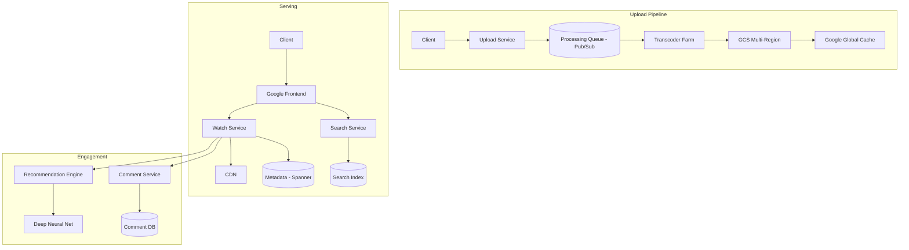
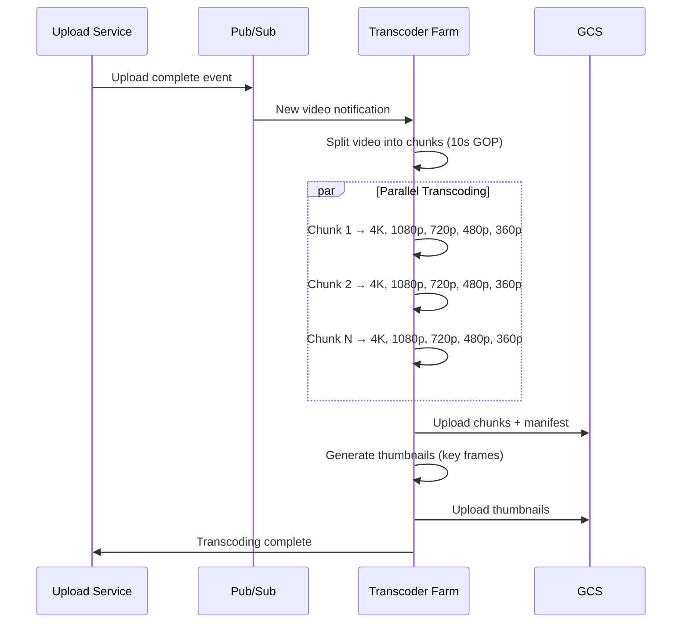

# Design YouTube

## Requirements

- Video upload, transcoding, streaming
- 500+ hours uploaded per minute
- Global CDN streaming
- Search, recommendations, comments
- Live streaming support
- 2B monthly users

## Capacity Estimation

```
Uploads:      500 hrs/min → 720K hrs/day → ~2PB raw video/day
Transcoded:   720K hrs × 6 qualities = 4.3M hrs encoded/day
Storage:      ~2PB/day → 730PB/year (raw), ~150PB after compression
Views:        5B videos/day, 1B hrs watched/day
Bandwidth:    1B hrs × 720p avg 3Mbps = 3 Tbps peak
Comments:     50M/day
Search:       3B queries/day
```

## High-Level Design



## Video Transcoding Pipeline



## Key Design Decisions

| Decision | Choice | Rationale |
|----------|--------|-----------|
| **Storage** | GCS multi-region (not single region) | Closest to users for fast transcoding read |
| **CDN** | Google Global Cache (edge in ISP) | 50% of traffic is cacheable long-tail |
| **Transcoding** | Split video → parallel chunks → reassemble | Linear scaling with cluster size |
| **Metadata** | Cloud Spanner (globally distributed SQL) | Strong consistency for views, likes |
| **Recommendation** | Two-tower DNN (candidate gen + ranking) | Handles billions of videos, real-time |

## Interview Questions

1. How does YouTube's video transcoding pipeline work?
2. How does YouTube handle 500 hours of uploads per minute?
3. How does YouTube's recommendation system work?
4. Design YouTube search with autocomplete
5. How does YouTube Live streaming work differently from VOD?
