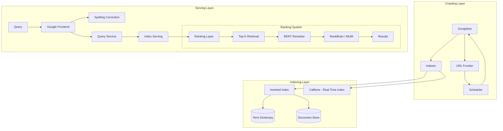

# Design Google Search

## Requirements

- Crawl and index billions of web pages
- Return relevant results in < 300ms
- Handle 3.5B searches/day
- Support spelling correction, synonyms
- Freshness: index new pages within minutes
- 100+ languages

## Capacity Estimation

```
Indexed pages:  50B+
Search queries: 3.5B/day ≈ 40K queries/sec peak
Index size:     50B × 50KB avg = 2.5PB (compressed, inverted index)
Crawled data:   50PB+ raw HTML
Query latency:  < 300ms p95
Spelling:       ~10B word corrections/day
```

## High-Level Design



## Index Structure

```
Inverted Index (term → list of documents):
  "system design" → [doc_1002, doc_4501, doc_7800, ...]
  Each posting: (doc_id, tf_idf_score, position[], metadata)

Forward Index (document → term positions):
  doc_1002 → [(pos_10, "system"), (pos_11, "design"), ...]

Index Sharding:
  Term-based sharding: Each shard handles a range of terms (A-M, N-Z)
  Document-based sharding: Each shard handles a subset of documents
  
Google uses document-based sharding with replication:
  - Each shard is a replica of a document range
  - Query sent to all shards in parallel
  - Results merged by aggregator
```

## Ranking Architecture

```
1. Retrieve: Top-K (10K candidates) from inverted index
   - TF-IDF scoring
   - PageRank influence factor
   - Freshness boost for recent content

2. Prerank: Lightweight scoring (filter to top 100)
   - Query-document relevance signals
   - User context (location, language)
   - Click-through rate history

3. Rerank: Deep neural model (BERT / MUM)
   - Full semantic understanding
   - Passage-level relevance
   - Entity linking verification
   
4. Personalize (optional):
   - Search history signals
   - User preference profile
   - Result diversity penalty
```

## Key Design Decisions

| Decision | Choice | Rationale |
|----------|--------|-----------|
| **Index structure** | Inverted index + compression (varint, delta encoding) | 10x compression, fits in memory |
| **Sharding** | Document-based (not term-based) | No single-term hotspot, parallelizable |
| **Caching** | Results cached in multi-tier (node, cluster, global) | 40% of queries are repeats |
| **Freshness** | Caffeine: incremental indexing (push, not pull) | New pages indexed in seconds |
| **Ranking** | Multi-stage cascading (retrieve → prerank → rerank) | Balance latency vs quality |

## Interview Questions

1. How does Google's inverted index work?
2. How does PageRank algorithm work?
3. How does Google handle spelling correction?
4. How does Google index fresh content quickly (Caffeine)?
5. Design a system that returns search results in < 300ms at Google scale
