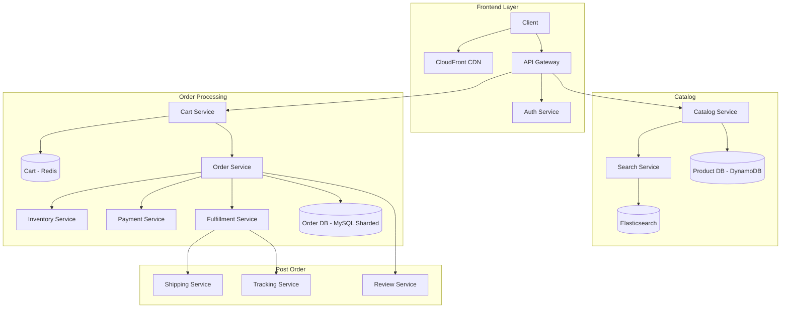

# Design Amazon / E-Commerce

## Requirements

- Product catalog with search and filtering
- Shopping cart and checkout
- Inventory management
- Order processing and fulfillment
- Payment processing
- Customer reviews and ratings
- Recommendations
- 300M active users, 1B+ products

## Capacity Estimation

```
Products:     1B+ SKUs
Orders:       100M/day (peak holiday: 500M/day)
Page views:   10B/day, 500K+ peak req/sec
Cart ops:     1B/day
Reviews:      50M/day
Inventory:    200M products tracked in real-time
Search:       1B queries/day
Storage:      Product data: ~200TB, Orders: ~2TB/day, Reviews: ~500GB/day
```

## High-Level Design



## Key Design Challenges

| Challenge | Solution |
|-----------|----------|
| **Hot products (flash sale)** | Product page served from CDN (static with stale-while-revalidate). Cart writes sharded by user_id |
| **Inventory consistency** | Optimistic locking on inventory count. Oversell buffer (2% extra stock), reconciliation batch |
| **Cart persistence** | Redis (fast) + periodic backup to DynamoDB. Merge on login from anonymous cart |
| **Search** | Elasticsearch for product search. Autocomplete via prefix trie in Redis. Faceted filtering |
| **Recommendations** | Item-to-item collaborative filtering (offline, nightly). Real-time "frequently bought together" from Redis |
| **Order idempotency** | checkout_id (UUID on cart → order transition). Dedup in Order Service |

## Database Schema

```sql
-- Products (DynamoDB)
-- PK: product_id, SK: metadata
-- GSI: category, name, brand, price

-- Inventory (DynamoDB with optimistic locking)
-- PK: product_id, SK: warehouse_id
-- Fields: quantity, reserved, available

-- Orders (MySQL sharded by order_id)
CREATE TABLE orders (
    id VARCHAR(36) PRIMARY KEY,
    user_id VARCHAR(36) NOT NULL,
    status VARCHAR(20), -- pending, confirmed, shipped, delivered
    total_amount DECIMAL(10,2),
    shipping_address JSON,
    payment_status VARCHAR(20),
    created_at TIMESTAMP,
    INDEX idx_user (user_id, created_at DESC)
);

CREATE TABLE order_items (
    id VARCHAR(36) PRIMARY KEY,
    order_id VARCHAR(36) NOT NULL,
    product_id VARCHAR(36) NOT NULL,
    quantity INT,
    unit_price DECIMAL(10,2),
    INDEX idx_order (order_id)
);
```

## Interview Questions

1. How would you design flash sale / limited inventory events?
2. How does Amazon handle shopping cart persistence across devices?
3. Design the product search with faceted filtering
4. How does inventory management work across 100+ warehouses?
5. How does Amazon's recommendation system (item-to-item CF) work?
