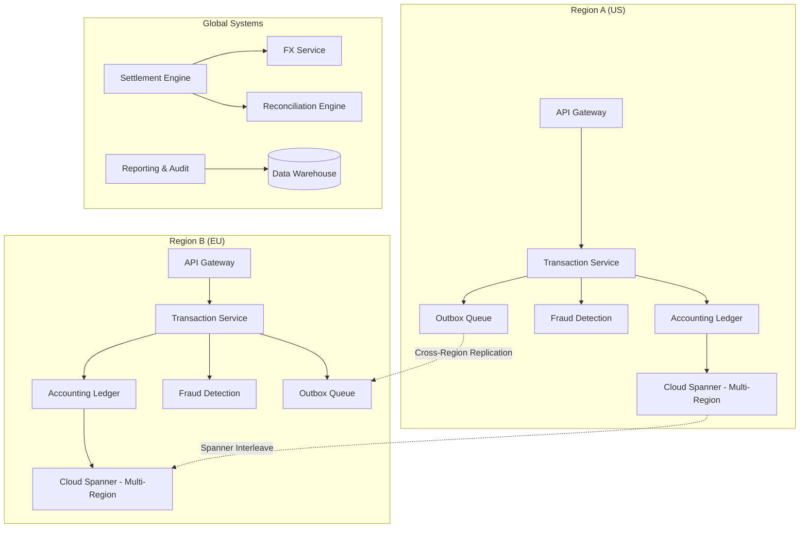
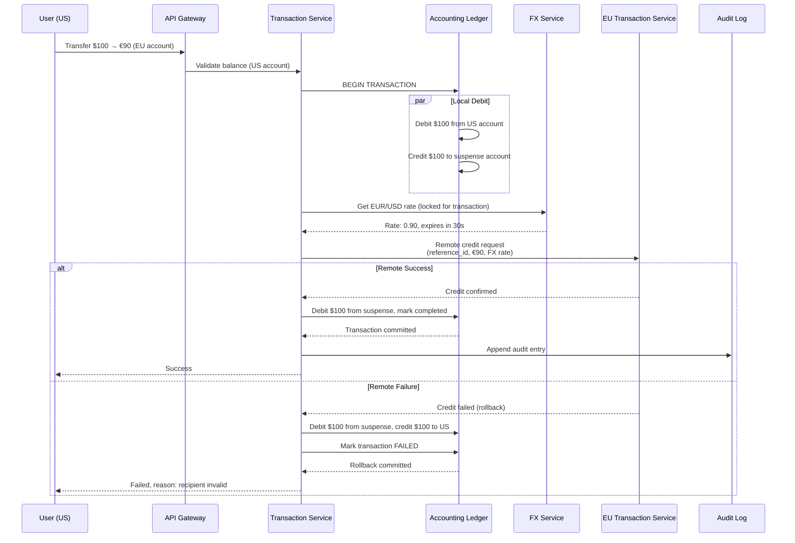

# Design a Multi-Region Banking System

## Requirements

- Global payments and transfers across regions
- Strong consistency for balances
- Compliance with local regulations (GDPR, PSD2, SOX)
- 99.999% uptime (5 nines)
- Fraud detection in real-time
- Multi-currency support with FX
- Audit trail for every transaction

## Constraints

| Constraint | Implication |
|------------|-------------|
| **Regulatory** | Data must stay in region (EU → EU servers) |
| **Consistency** | No stale reads on balance — CP system |
| **Latency** | Cross-region transfers < 2s for local, < 10s for global |
| **Audit** | Every transaction immutable, append-only |
| **Disaster Recovery** | RPO = 0 (no data loss), RTO < 60s |

## Capacity Estimation

```
Accounts:       2B globally
Transactions:   500M/day (peak: 1000 TPS)
Cross-border:   50M/day
Balance reads:  2B/day
Audit log:      500M × 1KB = 500GB/day → 180TB/year
Fraud checks:   500M transactions × 2 queries = 1B reads/day
```

## High-Level Design



## Transaction Flow (Cross-Region)



## Key Design Decisions

| Decision | Choice | Rationale |
|----------|--------|-----------|
| **Global DB** | Cloud Spanner (TrueTime + Paxos) | Strong consistency across regions, 5 nines |
| **Local sharding** | By account_id hash | Even distribution, no hotspots |
| **Cross-region TXN** | Saga pattern (2-phase with compensating TXN) | No distributed lock, handles partial failure |
| **Audit** | Append-only event store | Immutable, satisfies SOX compliance |
| **Fraud** | Real-time ML (TensorFlow Serving) + rule engine | < 50ms per check |
| **Idempotency** | idempotency_key = SHA256(user_id, amount, timestamp, nonce) | Prevents double-spend |

## Disaster Recovery Strategy

```
Active-Passive per region (Spanner multi-region):
- Each Region has: Primary + 2 Witnesses in nearby zones
- Spanner provides: RPO=0, RTO<60s automatically

Cross-Region DR:
- Region A (US-East) = Primary for US accounts
- Region B (EU-West) = Primary for EU accounts
- Each region maintains a standby in alternate geography

Failover:
1. Spanner auto-failover (Paxos-based, < 60s)
2. Transaction Service is stateless (just reroute traffic)
3. Queued outbox messages replay after failover
```

## Interview Questions

1. How do you handle cross-region money transfers with strong consistency?
2. How does the Saga pattern work for distributed transactions in banking?
3. How do you achieve 5 nines uptime across regions?
4. Design the fraud detection system for real-time transactions
5. How do you handle regulatory compliance (data residency, audit trails)?
