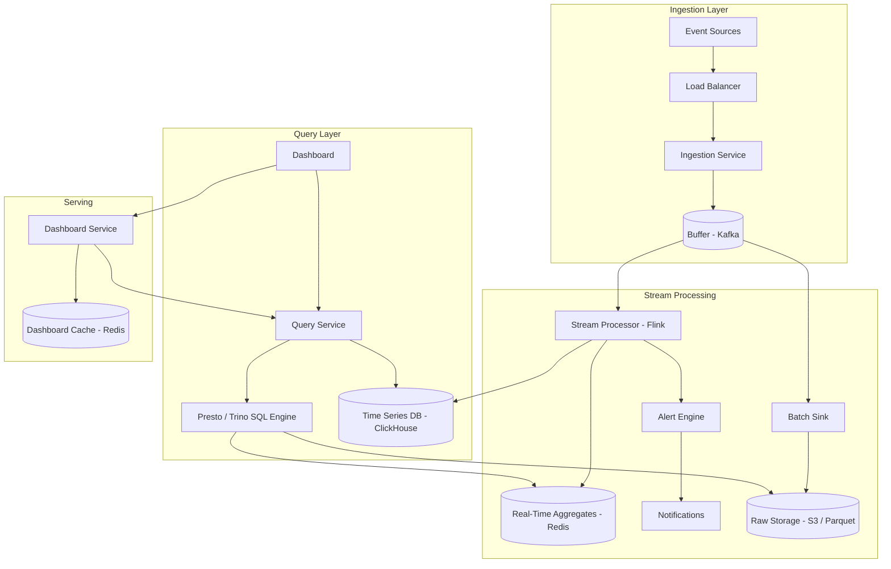
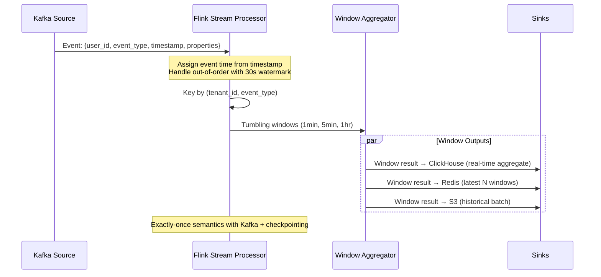

# Design a Real-Time Analytics Platform

## Requirements

- Ingest 1M events/sec from multiple sources
- Query with sub-second latency on fresh data
- Support SQL-like queries (aggregations, filters, group by)
- Retain raw data for 30 days, aggregates for 1 year
- Dashboard with real-time charts
- Alerting on metric thresholds
- Multi-tenant (1000+ users)

## Capacity Estimation

```
Events:         1M/sec → 86B events/day
Ingress:        1M × 1KB = 1GB/sec → 86TB/day raw
Storage:        86TB/day × 30 days = 2.6PB raw + 10TB aggregates
Queries:        10K queries/sec (1% of writes)
Alert rules:    100K active rules, evaluated every 60s
Dashboards:     10K concurrent dashboard views
```

## High-Level Design



## Stream Processing Pipeline (Flink)



## Data Model

```sql
-- Raw events (Parquet on S3, partitioned by date/hour)
-- Col: event_id, tenant_id, event_type, timestamp, user_id, properties MAP<STRING,STRING>

-- Real-time aggregates (ClickHouse)
CREATE TABLE event_aggregates (
    tenant_id String,
    event_type String,
    window_start DateTime,
    window_end DateTime,
    count UInt64,
    unique_users UInt64,
    p50_latency Float64,
    p99_latency Float64,
    properties_map String  -- serialized JSON for dynamic dimensions
) ENGINE = MergeTree()
PARTITION BY toDate(window_start)
ORDER BY (tenant_id, event_type, window_start);

-- Top-N queries (materialized in Redis)
-- Key: analytics:{tenant_id}:top_events:{window_type}
-- Value: Sorted Set (event_type → count)

-- Alerts (evaluated in Flink)
CREATE TABLE alert_rules (
    tenant_id String,
    rule_id String,
    metric_name String,
    condition String,  -- "> 1000"
    window_size Int16,  -- in minutes
    cooldown_sec Int32,
    status String DEFAULT 'active'
);
```

## Key Design Decisions

| Decision | Choice | Rationale |
|----------|--------|-----------|
| **Stream processor** | Apache Flink | Exactly-once, event time, stateful, low latency |
| **Query engine** | ClickHouse (for time-series) + Presto (for raw data) | ClickHouse: 100x faster for aggregates. Presto: full SQL on raw |
| **Hot cache** | Redis sorted sets for latest N windows | Sub-millisecond, built-in top-N |
| **Storage** | S3 + Parquet (raw), ClickHouse (aggregates) | Cost-effective raw storage, fast query on aggregates |
| **Alerting** | Flink CEP (Complex Event Processing) | Real-time evaluation, no separate system |
| **Multi-tenant** | Partition by tenant_id in Kafka + ClickHouse | Natural isolation, no noisy neighbor |

## Scaling Strategy

| Component | Scale |
|-----------|-------|
| **Kafka** | 100+ partitions (10 per event type) |
| **Flink** | Parallelism = number of Kafka partitions |
| **ClickHouse** | Sharded by tenant_id, replicated × 2 |
| **Presto** | Auto-scale workers, cache popular queries |
| **Redis** | Cluster mode with 16+ shards |

## Interview Questions

1. How would you design an analytics system handling 1M events/sec?
2. How does stream processing differ from batch processing for analytics?
3. How do you handle late-arriving data and out-of-order events?
4. Design the multi-tenant isolation strategy
5. How do you provide sub-second query latency on billions of events?
