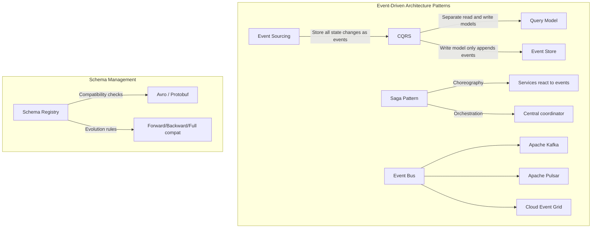

# Design an Event-Driven Architecture

## Requirements

- Asynchronous, decoupled microservices communication
- Support for event sourcing and CQRS
- Reliable event delivery with exactly-once semantics
- Event replay capability
- Schema evolution and compatibility
- Cross-service saga orchestration
- 100K events/sec throughput

## Capacity Estimation

```
Events:       100K/sec → 8.6B events/day
Event size:   2KB avg → 200MB/sec → 17TB/day
Storage:      7 day retention → 120TB (Kafka) + 1 year archive → 6PB (S3)
Event types:  500+ unique event types across 50 services
Subscriptions: 10K consumer groups
Schema versions: 1000+ registered schemas
```

## Core Patterns



## Event Sourcing + CQRS Architecture

```mermaid
graph TB
    subgraph WriteSide["Write Side (CQRS Command)"]
        Client[Client] --> Command[Command Handler]
        Command --> Validator[Validate]
        Validator --> EventStore[Event Store - Append Only]
        EventStore --> Bus[Event Bus - Kafka]
    end
    
    subgraph ReadSide["Read Side (CQRS Query)"]
        Bus --> Projector[Projector - Event Handler]
        Projector --> ReadDB[(Read DB - PostgreSQL/Elasticsearch)]
        ReadDB --> Query[Query Handler]
        Query --> Client2[Client]
    end
    
    subgraph Saga["Saga Orchestration"]
        Bus --> Saga[Saga Orchestrator]
        Saga --> Step1[Step 1: Reserve Inventory]
        Saga --> Step2[Step 2: Process Payment]
        Saga --> Step3[Step 3: Ship Order]
        
        Step1 -->|Failure| Comp1[Compensate: Release Inventory]
        Step2 -->|Failure| Comp2[Compensate: Refund Payment]
        Step3 -->|Failure| Comp3[Compensate: Cancel Shipment]
    end
```

## Event Schema Design

```json
{
  "event": {
    "id": "evt_abc123",
    "type": "order.created",
    "version": 1,
    "source": "order-service",
    "subject": "order_987",
    "time": "2026-06-04T12:00:00Z",
    "data": {
      "order_id": "order_987",
      "customer_id": "cust_456",
      "items": [{"product_id": "prod_123", "quantity": 2}],
      "total_amount": 49.99,
      "currency": "USD"
    },
    "correlation_id": "corr_789",
    "causation_id": "cmd_456",
    "traceparent": "00-0af7651916cd43dd8448eb211c80319c-b7ad6b7169203331-01"
  }
}
```

## Saga Orchestration Example (Order Processing)

```text
Order Service creates order → emits "order.created"
├── Saga Orchestrator receives "order.created"
│   ├── 1. Emit "inventory.reserve" → Inventory Service
│   │   ├── Success → emit "inventory.reserved"
│   │   └── Fail → emit "inventory.reservation_failed"
│   │       └── Compensating: "order.cancelled"
│   ├── 2. Emit "payment.charge" → Payment Service
│   │   ├── Success → emit "payment.charged"
│   │   └── Fail → emit "payment.charge_failed"
│   │       └── Compensating: "inventory.release"
│   ├── 3. Emit "shipment.create" → Shipping Service
│   │   ├── Success → emit "order.completed"
│   │   └── Fail → emit "shipment.creation_failed"
│   │       └── Compensating: "payment.refund" + "inventory.release"
│   └── Final: emit "order.saga_completed"
└── Each step is idempotent with idempotency_key
```

## Key Design Decisions

| Decision | Choice | Rationale |
|----------|--------|-----------|
| **Event bus** | Kafka (event sourcing + CQRS) | Durable, replayable, high throughput |
| **Schema registry** | Confluent Schema Registry with Avro | Backward/forward compatibility, evolution |
| **Event format** | CloudEvents standard | Interoperable across services, traceable |
| **CQRS projection** | Kafka Streams / ksqlDB | Exactly-once, stateful, exactly-once semantics |
| **Saga coordination** | Orchestration (central saga bus) | Choreography becomes complex with N services |
| **Idempotency** | event_id as idempotency key + dedup window | At-least-once delivery without duplicates |

## Event Replay Strategy

```
Replay Use Cases:
1. Bug fix in projection: Replay events since [timestamp]
2. New read model: Replay all events for that aggregate
3. Data recovery: Replay from last known good state
4. Audit/forensics: Query events for specific entity

Implementation:
- Kafka retention: 7 days (default), 30 days for critical topics
- Archive to S3: Parquet partitioned by event_type + date
- Replay: Kafka Streams reset tool (--to-earliest, --by-duration)

Snapshot strategy:
- Every 10,000 events: take snapshot of aggregate state
- Replay from last snapshot + remaining events
- Reduces replay time from days to minutes
```

## Interview Questions

1. How does event sourcing differ from traditional CRUD?
2. How does CQRS solve read/write contention in distributed systems?
3. Design a saga for a multi-step e-commerce order flow
4. How do you handle schema evolution in event-driven systems?
5. How would you replay events to rebuild a corrupted read model?
