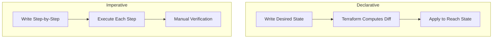

# 01 — Infrastructure as Code (IaC) Basics

## What is it?

Infrastructure as Code (IaC) is the practice of managing and provisioning infrastructure through machine-readable definition files rather than manual, interactive configuration. Instead of clicking through a web console or running ad-hoc shell commands, you write code that describes the desired state of your infrastructure — and a tool makes it so.

### Key Principles

- **Idempotency** — Running the same configuration repeatedly produces the same result
- **Declarative (or Imperative)** — You describe *what* you want, or *how* to get there
- **Version Control** — Infrastructure definitions are code, stored in Git
- **Automation** — No manual steps; everything is scripted and repeatable



## Why it matters

| Problem | IaC Solution |
|---------|-------------|
| Manual misconfiguration | Consistent, reviewed, versioned configs |
| Drift (manual changes) | Reconciliation via `terraform apply` |
| Environment inconsistency | Same code → dev/staging/prod |
| Slow recovery | Redeploy from code in minutes |
| Audit/compliance gaps | Full Git history of infra changes |

### Business Impact

- **Speed**: Provision environments in minutes, not days
- **Reliability**: Eliminate human error from infrastructure changes
- **Cost**: Easily tear down unused environments
- **Security**: Secrets and policies codified and reviewed

## Imperative vs Declarative

### Imperative (Ansible, Chef, Puppet, CloudFormation — in part)

You specify the exact steps to reach the desired state.

```yaml
# Ansible (imperative example)
- name: Install Nginx
  apt:
    name: nginx
    state: present
- name: Start Nginx
  service:
    name: nginx
    state: started
```

### Declarative (Terraform, Pulumi, CloudFormation — in part)

You specify the desired end state; the tool figures out the steps.

```hcl
# Terraform (declarative example)
resource "aws_instance" "web" {
  ami           = "ami-0c55b159cbfafe1f0"
  instance_type = "t2.micro"

  tags = {
    Name = "web-server"
  }
}
```

**Hybrid tools**: CloudFormation uses a declarative template but also supports `CreationPolicy` and `UserData` that are imperative. Ansible playbooks are procedural but strive for idempotency.

## Tool Comparison

| Feature | Terraform | CloudFormation | Pulumi | Ansible |
|---------|-----------|----------------|--------|---------|
| **Paradigm** | Declarative | Declarative | Declarative + Imperative | Imperative |
| **Language** | HCL | JSON / YAML | TypeScript, Python, Go, C#, Java | YAML |
| **State** | State file (local/remote) | AWS-managed stack | State file (local/cloud) | Stateless (pull-based) |
| **Cloud** | Multi-cloud | AWS-only | Multi-cloud | Multi-cloud |
| **Drift detection** | `terraform plan` | Drift detection built-in | `pulumi preview` | Ad-hoc playbooks |
| **Provisioners** | Limited (SSH, local-exec) | cfn-init, custom resource | Dynamic providers | First-class |
| **Community modules** | Terraform Registry | AWS Samples | Pulumi Registry | Ansible Galaxy |
| **Learning curve** | Medium | Medium | High (language required) | Low |

### When to choose which

- **Terraform** — Best for multi-cloud, open-source-first teams, complex orchestration
- **CloudFormation** — Best for pure AWS shops that want managed state + StackSets
- **Pulumi** — Best for teams that want real programming languages and testing libraries
- **Ansible** — Best for configuration management (installing software, compliance) alongside provisioning

## State Management

State is the **source of truth** in Terraform. It maps real-world resources to your configuration.

```hcl
# terraform.tfstate (simplified snippet)
{
  "version": 4,
  "resources": [
    {
      "module": "root",
      "type": "aws_instance",
      "name": "web",
      "instances": [
        {
          "attributes": {
            "id": "i-0a1b2c3d4e5f",
            "public_ip": "54.123.45.67"
          }
        }
      ]
    }
  ]
}
```

- **Local state**: `terraform.tfstate` — simple but dangerous for teams
- **Remote state**: S3, GCS, Azure Storage, Terraform Cloud — enables collaboration
- **State locking**: DynamoDB, Consul, or Terraform Cloud prevents concurrent writes

> **See also**: [05-State-Management.md](05-state-management.md) for deep dive

## Best Practices

1. **Always use remote state** with locking for any team > 1 person
2. **Never manually edit** state files — use `terraform state` commands
3. **Store state in a secure backend** with encryption at rest
4. **Don't store secrets** in state unless encrypted
5. **Pin provider versions** — avoid unexpected drift
6. **Use workspaces or directories** to separate environments

## Interview Questions

| Question | Key points |
|----------|------------|
| *What is IaC and why use it?* | Repeatability, version control, automation, drift prevention |
| *Compare Terraform and CloudFormation* | Multi-cloud vs AWS-only, state management, language |
| *What's the difference between declarative and imperative?* | *What* vs *How* — Terraform declares desired state, Ansible scripts steps |
| *What is state in Terraform?* | JSON mapping of real resources; source of truth for planning |
| *How do you handle secrets in Terraform?* | `sensitive = true` in variables, Vault provider, encrypted backend |

---

**Next**: [02 — Terraform Core Concepts](02-terraform-core-concepts.md)
