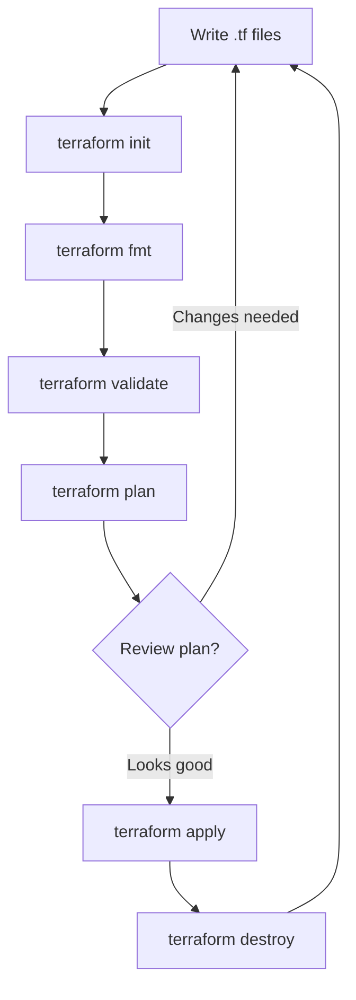

# 03 — Terraform Workflow

## What is it?

The Terraform workflow is the sequence of CLI commands used to write, plan, and apply infrastructure changes. It follows a core loop: **Init → Plan → Apply → Destroy** (for temporary environments). Mastering this workflow is essential for safe, predictable infrastructure changes.

## Why it matters

The workflow is where Terraform's safety guarantees come from. The separation of `plan` (what will change) from `apply` (make it happen) gives you a chance to review changes before they hit production. Understanding `plan` output, apply strategies, and the lock file prevents disasters.

## The Core Workflow



### Step 1: `terraform init`

```bash
# Initializes working directory, downloads providers and modules
terraform init

# With backend migration
terraform init -migrate-state

# Upgrade providers to latest within constraints
terraform init -upgrade
```

What happens:
1. Downloads all required providers to `.terraform/providers/`
2. Downloads all referenced modules to `.terraform/modules/`
3. Configures the backend (local or remote)
4. Creates `.terraform.lock.hcl`

### Step 2: `terraform fmt` & `validate`

```bash
# Format all .tf files to canonical HCL style
terraform fmt -recursive

# Check syntax and internal consistency
terraform validate
```

### Step 3: `terraform plan`

```bash
# Create and show an execution plan
terraform plan

# Save plan to file (for later apply)
terraform plan -out=plan.tfplan

# Plan with variables
terraform plan -var="environment=prod" -var-file="prod.tfvars"

# Plan targeting specific resources
terraform plan -target=aws_instance.web

# Generate only destroy plan
terraform plan -destroy
```

#### Plan Output Analysis

```
Terraform will perform the following actions:

  # aws_instance.web will be created
  + resource "aws_instance" "web" {
      + ami                          = "ami-0c55b159cbfafe1f0"
      + arn                          = (known after apply)
      + associate_public_ip_address  = (known after apply)
      + id                           = (known after apply)
      + instance_type                = "t2.micro"
      + private_ip                   = (known after apply)
      + public_ip                    = (known after apply)
      + subnet_id                    = "subnet-12345"
    }

  # aws_s3_bucket.data will be updated in-place
  ~ resource "aws_s3_bucket" "data" {
        id                          = "my-app-data-prod"
      ~ tags                        = {
          + "Environment" = "prod"
          + "Version"     = "2.0"
        }
    }

  # aws_security_group.old will be destroyed
  - resource "aws_security_group" "old" {
        id    = "sg-abcdef123"
        name  = "old-sg"
    }
```

**Symbols**:
- `+` : Create
- `-` : Destroy
- `~` : Update in-place
- `-/+` : Replace (destroy then create)

**Numbers**:
```
Plan: 1 to add, 2 to change, 1 to destroy.
```

### Step 4: `terraform apply`

```bash
# Review plan and approve interactively
terraform apply

# Apply a saved plan file (no approval needed)
terraform apply plan.tfplan

# Auto-approve (use with caution, typically in CI/CD)
terraform apply -auto-approve

# Apply with parallel operations
terraform apply -parallelism=10

# Apply and replace a specific resource
terraform apply -replace=aws_instance.web
```

#### Apply Strategies

| Strategy | Command | Use Case |
|----------|---------|----------|
| **Interactive** | `terraform apply` | Manual changes with peer review |
| **Plan-then-apply** | `plan -out=p.tfplan` → `apply p.tfplan` | CI/CD pipelines |
| **Auto-approve** | `apply -auto-approve` | Automation with safety checks upstream |
| **Replace** | `apply -replace=resource` | Recreate a specific resource |
| **Targeted** | `apply -target=resource` | Emergency fix (avoid — creates drift) |

### Step 5: `terraform destroy`

```bash
# Destroy all managed resources
terraform destroy

# Destroy with auto-approve
terraform destroy -auto-approve

# Destroy specific resources
terraform destroy -target=aws_instance.web
```

## `.terraform.lock.hcl`

The lock file records the exact provider versions and their checksums to ensure reproducible builds.

```hcl
# .terraform.lock.hcl
provider "registry.terraform.io/hashicorp/aws" {
  version     = "5.17.0"
  constraints = "~> 5.0"
  hashes = [
    "h1:rM4npXWE4+YMRXlPp2R2kWH6F9wHhZb+kIIT+GvE4I=",
    "zh:1234567890abcdef1234567890abcdef12345678",
  ]
}
```

- **Commit this file** to version control
- Use `terraform init -upgrade` to update to latest allowed versions
- Use `terraform providers lock` to pre-populate checksums for multiple platforms

## Provider Versioning

```hcl
terraform {
  required_providers {
    aws = {
      source  = "hashicorp/aws"
      version = "~> 5.0"   # >= 5.0, < 6.0
    }
    random = {
      source  = "hashicorp/random"
      version = ">= 3.1, < 4.0"
    }
  }
}
```

**Version constraint syntax**:

| Constraint | Meaning |
|------------|---------|
| `= 1.2.3` | Exact version |
| `>= 1.2` | Greater than or equal |
| `~> 1.2` | `>= 1.2, < 2.0` (minor version range) |
| `~> 1.2.3` | `>= 1.2.3, < 1.3.0` (patch range) |
| `>= 1.0, < 2.0` | Arbitrary range |
| `~> 1.0, >= 1.2` | Combined constraints |

## Workflow Example

```bash
# 1. Initialize
$ terraform init
Initializing the backend...
Initializing provider plugins...
Terraform has been successfully initialized!

# 2. Validate
$ terraform validate
Success! The configuration is valid.

# 3. Plan
$ terraform plan -out=prod.tfplan -var-file=prod.tfvars

# 4. Review plan output, then apply
$ terraform apply prod.tfplan
Apply complete! Resources: 3 added, 0 changed, 0 destroyed.

# 5. (Later) Destroy
$ terraform destroy -auto-approve
Destroy complete! Resources: 3 destroyed.
```

## Best Practices

1. **Always plan before apply** — never skip review
2. **Use `-out` flag** in CI/CD to ensure the applied plan matches the reviewed plan
3. **Commit `.terraform.lock.hcl`** to ensure deterministic provider versions
4. **Avoid `-target`** in production — it creates incomplete dependency tracking
5. **Run `terraform validate`** before every plan
6. **Use `terraform fmt -recursive`** to maintain consistent style
7. **Pass `-auto-approve` only in CI/CD** with proper gating upstream

## Interview Questions

| Question | Key points |
|----------|------------|
| *Explain the core Terraform workflow.* | Init → Plan → Apply → Destroy |
| *What is the purpose of `.terraform.lock.hcl`? | Lock provider versions and checksums for reproducibility |
| *How do you read a plan output?* | `+` create, `-` destroy, `~` update, `-/+` replace |
| *What's the difference between `terraform plan` and `terraform apply`?* | Plan is dry-run; apply executes changes |
| *When would you use `plan -out=file`?* | In CI/CD to save plan for a later, audited apply |
| *What happens if you run `apply` without `plan`?* | It generates a plan, asks for approval, then applies |

---

**Next**: [04 — Modules](04-modules.md)
