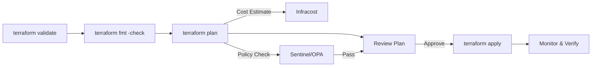

# 09 — Terraform Best Practices at Scale

## Naming Conventions

### What is it?

Consistent naming conventions for Terraform resources, variables, outputs, files, and modules. A predictable naming scheme makes code self-documenting and searchable across hundreds of configurations.

### Why it matters

At scale, ambiguous names cause confusion, merge conflicts, and accidental destruction. A team standard eliminates guesswork and makes code reviews faster.



### Implementation

```hcl
# ---------------------------------------------------------------------------
# Resource naming
# ---------------------------------------------------------------------------
# Pattern: <type>_<component>_<attribute>
resource "aws_s3_bucket" "app_logs_archive" {
  bucket = "myapp-logs-archive-${data.aws_caller_identity.current.account_id}"
}

resource "aws_iam_role" "ecs_task_execution" {
  name = "myapp-ecs-task-execution-role"
}

# ---------------------------------------------------------------------------
# Variable naming
# ---------------------------------------------------------------------------
# Use lowercase snake_case. Group related vars with a prefix.
variable "vpc_cidr_block" {
  description = "CIDR block for the VPC"
  type        = string
}

variable "vpc_enable_dns_hostnames" {
  description = "Enable DNS hostnames in the VPC"
  type        = bool
  default     = true
}

variable "db_instance_class" {
  description = "RDS instance class"
  type        = string
  default     = "db.t3.medium"
}

# Use maps for grouped configuration
variable "tags" {
  description = "Common resource tags"
  type        = map(string)
  default = {
    ManagedBy = "Terraform"
    Project   = "myapp"
  }
}

# ---------------------------------------------------------------------------
# Output naming
# ---------------------------------------------------------------------------
output "vpc_id" {
  description = "The VPC ID"
  value       = aws_vpc.main.id
}

output "vpc_private_subnet_ids" {
  description = "List of private subnet IDs"
  value       = aws_subnet.private[*].id
}

# ---------------------------------------------------------------------------
# File naming
# ---------------------------------------------------------------------------
# main.tf          — Primary resources
# variables.tf     — All variable declarations
# outputs.tf       — All output declarations
# terraform.tf     — Terraform / provider configuration
# providers.tf     — Provider configuration (alternative)
# locals.tf        — Local value definitions
# data.tf          — Data source declarations
# versions.tf      — Version constraints
# backend.tf       — Backend (remote state) configuration
```

### Best Practices

| Category | Convention | Example |
|----------|-----------|---------|
| Resources | `<type>_<component>_<detail>` | `aws_s3_bucket_app_logs` |
| Variables | `<prefix>_<attribute>` | `vpc_cidr_block` |
| Outputs | `<component>_<attribute>` | `vpc_id`, `subnet_ids` |
| Booleans | Prefix with `enable_` or `is_` | `enable_nat_gateway` |
| Counts | Suffix with `_count` or `_per_az` | `nat_gateway_count` |
| Files | Lowercase, semantic grouping | `network.tf`, `database.tf` |

### Interview Questions

**Q: Why prefer `for_each` over `count` for most use cases?**
A: `for_each` uses a map key to identify each resource instance, so removing an item from the middle of a collection does not cause all downstream resources to be recreated. `count` uses positional indexes, making it fragile when the list changes.

**Q: How do you name a module?**
A: Use a noun that describes the infrastructure it creates: `networking`, `database`, `compute`, `eks-cluster`. Avoid verbs (`create-vpc`) or implementation details (`aws-vpc`).

---

## File Structure

### What is it?

A standardized directory layout for Terraform projects that separates environments, modules, and shared configurations. The most common patterns are **environment folders** and **module composition**.

### Why it matters

Without structure, Terraform repositories become monolithic and unmaintainable. A clear layout enables team ownership, reduces blast radius, and simplifies CI/CD pipelines.

### Implementation

```hcl
# ---------------------------------------------------------------------------
# Environment folder layout (recommended for multi-env orgs)
# ---------------------------------------------------------------------------
# .
# ├── environments/
# │   ├── dev/
# │   │   ├── main.tf
# │   │   ├── terraform.tf
# │   │   ├── variables.tf
# │   │   └── terraform.tfvars
# │   ├── staging/
# │   │   └── ...
# │   └── prod/
# │       ├── main.tf
# │       ├── terraform.tf
# │       ├── variables.tf
# │       └── terraform.tfvars
# ├── modules/
# │   ├── networking/
# │   │   ├── main.tf
# │   │   ├── variables.tf
# │   │   └── outputs.tf
# │   ├── compute/
# │   │   └── ...
# │   └── database/
# │       └── ...
# ├── global/
# │   ├── iam/
# │   └── route53/
# ├── scripts/
# │   └── bootstrap.sh
# ├── tests/
# └── .github/workflows/terraform.yml

# ---------------------------------------------------------------------------
# Root module calling child modules
# ---------------------------------------------------------------------------
# environments/prod/main.tf

module "networking" {
  source = "../../modules/networking"

  vpc_cidr_block         = var.vpc_cidr_block
  enable_nat_gateway     = var.enable_nat_gateway
  private_subnet_count   = var.private_subnet_count
}

module "compute" {
  source = "../../modules/compute"

  vpc_id          = module.networking.vpc_id
  subnet_ids      = module.networking.private_subnet_ids
  instance_type   = var.instance_type
  instance_count  = var.instance_count
}

module "database" {
  source = "../../modules/database"

  vpc_id             = module.networking.vpc_id
  subnet_ids         = module.networking.database_subnet_ids
  instance_class     = var.db_instance_class
  storage_gb         = var.db_storage_gb
}

# ---------------------------------------------------------------------------
# Shared configuration per environment
# ---------------------------------------------------------------------------
# environments/prod/terraform.tfvars

vpc_cidr_block       = "10.0.0.0/16"
enable_nat_gateway   = true
private_subnet_count = 3
instance_type        = "t3.large"
instance_count       = 5
db_instance_class    = "db.r5.large"
db_storage_gb        = 500
tags = {
  Environment = "production"
  ManagedBy   = "Terraform"
}
```

### Best Practices

| Practice | Rationale |
|----------|-----------|
| One root module per environment | Isolates blast radius, independent state files |
| Modules with 3-8 resources | Too small = overhead, too large = rigid |
| No hardcoded values in modules | All inputs through variables |
| Use `terraform.tfvars` per environment | Keeps configuration separate from logic |
| Pin module versions via `ref` or tags | `source = "git::ssh://git@github.com/org/networking.git?ref=v1.2.0"` |

### Interview Questions

**Q: How do you handle shared global resources (IAM, DNS) in this layout?**
A: Place them in a `global/` directory with their own state. They are created before environment-specific infrastructure and rarely change.

---

## Remote State Strategy

### What is it?

Storing Terraform state files in a shared, durable, and locked backend (AWS S3 + DynamoDB, Azure Storage, GCS) instead of locally on disk.

### Why it matters

Local state breaks in team environments: conflicts, lost state, no locking. Remote state enables collaboration, audit trails, and disaster recovery.

### Implementation

```hcl
# ---------------------------------------------------------------------------
# AWS S3 + DynamoDB backend (most common)
# ---------------------------------------------------------------------------
# terraform.tf

terraform {
  backend "s3" {
    bucket         = "myapp-terraform-state"                    # Created manually or via bootstrap
    key            = "environments/prod/terraform.tfstate"      # Unique per environment
    region         = "us-east-1"
    encrypt        = true
    dynamodb_table = "terraform-state-lock"                     # DynamoDB for locking
  }
}

# ---------------------------------------------------------------------------
# Bootstrap script (run once)
# ---------------------------------------------------------------------------
# scripts/bootstrap.sh
# aws s3api create-bucket --bucket myapp-terraform-state --region us-east-1
# aws s3api put-bucket-versioning --bucket myapp-terraform-state --versioning-configuration Status=Enabled
# aws s3api put-bucket-encryption --bucket myapp-terraform-state --server-side-encryption-configuration '{"Rules":[{"ApplyServerSideEncryptionByDefault":{"SSEAlgorithm":"AES256"}}]}'
# aws dynamodb create-table --table-name terraform-state-lock --attribute-definitions AttributeName=LockID,AttributeType=S --key-schema AttributeName=LockID,KeyType=HASH --billing-mode PAY_PER_REQUEST
# aws s3api put-public-access-block --bucket myapp-terraform-state --public-access-block-configuration BlockPublicAcls=true,IgnorePublicAcls=true,BlockPublicPolicy=true,RestrictPublicBuckets=true

# ---------------------------------------------------------------------------
# Azure Storage backend
# ---------------------------------------------------------------------------
# terraform {
#   backend "azurerm" {
#     storage_account_name = "myappterraformstate"
#     container_name       = "tfstate"
#     key                  = "environments/prod.terraform.tfstate"
#     access_key           = ""  # Use environment variable ARM_ACCESS_KEY
#   }
# }

# ---------------------------------------------------------------------------
# GCS backend
# ---------------------------------------------------------------------------
# terraform {
#   backend "gcs" {
#     bucket = "myapp-terraform-state"
#     prefix = "environments/prod"
#   }
# }

# ---------------------------------------------------------------------------
# Reading remote state from another configuration
# ---------------------------------------------------------------------------
data "terraform_remote_state" "networking" {
  backend = "s3"
  config = {
    bucket = "myapp-terraform-state"
    key    = "global/networking/terraform.tfstate"
    region = "us-east-1"
  }
}

# Use the remote state outputs
resource "aws_security_group" "app" {
  name        = "app-sg"
  description = "Security group for app instances"
  vpc_id      = data.terraform_remote_state.networking.outputs.vpc_id
}
```

### Best Practices

| Practice | Detail |
|----------|--------|
| Enable S3 versioning | Recover from accidental deletion or corruption |
| Enable S3 encryption | SSE-S3 or SSE-KMS |
| Block public access | State files may contain secrets |
| Use separate state per environment | Prevents cross-environment impact |
| Never commit state to git | Add `*.tfstate` to `.gitignore` |
| Prefer `data.terraform_remote_state` | Over manual `terraform_remote_state` CLI calls |

### Interview Questions

**Q: What happens if DynamoDB lock is not released?**
A: Force-unlock with `terraform force-unlock <LOCK_ID>`. Investigate before forcing — the lock may indicate a running apply.

---

## State Locking

### What is it?

State locking prevents concurrent modifications to the same state file, avoiding corruption and conflicting resource changes.

### Why it matters

Without locking, two team members can run `terraform apply` simultaneously, resulting in lost updates, duplicate resources, or state corruption.

### Implementation

```hcl
# ---------------------------------------------------------------------------
# DynamoDB table for state locking (AWS)
# ---------------------------------------------------------------------------
# The backend configuration in terraform.tf references a DynamoDB table:
terraform {
  backend "s3" {
    bucket         = "myapp-terraform-state"
    key            = "environments/prod/terraform.tfstate"
    region         = "us-east-1"
    encrypt        = true
    dynamodb_table = "terraform-state-lock"
  }
}

# DynamoDB table definition (created via separate Terraform or bootstrap)
resource "aws_dynamodb_table" "terraform_lock" {
  name         = "terraform-state-lock"
  billing_mode = "PAY_PER_REQUEST"
  hash_key     = "LockID"

  attribute {
    name = "LockID"
    type = "S"
  }

  tags = {
    Name        = "Terraform State Lock"
    ManagedBy   = "Terraform"
  }
}

# ---------------------------------------------------------------------------
# Azure Storage lease locking (built-in)
# ---------------------------------------------------------------------------
# terraform {
#   backend "azurerm" {
#     storage_account_name = "myappterraformstate"
#     container_name       = "tfstate"
#     key                  = "prod.terraform.tfstate"
#     use_azuread_auth     = true
#   }
# }

# ---------------------------------------------------------------------------
# Force unlock (emergency procedure)
# ---------------------------------------------------------------------------
# terraform force-unlock <LOCK_ID>
# Use only after verifying no process is actively using the state!
```

### Best Practices

| Practice | Detail |
|----------|--------|
| Always configure a locking backend | S3 alone has no locking; you must add DynamoDB |
| Set DynamoDB to `PAY_PER_REQUEST` | Lock table has low traffic; no need for provisioned capacity |
| Never force-unlock blindly | Verify no apply/plan is running first |
| CI/CD locking is automatic | Pipelines should never run concurrent applies on the same state |

### Interview Questions

**Q: Can Terraform apply without a lock?**
A: Yes — Terraform Cloud and some backends (like Consul) support optional locking. Without a lock backend, `apply` proceeds with no concurrency protection.

---

## Secrets Management

### What is it?

Handling sensitive values (API keys, passwords, certificates) in Terraform without exposing them in state files, logs, or version control.

### Why it matters

Terraform state files contain all resource attributes in plaintext — including secrets. A compromised state bucket leaks your entire infrastructure's credentials.

### Implementation

```hcl
# ---------------------------------------------------------------------------
# Mark variables as sensitive
# ---------------------------------------------------------------------------
variable "db_master_password" {
  description = "RDS master password"
  type        = string
  sensitive   = true  # Hides value in CLI output and logs
}

variable "api_secret_key" {
  description = "API secret key for integration"
  type        = string
  sensitive   = true
}

# ---------------------------------------------------------------------------
# Input secrets via environment variables (never in .tfvars files)
# ---------------------------------------------------------------------------
# $ export TF_VAR_db_master_password="MyS3cur3P@ss!"
# $ export TF_VAR_api_secret_key="sk-abc123..."
# $ terraform plan

# ---------------------------------------------------------------------------
# HashiCorp Vault provider — dynamic secrets
# ---------------------------------------------------------------------------
provider "vault" {
  address = var.vault_address
  token   = var.vault_token  # Or use VAULT_TOKEN env var
}

data "vault_kv_secret_v2" "db" {
  mount = "secret"
  name  = "database/prod"
}

resource "aws_db_instance" "main" {
  identifier     = "myapp-prod"
  engine         = "postgres"
  instance_class = "db.r5.large"

  # Reference Vault secret without storing in state as plaintext
  # Note: Terraform still stores the resolved value in state.
  # Use Vault dynamic secrets for short-lived credentials.
  username = data.vault_kv_secret_v2.db.data["username"]
  password = data.vault_kv_secret_v2.db.data["password"]
}

# ---------------------------------------------------------------------------
# SOPS (Secrets OPerationS) — encrypted .tfvars files
# ---------------------------------------------------------------------------
# Encrypt a tfvars file with age key:
# $ sops --encrypt --age age1abc... terraform.dev.tfvars > terraform.dev.tfvars.sops
#
# Decrypt and pipe to terraform:
# $ sops --decrypt terraform.dev.tfvars.sops > terraform.dev.tfvars
# $ terraform apply -var-file=terraform.dev.tfvars

# ---------------------------------------------------------------------------
# AWS Secrets Manager (or Parameter Store)
# ---------------------------------------------------------------------------
data "aws_secretsmanager_secret" "db_credentials" {
  name = "prod/db/credentials"
}

data "aws_secretsmanager_secret_version" "db_credentials" {
  secret_id = data.aws_secretsmanager_secret.db_credentials.id
}

locals {
  db_creds = jsondecode(data.aws_secretsmanager_secret_version.db_credentials.secret_string)
}

resource "aws_db_instance" "main" {
  username = local.db_creds.username
  password = local.db_creds.password
}

# ---------------------------------------------------------------------------
# Output secrets only when needed
# ---------------------------------------------------------------------------
output "db_password" {
  description = "Database master password"
  value       = aws_db_instance.main.password
  sensitive   = true  # Terraform will mask this in CLI
}
```

### Best Practices

| Practice | Detail |
|----------|--------|
| Never commit secrets to git | Add `*.tfvars` (non-`.sops`), `*.tfstate` to `.gitignore` |
| Use `sensitive = true` on secret variables | Prevents exposure in CLI output and plan logs |
| Prefer environment variables for CI/CD | `TF_VAR_*` pattern keeps secrets out of code |
| Use Vault dynamic secrets | Auto-expiring credentials minimize blast radius |
| Rotate secrets regularly | Integrate with Secrets Manager rotation lambda |
| Audit state access | CloudTrail / audit logs should monitor state bucket reads |

### Interview Questions

**Q: Can Terraform state expose secrets even if variables are marked sensitive?**
A: Yes. `sensitive` only masks CLI output. State files store the resolved attribute values in plaintext. Always encrypt the state bucket and restrict access.

---

## CI/CD Integration

### What is it?

Automating Terraform plan and apply through CI/CD pipelines (GitLab CI, GitHub Actions) with approval gates, artifact sharing, and policy checks.

### Why it matters

Manual `terraform apply` is error-prone and lacks audit trails. CI/CD pipelines enforce review, run automated checks, and produce repeatable deployments.

### Implementation

```yaml
# ---------------------------------------------------------------------------
# GitHub Actions — Terraform CI/CD
# ---------------------------------------------------------------------------
# .github/workflows/terraform.yml

name: Terraform

on:
  push:
    branches: [main]
  pull_request:
    branches: [main]

env:
  TF_VERSION: "1.5.7"
  TF_VAR_region: "us-east-1"

jobs:
  validate:
    name: validate
    runs-on: ubuntu-latest
    steps:
      - uses: actions/checkout@v4

      - uses: hashicorp/setup-terraform@v3
        with:
          terraform_version: ${{ env.TF_VERSION }}

      - name: Terraform Init
        run: terraform init
        working-directory: environments/prod

      - name: Terraform Format
        run: terraform fmt -check -recursive

      - name: Terraform Validate
        run: terraform validate
        working-directory: environments/prod

  plan:
    name: plan
    needs: [validate]
    runs-on: ubuntu-latest
    if: github.event_name == 'pull_request'

    steps:
      - uses: actions/checkout@v4

      - uses: hashicorp/setup-terraform@v3
        with:
          terraform_version: ${{ env.TF_VERSION }}

      - name: Terraform Init
        run: terraform init
        working-directory: environments/prod

      - name: Terraform Plan
        id: plan
        run: terraform plan -no-color -out=tfplan
        working-directory: environments/prod

      - name: Upload Plan Artifact
        uses: actions/upload-artifact@v4
        with:
          name: tfplan
          path: environments/prod/tfplan

  apply:
    name: apply
    needs: [plan]
    runs-on: ubuntu-latest
    if: github.ref == 'refs/heads/main' && github.event_name == 'push'

    steps:
      - uses: actions/checkout@v4

      - uses: hashicorp/setup-terraform@v3
        with:
          terraform_version: ${{ env.TF_VERSION }}

      - name: Terraform Init
        run: terraform init
        working-directory: environments/prod

      - name: Terraform Apply
        run: terraform apply -auto-approve
        working-directory: environments/prod
```

```yaml
# ---------------------------------------------------------------------------
# GitLab CI — Terraform CI/CD
# ---------------------------------------------------------------------------
# .gitlab-ci.yml

image: hashicorp/terraform:1.5

cache:
  paths:
    - .terraform

variables:
  TF_ROOT: environments/prod

before_script:
  - cd $TF_ROOT
  - terraform init

stages:
  - validate
  - plan
  - apply

validate:
  stage: validate
  script:
    - terraform fmt -check -recursive
    - terraform validate

plan:
  stage: plan
  script:
    - terraform plan -no-color -out=tfplan
  artifacts:
    paths:
      - $TF_ROOT/tfplan
  only:
    - merge_requests

apply:
  stage: apply
  script:
    - terraform apply -auto-approve tfplan
  dependencies:
    - plan
  environment:
    name: production
  only:
    - main
  when: manual  # Require manual approval
```

### Best Practices

| Practice | Detail |
|----------|--------|
| Plan on PR, apply on merge | Review before apply prevents destructive changes |
| Upload plan as artifact | Apply uses the exact same plan, not a new one |
| Use OIDC instead of long-lived creds | `aws configure` with static keys is a security risk |
| Add manual approval for production | `when: manual` in GitLab, `environment` approval in GitHub |
| Pin Terraform version in CI | Avoids unexpected behavior from version bumps |
| Use separate CI jobs per environment | Dev -> staging -> prod promotion pipeline |

### Interview Questions

**Q: Why should the plan artifact be reused in the apply stage?**
A: Ensures the apply stage uses the exact same plan that was reviewed. Running a new plan in the apply stage risks drift between review and execution.

---

## Terragrunt for DRY Configurations

### What is it?

[Terragrunt](https://terragrunt.gruntwork.io) is a thin wrapper that keeps Terraform configurations DRY by managing remote state, provider configurations, and variable inheritance across multiple environments and modules.

### Why it matters

Without Terragrunt, you repeat `backend` and `provider` configuration in every root module. Terragrunt centralises these into a single `terragrunt.hcl` file and automates state bucket creation.

### Implementation

```hcl
# ---------------------------------------------------------------------------
# Root terragrunt.hcl — shared configuration
# ---------------------------------------------------------------------------
# terragrunt.hcl

locals {
  environment = basename(dirname(get_terragrunt_dir()))
  account_id  = "123456789012"
  region      = "us-east-1"
}

# Generate provider configuration for all child modules
generate "provider" {
  path      = "provider.tf"
  if_exists = "overwrite_terragrunt"
  contents  = <<-EOF
    provider "aws" {
      region = "${local.region}"
      default_tags {
        tags = {
          Environment = "${local.environment}"
          ManagedBy   = "Terragrunt"
        }
      }
    }
  EOF
}

# Remote state configuration — applied to all child modules
remote_state {
  backend = "s3"
  config = {
    bucket         = "myapp-terraform-state"
    key            = "${path_relative_to_include()}/terraform.tfstate"
    region         = local.region
    encrypt        = true
    dynamodb_table = "terraform-state-lock"
  }
  generate = {
    path      = "backend.tf"
    if_exists = "overwrite_terragrunt"
  }
}

# ---------------------------------------------------------------------------
# Environment-specific terragrunt.hcl
# ---------------------------------------------------------------------------
# environments/prod/terragrunt.hcl

include "root" {
  path = find_in_parent_folders()
}

terraform {
  source = "../../modules/networking"
}

inputs = {
  vpc_cidr_block       = "10.0.0.0/16"
  enable_nat_gateway   = true
  private_subnet_count = 3
}
```

```hcl
# ---------------------------------------------------------------------------
# Terragrunt dependency — read outputs from another module
# ---------------------------------------------------------------------------
# environments/prod/compute/terragrunt.hcl

include "root" {
  path = find_in_parent_folders()
}

terraform {
  source = "../../modules/compute"
}

dependency "networking" {
  config_path = "../networking"
}

inputs = {
  vpc_id     = dependency.networking.outputs.vpc_id
  subnet_ids = dependency.networking.outputs.private_subnet_ids
  instance_type = "t3.large"
  instance_count = 5
}
```

### Best Practices

| Practice | Detail |
|----------|--------|
| One `terragrunt.hcl` per env folder | Inherits root config, overrides inputs |
| Use `find_in_parent_folders()` | Avoids hardcoded relative paths |
| Use `dependency` blocks | Instead of `data.terraform_remote_state` |
| Generate backend.hcl | Avoids duplicating backend config across modules |
| Keep modules pure | Modules should be usable without Terragrunt too |

### Interview Questions

**Q: How does Terragrunt handle state bucket creation?**
A: Terragrunt automatically creates the S3 bucket and DynamoDB lock table if they do not exist based on the `remote_state` configuration, eliminating the bootstrap step.

---

## Pre-commit Hooks

### What is it?

Automated checks that run before every `git commit` to catch formatting errors, validation failures, and security issues. Uses the [`pre-commit`](https://pre-commit.com) framework with Terraform-specific hooks.

### Why it matters

Catches issues before they reach CI/CD, reducing pipeline failures and code review noise. Enforces team standards automatically.

### Implementation

```yaml
# ---------------------------------------------------------------------------
# .pre-commit-config.yaml
# ---------------------------------------------------------------------------
repos:
  - repo: https://github.com/antonbabenko/pre-commit-terraform
    rev: v1.88.0
    hooks:
      - id: terraform_fmt
        args:
          - --args=--recursive

      - id: terraform_validate
        args:
          - --init-args=-upgrade
          - --args=-no-color

      - id: terraform_tflint
        args:
          - --args=--config=__GIT_WORKING_DIR__/.tflint.hcl

      - id: terraform_docs
        args:
          - --args=--output-mode=inject

      - id: terraform_providers_lock
        args:
          - --args=-platform=linux_amd64
          - --args=-platform=darwin_amd64

      - id: terraform_checkov
        args:
          - --args=--skip-check=CKV_AWS_123

      - id: terrascan
        args:
          - --args=--non-recursive

      - id: infracost_breakdown
        args:
          - --args=--path=.

  - repo: https://github.com/pre-commit/pre-commit-hooks
    rev: v4.5.0
    hooks:
      - id: trailing-whitespace
      - id: end-of-file-fixer
      - id: check-yaml
      - id: check-added-large-files
        args: ["--maxkb=500"]

# ---------------------------------------------------------------------------
# TFLint configuration
# ---------------------------------------------------------------------------
# .tflint.hcl

plugin "aws" {
  enabled = true
  version = "0.30.0"
  source  = "github.com/terraform-linters/tflint-ruleset-aws"
}

rule "terraform_deprecated_index" {
  enabled = true
}

rule "terraform_unused_declarations" {
  enabled = true
}

rule "terraform_documented_outputs" {
  enabled = true
}

rule "terraform_documented_variables" {
  enabled = true
}

rule "terraform_typed_variables" {
  enabled = true
}

rule "terraform_naming_convention" {
  enabled = true
}
```

```yaml
# ---------------------------------------------------------------------------
# Terratest — automated integration tests for Terraform (Go)
# ---------------------------------------------------------------------------
# test/terraform_test.go

package test

import (
  "testing"
  "github.com/gruntwork-io/terratest/modules/terraform"
  "github.com/stretchr/testify/assert"
)

func TestVpcModule(t *testing.T) {
  opts := &terraform.Options{
    TerraformDir: "../environments/test",
    Vars: map[string]interface{}{
      "vpc_cidr_block": "10.0.0.0/16",
    },
    NoColor: true,
  }

  defer terraform.Destroy(t, opts)
  terraform.InitAndApply(t, opts)

  vpcId := terraform.Output(t, opts, "vpc_id")
  assert.NotEmpty(t, vpcId, "VPC ID should not be empty")
}
```

### Best Practices

| Practice | Detail |
|----------|--------|
| Run `terraform_fmt` first | Fixes formatting before other checks |
| Use `terraform_validate` | Catches syntax and reference errors |
| Add security scanners | `checkov`, `terrascan`, `tflint` for CIS compliance |
| Pin `pre-commit` revision tags | Avoid unexpected hook updates |
| Run hooks on all files | `--all-files` flag for CI runs |

### Interview Questions

**Q: Can pre-commit hooks block security violations?**
A: Yes. Tools like Checkov can be configured with `--hard-fail-on` to force-fail on critical findings (e.g., `CKV_AWS_51` for unencrypted EBS volumes).

---

## Cost Estimation

### What is it?

Automatically estimating the monthly cost of infrastructure changes before they are applied, using tools like [Infracost](https://infracost.io).

### Why it matters

Cloud cost overruns are a common problem. Infracost surfaces cost impact in pull requests, enabling teams to make financially informed decisions during code review.

### Implementation

```bash
# ---------------------------------------------------------------------------
# Infracost CLI usage
# ---------------------------------------------------------------------------
# Generate a cost breakdown from a Terraform plan
$ terraform init
$ terraform plan -out=tfplan
$ terraform show -json tfplan > plan.json
$ infracost breakdown --path plan.json

# Output:
# NAME                           MONTHLY QTY  UNIT        PRICE  HOURLY COST  MONTHLY COST
# aws_instance.web[0]                        1  hours       730   $0.0869      $15.64
# aws_db_instance.main                       1  hours       730   $0.4820      $86.76
# aws_s3_bucket.logs                   1,000  GB             50   $0.0230      $23.00
# ---------------------------------------------------------------------------
# OVERALL TOTAL                                                          $125.40
```

```yaml
# ---------------------------------------------------------------------------
# GitHub Actions — Infracost on PRs
# ---------------------------------------------------------------------------
# .github/workflows/infracost.yml

name: Infracost

on:
  pull_request:
    paths:
      - 'environments/**/*.tf'
      - 'modules/**/*.tf'

jobs:
  cost-estimate:
    runs-on: ubuntu-latest
    steps:
      - uses: actions/checkout@v4

      - name: Setup Terraform
        uses: hashicorp/setup-terraform@v3
        with:
          terraform_version: 1.5.7

      - name: Setup Infracost
        uses: infracost/actions/setup@v3
        with:
          api-key: ${{ secrets.INFRACOST_API_KEY }}

      - name: Generate Infracost Breakdown
        run: |
          terraform init
          terraform plan -out=tfplan
          terraform show -json tfplan > plan.json
          infracost breakdown --path plan.json --format json --out-file infracost.json
        working-directory: environments/prod

      - name: Post Infracost Comment
        uses: infracost/actions/comment@v3
        with:
          path: environments/prod/infracost.json
          github-token: ${{ secrets.GITHUB_TOKEN }}
```

```yaml
# ---------------------------------------------------------------------------
# GitLab CI — Infracost
# ---------------------------------------------------------------------------
# infracost:
#   stage: validate
#   image: infracost/infracost:latest
#   script:
#     - terraform init
#     - terraform plan -out=tfplan
#     - terraform show -json tfplan > plan.json
#     - infracost breakdown --path plan.json
#   only:
#     - merge_requests
```

### Best Practices

| Practice | Detail |
|----------|--------|
| Run Infracost on every PR | Catches cost increases before merge |
| Set a cost budget threshold | Comment only when change exceeds $X |
| Use `--usage-file` | Provide realistic usage data (e.g., GB storage, data transfer) |
| Tag resources for cost allocation | Ensure Infracost can map resources to teams/projects |

### Interview Questions

**Q: How does Infracost determine pricing?**
A: It uses a combination of cloud provider pricing APIs and a maintained pricing database. It parses the Terraform plan JSON to extract resource attributes and calculates costs based on the provider's pricing model.

---

## Policy as Code

### What is it?

Enforcing infrastructure policies (e.g., "no public S3 buckets", "encryption must be enabled") using policy-as-code frameworks such as HashiCorp Sentinel, Open Policy Agent (OPA), or Checkov policies.

### Why it matters

Manual policy enforcement does not scale. Policy as code catches violations in CI/CD pipelines, preventing non-compliant infrastructure from being provisioned.

### Implementation

```hcl
# ---------------------------------------------------------------------------
# Sentinel — HashiCorp's policy framework (Terraform Cloud/Enterprise)
# ---------------------------------------------------------------------------
# sentinel.hcl — policy set definition

policy "restrict-public-s3" {
  source            = "./policies/restrict-public-s3.sentinel"
  enforcement_level = "hard-mandatory"
}

policy "require-encryption" {
  source            = "./policies/require-encryption.sentinel"
  enforcement_level = "hard-mandatory"
}

policy "allowed-regions" {
  source            = "./policies/allowed-regions.sentinel"
  enforcement_level = "soft-mandatory"
}
```

```python
# policies/restrict-public-s3.sentinel

import "tfplan/v2" as tfplan

# Get all S3 bucket resources
s3_buckets = filter tfplan.resource_changes as _, rc {
    rc.type is "aws_s3_bucket" and
    rc.mode is "managed" and
    (rc.change.actions contains "create" or rc.change.actions contains "update")
}

# Check that no bucket has a public ACL
main = rule {
    all s3_buckets as _, bucket {
        not bucket.change.after.acl else "public-read" or "public-read-write"
    }
}
```

```rego
# ---------------------------------------------------------------------------
# OPA / Rego — Open Policy Agent (works with any Terraform)
# ---------------------------------------------------------------------------
# policy/terraform.rego

package terraform

# Deny public S3 buckets
deny[msg] {
    resource := input.resource_changes[_]
    resource.type == "aws_s3_bucket"
    resource.change.after.acl == "public-read"

    msg := sprintf("%s: S3 bucket %s has public-read ACL", [resource.address, resource.change.after.bucket])
}

deny[msg] {
    resource := input.resource_changes[_]
    resource.type == "aws_s3_bucket"
    resource.change.after.acl == "public-read-write"

    msg := sprintf("%s: S3 bucket %s has public-read-write ACL", [resource.address, resource.change.after.bucket])
}

# Require encryption on EBS volumes
deny[msg] {
    resource := input.resource_changes[_]
    resource.type == "aws_ebs_volume"
    resource.change.after.encrypted == false

    msg := sprintf("%s: EBS volume is not encrypted", [resource.address])
}

# Restrict EC2 instance types
deny[msg] {
    resource := input.resource_changes[_]
    resource.type == "aws_instance"
    not startswith(resource.change.after.instance_type, "t3.")
    not startswith(resource.change.after.instance_type, "m5.")

    msg := sprintf("%s: Instance type %s is not allowed (only t3.*, m5.*)", [resource.address, resource.change.after.instance_type])
}
```

```yaml
# ---------------------------------------------------------------------------
# OPA integration with Terraform (CI/CD)
# ---------------------------------------------------------------------------
# .github/workflows/terraform-opa.yml

# - name: Generate Plan JSON
#   run: |
#     terraform init
#     terraform plan -out=tfplan
#     terraform show -json tfplan > plan.json
#
# - name: OPA Policy Check
#   run: |
#     opa eval --data policy/ --input plan.json "data.terraform.deny"
#     # If any deny rules evaluate to true, fail the pipeline
```

### Best Practices

| Practice | Detail |
|----------|--------|
| Start with `soft-mandatory` | Log violations before enforcing them |
| Cover OWASP / CIS benchmarks | S3 public access, encryption, network ACLs, IAM policies |
| Version your policies | Store in a separate repo with its own review cycle |
| Test policies | Write unit tests for Sentinel or OPA policies |
| Combine with Checkov | Static analysis catches issues before plan generation |

### Interview Questions

**Q: Sentinel vs OPA — when to use which?**
A: Sentinel is tightly integrated with Terraform Cloud/Enterprise and can enforce policies at plan, apply, or state level. OPA is cloud-agnostic, works with any IaC tool, and uses Rego — a more expressive policy language. Choose Sentinel if you are on TFC/TFE; choose OPA for multi-tool or multi-cloud policy enforcement.

---

## Workspace Strategy

### What is it?

Workspaces allow managing multiple distinct infrastructure environments (dev, staging, prod) within a single Terraform configuration by maintaining separate state files.

### Why it matters

A workspace strategy determines how you isolate environments, manage state, and structure CI/CD. Poor workspace choices lead to accidental cross-environment changes.

### Implementation

```hcl
# ---------------------------------------------------------------------------
# Terraform CLI workspaces (initial use)
# ---------------------------------------------------------------------------
# $ terraform workspace new dev
# $ terraform workspace new staging
# $ terraform workspace new prod
# $ terraform workspace select dev

# ---------------------------------------------------------------------------
# Workspace-aware configuration
# ---------------------------------------------------------------------------
locals {
  environment = terraform.workspace

  # Environment-specific configuration via maps
  instance_config = {
    dev     = { type = "t3.medium", count = 1 }
    staging = { type = "t3.large",  count = 2 }
    prod    = { type = "t3.xlarge", count = 5 }
  }

  instance_type  = local.instance_config[local.environment].type
  instance_count = local.instance_config[local.environment].count
}

resource "aws_instance" "web" {
  count = local.instance_count

  ami           = data.aws_ami.amazon_linux.id
  instance_type = local.instance_type

  tags = {
    Name        = "web-${local.environment}-${count.index + 1}"
    Environment = local.environment
  }
}

# ---------------------------------------------------------------------------
# Tagging resources with workspace name
# ---------------------------------------------------------------------------
resource "aws_s3_bucket" "app_logs" {
  bucket = "myapp-logs-${local.environment}-${data.aws_caller_identity.current.account_id}"

  tags = {
    Environment = local.environment
  }
}

# ---------------------------------------------------------------------------
# Directory-per-environment (alternative to workspaces — recommended)
# ---------------------------------------------------------------------------
# environments/
#   dev/
#     main.tf
#     terraform.tfvars
#   staging/
#     main.tf
#     terraform.tfvars
#   prod/
#     main.tf
#     terraform.tfvars

# Strategy comparison:
# ┌────────────────┬─────────────────┬──────────────────────┐
# │ Aspect         │ CLI Workspaces  │ Directory-per-env    │
# ├────────────────┼─────────────────┼──────────────────────┤
# │ Isolation      │ Shared config   │ Independent configs  │
# │ State risk     │ Accidental env  │ Root module per env  │
# │ CI/CD         │ Single pipeline │ Per-environment jobs  │
# │ Refactoring    │ Dangerous       │ Safe per env         │
# │ Recommendation│ Quick POC only  │ Production standard  │
# └────────────────┴─────────────────┴──────────────────────┘
```

### Best Practices

| Practice | Detail |
|----------|--------|
| Prefer directory-per-environment | Greater isolation, independent state, safer refactoring |
| Use CLI workspaces only for quick POCs | Risk of accidental `terraform apply` on wrong workspace |
| Name workspaces clearly | `dev`, `staging`, `prod` — avoid ambiguous names |
| Tag all resources with workspace name | Enables cost tracking and resource identification |
| CI/CD must select the correct workspace | Pipe the environment name explicitly |

### Interview Questions

**Q: Why is directory-per-environment safer than CLI workspaces at scale?**
A: Each environment has its own root module, state, and CI/CD pipeline. There is zero risk of running `apply` on the wrong environment. Refactoring one environment does not affect others.

---

## Version Constraints

### What is it?

Pinning Terraform provider and module versions to specific ranges using `required_version` and `version` constraints. Ensures consistent behaviour across environments and team members.

### Why it matters

Unpinned versions cause unexpected behaviour when providers or Terraform CLI introduce breaking changes (e.g., provider attribute renames, removed data sources).

### Implementation

```hcl
# ---------------------------------------------------------------------------
# Terraform CLI version constraint
# ---------------------------------------------------------------------------
# versions.tf

terraform {
  required_version = ">= 1.5, < 2.0"

  required_providers {
    aws = {
      source  = "hashicorp/aws"
      version = ">= 5.0, < 6.0"
    }
    random = {
      source  = "hashicorp/random"
      version = ">= 3.5, < 4.0"
    }
  }
}

# ---------------------------------------------------------------------------
# Provider version constraint patterns
# ---------------------------------------------------------------------------
# >= 1.0             — Any version 1.0 or higher
# ~> 1.2             — Any 1.x where x >= 2 (pessimistic constraint)
# >= 1.0, < 2.0     — Any 1.x (most common for production)
# >= 1.0, <= 2.0    — Inclusive range
# = 1.2.3            — Exact version (brittle, avoid)
# >= 1.0, < 2.0, != 1.5.0  — Range with excluded version

# ---------------------------------------------------------------------------
# Module version constraints
# ---------------------------------------------------------------------------
# Terraform Registry
module "vpc" {
  source  = "terraform-aws-modules/vpc/aws"
  version = "~> 5.0"  # Use latest 5.x

  name = "myapp-vpc"
  cidr = "10.0.0.0/16"
}

# Git source with tag (preferred for private modules)
module "networking" {
  source = "git::ssh://git@github.com/myorg/terraform-networking.git?ref=v1.2.0"

  vpc_cidr_block = "10.0.0.0/16"
}

# Local path (development only)
module "networking" {
  source = "../../modules/networking"
}

# ---------------------------------------------------------------------------
# Lock file (.terraform.lock.hcl)
# ---------------------------------------------------------------------------
# The lock file records the exact provider versions used.
# Commit it to version control to ensure reproducible runs.
#
# provider hashicorp/aws {
#   version     = "5.40.0"
#   constraints = ">= 5.0, < 6.0"
#   hashes = [
#     "h1:jWx3D+PZeA08f4b2W0E/0G/xT9hHy7PT5hY+IIqMxM=",
#     "h1:qCx+Jk+2LpC7e2hFXSTOcYEMD6hNEFS9A/+DnfOom0=",
#   ]
# }
```

### Best Practices

| Practice | Detail |
|----------|--------|
| Always set `required_version` | Prevents accidental Terraform upgrades |
| Use `~>` (pessimistic) for providers | Safer than `>=` alone |
| Commit `.terraform.lock.hcl` | Ensures reproducible runs across machines |
| Avoid `= exact` versions | Blocks essential security patches |
| Set module version tags explicitly | `?ref=v1.2.0` — not `main` or `latest` |
| Update constraints deliberately | Review provider changelogs before bumping |

### Interview Questions

**Q: What does the pessimistic version constraint `~> 2.1` resolve to?**
A: It allows any 2.x version where `x >= 1` (e.g., 2.1, 2.2, up to 2.999...). It does not allow 3.x. Effectively `>= 2.1, < 3.0`.

---

## Cross-References

- **[10-AWS/02-iam-detailed.md](../10-AWS/02-iam-detailed.md)** — IAM roles and policies commonly provisioned via Terraform
- **[10-AWS/09-s3-storage.md](../10-AWS/09-s3-storage.md)** — S3 buckets as Terraform backends
- **[11-Azure/16-entra-id.md](../11-Azure/16-entra-id.md)** — Azure AD authentication for Terraform
- **[12-GCP/21-iam-resource-hierarchy.md](../12-GCP/21-iam-resource-hierarchy.md)** — GCP service accounts for Terraform
- **[14-DevOps/07-ci-cd-pipeline-design.md](../14-DevOps/07-ci-cd-pipeline-design.md)** — CI/CD pipeline patterns that integrate Terraform
- **[14-DevOps/09-devops-security.md](../14-DevOps/09-devops-security.md)** — Secrets management and security scanning in pipelines
- **[01-iac-basics.md](./01-iac-basics.md)** — Foundational IaC concepts
- **[05-state-management.md](./05-state-management.md)** — Deep dive into state backends and migration
- **[08-terraform-cloud.md](./08-terraform-cloud.md)** — Terraform Cloud workspaces, Sentinel, and remote runs
