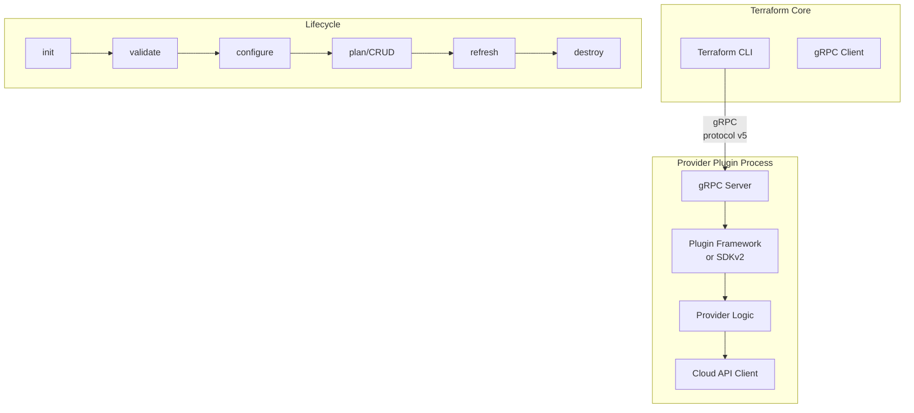

# 10 — Providers Deep Dive

## What is it?

Providers are Terraform plugins that implement resource types and data sources for a specific platform (AWS, Azure, GCP, Kubernetes, etc.). They translate HCL declarations into actual API calls using a plugin-based architecture built on gRPC. Understanding provider internals — schema, lifecycle, and the Plugin Framework — is essential for writing custom providers and debugging provider behavior.

## Why it matters

- Provider behavior directly impacts plan accuracy and apply reliability
- SDKv2 vs Plugin Framework v2 affects how you build and maintain custom providers
- Multi-provider patterns and alias configurations unlock complex architectures
- Acceptance testing ensures provider correctness before release
- Provider schema drives Terraform's validation, planning, and state tracking

## Provider Architecture



### Plugin Protocol v5 (gRPC)

Terraform launches each provider as a separate binary process and communicates over gRPC:

```
Terraform Core  ←→  provider plugin process (gRPC on localhost)
                          ↓
                 Cloud/Platform API
```

All providers implement `terraform.ResourceProviderServer` interface:
- `GetProviderSchema` — returns resource/data source/provider config schemas
- `ValidateProviderConfig` / `ValidateResourceConfig` — semantic validation
- `ConfigureProvider` — sets up API clients, auth, region
- `ReadResource` / `PlanResourceChange` / `CreateResource` / `UpdateResource` / `DeleteResource`
- `ReadDataSource`
- `ImportResourceState`
- `UpgradeResourceState` — migrates state from previous schema versions

## Provider Schema

Every provider exports three schema types:

```hcl
# Provider config schema
provider "aws" {
  region  = "us-east-1"
  profile = "production"
}

# Resource schema
resource "aws_instance" "web" {
  ami           = "ami-0c55b159cbfafe1f0"
  instance_type = "t2.micro"
}

# Data source schema
data "aws_ami" "amazon_linux" {
  most_recent = true
  owners      = ["amazon"]
}
```

### Schema Attributes

| Attribute | Kind | Description |
|-----------|------|-------------|
| `Type` | string/bool/int/float/list/map/set/object/tuple | HCL type system |
| `Required` | bool | Must be set by user |
| `Optional` | bool | Can be omitted |
| `Computed` | bool | Provider sets the value (e.g., `id`, `arn`) |
| `ForceNew` | bool | Change triggers resource recreation |
| `Sensitive` | bool | Redacted in logs/state/UI |
| `ConflictsWith` | []string | Mutual exclusion |
| `AtLeastOneOf` | []string | At least one must be set |
| `ExactlyOneOf` | []string | Exactly one must be set |
| `RequiredWith` | []string | Must be set alongside others |
| `Description` | string | User-facing documentation |
| `ValidateFunc` | func | Custom validation logic |

## SDKv2 vs Plugin Framework v2

| Aspect | SDKv2 | Plugin Framework v2 |
|--------|-------|-------------------|
| **Introduced** | 2017 | 2022 |
| **Type system** | Go types + schema.Schema | Attribute types (`tftypes`), generics |
| **Validation** | `ValidateFunc`, `DiffSuppressFunc` | Validators via `tfsdk` |
| **Plan modifiers** | `CustomizeDiff` | `tfsdk.AttributePlanModifier` |
| **State upgrades** | Manual `MigrateState` | `UpgradeState` interface |
| **Debugging** | Limited | `tfsdk.Debug` |
| **Error handling** | Panic-prone | Diagnostics framework |
| **Testing** | `resource.TestCase` | `resource.TestCase` compatible |

### SDKv2 Provider Skeleton

```go
package provider

import (
    "github.com/hashicorp/terraform-plugin-sdk/v2/helper/schema"
)

func Provider() *schema.Provider {
    return &schema.Provider{
        Schema: map[string]*schema.Schema{
            "region": {
                Type:     schema.TypeString,
                Required: true,
            },
        },
        ResourcesMap: map[string]*schema.Resource{
            "mycloud_instance": resourceInstance(),
        },
        DataSourcesMap: map[string]*schema.Resource{
            "mycloud_instance": dataSourceInstance(),
        },
        ConfigureContextFunc: providerConfigure,
    }
}
```

### Plugin Framework v2 Provider Skeleton

```go
package provider

import (
    "github.com/hashicorp/terraform-plugin-framework/provider"
)

type mycloudProvider struct {
    client *api.Client
}

func (p *mycloudProvider) Schema(ctx context.Context, req provider.SchemaRequest, resp *provider.SchemaResponse) {
    resp.Schema = provider.Schema{
        Attributes: map[string]provider.Attribute{
            "region": provider.StringAttribute{
                Required: true,
            },
        },
    }
}

func (p *mycloudProvider) Resources(ctx context.Context) []func() provider.Resource {
    return []func() provider.Resource{
        NewInstanceResource,
    }
}
```

## Acceptance Testing

### Standard Test Pattern

```go
func TestAccInstance_Basic(t *testing.T) {
    resource.Test(t, resource.TestCase{
        PreCheck:          func() { testAccPreCheck(t) },
        ProviderFactories: testAccProviders,
        CheckDestroy:      testAccCheckInstanceDestroy,
        Steps: []resource.TestStep{
            {
                Config: testAccInstanceConfig_basic(),
                Check: resource.ComposeTestCheckFunc(
                    testAccCheckInstanceExists("mycloud_instance.test"),
                    resource.TestCheckResourceAttr("mycloud_instance.test", "size", "small"),
                    resource.TestCheckResourceAttrSet("mycloud_instance.test", "public_ip"),
                ),
            },
            {
                Config: testAccInstanceConfig_updated(),
                Check: resource.ComposeTestCheckFunc(
                    testAccCheckInstanceExists("mycloud_instance.test"),
                    resource.TestCheckResourceAttr("mycloud_instance.test", "size", "large"),
                ),
            },
        },
    })
}

func testAccCheckInstanceDestroy(s *terraform.State) error {
    for _, rs := range s.RootModule().Resources {
        if rs.Type != "mycloud_instance" {
            continue
        }
        // Verify the resource no longer exists via API
        _, err := testAccClient.GetInstance(rs.Primary.ID)
        if err == nil {
            return fmt.Errorf("instance still exists")
        }
    }
    return nil
}
```

### Test Steps Pattern

| Step Purpose | Config | Checks |
|-------------|--------|--------|
| Create | Minimal config | Exists + attributes set |
| Update | Modified config | Changed attributes |
| Import | `ImportState: true` | `ImportStateVerify` |
| Destroy | None (implicit) | Custom CheckDestroy |
| PlanOnly | `PlanOnly: true` | Expect non-empty plan |

## Multi-Provider Patterns

### Provider Aliases

```hcl
provider "aws" {
  alias   = "us_east"
  region  = "us-east-1"
  profile = "prod"
}

provider "aws" {
  alias   = "us_west"
  region  = "us-west-2"
  profile = "prod"
}

resource "aws_instance" "primary" {
  provider   = aws.us_east
  ami        = "ami-0abc123"
  instance_type = "t3.micro"
}

resource "aws_instance" "secondary" {
  provider   = aws.us_west
  ami        = "ami-0def456"
  instance_type = "t3.micro"
}
```

### Assume Role

```hcl
provider "aws" {
  region = "us-east-1"
  assume_role {
    role_arn     = "arn:aws:iam::123456789012:role/OrganizationAccountAccessRole"
    session_name = "terraform-deploy"
    external_id  = "EXTERNAL_ID"
    duration     = "1h"
  }
}

# Chained assume role (cross-account)
provider "aws" {
  alias  = "child"
  region = "us-east-1"
  assume_role {
    role_arn = "arn:aws:iam::210987654321:role/ChildAccountRole"
  }
}
```

### Provider Meta-Arguments

| Meta-argument | Purpose |
|---------------|---------|
| `alias` | Multiple configurations of the same provider |
| `version` | (Deprecated) Use `required_providers` in `terraform` block |
| `provider` | Specify which provider config a resource uses |

## Best Practices

- Use **Plugin Framework v2** for new providers; SDKv2 is in maintenance mode
- Write acceptance tests against real infrastructure, not mocks
- Run acceptance tests with `TF_ACC=1` to avoid accidental execution
- Set `PreventDiskCleanup = true` during test development to inspect failures
- Use `resource.TestCheckResourceAttrPair` for cross-attribute validation
- Implement `ImportState` for every resource to enable migration
- Follow the [Terraform Provider Development Program](https://registry.terraform.io/browse/providers) guidelines
- Maintain comprehensive `Description` fields — they generate documentation

## Interview Questions

| Question | Key points |
|----------|------------|
| *Explain the Terraform provider plugin protocol.* | gRPC v5, separate binary process, Terraform Core launches providers as plugins |
| *What is the provider lifecycle?* | init → validate → configure → plan/CRUD → refresh → destroy |
| *SDKv2 vs Plugin Framework v2 — which to use?* | Plugin Framework v2 is the future; SDKv2 in maintenance |
| *How do acceptance tests work?* | `resource.TestCase` with PreCheck, ProviderFactories, Steps, CheckDestroy |
| *What is the purpose of `ForceNew`?* | Marks an attribute whose change requires resource recreation |
| *How do you use provider aliases?* | `alias` meta-argument on `provider` block; specify `provider = aws.xxx` on resources |
| *What is assume_role chaining?* | Nested `assume_role` blocks for cross-account access |

---

**Next**: [11 — CDK for Terraform (CDKTF)](11-cdktf.md)
