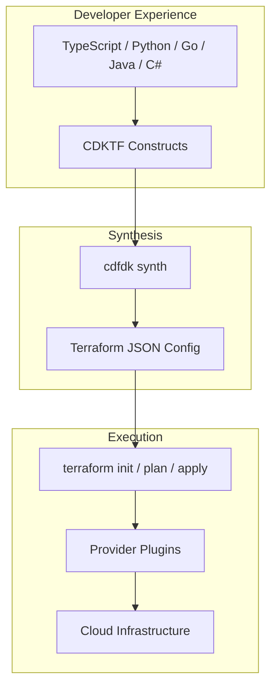

# 11 — CDK for Terraform (CDKTF)

## What is it?

CDKTF (Cloud Development Kit for Terraform) lets you define infrastructure using general-purpose programming languages (TypeScript, Python, Go, Java, C#) instead of HCL. It generates Terraform JSON configuration from your code, which Terraform applies normally. CDKTF bridges the gap between application developers who prefer familiar languages and infrastructure engineers who need Terraform's provider ecosystem.

## Why it matters

- Use loops, conditionals, functions, and OOP patterns instead of HCL's limited DSL
- Share code with your application team — they understand TypeScript/Python
- Strong typing improves IDE support (autocomplete, refactoring, type checking)
- CDKTF works with all 3,000+ Terraform providers — no vendor lock-in
- Unit-test infrastructure code with standard testing frameworks (jest, pytest)

## Architecture



## Core Concepts

### App, Stack, and Construct

```typescript
import { Construct } from "constructs";
import { App, TerraformStack, TerraformOutput } from "cdktf";
import { AwsProvider, Instance } from "@cdktf/provider-aws";

class MyStack extends TerraformStack {
  constructor(scope: Construct, name: string) {
    super(scope, name);

    new AwsProvider(this, "aws", {
      region: "us-east-1",
    });

    const instance = new Instance(this, "compute", {
      ami: "ami-0c55b159cbfafe1f0",
      instanceType: "t2.micro",
      tags: {
        Name: "cdktf-example",
        Environment: "production",
      },
    });

    new TerraformOutput(this, "publicIp", {
      value: instance.publicIp,
    });
  }
}

const app = new App();
new MyStack(app, "infra");
app.synth();
```

| Concept | Description | HCL Equivalent |
|---------|-------------|----------------|
| `App` | Root container; holds one or more Stacks | Root module |
| `Stack` | A deployable unit; maps to a Terraform workspace | `terraform { ... }` |
| `Construct` | Reusable building block (resource, module, or abstraction) | `resource`, `module`, or custom |
| `TerraformOutput` | Declares a stack output | `output` block |
| `Token` | Lazy value — resolved at synth time | Interpolation (`${...}`) |

### Tokens

Tokens are placeholders for values not yet known at synthesis time:

```typescript
// Token is a lazily-evaluated string
import { Token } from "cdktf";

class MyConstruct extends Construct {
  public readonly arn: string;

  constructor(scope: Construct, name: string) {
    super(scope, name);

    // Token.asString() creates a placeholder resolved at synth
    this.arn = Token.asString(`\${aws_instance.web.arn}`);
  }
}
```

Common token types: `Token.asString()`, `Token.asList()`, `Token.asNumber()`, `Token.asBoolean()`, `Token.asMap()`.

## CDKTF CLI Commands

```bash
# Initialize a new CDKTF project
cdktf init --template=typescript --local

# Generate provider bindings
cdktf get

# Synthesize to Terraform JSON
cdktf synth

# List stacks
cdktf list

# Deploy a stack
cdktf deploy my-stack

# Get outputs
cdktf output

# Destroy resources
cdktf destroy

# Diff against current state
cdktf diff

# Watch for changes and auto-deploy
cdktf watch
```

### Project Template Structure

```
my-infra/
├── main.ts                  # App + Stack definitions
├── cdktf.json               # CDKTF configuration
├── tsconfig.json
├── package.json
├── /imports                 # Generated provider bindings
│   └── /providers
│       └── /aws
│           ├── index.ts
│           └── ...
├── /cdktf.out               # Synthesized Terraform config
│   ├── manifest.json
│   └── stacks/
│       └── my-stack/
│           ├── cdk.tf.json   # Terraform JSON
│           └── plan
└── /__tests__/
    └── main-test.ts          # Unit tests
```

## Languages

| Language | Status | Template |
|----------|--------|----------|
| TypeScript | Stable | `--template=typescript` |
| Python | Stable | `--template=python` |
| Go | Beta | `--template=go` |
| Java | Beta | `--template=java` |
| C# | Beta | `--template=csharp` |

### Python Example

```python
from cdktf import App, TerraformStack, TerraformOutput
from constructs import Construct
from imports.aws import AwsProvider, Instance

class MyStack(TerraformStack):
    def __init__(self, scope: Construct, id: str):
        super().__init__(scope, id)
        AwsProvider(self, "aws", region="us-east-1")
        instance = Instance(self, "hello",
            ami="ami-0c55b159cbfafe1f0",
            instance_type="t2.micro"
        )
        TerraformOutput(self, "public_ip", value=instance.public_ip)

app = App()
MyStack(app, "infra")
app.synth()
```

## Testing

```typescript
// __tests__/main-test.ts
import { Testing } from "cdktf";
import { MyStack } from "../main";

test("stack synthesizes valid JSON", () => {
  const app = Testing.app();
  const stack = new MyStack(app, "test");
  const synthesized = Testing.synth(stack);

  expect(synthesized).toHaveProperty("resource.aws_instance.compute");
  expect(synthesized.resource.aws_instance.compute.ami)
    .toBe("ami-0c55b159cbfafe1f0");
});

test("stack has required provider", () => {
  const app = Testing.app();
  const stack = new MyStack(app, "test");
  const synthesized = Testing.synth(stack);

  expect(synthesized).toHaveProperty("terraform");
  expect(synthesized.terraform[0].required_providers)
    .toHaveProperty("aws");
});

import { Template } from "cdktf";
import { Construct } from "constructs";

test("matches snapshot", () => {
  const app = Testing.app();
  const stack = new MyStack(app, "test");
  const template = Template.synth(stack);
  expect(template).toMatchSnapshot();
});
```

Use `cdktf-assert` for richer assertions:

```typescript
import { Testing } from "cdktf";

test("resource has correct tags", () => {
  const app = Testing.app();
  const stack = new MyStack(app, "test");
  const synthesized = Testing.synth(stack);
  const instance = synthesized.resource.aws_instance.compute;

  expect(instance.tags.Name).toBe("cdktf-example");
});
```

## Modules (TerraformHclModule)

CDKTF can consume any HCL module from the Terraform Registry:

```typescript
import { TerraformHclModule } from "cdktf";

new TerraformHclModule(this, "vpc", {
  source  = "terraform-aws-modules/vpc/aws",
  version = "5.0.0",
  variables: {
    name = "my-vpc",
    cidr = "10.0.0.0/16",
    azs  = ["us-east-1a", "us-east-1b"],
    private_subnets = ["10.0.1.0/24", "10.0.2.0/24"],
    public_subnets  = ["10.0.101.0/24", "10.0.102.0/24"],
    enable_nat_gateway = true,
    enable_vpn_gateway = false,
    tags = {
      Environment = "production",
    },
  },
});
```

## Escape Hatches

When a provider or resource property has no CDKTF binding, use escape hatches:

```typescript
// Add raw HCL via TerraformResourceConfigOverrides
import { Fn } from "cdktf";

// Add a property not yet in the generated bindings
instance.addOverride("prop.name", "value");

// Use functions
instance.addOverride("depends_on", [
  `\${${otherResource.fqn}}`,
]);

// Raw HCL interpolation
instance.tags = {
  Name: `\${var.environment}-server`,
};

// Use Fn helpers
const id = Fn.arn("aws", "iam", "", "123456789012", "role/my-role");
```

## CDKTF vs Pulumi vs Plain HCL

| Aspect | CDKTF | Pulumi | Plain HCL |
|--------|-------|--------|-----------|
| **Language** | TS/Python/Go/Java/C# | TS/Go/Python/Java/C#/YAML | HCL DSL |
| **Provider ecosystem** | All Terraform providers | Native + TF bridge | All Terraform providers |
| **State management** | Terraform state | Pulumi state (self-managed or cloud) | Terraform state |
| **Testing** | Jest, Mocha, pytest | Unit + integration tests | tflint, checkov, sentinel |
| **Maturity** | GA (v0.20+) | GA | Very mature |
| **Learning curve** | Medium (CDK concepts) | Medium | Low (simple DSL) |
| **Multi-language** | Yes | Yes | No |
| **Debugging** | Harder (generated JSON) | Easier (direct API calls) | Direct (plan output) |

## Best Practices

- Use TypeScript for the best CDKTF experience — strongest type bindings
- Run `cdktf get` after adding new providers to regenerate bindings
- Leverage `cdktf synth` to inspect the generated JSON before deploying
- Write unit tests with `Testing.synth()` for every construct
- Use `TerraformHclModule` to consume existing HCL modules
- Keep stacks focused on a single concern (network, compute, data)
- Use environment variables or `cdktf.json` for provider configuration
- Avoid over-abstracting — too many layers make debugging difficult

## Interview Questions

| Question | Key points |
|----------|------------|
| *What is CDKTF?* | Code-driven Terraform using general-purpose languages; synthesizes to Terraform JSON |
| *Explain the App/Stack/Construct pattern.* | App is root, Stack is deployable unit, Construct is reusable building block |
| *What are Tokens?* | Lazy placeholders resolved at synth time for values unknown when code runs |
| *How do you test CDKTF code?* | `Testing.synth()` returns JSON; use Jest/Mocha/pytest to assert structure |
| *How does CDKTF compare to Pulumi?* | Both use general-purpose languages; CDKTF uses Terraform providers and state; Pulumi has native providers |
| *What are escape hatches?* | `addOverride` / `Fn` for properties not yet covered by bindings |
| *How do you use HCL modules from CDKTF?* | `TerraformHclModule` with `source`, `version`, `variables` |

---

**Next**: [12 — Testing Strategies](12-testing-strategies.md)
