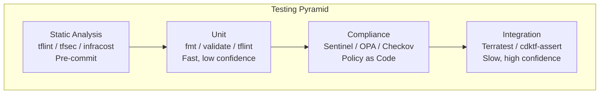

# 12 — Testing Strategies

## What is it?

Terraform testing spans multiple layers: static analysis of HCL code, unit-level validation, compliance policy enforcement, integration testing against real infrastructure, and golden file testing for regression detection. A robust testing strategy prevents misconfigurations, security vulnerabilities, cost overruns, and state corruption before they reach production.

## Why it matters

- A single misconfigured security group can expose millions of records
- State corruption from untested changes can orphan infrastructure
- Cost overruns from unvalidated resource choices increase cloud bills
- Manual testing of infrastructure changes is slow and error-prone
- Automated testing gates are required for mature CI/CD pipelines

## Testing Pyramid



## 1. Static Analysis

### tflint

```bash
# Install
tflint --init

# Run
tflint --recursive

# With config
tflint --config .tflint.hcl
```

```hcl
# .tflint.hcl
plugin "aws" {
    enabled = true
    version = "0.27.0"
    source  = "github.com/terraform-linters/tflint-ruleset-aws"
}

rule "aws_instance_previous_type" {
    enabled = false
}
```

### checkov

```bash
checkov --directory . --framework terraform
checkov --file main.tf --framework terraform
checkov -c CKV_AWS_118  # Run specific rule
```

### tfsec

```bash
tfsec .
tfsec --no-colour --format=json
tfsec --exclude-downloaded-modules
```

### terrascan

```bash
terrascan init
terrascan scan -i terraform -d .
terrascan scan -p policy/aws
```

### infracost

```bash
# Show cost estimate in plan output
infracost breakdown --path .

# Compare to previous run
infracost diff --path . --compare-to infracost-base.json

# With terraform plan JSON
terraform plan -out=plan.tfplan
terraform show -json plan.tfplan > plan.json
infracost breakdown --path plan.json
```

## 2. Unit-Level Testing

### fmt & validate

```bash
# Check formatting (fail on non-canonical)
terraform fmt -check -recursive
if [ $? -ne 0 ]; then
    echo "Formatting check failed"
    exit 1
fi

# Validate syntax and internal references
terraform validate

# Per-directory validation in CI
for dir in environments/*/; do
    (cd "$dir" && terraform init -backend=false && terraform validate)
done
```

### Terraform Test Framework (1.6+)

```hcl
# tests/instance_test.tftest.hcl
provider "aws" {
  region = "us-east-1"
}

run "validate_instance_config" {
  command = plan

  assert {
    condition     = aws_instance.web.instance_type == "t3.micro"
    error_message = "Expected instance type t3.micro"
  }

  assert {
    condition     = length(aws_instance.web.tags) > 0
    error_message = "Tags must be set"
  }
}

run "validate_outputs" {
  command = apply

  assert {
    condition     = output.instance_arn != null
    error_message = "ARN output must be set"
  }
}
```

```bash
# Run tests
terraform test

# With verbose output
terraform test -verbose

# Filter specific test files
terraform test -filter=tests/network_test.tftest.hcl
```

## 3. Compliance Testing

### Sentinel (Terraform Cloud)

```sentinel
# restrict-instance-type.sentinel
import "tfplan/v2" as tfplan

allowed_types = ["t3.micro", "t3.small", "t3.medium"]

main = rule {
    all tfplan.resource_changes as _, rc {
        rc.mode == "managed" and rc.type == "aws_instance" implies
            rc.change.after.instance_type in allowed_types
    }
}
```

### OPA / Rego

```rego
# policy/terraform/instance.rego
package terraform.aws

allowed_instance_types = {"t3.micro", "t3.small", "t3.medium"}
denied_public_ports = {22, 3389}

# Fail if unauthorized instance type
deny[msg] {
    resource := input.resource.aws_instance[name]
    not resource.instance_type == allowed_instance_types[_]
    msg := sprintf("%v: instance type %v not allowed", [name, resource.instance_type])
}

# Fail if SSH/RDP exposed to 0.0.0.0/0
deny[msg] {
    sg := input.resource.aws_security_group[name]
    ingress := sg.ingress[_]
    ingress.from_port <= denied_public_ports[_]
    ingress.to_port >= denied_public_ports[_]
    ingress.cidr_blocks[_] == "0.0.0.0/0"
    msg := sprintf("%v: public SSH/RDP access blocked", [name])
}
```

```bash
# Run OPA against Terraform plan
terraform plan -out=plan.tfplan
terraform show -json plan.tfplan > plan.json
opa eval --data policy --input plan.json "data.terraform.aws.deny"
```

### Checkov Custom Policies

```yaml
# .checkov.yml
policies:
  - id: CUSTOM_AWS_001
    name: "Prohibit large instance types"
    resource: aws_instance
    condition: "instance_type not in ['t3.large', 't3.xlarge', ...]"
```

## 4. Integration Testing (Terratest)

```go
// test/terraform_test.go
package test

import (
    "testing"
    "github.com/gruntwork-io/terratest/modules/terraform"
    "github.com/stretchr/testify/assert"
)

func TestTerraformAwsInstance(t *testing.T) {
    t.Parallel()

    terraformOptions := &terraform.Options{
        TerraformDir: "../examples/instance",
        Vars: map[string]interface{}{
            "instance_type": "t3.micro",
        },
    }

    // Clean up at the end
    defer terraform.Destroy(t, terraformOptions)

    // Initialize and apply
    terraform.InitAndApply(t, terraformOptions)

    // Validate outputs
    instanceID := terraform.Output(t, terraformOptions, "instance_id")
    assert.Contains(t, instanceID, "i-")

    publicIP := terraform.Output(t, terraformOptions, "public_ip")
    assert.NotEmpty(t, publicIP)

    // Validate the resource exists via AWS SDK
    // ... use aws-sdk-go to describe the instance
}

func TestTerraformVpcModule(t *testing.T) {
    t.Parallel()

    opts := &terraform.Options{
        TerraformDir: "../examples/vpc",
        Vars: map[string]interface{}{
            "cidr": "10.0.0.0/16",
            "azs":  []string{"us-east-1a", "us-east-1b"},
        },
    }

    defer terraform.Destroy(t, opts)
    terraform.InitAndApply(t, opts)

    vpcID := terraform.Output(t, opts, "vpc_id")
    assert.NotEmpty(t, vpcID)

    subnetIDs := terraform.OutputList(t, opts, "public_subnet_ids")
    assert.Len(t, subnetIDs, 2)

    // Validate subnets exist in the VPC
    // ... use SDK to verify subnet association
}
```

### Golden File Testing

```go
func TestTerraformGoldenFile(t *testing.T) {
    opts := &terraform.Options{
        TerraformDir: "./fixtures/basic",
    }

    // Generate plan JSON
    planPath := terraform.Plan(t, opts)
    planJSON := terraform.Show(t, opts, planPath)

    // Compare to golden file
    expected, _ := ioutil.ReadFile("testdata/golden_plan.json")
    assert.JSONEq(t, string(expected), planJSON)
}
```

## 5. CI Integration

### GitHub Actions

```yaml
# .github/workflows/terraform-test.yml
name: Terraform Validation
on: [pull_request]

jobs:
  validate:
    runs-on: ubuntu-latest
    steps:
      - uses: actions/checkout@v3

      - name: Setup Terraform
        uses: hashicorp/setup-terraform@v2
        with:
          terraform_version: 1.7.0

      - name: tflint
        uses: reviewdog/action-tflint@v1

      - name: tfsec
        uses: aquasecurity/tfsec-action@v1

      - name: Checkov
        uses: bridgecrewio/checkov-action@v12

      - name: Infracost
        uses: infracost/actions/setup@v2
        with:
          api-key: ${{ secrets.INFRACOST_API_KEY }}

      - name: Terraform fmt
        run: terraform fmt -check -recursive

      - name: Terraform Validate
        run: |
          terraform init -backend=false
          terraform validate

      - name: Terratest
        run: |
          cd test
          go test -v -timeout 30m
```

### Atlantis with Policy Checks

```yaml
# atlantis.yaml
version: 3
projects:
  - name: production
    dir: environments/prod
    terraform_version: v1.7.0
    workflow: production
    autoplan:
      enabled: true
      when_modified: ["*.tf", "*.tfvars"]

workflows:
  production:
    plan:
      steps:
        - run: tflint --recursive
        - run: tfsec --no-colour
        - run: checkov --directory .
        - run: terraform fmt -check
        - init
        - plan
    apply:
      steps:
        - run: infracost diff --path $PLANFILE
        - apply
```

## Module CI/CD

```
modules/
├── vpc/
│   ├── main.tf
│   ├── outputs.tf
│   ├── variables.tf
│   ├── test/
│   │   └── vpc_test.go      # Terratest integration tests
│   ├── examples/
│   │   └── basic/
│   │       ├── main.tf
│   │       └── terraform.tfvars
│   └── .github/
│       └── workflows/
│           └── test.yml      # Module CI
```

## Best Practices

- Run tflint, tfsec, and checkov in pre-commit hooks before any CI step
- Use `infracost` to flag cost increases in pull requests automatically
- Combine `terraform validate` with `tflint` — they catch different issues
- Write Terratest integration tests for every module you publish
- Use golden file comparison to catch unexpected plan diffs
- Gate production applies on compliance policy checks (Sentinel/OPA)
- Run `terraform test` (1.6+) in CI for fast unit-level assertions
- Keep test fixtures minimal — one resource per test pattern

## Interview Questions

| Question | Key points |
|----------|------------|
| *What belongs at each level of the testing pyramid?* | Static analysis → unit fmt/validate → compliance → integration |
| *How does tflint differ from tfsec?* | tflint lints HCL style and provider correctness; tfsec checks security posture |
| *What is Terratest and how does it work?* | Go library: InitAndApply → assert outputs → Destroy |
| *How do you enforce compliance policies?* | Sentinel (TFC), OPA/Rego (terraform show -json + opa eval), Checkov |
| *How does Atlantis integrate testing?* | Custom workflows: run linters before plan, gate apply with policies |
| *What is the purpose of golden file testing?* | Snapshot the plan JSON and diff against expected output to catch regressions |

---

**Next**: [14-DevOps/01-git-workflows.md](../14-DevOps/01-git-workflows.md)
