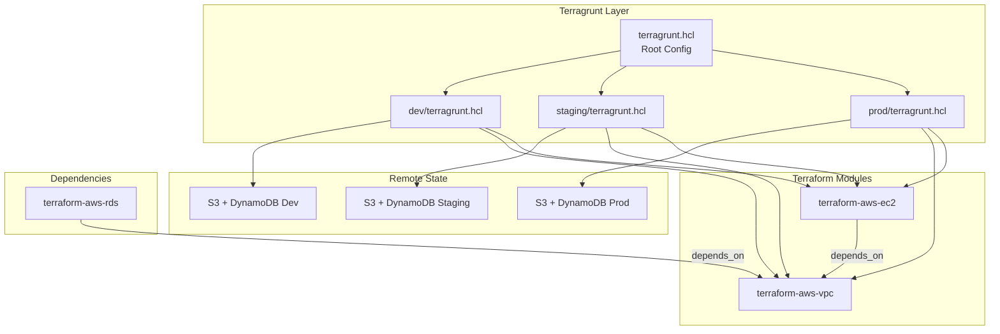

# 13 — Terragrunt: DRY Terraform at Scale

## Architecture at a Glance



## What is it?

Terragrunt is a thin wrapper around Terraform that provides extra tools for keeping your Terraform configurations **DRY** (Don't Repeat Yourself). It solves common pain points at scale — managing remote state backends across environments, composing modules without duplication, and handling dependencies between infrastructure components. Terragrunt uses `terragrunt.hcl` configuration files instead of Terraform's `.tf` files for environment-level orchestration.

## Why it was created

Terraform alone doesn't enforce DRY practices at the environment level. Teams managing multiple environments (dev/staging/prod) end up duplicating backend configurations, provider blocks, and variable files across directories. Terragrunt was created by Gruntwork to solve:

- **Backend boilerplate** — Defining S3 + DynamoDB configs in every environment manually
- **Module duplication** — Copy-pasting module calls across environments
- **Dependency ordering** — No native way to say "apply networking before compute" across root modules
- **CLI automation** — Running the same command across multiple directories

## When to use it

| Scenario | Recommendation |
|----------|---------------|
| Single environment, single module | Plain Terraform is sufficient |
| 2-3 environments with shared modules | Terragrunt saves significant boilerplate |
| 5+ environments, multi-team | Terragrunt is essential for maintainability |
| Complex dependency chains | Terragrunt `dependency` blocks are invaluable |
| Compliance/audit requirements | Terragrunt enforces consistent backends |

## Hands-on Example

### Root `terragrunt.hcl` (shared configuration)

```hcl
# root terragrunt.hcl — applied to ALL child directories
terraform {
  extra_arguments "common_vars" {
    commands = ["plan", "apply", "destroy"]

    arguments = [
      "-var-file=${get_parent_terragrunt_dir()}/common.tfvars",
      "-var-file=${get_terragrunt_dir()}/${get_env("TF_VAR_env", "dev")}.tfvars",
    ]
  }
}

remote_state {
  backend = "s3"
  config = {
    bucket         = "myorg-terraform-state"
    key            = "${path_relative_to_include()}/terraform.tfstate"
    region         = "us-east-1"
    encrypt        = true
    dynamodb_table = "terraform-state-lock"
  }

  generate = {
    path      = "backend.tf"
    if_exists = "overwrite"
  }
}

generate "provider" {
  path      = "provider.tf"
  if_exists = "overwrite"
  contents  = <<EOF
provider "aws" {
  region = "${local.aws_region}"
  default_tags {
    tags = {
      Environment = "${local.env}"
      ManagedBy   = "terragrunt"
    }
  }
}
EOF
}
```

### Dev environment `dev/terragrunt.hcl`

```hcl
# dev/terragrunt.hcl
include "root" {
  path = find_in_parent_folders()
}

locals {
  env        = "dev"
  aws_region = "us-east-1"
}

terraform {
  source = "git::https://github.com/org/terraform-aws-vpc.git//?ref=v5.0.0"
}

inputs = {
  name = "myapp-dev"
  cidr = "10.0.0.0/16"
  azs  = ["us-east-1a", "us-east-1b"]

  public_subnets  = ["10.0.101.0/24", "10.0.102.0/24"]
  private_subnets = ["10.0.1.0/24", "10.0.2.0/24"]

  enable_nat_gateway     = true
  enable_dns_hostnames   = true
  enable_vpn_gateway     = false

  tags = {
    Environment = "dev"
  }
}
```

### Dependency management between modules

```hcl
# dev/ec2/terragrunt.hcl
include "root" {
  path = find_in_parent_folders()
}

terraform {
  source = "git::https://github.com/org/terraform-aws-ec2.git//?ref=v2.0.0"
}

dependency "vpc" {
  config_path = "../vpc"

  mock_outputs = {
    vpc_id          = "vpc-12345678"
    public_subnets  = ["subnet-12345678", "subnet-87654321"]
    private_subnets = ["subnet-11111111", "subnet-22222222"]
  }
}

inputs = {
  name           = "web-server-dev"
  instance_count = 2
  instance_type  = "t3.micro"
  subnet_ids     = dependency.vpc.outputs.public_subnets
  vpc_id         = dependency.vpc.outputs.vpc_id
}
```

### `run-cmd` and `keepers` patterns

```hcl
# Run a command after apply (e.g., trigger a pipeline)
terraform {
  after_hook "trigger_deploy" {
    commands     = ["apply"]
    execute      = ["curl", "-X", "POST", "https://ci.example.com/trigger/deploy"]
    run_on_error = false
  }
}

# Keepers — regenerate resources on value changes
# Used with null_resource to trigger side-effects
```

### Multi-environment folder structure

```
infrastructure/
├── terragrunt.hcl          # Root config (inherit by all)
├── common.tfvars           # Shared variable values
├── dev/
│   ├── vpc/
│   │   └── terragrunt.hcl
│   ├── ec2/
│   │   └── terragrunt.hcl
│   └── rds/
│       └── terragrunt.hcl
├── staging/
│   ├── vpc/
│   │   └── terragrunt.hcl
│   ├── ec2/
│   │   └── terragrunt.hcl
│   └── rds/
│       └── terragrunt.hcl
└── prod/
    ├── vpc/
    │   └── terragrunt.hcl
    ├── ec2/
    │   └── terragrunt.hcl
    └── rds/
        └── terragrunt.hcl
```

## Best Practices

1. **Use `find_in_parent_folders()`** — Always include the root config via this function so all children inherit remote state and provider configs.
2. **Pin module versions** — Specify exact Git refs or tags for module sources. Never use `main`.
3. **Mock outputs for dependencies** — Use `mock_outputs` in `dependency` blocks so `terragrunt plan-all` works without prior applies.
4. **Keep environments isolated** — One state file per environment per module. Never share backends across envs.
5. **Use `generate` blocks** — Auto-generate `backend.tf` and `provider.tf` from root config instead of duplicating.
6. **Leverage `before_hook` / `after_hook`** — For pre/post apply actions like running tests or triggering deployments.
7. **Commit `terragrunt.hcl` to version control** — All infrastructure configs should be in Git.
8. **Use `terraform` blocks sparingly** — Prefer `generate` for provider/backend so root config remains the single source of truth.

## Interview Questions

**Q1: How does Terragrunt solve the "duplicate backend configuration" problem across environments?**

Terragrunt uses a root-level `terragrunt.hcl` with a `remote_state` block and `generate` blocks. The `remote_state` block defines the S3 bucket, DynamoDB table, and key pattern once. The `generate` block outputs a `backend.tf` file into each child directory with the correct key based on `path_relative_to_include()`. Every environment and module automatically gets a unique state key (`dev/vpc/terraform.tfstate`, `prod/vpc/terraform.tfstate`, etc.) without any copy-paste.

**Q2: What are `dependency` blocks and how do they differ from Terraform's `data.terraform_remote_state`?**

`dependency` blocks let one Terragrunt module read outputs from another module's state. Unlike `data.terraform_remote_state`, dependencies are aware of ordering — `terragrunt apply-all` will apply depended-on modules first. They also support `mock_outputs`, which provide fake values during initial planning when dependencies haven't been applied yet, enabling full `plan-all` runs on a fresh environment. `data.terraform_remote_state` requires real state to exist and has no ordering guarantees.

**Q3: How do you manage different variable values across dev/staging/prod with Terragrunt?**

Terragrunt supports multiple strategies: (a) Use `inputs = { ... }` in each environment's `terragrunt.hcl` to pass environment-specific values directly; (b) Use `extra_arguments` in the root config with `-var-file` pointing to environment-specific `.tfvars` files; (c) Read environment variables via `get_env()` and use them in `locals` blocks. The most common pattern is a combination — root config includes shared tfvars, and each environment's `terragrunt.hcl` passes environment-specific inputs.

## Real Company Usage

| Company | Use Case |
|---------|----------|
| **Gruntwork** | Creators of Terragrunt; use it to deliver their infrastructure packages to 500+ customers |
| **Segment (Twilio)** | Manages 200+ AWS accounts with Terragrunt, reducing config duplication by 90% |
| **Atlassian** | Uses Terragrunt to manage multi-region, multi-environment Terraform at scale |
| **ThoughtWorks** | Adopted Terragrunt as a standard practice for Terraform client engagements |
| **DigitalOcean** | Manages internal infrastructure across multiple environments with Terragrunt |
| **TransferWise (Wise)** | Uses Terragrunt to orchestrate hundreds of Terraform modules across environments |
