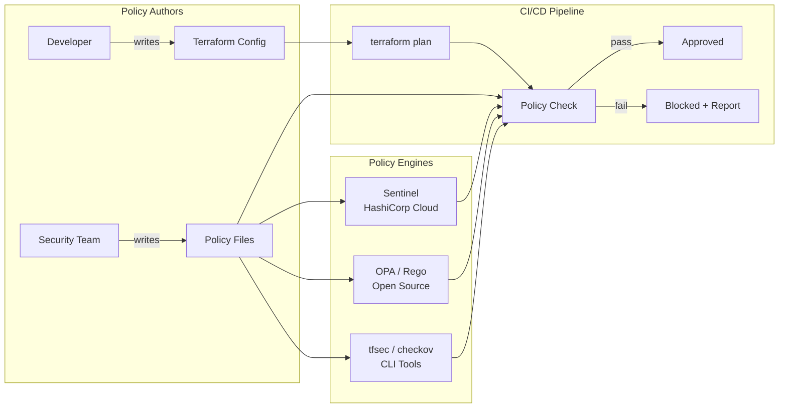

# 14 — Policy as Code for Terraform

## Architecture at a Glance



## What is it?

Policy as Code (PaC) for Terraform is the practice of defining, validating, and enforcing infrastructure policies through code rather than manual reviews. Policies codify rules like "all S3 buckets must be encrypted" or "EC2 instances cannot use public IPs" and are automatically evaluated during the Terraform plan/apply workflow. Tools like HashiCorp Sentinel, Open Policy Agent (OPA) with Rego, tfsec, and checkov provide different approaches to scanning Terraform configurations against a policy set.

## Why it was created

Manual compliance reviews don't scale. As infrastructure grows, teams need automated guardrails that:

- **Prevent misconfigurations** before they reach production
- **Enforce compliance** (SOC2, HIPAA, PCI-DSS, FedRAMP) continuously
- **Shift security left** — catch issues at plan time, not after deployment
- **Provide audit trails** — who approved what policy override
- **Standardize governance** across teams using the same policy language

## When to use it

| Scenario | Approach |
|----------|----------|
| Small team, one environment | tfsec or checkov in pre-commit hooks |
| Multi-team, Terraform Cloud | Sentinel (native TFC integration) |
| Multi-cloud, existing OPA infra | OPA/Rego for unified policy engine |
| Regulatory compliance | Combine Sentinel/OPA + tfsec/checkov |
| CI/CD gating | Policy check as a required status check |

## Hands-on Example

### Sentinel Policy (HashiCorp Cloud Platform)

```sentinel
# sentinel.hcl - policy definition
policy "enforce-encryption" {
  source            = "./enforce-encryption.sentinel"
  enforcement_level = "hard-mandatory"
}

# enforce-encryption.sentinel
import "tfplan"
import "tfconfig"

# All AWS S3 buckets must have encryption enabled
s3_buckets = tfconfig.resources("aws_s3_bucket", "aws_s3_bucket_v2")

violations = []

for s3_buckets as _, bucket {
  # Check server_side_encryption_configuration exists
  if length(bucket.config.server_side_encryption_configuration) is 0 {
    append(violations, bucket.address)
  } else {
    # Verify encryption is AES256 or aws:kms
    rule = bucket.config.server_side_encryption_configuration.rule
    sse_algorithm = rule.apply_server_side_encryption_by_default.sse_algorithm
    if sse_algorithm not in ["AES256", "aws:kms"] {
      append(violations, bucket.address)
    }
  }
}

main = rule {
  length(violations) is 0
}
```

### OPA / Rego Policy for Terraform

```rego
# policy/terraform/terraform.rego
package terraform.analysis

import future.keywords.if
import future.keywords.in

# Deny S3 buckets without encryption
deny[msg] {
    resource := input.resource.aws_s3_bucket[name]
    not resource.server_side_encryption_configuration
    msg = sprintf("S3 bucket %v must have encryption enabled", [name])
}

# Deny EC2 instances with public IPs
deny[msg] {
    resource := input.resource.aws_instance[name]
    resource.associate_public_ip_address == true
    msg = sprintf("EC2 instance %v must not have a public IP", [name])
}

# Deny security groups with open ingress to 0.0.0.0/0
deny[msg] {
    resource := input.resource.aws_security_group[name]
    some ingress in resource.ingress
    ingress.cidr_blocks[_] == "0.0.0.0/0"
    msg = sprintf("Security group %v has ingress open to 0.0.0.0/0 on port %v", [name, ingress.from_port])
}

# Deny RDS instances without deletion protection
deny[msg] {
    resource := input.resource.aws_db_instance[name]
    resource.deletion_protection != true
    msg = sprintf("RDS instance %v must have deletion protection enabled", [name])
}
```

### Running OPA against Terraform plan

```bash
# Generate a Terraform plan in JSON format
terraform plan -out=plan.tfplan
terraform show -json plan.tfplan > plan.json

# Evaluate OPA policies
opa eval --data policy/terraform/ --input plan.json "data.terraform.analysis.deny"

# Or using opa test for policy testing
opa test policy/terraform/ -v

# Integrate in CI pipeline
opa eval --data policy/terraform/ --input plan.json "data.terraform.analysis.deny" \
  --format=values | jq -r '.[]' | while read -r msg; do
  echo "POLICY VIOLATION: $msg"
  exit 1
done
```

### tfsec static analysis

```hcl
# tfsec detects misconfigurations via static analysis
resource "aws_s3_bucket" "data" {
  bucket = "my-data-bucket"
  # tfsec will flag: aws-s3-enable-bucket-logging
  # tfsec will flag: aws-s3-specify-public-access-block
}

resource "aws_instance" "web" {
  ami           = "ami-0c55b159cbfafe1f0"
  instance_type = "t3.micro"

  # tfsec will flag: aws-ec2-no-public-ip-subnet
  associate_public_ip_address = true
}
```

```bash
# Run tfsec
tfsec .

# Output with custom severity
tfsec . --no-colour --format json | jq '.results[] | {rule_id, severity, description}'

# Run checkov
checkov --directory . --framework terraform

# Combine with CI
checkov --directory . --framework terraform --quiet \
  --soft-fail-on CKV_AWS_123
```

### `terraform policy check` (HCL-native)

```hcl
# Since Terraform 1.7+, native policy validation
# terraform.tf
resource "aws_s3_bucket" "data" {
  bucket = "my-bucket"
  tags   = {
    Environment = "prod"
  }
}

# Run
# terraform policy check -policy-set=./policies/
```

## Best Practices

1. **Start with a policy framework** — Adopt Sentinel (TFC), OPA (multi-tool), or a combination rather than ad-hoc scripts.
2. **Pin policy versions** — Version your policy sets in Git with semantic tags just like application code.
3. **Test policies thoroughly** — Write unit tests for your Sentinel/Rego policies with `opa test` or Sentinel test runner.
4. **Use soft-mandatory first** — Start with advisory policies, then escalate to hard-mandatory after team adoption.
5. **Combine static + dynamic checks** — Use tfsec/checkov for static analysis; Sentinel/OPA for plan-time checks.
6. **Monitor policy violations** — Track policy pass/fail rates to identify which rules trigger most frequently.
7. **Document exceptions** — Use policy override mechanisms with clear audit trails instead of disabling policies.
8. **Run in CI/CD gating** — Make policy checks a required status check in GitHub/GitLab before merge.

## Interview Questions

**Q1: What is the difference between Sentinel and OPA/Rego for Terraform policy enforcement?**

Sentinel is HashiCorp's proprietary policy language integrated natively into Terraform Cloud/Enterprise. It evaluates against live plan data and supports multiple enforcement levels (advisory, soft-mandatory, hard-mandatory). OPA (Open Policy Agent) with Rego is an open-source, CNCF-graduated policy engine that can evaluate policies against any structured data (JSON, Terraform plans, Kubernetes resources, etc.). Sentinel is easiest within the HashiCorp ecosystem; OPA is the better choice for multi-tool, multi-cloud policy enforcement across your entire stack.

**Q2: How do you integrate policy-as-code into a CI/CD pipeline for Terraform?**

The standard workflow: (a) Developer commits Terraform config and pushes a PR; (b) CI runs `terraform fmt` + `terraform validate`; (c) CI runs static analysis (tfsec/checkov) against the `.tf` files — any violations comment on the PR; (d) CI runs `terraform plan` and converts output to JSON; (e) CI runs OPA or Sentinel against the plan JSON; (f) Policy violations cause the pipeline step to fail; (g) Developers must fix violations or request policy exceptions with manager approval; (h) Only on policy pass does the apply proceed.

**Q3: What types of policies are most commonly enforced for Terraform infrastructure?**

Common policy categories: (a) **Security** — S3 bucket encryption, security group ingress restrictions, IAM least-privilege, KMS key usage; (b) **Compliance** — Required tags (Environment, CostCenter), region restrictions, backup/snapshot requirements; (c) **Cost** — Instance type limits, prohibition of expensive resources (e.g., `m5.24xlarge`), auto-stop schedules; (d) **Operational** — Mandatory logging/monitoring, backup retention periods, deletion protection on RDS; (e) **Naming** — Resource naming conventions, standardized tag schemas.

## Real Company Usage

| Company | Tools | Use Case |
|---------|-------|----------|
| **HashiCorp** | Sentinel | Built-in policy engine for Terraform Cloud, enforced across millions of runs daily |
| **Netflix** | OPA/Rego | Spinnaker + Terraform policy enforcement for multi-account AWS governance |
| **Goldman Sachs** | OPA/Rego | Compliance validation for Terraform-managed infrastructure across clouds |
| **New Relic** | tfsec + OPA | CI/CD pipeline gating with both static analysis and plan-time policy checks |
| **Salesforce** | Sentinel + Checkov | Multi-team Terraform Cloud with custom Sentinel policies for PCI compliance |
| **Adobe** | OPA/Rego | Unified policy enforcement across Terraform, Kubernetes, and REST APIs |
