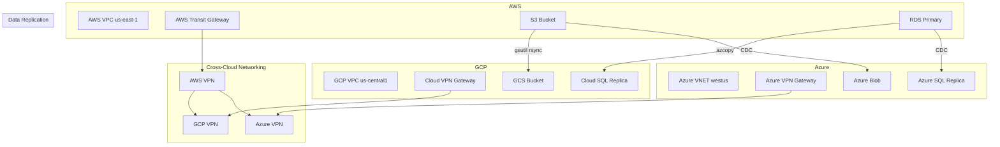

# 15 — Multi-Cloud Terraform Architectures

## Architecture at a Glance



## What is it?

Multi-cloud Terraform architectures use Terraform to manage infrastructure across two or more cloud providers (AWS, GCP, Azure, etc.) from a single codebase. This involves composing provider configurations, establishing cross-cloud networking (VPNs, transit gateways), replicating data across clouds, managing secrets across provider boundaries, and building cloud-agnostic modules that abstract provider-specific details behind a unified interface.

## Why it was created

Organizations adopt multi-cloud for several strategic reasons:

- **Vendor lock-in avoidance** — No single cloud provider dependency
- **Best-of-breed services** — Use each cloud's strengths (AWS for compute, GCP for BigQuery, Azure for Active Directory)
- **Disaster recovery** — Active-passive or active-active across regions and providers
- **Geographic presence** — Data residency requirements may dictate specific providers per region
- **M&A integration** — Acquired companies bring their own cloud infrastructure

## When to use it

| Scenario | Recommendation |
|----------|---------------|
| Single-cloud, no strategic need | Don't add multi-cloud complexity |
| DR/BCP requirement | Active-passive multi-cloud with periodic failover testing |
| Best-of-breed per workload | Multi-cloud with clear service boundaries and interconnects |
| M&A integration | Multi-cloud during transition, target consolidation over time |
| Data residency / sovereignty | Multi-cloud per region based on compliance requirements |

## Hands-on Example

### Multi-provider composition

```hcl
# providers.tf
terraform {
  required_version = ">= 1.6"
  required_providers {
    aws = {
      source  = "hashicorp/aws"
      version = "~> 5.0"
    }
    google = {
      source  = "hashicorp/google"
      version = "~> 5.0"
    }
    azurerm = {
      source  = "hashicorp/azurerm"
      version = "~> 3.0"
    }
  }
}

provider "aws" {
  region = var.aws_region
  assume_role {
    role_arn = var.aws_role_arn
  }
}

provider "google" {
  project = var.gcp_project
  region  = var.gcp_region
}

provider "azurerm" {
  features {}
  subscription_id = var.azure_subscription_id
}
```

### Cross-cloud VPN (AWS to GCP)

```hcl
# AWS side
resource "aws_vpn_gateway" "main" {
  vpc_id = aws_vpc.main.id

  tags = {
    Name = "vpn-to-gcp"
  }
}

resource "aws_customer_gateway" "gcp" {
  bgp_asn    = 65000
  ip_address = google_compute_address.vpn_gw.address
  type       = "ipsec.1"

  tags = {
    Name = "gcp-vpn-gateway"
  }
}

resource "aws_vpn_connection" "to_gcp" {
  vpn_gateway_id      = aws_vpn_gateway.main.id
  customer_gateway_id = aws_customer_gateway.gcp.id
  type                = "ipsec.1"
  static_routes_only  = true
}

resource "aws_vpn_connection_route" "gcp_cidr" {
  destination_cidr_block = var.gcp_cidr_block
  vpn_connection_id      = aws_vpn_connection.to_gcp.id
}

# GCP side
resource "google_compute_address" "vpn_gw" {
  name   = "vpn-gw-address"
  region = var.gcp_region
}

resource "google_compute_ha_vpn_gateway" "main" {
  name    = "aws-ha-vpn-gw"
  region  = var.gcp_region
  network = google_compute_vpc.main.self_link
}

resource "google_compute_external_vpn_gateway" "aws" {
  name            = "aws-external-gw"
  redundancy_type = "SINGLE_IP_INTERNALLY_REDUNDANT"

  interface {
    id         = 0
    ip_address = aws_vpn_gateway.main.public_ip
  }
}

resource "google_compute_vpn_tunnel" "to_aws" {
  name               = "vpn-tunnel-to-aws"
  region             = var.gcp_region
  vpn_gateway        = google_compute_ha_vpn_gateway.main.self_link
  peer_external_gateway = google_compute_external_vpn_gateway.aws.self_link
  peer_external_gateway_interface = 0
  shared_secret      = var.vpn_shared_secret
  ike_version        = 2

  local_traffic_selector  = [var.gcp_cidr_block]
  remote_traffic_selector = [var.aws_cidr_block]
}
```

### Cloud-agnostic module pattern

```hcl
# modules/compute/main.tf — abstraction over compute instances
variable "cloud_provider" {
  description = "Cloud provider to use (aws, gcp, azure)"
  type        = string
}

variable "name" {
  type = string
}

variable "instance_type" {
  type = string
}

variable "subnet_id" {
  type = string
}

variable "image_id" {
  type = string
}

# AWS
resource "aws_instance" "main" {
  count   = var.cloud_provider == "aws" ? 1 : 0
  ami     = var.image_id
  instance_type = var.instance_type
  subnet_id     = var.subnet_id

  tags = {
    Name = var.name
  }
}

# GCP
resource "google_compute_instance" "main" {
  count        = var.cloud_provider == "gcp" ? 1 : 0
  name         = var.name
  machine_type = var.instance_type
  zone         = var.zone

  boot_disk {
    initialize_params {
      image = var.image_id
    }
  }

  network_interface {
    subnetwork = var.subnet_id
  }
}

# Azure
resource "azurerm_linux_virtual_machine" "main" {
  count               = var.cloud_provider == "azure" ? 1 : 0
  name                = var.name
  resource_group_name = var.resource_group_name
  location            = var.location
  size                = var.instance_type
  admin_username      = "adminuser"

  network_interface_ids = [var.subnet_id]

  admin_ssh_key {
    username   = "adminuser"
    public_key = var.ssh_public_key
  }

  source_image_id = var.image_id

  os_disk {
    caching              = "ReadWrite"
    storage_account_type = "Standard_LRS"
  }
}
```

### Secrets management across clouds

```hcl
# Using AWS Secrets Manager + GCP Secret Manager
terraform {
  required_providers {
    aws = {
      source  = "hashicorp/aws"
      version = "~> 5.0"
    }
    google = {
      source  = "hashicorp/google"
      version = "~> 5.0"
    }
  }
}

# Read secret from AWS
data "aws_secretsmanager_secret_version" "db_password" {
  secret_id = "prod/db/password"
}

# Replicate to GCP
resource "google_secret_manager_secret" "db_password" {
  secret_id = "db-password"

  replication {
    auto {}
  }
}

resource "google_secret_manager_secret_version" "db_password" {
  secret      = google_secret_manager_secret.db_password.id
  secret_data = data.aws_secretsmanager_secret_version.db_password.secret_string
}
```

### Data replication across clouds

```hcl
# Replicate S3 bucket to GCS using gsutil via local-exec
resource "null_resource" "s3_to_gcs_replication" {
  triggers = {
    s3_object_hash  = data.aws_s3_bucket_object.data.etag
    gcs_bucket_name = google_storage_bucket.replica.name
  }

  provisioner "local-exec" {
    command = <<EOF
      aws s3 sync s3://${var.source_bucket}/ data/ \
      && gsutil -m rsync -r data/ gs://${google_storage_bucket.replica.name}/
    EOF
  }
}

# Cross-cloud DNS with Route53 -> Cloud DNS
resource "aws_route53_record" "cross_cloud" {
  zone_id = aws_route53_zone.main.zone_id
  name    = "api.global.example.com"
  type    = "A"

  alias {
    name                   = google_cloud_run_service.api.status[0].url
    zone_id                = "Z2FDTNDATAQYW2"  # CloudFront/LB zone ID
    evaluate_target_health = true
  }
}
```

## Best Practices

1. **Use workspaces or directories per cloud** — Keep cloud-specific configs in separate directories or workspaces, not entangled in the same root module.
2. **Abstract with cloud-agnostic modules** — Build modules that accept a `cloud_provider` variable and use `count` to select provider-specific resources.
3. **Establish dedicated cross-cloud networking** — Use VPN or dedicated interconnects (AWS Direct Connect, GCP Dedicated Interconnect, Azure ExpressRoute) for reliable connectivity.
4. **Manage secrets centrally** — Use a single secrets manager with cross-cloud replication (AWS Secrets Manager, HashiCorp Vault) rather than per-provider secret stores.
5. **Separate state per cloud per environment** — Never mix AWS and GCP state in the same file. Use `backend` configs per cloud.
6. **Implement cloud-agnostic CI/CD** — Run the same pipeline with different provider credentials injected per cloud.
7. **Plan for data sovereignty** — Ensure data replication respects regional compliance boundaries (GDPR, SOC2, etc.).
8. **Test failover regularly** — Multi-cloud DR is only reliable if failover procedures are tested quarterly.

## Interview Questions

**Q1: How do you handle state management for multi-cloud Terraform deployments?**

Each cloud provider configuration should have its own separate state file. For example: `aws/prod/terraform.tfstate`, `gcp/prod/terraform.tfstate`, `azure/prod/terraform.tfstate`. Use different backend configurations per cloud provider (S3 for AWS, GCS for GCP, Azure Storage for Azure). For cloud-agnostic modules that span providers, consider separate workspace names per cloud. Never mix resources from different providers in the same state file — it creates tight coupling and complicates partial failures and rollbacks.

**Q2: What are the key considerations for cross-cloud networking with Terraform?**

Three key considerations: (a) **IP address planning** — Ensure VPC/VNet CIDR blocks don't overlap across clouds so routes can be exchanged without conflict; (b) **VPN/Interconnect management** — Use Terraform to manage VPN gateways, customer gateways, tunnels, and route propagation on both sides; for production, use dedicated interconnects (DX, Partner Interconnect, ExpressRoute) rather than internet-based VPNs; (c) **Shared secret rotation** — The VPN pre-shared key must be managed securely; use a secrets manager and Terraform data sources to read it at plan time rather than hardcoding in config.

**Q3: How do you design cloud-agnostic Terraform modules?**

Use a `cloud_provider` variable that selects provider-specific resource blocks via `count` or `for_each`. Each provider's resource block is conditionally created: `count = var.cloud_provider == "aws" ? 1 : 0`. Abstract the interface: normalise input variable names across providers (e.g., `instance_type` maps to AWS `instance_type`, GCP `machine_type`, Azure `size`). Use `try()` and `coalescelist()` to handle provider-specific outputs. The trade-off is increased module complexity — for teams without a strong multi-cloud requirement, separate provider-specific modules are simpler and more maintainable.

## Real Company Usage

| Company | Architecture | Details |
|---------|-------------|---------|
| **Spotify** | AWS + GCP | Migrated from GCP to AWS but still maintains multi-cloud for data processing; uses Terraform for both |
| **Uber** | AWS + GCP + Azure | Multi-cloud for geographic presence and best-of-breed services; custom Terraform provider wrappers |
| **Dropbox** | AWS + GCP | Uses Terraform to manage cross-cloud networking and data replication for user data |
| **Pinterest** | AWS + GCP | Multi-cloud DR architecture with Terraform managing failover infrastructure |
| **Lyft** | AWS + GCP | Uses cloud-agnostic Terraform modules for compute, with AWS primary and GCP for ML workloads |
| **Expedia** | AWS + Azure | Multi-cloud Terraform managing regional data residency requirements across providers |
