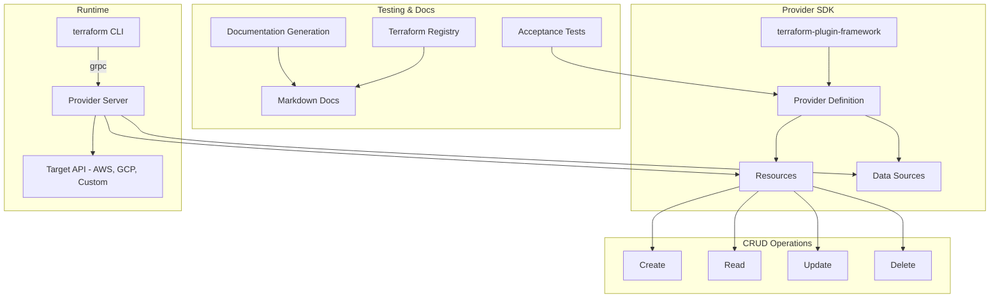

# 16 — Building Custom Terraform Providers

## Architecture at a Glance



## What is it?

Building a custom Terraform provider means using HashiCorp's `terraform-plugin-framework` (or the legacy `terraform-plugin-sdk`) to create a Go binary that Terraform communicates with via gRPC to manage external resources. Providers implement CRUD (Create, Read, Update, Delete) operations for each resource type and define schema for configuration, attributes, and validation. Custom providers unlock Terraform management for internal APIs, SaaS platforms, proprietary infrastructure, or any system without an existing provider in the Terraform Registry.

## Why it was created

The Terraform provider ecosystem covers major cloud providers, SaaS tools, and infrastructure components, but enterprises frequently need to manage resources behind internal APIs or niche platforms. Custom provider development enables:

- **Internal API management** — Terraformify your company's internal platforms
- **Custom resource lifecycle** — Full CRUD with Terraform's planning and state management
- **Private registry distribution** — Share providers within an organization
- **Integration with proprietary systems** — Anything with an API can be a Terraform resource
- **Fine-grained control** — Custom validation, plan modifiers, and diffs not possible with generic resources

## When to use it

| Scenario | Approach |
|----------|----------|
| Internal API with CRUD operations | Build a full custom provider with terraform-plugin-framework |
| Simple REST API wrapper | Consider a generic provider like `restapi` or `http` first |
| Wrapping a CLI tool | Use `local-exec` provisioner or `external` data source instead |
| Complex state management needed | Custom provider with proper CRUD + acceptance tests |
| Internal tool with 10+ resource types | Custom provider is worth the investment |

## Hands-on Example

### Project structure

```
terraform-provider-example/
├── main.go                 # Entry point
├── provider/
│   ├── provider.go         # Provider definition
│   ├── resource_server.go  # Resource CRUD implementation
│   └── resource_server_test.go  # Acceptance tests
├── examples/
│   ├── provider/
│   │   └── provider.tf
│   └── resources/
│       └── example_server/
│           └── main.tf
├── docs/
│   ├── index.md
│   └── resources/
│       └── example_server.md
├── go.mod
├── go.sum
└── Makefile
```

### Provider entry point (`main.go`)

```go
package main

import (
	"context"

	"github.com/hashicorp/terraform-plugin-framework/providerserver"
	"terraform-provider-example/provider"
)

func main() {
	providerserver.Serve(context.Background(), provider.New, providerserver.ServeOpts{
		Address: "registry.terraform.io/example/example",
	})
}
```

### Provider definition (`provider/provider.go`)

```go
package provider

import (
	"context"
	"github.com/hashicorp/terraform-plugin-framework/datasource"
	"github.com/hashicorp/terraform-plugin-framework/provider"
	"github.com/hashicorp/terraform-plugin-framework/provider/schema"
	"github.com/hashicorp/terraform-plugin-framework/resource"
)

var _ provider.Provider = (*ExampleProvider)(nil)

type ExampleProvider struct {
	version string
}

type ExampleProviderModel struct {
	Endpoint string `tfsdk:"endpoint"`
	APIToken string `tfsdk:"api_token"`
}

func (p *ExampleProvider) Metadata(ctx context.Context, req provider.MetadataRequest, resp *provider.MetadataResponse) {
	resp.TypeName = "example"
	resp.Version = p.version
}

func (p *ExampleProvider) Schema(ctx context.Context, req provider.SchemaRequest, resp *provider.SchemaResponse) {
	resp.Schema = schema.Schema{
		Attributes: map[string]schema.Attribute{
			"endpoint": schema.StringAttribute{
				Required: true,
				Description: "The API endpoint for the example service",
			},
			"api_token": schema.StringAttribute{
				Required:  true,
				Sensitive: true,
				Description: "API token for authentication",
			},
		},
	}
}

func (p *ExampleProvider) Configure(ctx context.Context, req provider.ConfigureRequest, resp *provider.ConfigureResponse) {
	var config ExampleProviderModel
	diags := req.Config.Get(ctx, &config)
	resp.Diagnostics.Append(diags...)
	if resp.Diagnostics.HasError() {
		return
	}

	// Initialize API client
	client := NewExampleClient(config.Endpoint, config.APIToken)
	resp.DataSourceData = client
	resp.ResourceData = client
}

func (p *ExampleProvider) Resources(ctx context.Context) []func() resource.Resource {
	return []func() resource.Resource{
		NewServerResource,
	}
}

func (p *ExampleProvider) DataSources(ctx context.Context) []func() datasource.DataSource {
	return []func() datasource.DataSource{}
}

func New(version string) func() provider.Provider {
	return func() provider.Provider {
		return &ExampleProvider{
			version: version,
		}
	}
}
```

### Resource implementation (`provider/resource_server.go`)

```go
package provider

import (
	"context"

	"github.com/hashicorp/terraform-plugin-framework/path"
	"github.com/hashicorp/terraform-plugin-framework/resource"
	"github.com/hashicorp/terraform-plugin-framework/resource/schema"
	"github.com/hashicorp/terraform-plugin-framework/resource/schema/planmodifier"
	"github.com/hashicorp/terraform-plugin-framework/resource/schema/stringplanmodifier"
	"github.com/hashicorp/terraform-plugin-framework/types"
)

var _ resource.Resource = (*ServerResource)(nil)
var _ resource.ResourceWithImportState = (*ServerResource)(nil)

type ServerResource struct {
	client *ExampleClient
}

type ServerResourceModel struct {
	ID      types.String `tfsdk:"id"`
	Name    types.String `tfsdk:"name"`
	Size    types.String `tfsdk:"size"`
	Region  types.String `tfsdk:"region"`
	Status  types.String `tfsdk:"status"`
	IP      types.String `tfsdk:"ip_address"`
}

func NewServerResource() resource.Resource {
	return &ServerResource{}
}

func (r *ServerResource) Metadata(ctx context.Context, req resource.MetadataRequest, resp *resource.MetadataResponse) {
	resp.TypeName = req.ProviderTypeName + "_server"
}

func (r *ServerResource) Schema(ctx context.Context, req resource.SchemaRequest, resp *resource.SchemaResponse) {
	resp.Schema = schema.Schema{
		Description: "Manages an example server resource.",
		Attributes: map[string]schema.Attribute{
			"id": schema.StringAttribute{
				Computed:    true,
				Description: "Unique identifier of the server",
				PlanModifiers: []planmodifier.String{
					stringplanmodifier.UseStateForUnknown(),
				},
			},
			"name": schema.StringAttribute{
				Required:    true,
				Description: "Name of the server",
			},
			"size": schema.StringAttribute{
				Required:    true,
				Description: "Size/flavor of the server (small, medium, large)",
			},
			"region": schema.StringAttribute{
				Required:    true,
				Description: "Region to deploy the server",
			},
			"status": schema.StringAttribute{
				Computed:    true,
				Description: "Current status of the server",
			},
			"ip_address": schema.StringAttribute{
				Computed:    true,
				Description: "Public IP address of the server",
			},
		},
	}
}

// Create — POST /api/servers
func (r *ServerResource) Create(ctx context.Context, req resource.CreateRequest, resp *resource.CreateResponse) {
	var plan ServerResourceModel
	diags := req.Plan.Get(ctx, &plan)
	resp.Diagnostics.Append(diags...)
	if resp.Diagnostics.HasError() {
		return
	}

	server, err := r.client.CreateServer(ctx, &Server{
		Name:   plan.Name.ValueString(),
		Size:   plan.Size.ValueString(),
		Region: plan.Region.ValueString(),
	})
	if err != nil {
		resp.Diagnostics.AddError("Error creating server", err.Error())
		return
	}

	plan.ID = types.StringValue(server.ID)
	plan.Status = types.StringValue(server.Status)
	plan.IP = types.StringValue(server.IP)

	diags = resp.State.Set(ctx, &plan)
	resp.Diagnostics.Append(diags...)
}

// Read — GET /api/servers/{id}
func (r *ServerResource) Read(ctx context.Context, req resource.ReadRequest, resp *resource.ReadResponse) {
	var state ServerResourceModel
	diags := req.State.Get(ctx, &state)
	resp.Diagnostics.Append(diags...)
	if resp.Diagnostics.HasError() {
		return
	}

	server, err := r.client.GetServer(ctx, state.ID.ValueString())
	if err != nil {
		resp.Diagnostics.AddError("Error reading server", err.Error())
		return
	}

	state.Name = types.StringValue(server.Name)
	state.Size = types.StringValue(server.Size)
	state.Region = types.StringValue(server.Region)
	state.Status = types.StringValue(server.Status)
	state.IP = types.StringValue(server.IP)

	diags = resp.State.Set(ctx, &state)
	resp.Diagnostics.Append(diags...)
}

// Update — PUT /api/servers/{id}
func (r *ServerResource) Update(ctx context.Context, req resource.UpdateRequest, resp *resource.UpdateResponse) {
	var plan ServerResourceModel
	diags := req.Plan.Get(ctx, &plan)
	resp.Diagnostics.Append(diags...)
	if resp.Diagnostics.HasError() {
		return
	}

	server, err := r.client.UpdateServer(ctx, plan.ID.ValueString(), &Server{
		Name:   plan.Name.ValueString(),
		Size:   plan.Size.ValueString(),
		Region: plan.Region.ValueString(),
	})
	if err != nil {
		resp.Diagnostics.AddError("Error updating server", err.Error())
		return
	}

	plan.Status = types.StringValue(server.Status)
	plan.IP = types.StringValue(server.IP)

	diags = resp.State.Set(ctx, &plan)
	resp.Diagnostics.Append(diags...)
}

// Delete — DELETE /api/servers/{id}
func (r *ServerResource) Delete(ctx context.Context, req resource.DeleteRequest, resp *resource.DeleteResponse) {
	var state ServerResourceModel
	diags := req.State.Get(ctx, &state)
	resp.Diagnostics.Append(diags...)
	if resp.Diagnostics.HasError() {
		return
	}

	err := r.client.DeleteServer(ctx, state.ID.ValueString())
	if err != nil {
		resp.Diagnostics.AddError("Error deleting server", err.Error())
		return
	}
}

func (r *ServerResource) ImportState(ctx context.Context, req resource.ImportStateRequest, resp *resource.ImportStateResponse) {
	resource.ImportStatePassthroughID(ctx, path.Root("id"), req, resp)
}
```

### Acceptance tests (`provider/resource_server_test.go`)

```go
package provider

import (
	"testing"
	"github.com/hashicorp/terraform-plugin-testing/helper/resource"
	"github.com/hashicorp/terraform-plugin-testing/terraform"
)

func TestAccServerResource(t *testing.T) {
	resource.Test(t, resource.TestCase{
		PreCheck:                 func() { testAccPreCheck(t) },
		ProtoV6ProviderFactories: testAccProtoV6ProviderFactories,
		Steps: []resource.TestStep{
			{
				Config: testAccServerConfig("test-server", "small", "us-east-1"),
				Check: resource.ComposeAggregateTestCheckFunc(
					resource.TestCheckResourceAttr("example_server.test", "name", "test-server"),
					resource.TestCheckResourceAttr("example_server.test", "size", "small"),
					resource.TestCheckResourceAttr("example_server.test", "region", "us-east-1"),
					resource.TestCheckResourceAttrSet("example_server.test", "id"),
					resource.TestCheckResourceAttrSet("example_server.test", "ip_address"),
				),
			},
			{
				ResourceName:      "example_server.test",
				ImportState:       true,
				ImportStateVerify: true,
			},
			{
				Config: testAccServerConfig("test-server", "medium", "us-east-1"),
				Check: resource.ComposeAggregateTestCheckFunc(
					resource.TestCheckResourceAttr("example_server.test", "size", "medium"),
				),
			},
		},
	})
}

func testAccServerConfig(name, size, region string) string {
	return `
	provider "example" {
		endpoint   = "https://api.example.com"
		api_token  = "test-token"
	}

	resource "example_server" "test" {
		name   = "` + name + `"
		size   = "` + size + `"
		region = "` + region + `"
	}
	`
}
```

### Makefile for build and release

```makefile
HOSTNAME=registry.terraform.io
NAMESPACE=example
NAME=example
BINARY=terraform-provider-${NAME}
VERSION=0.1.0
OS_ARCH=windows_amd64

default: install

build:
	go build -o ${BINARY}

install: build
	mkdir -p ~/.terraform.d/plugins/${HOSTNAME}/${NAMESPACE}/${NAME}/${VERSION}/${OS_ARCH}
	cp ${BINARY} ~/.terraform.d/plugins/${HOSTNAME}/${NAMESPACE}/${NAME}/${VERSION}/${OS_ARCH}

test:
	go test -v -count=1 ./...

testacc:
	TF_ACC=1 go test -v -count=1 ./...

docs:
	go generate ./...

release:
	goreleaser release --rm-dist
```

### Usage in Terraform config

```hcl
# examples/resources/example_server/main.tf
terraform {
  required_providers {
    example = {
      source  = "example/example"
      version = "~> 0.1"
    }
  }
}

provider "example" {
  endpoint  = "https://api.example.com"
  api_token = var.api_token
}

resource "example_server" "web" {
  name   = "web-server-01"
  size   = "medium"
  region = "us-east-1"
}

output "server_ip" {
  value = example_server.web.ip_address
}
```

### Documentation generation (using tfplugindocs)

```go
//go:generate go run github.com/hashicorp/terraform-plugin-docs/cmd/tfplugindocs

package provider
```

## Best Practices

1. **Use terraform-plugin-framework** — The framework is the modern, type-safe SDK. Only use the legacy SDK v2 if you need to maintain an existing provider.
2. **Implement ImportState** — Every resource should support `terraform import` for recovery and migration.
3. **Write plan modifiers** — Use `UseStateForUnknown()` for IDs, `RequiresReplace()` for immutable attributes.
4. **Add sensitive annotations** — Mark API tokens, passwords, and private keys as `Sensitive: true` in schema.
5. **Test with acceptance tests** — Use `TF_ACC=1` to run tests against real API endpoints, not just unit tests.
6. **Generate documentation** — Use `tfplugindocs` to auto-generate Terraform Registry-compatible docs from schema and examples.
7. **Version with GoReleaser** — Automate cross-compilation and GitHub releases with goreleaser.
8. **Handle errors gracefully** — Return diagnostic errors with actionable messages, not raw API errors.
9. **Set timeouts** — Use `resource.Timeouts` to configure create/read/update/delete timeouts.
10. **Implement consistent plan** — Ensure plan outputs match apply outputs to avoid perpetual diff.

## Interview Questions

**Q1: What is the difference between terraform-plugin-sdk v2 and terraform-plugin-framework?**

terraform-plugin-framework is the modern, type-safe provider SDK recommended by HashiCorp for all new development. Key differences: (a) **Type safety** — Framework uses Go generics and typed `tfsdk` structs instead of `schema.Schema` with interface{} values; (b) **Attribute-level plan modifiers** — Framework supports per-attribute plan modification (UseStateForUnknown, RequiresReplace) without needing a full CustomizeDiff; (c) **Better validation** — Framework offers declarative validators for each attribute type; (d) **Improved diagnostics** — Framework provides structured error reporting with severity levels; (e) **Protocol v6** — Framework uses the latest gRPC protocol. SDK v2 is maintained for existing providers but framework is the future direction.

**Q2: How do Terraform acceptance tests work and how are they different from unit tests?**

Acceptance tests (prefixed `TestAcc`) require `TF_ACC=1` environment variable and communicate with a real API endpoint — they create, read, update, and destroy actual resources. Unit tests mock the API client and test only the provider logic (schema validation, plan modifiers). Acceptance tests use `resource.Test` with `ProtoV6ProviderFactories` (or `ProviderFactories` for SDKv2) to spin up a real provider server and run Terraform CLI commands programmatically. They test the full lifecycle including import. Unit tests are fast and run without credentials; acceptance tests are slow, require credentials, and incur real costs but validate actual API interactions.

**Q3: How do you publish a custom provider to the Terraform Registry?**

Publishing requires: (a) A public GitHub repository following the naming convention `terraform-provider-{NAME}`; (b) GPG-signed releases with GitHub Releases using GoReleaser; (c) Verified ownership of the GitHub organization/account; (d) Registration at `registry.terraform.io/publish` with OAuth to GitHub. The provider must have: valid `go.mod` with module path, proper `main.go` with `providerserver.Serve`, generated documentation in `docs/`, and a `Makefile` or GitHub Actions workflow for release. Private providers can be distributed via a private registry (Terraform Cloud/Enterprise) or installed from local filesystem (`filesystem://` mirror) or private Git repos.

## Real Company Usage

| Company | Provider | Purpose |
|---------|----------|---------|
| **HashiCorp** | Official AWS/GCP/Azure providers | Maintained by HashiCorp using terraform-plugin-framework |
| **Datadog** | terraform-provider-datadog | Manage Datadog monitors, dashboards, and API keys via Terraform |
| **Snowflake** | terraform-provider-snowflake | Manage Snowflake warehouses, databases, roles, and permissions |
| **GitHub** | terraform-provider-github | Manage repos, teams, branch protection, and actions via Terraform |
| **MongoDB Atlas** | terraform-provider-mongodbatlas | Manage Atlas clusters, network peering, and database users |
| **Spotify** | terraform-provider-spotify (internal) | Internal provider for managing Spotify's infrastructure-as-code resources |
