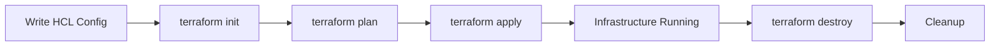

# 13 — Terraform & Infrastructure as Code

## Module Overview

| # | File | Topics Covered |
|---|------|----------------|
| 01 | `01-iac-basics.md` | What is IaC, imperative vs declarative, Terraform vs CloudFormation vs Pulumi vs Ansible, state management |
| 02 | `02-terraform-core-concepts.md` | Providers, resources, data sources, variables, outputs, state files, workspaces, HCL syntax |
| 03 | `03-terraform-workflow.md` | init / plan / apply / destroy, plan output analysis, apply strategies, lock file, provider versioning |
| 04 | `04-modules.md` | Module structure, inputs/outputs, registry, version constraints, composition, reuse |
| 05 | `05-state-management.md` | Local vs remote state, S3 + DynamoDB, state commands, `terraform_remote_state`, migration, security |
| 06 | `06-provisioning-aws.md` | Full AWS infra: VPC, subnets, EC2, RDS, ALB, ASG, IAM — with complete HCL examples |
| 07 | `07-advanced-patterns.md` | `count` vs `for_each`, `dynamic` blocks, `locals`, `depends_on`, provisioners, `moved`, refactoring |
| 08 | `08-terraform-cloud.md` | Terraform Cloud/Enterprise: workspaces, remote runs, Sentinel, cost estimation, VCS, teams |
| 09 | `09-best-practices.md` | Naming, file structure, env separation, secrets, CI/CD (GitLab/GitHub Actions), Terragrunt |
| 10 | `10-providers-deep-dive.md` | Provider schema, CRUD, authentication, versioning, custom provider patterns |
| 11 | `11-cdktf.md` | CDK for Terraform: TypeScript/Python/Go, stacks, constructs, synthesis |
| 12 | `12-testing-strategies.md` | Unit tests, integration tests, Terratest, policy testing, compliance validation |
| 13 | `13-terragrunt.md` | Terragrunt for DRY Terraform, module composition, multi-environment |
| 14 | `14-policy-as-code.md` | Sentinel, OPA/Rego, tfsec, checkov, compliance pipelines |
| 15 | `15-multi-cloud-terraform.md` | Multi-cloud provider patterns, cross-cloud networking, migration |
| 16 | `16-terraform-provider-development.md` | Provider SDK, CRUD, acceptance tests, registry publishing |

## Cross-References

- **[10-AWS](../10-AWS)** — AWS services provisioned by Terraform
- **[11-Azure](../11-Azure)** — Azure Resource Manager and Terraform
- **[12-GCP](../12-GCP)** — GCP Deployment Manager and Terraform
- **[14-DevOps](../14-DevOps)** — CI/CD pipelines that run Terraform

## Prerequisites

- Terraform CLI >= 1.5
- Cloud provider account (AWS free tier recommended)
- Basic familiarity with HCL syntax

---
Previous: [12 — GCP](../12-GCP/README.md)
Next: [14 — DevOps](../14-DevOps/README.md)
