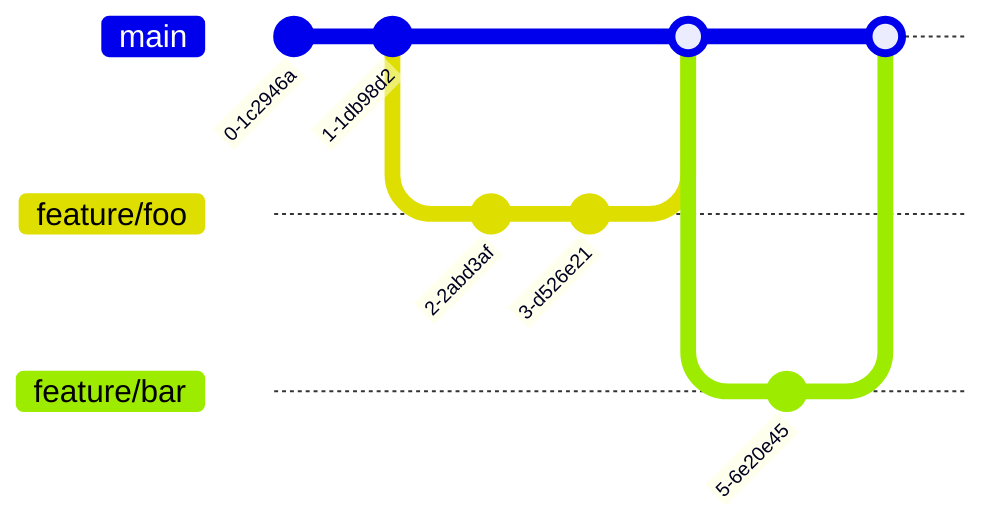
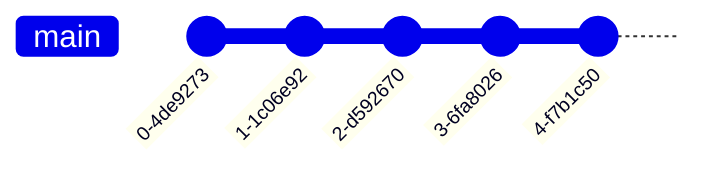

# 01 - Git Workflows

## What is it?

A Git workflow is a convention for how team members use branches, commits, and merges to manage code changes. It defines branching strategy, naming conventions, merge policies, and release processes.

## Why it matters

- Enables parallel development without conflicts
- Enforces code quality gates before merging
- Provides clear audit trail and accountability
- Supports multiple environments and release cadences
- Reduces merge hell and integration pain

## Implementation

### GitFlow


- `main` — production-ready code
- `develop` — integration branch
- `feature/*` — new features (branch off develop)
- `release/*` — release candidates (branch off develop, merge to main & develop)
- `hotfix/*` — emergency fixes (branch off main, merge to main & develop)

### GitHub Flow



- `main` — always deployable
- Any change branches off `main`
- Open a PR for review
- Merge via squash or rebase, then deploy immediately

### Trunk-Based Development



- Developers work on short-lived branches (hours, not days)
- Frequent merges to `main` (multiple times per day)
- Feature flags hide incomplete work
- No `develop` or long-lived feature branches

### Conventional Commits

```
<type>(<scope>): <description>

[optional body]

[optional footer]
```

| Type | Usage |
|------|-------|
| `feat` | New feature |
| `fix` | Bug fix |
| `chore` | Maintenance, tooling |
| `docs` | Documentation |
| `refactor` | Code refactoring |
| `test` | Adding/updating tests |
| `ci` | CI/CD configuration |
| `BREAKING CHANGE` | Incompatible API change |

**Example:**
```
feat(auth): add OAuth2 login flow

Implements Google and GitHub OAuth2 authentication.
Closes #142

BREAKING CHANGE: drops session-based auth
```

### Pre-commit Hooks (`.pre-commit-config.yaml`)

```yaml
repos:
  - repo: https://github.com/pre-commit/pre-commit-hooks
    rev: v4.5.0
    hooks:
      - id: trailing-whitespace
      - id: end-of-file-fixer
      - id: check-yaml
      - id: check-json
  - repo: https://github.com/commitizen-tools/commitizen
    rev: v3.13.0
    hooks:
      - id: commitizen
```

### GPG Signing

```bash
# Generate GPG key
gpg --full-generate-key

# List keys
gpg --list-secret-keys --keyid-format LONG

# Configure Git
git config --global user.signingkey <KEY_ID>
git config --global commit.gpgSign true
git config --global tag.gpgSign true
```

## Best Practices

- Agree on one branching model per team, document it
- Keep branches short-lived (< 1 day for trunk-based, < 1 week for GitFlow)
- Use squash merges to keep history clean
- Enforce conventional commits with commitlint + pre-commit hooks
- Sign commits and tags with GPG for supply-chain integrity
- Protect `main` and `develop` branches with status checks and required reviews
- Delete branches after merging

## Interview Questions

| Question | Answer |
|----------|--------|
| GitFlow vs GitHub Flow — when to use which? | GitFlow for versioned releases/saas, GitHub Flow for continuous deployment |
| What is trunk-based development? | Short-lived feature branches merged to `main` multiple times daily, feature flags for incomplete work |
| How do conventional commits enable automatic versioning? | Tools like semantic-release parse commit types to determine major/minor/patch bumps |
| Why GPG sign commits? | Verify commit authenticity, prevent impersonation, supply-chain security |
| What is a pre-commit hook? | Local script that runs before each commit to catch lint/format/secret issues |

## Cross-References

- [14-DevOps/02-github-actions.md](02-github-actions.md) — CI/CD with GitHub Actions
- [14-DevOps/07-ci-cd-pipeline-design.md](07-ci-cd-pipeline-design.md) — Pipeline stages & approval gates
- [14-DevOps/10-release-management.md](10-release-management.md) — Semver & release automation
