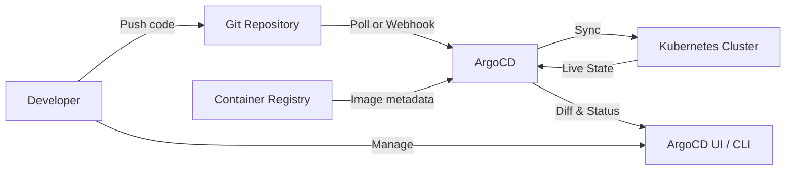
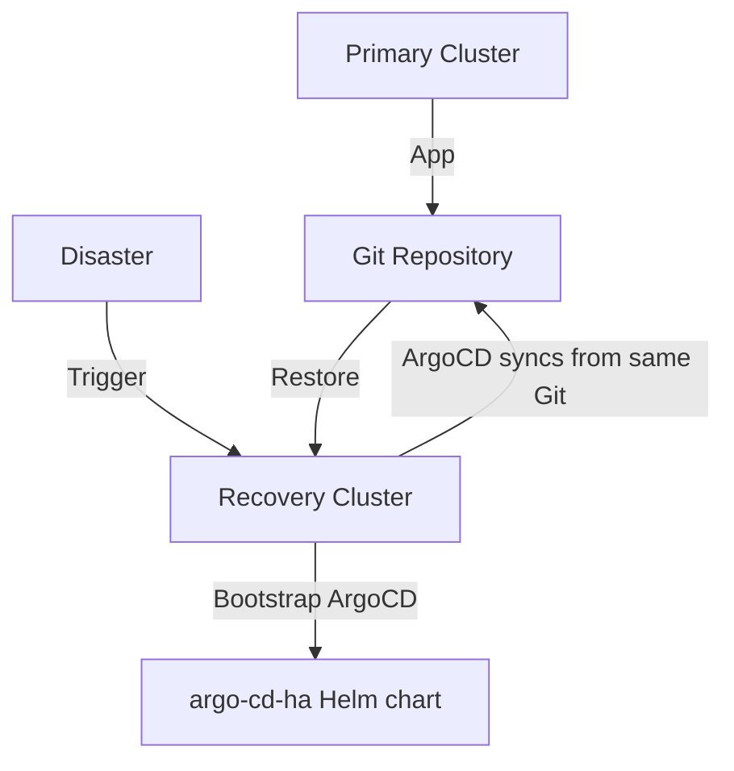

# 04 - ArgoCD

## What is it?

ArgoCD is a declarative, GitOps-based continuous delivery tool for Kubernetes. It automates the synchronization of desired application state defined in a Git repository with the live state in one or more Kubernetes clusters.

## Why it matters

- Single source of truth — Git repository defines all desired state
- Automated drift detection and correction
- Multi-cluster and multi-environment management
- Rich UI, CLI, and API for visibility and control
- Integrates with SSO, RBAC, and webhooks
- Enables auditable, repeatable deployments

## How It Works



## Implementation

### Application CRD

```yaml
apiVersion: argoproj.io/v1alpha1
kind: Application
metadata:
  name: my-app
  namespace: argocd
spec:
  project: default
  source:
    repoURL: https://github.com/myorg/my-app-config.git
    targetRevision: main
    path: k8s/overlays/production
    helm:
      valueFiles:
        - values-prod.yaml
  destination:
    server: https://kubernetes.default.svc
    namespace: production
  syncPolicy:
    automated:
      prune: true
      selfHeal: true
      allowEmpty: false
    syncOptions:
      - CreateNamespace=true
      - ApplyOutOfSyncOnly=true
      - PrunePropagationPolicy=foreground
    retry:
      limit: 5
      backoff:
        duration: 5s
        factor: 2
        maxDuration: 3m
```

### Sync Strategies

| Strategy | Behavior |
|----------|----------|
| **Automated** | ArgoCD syncs automatically when Git changes |
| **Manual** | Admin triggers sync via UI/CLI |
| **Preview** | Dry-run before applying changes |
| **Self-Heal** | Reverts manual cluster changes to match Git |
| **Prune** | Removes resources no longer in Git |

### Project CRD

```yaml
apiVersion: argoproj.io/v1alpha1
kind: AppProject
metadata:
  name: team-alpha
  namespace: argocd
spec:
  description: Team Alpha applications
  sourceRepos:
    - 'https://github.com/myorg/team-alpha-*'
  destinations:
    - namespace: 'team-*'
      server: https://kubernetes.default.svc
  clusterResourceWhitelist:
    - group: '*'
      kind: '*'
  roles:
    - name: admin
      policies:
        - p, proj:team-alpha:admin, applications, *, team-alpha/*, allow
    - name: viewer
      policies:
        - p, proj:team-alpha:viewer, applications, get, team-alpha/*, allow
```

### SSO Integration (Dex + OIDC)

```yaml
apiVersion: v1
kind: ConfigMap
metadata:
  name: argocd-cm
  namespace: argocd
data:
  dex.config: |
    connectors:
      - type: github
        id: github
        name: GitHub
        config:
          clientID: $dex.github.clientID
          clientSecret: $dex.github.clientSecret
          orgs:
            - name: myorg
  url: https://argocd.example.com
```

### RBAC

```yaml
apiVersion: v1
kind: ConfigMap
metadata:
  name: argocd-rbac-cm
  namespace: argocd
data:
  policy.default: role:readonly
  policy.csv: |
    p, role:org-admin, applications, *, */*, allow
    p, role:org-admin, clusters, get, *, allow
    p, role:org-admin, projects, *, *, allow
    g, alice@example.com, role:org-admin
    g, team-alpha, role:team-admin
```

### Multi-Cluster Management

```yaml
apiVersion: v1
kind: Secret
metadata:
  name: prod-cluster
  namespace: argocd
  labels:
    argocd.argoproj.io/secret-type: cluster
type: Opaque
stringData:
  name: prod-us-east
  server: https://api.prod-cluster.example.com:6443
  config: |
    {
      "bearerToken": "...",
      "tlsClientConfig": {
        "insecure": false,
        "caData": "..."
      }
    }
```

### ApplicationSet (Multi-Cluster/Env)

```yaml
apiVersion: argoproj.io/v1alpha1
kind: ApplicationSet
metadata:
  name: my-apps
  namespace: argocd
spec:
  generators:
    - clusters:
        selector:
          matchLabels:
            env: staging
    - git:
        repoURL: https://github.com/myorg/my-app-config.git
        revision: main
        directories:
          - path: k8s/overlays/*
  template:
    metadata:
      name: '{{name}}-my-app'
    spec:
      project: default
      source:
        repoURL: https://github.com/myorg/my-app-config.git
        targetRevision: main
        path: '{{path}}'
      destination:
        server: '{{server}}'
        namespace: '{{name}}'
```

### Disaster Recovery



Steps:
1. Install ArgoCD on recovery cluster
2. Register recovery cluster in ArgoCD
3. Create all Applications from Git backup
4. Run `argocd app sync -l app.kubernetes.io/instance --prune`
5. Update DNS to point to recovery cluster ingress

## Best Practices

- Enable automated sync with self-heal and prune
- Use ApplicationSet for multi-cluster/environment management
- Separate application config from application code repos
- Pin `targetRevision` to specific commit SHA for production
- Configure webhooks (GitHub/GitLab) for instant sync triggers
- Use `argocd app diff` as part of CI to preview changes
- Enable resource tracking with `argocd.argoproj.io/tracking-id`
- Restrict cluster access with fine-grained RBAC in AppProjects

## Interview Questions

| Question | Answer |
|----------|--------|
| What is GitOps and how does ArgoCD implement it? | GitOps uses Git as source of truth; ArgoCD continuously syncs cluster to match Git state |
| Automated sync with self-heal — what happens? | ArgoCD polls/pushes Git, applies diff, reverts manual changes automatically |
| How does ArgoCD handle secrets? | Use SealedSecrets, External Secrets Operator, or SOPS; ArgoCD syncs encrypted manifests |
| What is an ApplicationSet? | Template-based generator for creating Applications per cluster, git directory, or matrix of params |
| How do you manage multi-cluster with ArgoCD? | Register clusters as Secrets with `argocd.argoproj.io/secret-type: cluster` label; target via `destination.server` |
| Disaster recovery strategy for ArgoCD? | Bootstrap on new cluster, sync from Git; backup Application CRDs in Git or Velero |

## Cross-References

- [14-DevOps/05-helm.md](05-helm.md) — Helm chart sources for ArgoCD
- [09-Kubernetes](../09-Kubernetes/README.md) — K8s resources managed by ArgoCD
- [14-DevOps/07-ci-cd-pipeline-design.md](07-ci-cd-pipeline-design.md) — Pipeline → ArgoCD trigger
- [10-AWS](../10-AWS/README.md) — EKS clusters managed by ArgoCD
- [13-Terraform](../13-Terraform/README.md) — Cluster provisioning then ArgoCD bootstrap
