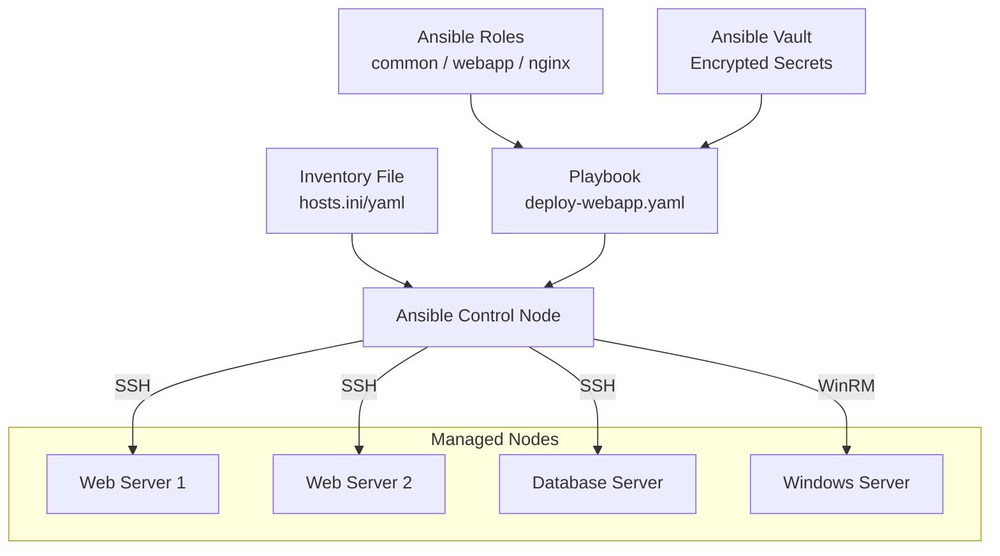

# 06 - Ansible

## What is it?

Ansible is a radically simple IT automation engine that automates cloud provisioning, configuration management, application deployment, intra-service orchestration, and many other IT needs. It is agentless (uses SSH/WinRM), uses YAML for playbooks, and follows a push-based architecture.

## Why it matters

- **Agentless** — no need to install agents on managed nodes; reduces attack surface and management overhead
- **Idempotent** — running the same playbook multiple times produces the same result; safe to re-run
- **Declarative YAML** — easy to read, write, and version-control; lowers the barrier for ops and devs
- **Large module ecosystem** — 750+ built-in modules for cloud, network, containers, monitoring, etc.
- **Integration** — works with Terraform ([13-Terraform](../13-Terraform/README.md)), Docker ([08-Docker](../08-Docker/README.md)), Kubernetes ([09-Kubernetes](../09-Kubernetes/README.md)), and AWS ([10-AWS](../10-AWS/README.md))



## Implementation

### Inventory Files

**INI format (`inventory.ini`):**
```ini
[webservers]
web1.example.com ansible_host=192.168.1.10 ansible_user=ubuntu
web2.example.com ansible_host=192.168.1.11 ansible_user=ubuntu

[dbservers]
db1.example.com ansible_host=192.168.1.20 ansible_user=ubuntu

[all:vars]
ansible_ssh_private_key_file=~/.ssh/id_rsa
ansible_python_interpreter=/usr/bin/python3
```

**YAML format (`inventory.yaml`):**
```yaml
all:
  children:
    webservers:
      hosts:
        web1.example.com:
          ansible_host: 192.168.1.10
          ansible_user: ubuntu
        web2.example.com:
          ansible_host: 192.168.1.11
          ansible_user: ubuntu
    dbservers:
      hosts:
        db1.example.com:
          ansible_host: 192.168.1.20
          ansible_user: ubuntu
  vars:
    ansible_ssh_private_key_file: ~/.ssh/id_rsa
    ansible_python_interpreter: /usr/bin/python3
```

### Playbooks

**Deploy a web app (`deploy-webapp.yaml`):**
```yaml
---
- name: Deploy web application
  hosts: webservers
  become: yes
  vars:
    app_name: myapp
    app_version: "1.2.3"
    app_port: 3000
    node_version: "18.x"

  tasks:
    - name: Install system dependencies
      apt:
        name:
          - curl
          - git
          - nginx
          - certbot
        state: present
        update_cache: yes

    - name: Add NodeSource APT repository
      shell: |
        curl -fsSL https://deb.nodesource.com/setup_{{ node_version }} | bash -
      args:
        creates: /etc/apt/sources.list.d/nodesource.list

    - name: Install Node.js
      apt:
        name: nodejs
        state: present

    - name: Create application directory
      file:
        path: "/opt/{{ app_name }}"
        state: directory
        owner: www-data
        group: www-data
        mode: "0755"

    - name: Copy application artifacts
      copy:
        src: "{{ artifact_path }}/{{ app_name }}-{{ app_version }}.tar.gz"
        dest: "/opt/{{ app_name }}/app.tar.gz"
      when: artifact_path is defined

    - name: Extract application archive
      unarchive:
        src: "/opt/{{ app_name }}/app.tar.gz"
        dest: "/opt/{{ app_name }}"
        remote_src: yes
        owner: www-data
        group: www-data

    - name: Install npm dependencies
      npm:
        path: "/opt/{{ app_name }}"
        production: yes

    - name: Render environment config from template
      template:
        src: env.j2
        dest: "/opt/{{ app_name }}/.env"
        owner: www-data
        group: www-data
        mode: "0600"

    - name: Configure systemd service
      template:
        src: webapp.service.j2
        dest: /etc/systemd/system/{{ app_name }}.service
      notify: restart webapp

    - name: Configure nginx reverse proxy
      template:
        src: nginx.conf.j2
        dest: "/etc/nginx/sites-available/{{ app_name }}"
      notify: reload nginx

    - name: Enable nginx site
      file:
        src: "/etc/nginx/sites-available/{{ app_name }}"
        dest: "/etc/nginx/sites-enabled/{{ app_name }}"
        state: link
      notify: reload nginx

    - name: Ensure services are running
      service:
        name: "{{ item }}"
        state: started
        enabled: yes
      loop:
        - "{{ app_name }}"
        - nginx

  handlers:
    - name: restart webapp
      systemd:
        name: "{{ app_name }}"
        daemon_reload: yes
        state: restarted

    - name: reload nginx
      service:
        name: nginx
        state: reloaded
```

### Roles and Directory Structure

```
site.yml
requirements.yml
inventories/
  production/
    hosts.yml
    group_vars/
      webservers.yml
      dbservers.yml
      all.yml
  staging/
    hosts.yml
    group_vars/
      all.yml
roles/
  common/
    tasks/main.yml
    handlers/main.yml
    templates/
    files/
    vars/main.yml
    defaults/main.yml
    meta/main.yml
  webapp/
    tasks/main.yml
    templates/
      env.j2
      webapp.service.j2
      nginx.conf.j2
    vars/main.yml
    defaults/main.yml
    meta/
      main.yml
  nginx/
    tasks/main.yml
    handlers/main.yml
    templates/
    vars/main.yml
```

**Using roles in a playbook (`site.yml`):**
```yaml
---
- name: Apply common configuration
  hosts: all
  roles:
    - common

- name: Deploy web servers
  hosts: webservers
  roles:
    - nginx
    - webapp
```

### Variables and Facts

**Variable precedence (lowest to highest):**
1. Role defaults (`roles/X/defaults/main.yml`)
2. Inventory group/host vars
3. Playbook `vars:` block
4. `vars_prompt`
5. Registered variables (from `register:`)
6. Include/import variables
7. Extra vars (`-e "var=value"`)

**Gathering facts:**
```yaml
- name: Display system facts
  hosts: all
  gather_facts: yes
  tasks:
    - name: Print OS distribution
      debug:
        msg: "{{ ansible_facts['distribution'] }} {{ ansible_facts['distribution_version'] }}"
```

### Ansible Vault

```bash
# Create encrypted file
ansible-vault create secrets.yml

# Edit encrypted file
ansible-vault edit secrets.yml

# Encrypt existing file
ansible-vault encrypt group_vars/all/vault.yml

# Run playbook with vault
ansible-playbook site.yml --ask-vault-pass

# Or use vault password file
ansible-playbook site.yml --vault-password-file .vault_pass
```

**Encrypted variable example (`group_vars/all/vault.yml`):**
```yaml
vault_db_password: !vault |
  $ANSIBLE_VAULT;1.1;AES256
  66386139643631373930393534386235663461386662356566343734613235376462623332356562
  3938623137633631316536356531313462343834613361350a613563346637613335313837646166
  61623538616462353961343830373863353466646230303365663738636132333533336665306563
  6464363366633434660a623838653438323166336239643463303961396262613137383434303338
  3233
```

### Idempotency

Ansible modules are idempotent by design. Key practices:
- Use `state: present/absent` rather than imperative commands
- Use `creates:` with `command`/`shell` to skip if file exists
- Use `changed_when: false` for commands that don't change state
- Use `register:` with `when:` to conditionally run tasks
- Prefer dedicated modules (`apt`, `copy`, `template`, `service`) over `command`/`shell`

### AWX / Tower Overview

| Feature | AWX (OSS) | Ansible Tower (Red Hat) |
|---------|-----------|-------------------------|
| Web UI | Yes | Yes |
| RBAC | Yes | Yes + LDAP/SAML |
| REST API | Yes | Yes |
| Job scheduling | Yes | Yes |
| Workflows | Yes | Yes + advanced |
| Support | Community | Enterprise SLA |

### Common Modules

| Module | Purpose | Example |
|--------|---------|---------|
| `command` | Execute command (not idempotent) | `command: /usr/bin/uptime` |
| `shell` | Execute via shell (env vars, pipes) | `shell: cat /etc/os-release \| head -1` |
| `copy` | Copy file from local to remote | `copy: src=foo.conf dest=/etc/foo.conf` |
| `template` | Render Jinja2 template | `template: src=env.j2 dest=.env` |
| `service` | Manage services | `service: name=nginx state=started enabled=yes` |
| `apt` | Package management (Debian) | `apt: name=nginx state=latest` |
| `yum` | Package management (RHEL) | `yum: name=nginx state=present` |
| `file` | File/directory/symlink management | `file: path=/app state=directory mode=0755` |
| `uri` | HTTP requests | `uri: url=http://localhost/health return_content=yes` |
| `docker_container` | Manage Docker containers | `docker_container: name=web image=nginx:alpine` |

## Best Practices

1. **Use roles** — organize playbooks into reusable, versionable roles
2. **Pin versions** — specify exact versions in `requirements.yml` for community roles
3. **Encrypt secrets** — use Ansible Vault for passwords, API keys, and certificates
4. **Use `ansible-lint`** — enforce best practices with automated linting
5. **Dry-run first** — `ansible-playbook --check --diff` to preview changes
6. **Tag tasks** — `tags: [deploy, config]` to run subsets: `--tags deploy`
7. **Use group_vars/host_vars** — keep variable data separate from playbook logic
8. **Strategy plugins** — use `strategy: mitogen` for 3-5x speedup on large fleets
9. **CI/CD integration** — run `ansible-lint` and `ansible-playbook --syntax-check` in pipelines

## Interview Questions

**Q1: What makes Ansible idempotent?**
A: Ansible modules check current state before making changes. For example, `apt: name=nginx state=present` checks if nginx is already installed; if yes, no change is made. This ensures running a playbook multiple times produces the same final state. The `changed_when` and `failed_when` keywords let you define idempotency for custom commands.

**Q2: How do you manage secrets in Ansible?**
A: Ansible Vault encrypts sensitive data at rest. Files or variables are encrypted with `ansible-vault encrypt` and decrypted at runtime with `--ask-vault-pass` or `--vault-password-file`. Variables can be referenced as `{{ vault_db_password }}`. For dynamic secrets, integrate with HashiCorp Vault via the `community.hashi_vault` lookup plugin.

**Q3: What's the difference between `copy` and `template` modules?**
A: `copy` transfers files as-is from the controller to the managed node. `template` processes Jinja2 templates on the controller, substituting variables (e.g., `{{ app_port }}`), then copies the rendered result. Use `copy` for static files and `template` for configuration files that need dynamic values.

**Q4: How does Ansible compare to Terraform?**
A: Ansible is a configuration management and automation tool (provisioning, config, deployment), while Terraform ([13-Terraform](../13-Terraform/README.md)) is an infrastructure provisioning tool. Terraform manages the lifecycle of cloud resources; Ansible configures the OS and applications on those resources. They are complementary — Terraform provisions VMs, Ansible configures them.

**Q5: Explain the Ansible role directory structure.**
A: A role follows a standard layout: `tasks/` (main actions), `handlers/` (service restarts), `templates/` (Jinja2 templates), `files/` (static files), `vars/` (high-priority variables), `defaults/` (low-priority defaults), and `meta/` (dependencies and role metadata). This convention enables role reusability across projects.
