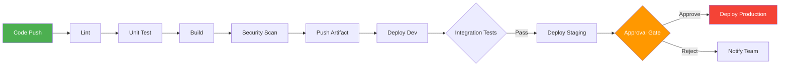

# 07 - CI/CD Pipeline Design

## What is it?

CI/CD (Continuous Integration/Continuous Delivery) is the automated pipeline that takes code from commit to production. **Continuous Integration** automatically builds and tests every commit. **Continuous Delivery** automates deployment to environments, with optional manual approvals for production. **Continuous Deployment** fully automates production releases.

## Why it matters

- **Speed** — automated pipelines reduce release cycles from weeks to minutes
- **Quality** — every change is linted, tested, and scanned before reaching production
- **Reliability** — repeatable, auditable deployments eliminate manual error
- **Feedback** — developers get immediate feedback on their changes
- **Compliance** — approval gates and audit trails satisfy regulatory requirements
- **Rollback** — automated rollback strategies minimize blast radius

## Implementation

### CI/CD Pipeline Architecture



### Environment Promotion

```
┌─────────────┐     ┌─────────────┐     ┌─────────────┐
│    Dev      │ ──> │   Staging   │ ──> │ Production  │
│ (auto-deploy)│     │ (auto-deploy)│     │ (manual gate)│
└─────────────┘     └─────────────┘     └─────────────┘
      │                    │                    │
      │ Short-lived        │ Production-like    │ Real traffic
      │ feature testing    │ QA & UAT           │ 99.99% SLA
      └────────────────────┴────────────────────┘
```

### Approval Gates

| Gate Type | Implementation | Tooling |
|-----------|---------------|---------|
| Manual | Human clicks approve | GitHub Environments, Jenkins input |
| Automated | Test pass rate ≥ threshold | JUnit, Pytest, Playwright |
| Time-based | Deploy window (e.g., 9am-5pm) | Pipeline scheduler |
| Compliance | Security scan passes | SonarQube, Snyk, Trivy |
| Peer review | PR must be approved | GitHub branch protection |

### Rollback Strategies

| Strategy | Description | Downtime | Complexity |
|----------|-------------|----------|------------|
| **Recreate** | Destroy and redeploy previous version | High | Low |
| **Rolling rollback** | Revert instances one by one to previous version | Low | Medium |
| **Blue/green flip** | Route traffic back to old environment | None | Medium |
| **Canary revert** | Shift traffic back from new to old version | None | High |
| **Feature flag** | Disable new feature at config level | None | Low |

### Branch Policies and Pipeline Triggers

```yaml
# GitHub branch protection rules
# - Require pull request reviews (2)
# - Dismiss stale reviews
# - Require status checks (lint, test, build, scan)
# - Require up-to-date branches
# - Include administrators
# - Require linear history

# Trigger matrix
triggers:
  push:
    branches: [main, develop]
  pull_request:
    branches: [main]
  tags:
    - "v*"
  schedule:
    - cron: "0 6 * * 1"  # Security scan weekly
```

### Artifacts vs Rebuild

| Approach | Pros | Cons |
|----------|------|------|
| **Rebuild** each stage | Simple, no artifact storage | Non-deterministic; different binary in prod than tested |
| **Build once, promote artifact** | Same binary through pipeline | Requires artifact registry; larger storage |

**Recommended:** Build once, promote artifact. Tag artifacts with commit SHA and Git tag.

### Pipeline as Code

**GitHub Actions workflow (`deploy.yml`):**
```yaml
name: CI/CD Pipeline

on:
  push:
    branches: [main, develop]
  pull_request:
    branches: [main]

env:
  REGISTRY: ghcr.io
  IMAGE_NAME: ${{ github.repository }}
  NODE_VERSION: "18"

jobs:
  lint:
    runs-on: ubuntu-latest
    steps:
      - uses: actions/checkout@v4
      - uses: actions/setup-node@v4
        with:
          node-version: ${{ env.NODE_VERSION }}
          cache: npm
      - run: npm ci
      - run: npm run lint
      - run: npm run typecheck

  test:
    needs: lint
    runs-on: ubuntu-latest
    strategy:
      matrix:
        node-version: [16, 18, 20]
    steps:
      - uses: actions/checkout@v4
      - uses: actions/setup-node@v4
        with:
          node-version: ${{ matrix.node-version }}
          cache: npm
      - run: npm ci
      - run: npm run test -- --coverage
      - uses: actions/upload-artifact@v4
        with:
          name: coverage-${{ matrix.node-version }}
          path: coverage/

  build:
    needs: test
    runs-on: ubuntu-latest
    outputs:
      image-digest: ${{ steps.docker-build.outputs.digest }}
    steps:
      - uses: actions/checkout@v4
      - name: Set up Docker Buildx
        uses: docker/setup-buildx-action@v3
      - name: Log in to registry
        uses: docker/login-action@v3
        with:
          registry: ${{ env.REGISTRY }}
          username: ${{ github.actor }}
          password: ${{ secrets.GITHUB_TOKEN }}
      - name: Extract metadata
        id: meta
        uses: docker/metadata-action@v5
        with:
          images: ${{ env.REGISTRY }}/${{ env.IMAGE_NAME }}
          tags: |
            type=sha,prefix=
            type=ref,event=branch
            type=semver,pattern={{version}}
      - name: Build and push
        id: docker-build
        uses: docker/build-push-action@v6
        with:
          context: .
          push: true
          tags: ${{ steps.meta.outputs.tags }}
          labels: ${{ steps.meta.outputs.labels }}
          cache-from: type=gha
          cache-to: type=gha,mode=max
      - name: Run Trivy scan
        uses: aquasecurity/trivy-action@master
        with:
          image-ref: ${{ env.REGISTRY }}/${{ env.IMAGE_NAME }}@${{ steps.docker-build.outputs.digest }}
          format: sarif
          output: trivy-results.sarif
      - name: Upload Trivy results
        uses: github/codeql-action/upload-sarif@v3
        with:
          sarif_file: trivy-results.sarif

  security-scan:
    needs: build
    runs-on: ubuntu-latest
    steps:
      - uses: actions/checkout@v4
      - name: Run Snyk to check for vulnerabilities
        uses: snyk/actions/node@master
        env:
          SNYK_TOKEN: ${{ secrets.SNYK_TOKEN }}
        with:
          args: --severity-threshold=high

  deploy-dev:
    needs: build
    runs-on: ubuntu-latest
    if: github.ref == 'refs/heads/develop'
    environment:
      name: development
      url: https://dev.myapp.com
    steps:
      - name: Deploy to Dev
        run: |
          echo "Deploying ${{ env.IMAGE_NAME }}@${{ needs.build.outputs.image-digest }} to dev"
          # kubectl set image, helm upgrade, or Terraform apply

  deploy-staging:
    needs: [build, security-scan]
    runs-on: ubuntu-latest
    if: github.ref == 'refs/heads/main'
    environment:
      name: staging
      url: https://staging.myapp.com
    steps:
      - name: Deploy to Staging
        run: echo "Deploying to staging"

  deploy-production:
    needs: deploy-staging
    runs-on: ubuntu-latest
    if: startsWith(github.ref, 'refs/tags/v')
    environment:
      name: production
      url: https://myapp.com
    steps:
      - name: Approval gate (manual)
        run: echo "Waiting for manual approval"
      - name: Deploy to Production
        run: echo "Deploying to production"
      - name: Health check
        run: |
          curl --retry 10 --retry-delay 5 --retry-connrefused https://myapp.com/health
```

### Environment Promotion with GitHub Environments

```yaml
# environments defined in GitHub UI or via API
environments:
  development:
    protection_rules: []
    deployment_branch: develop
  staging:
    protection_rules:
      - required_reviewers: [team/qa]
    deployment_branch: main
  production:
    protection_rules:
      - required_reviewers: [team/ops]
      - wait_timer: 15  # 15-minute cooldown
    deployment_branch: main
```

### Full CI/CD Flow with Docker and Kubernetes

```yaml
deploy:
  runs-on: ubuntu-latest
  needs: build
  steps:
    - uses: actions/checkout@v4
    - name: Deploy to Kubernetes
      run: |
        kubectl set image deployment/myapp \
          myapp=${{ env.REGISTRY }}/${{ env.IMAGE_NAME }}@${{ needs.build.outputs.image-digest }} \
          --record
    - name: Verify rollout
      run: |
        kubectl rollout status deployment/myapp --timeout=2m
    - name: Rollback on failure
      if: failure() && github.ref == 'refs/heads/main'
      run: |
        kubectl rollout undo deployment/myapp
```

**See also:** [GitHub Actions](02-github-actions.md) for advanced workflow patterns, [ArgoCD](04-argocd.md) for GitOps deployment, [Docker](../08-Docker/README.md) for container builds, [Kubernetes](../09-Kubernetes/README.md) for orchestration.

## Best Practices

1. **Fail fast** — run lint and unit tests first; don't waste time building broken code
2. **Build once, deploy many** — promote immutable artifacts through environments
3. **Idempotent pipelines** — rerunning the same commit produces the same result
4. **Short-lived branches** — delete feature branches after merge; keep main stable
5. **Pipeline as code** — version-control pipeline definitions alongside code
6. **Secret management** — never hardcode secrets; use GitHub secrets, Vault, or OIDC
7. **Cache dependencies** — speed up pipelines with dependency caching
8. **Parallel stages** — run independent jobs (test matrix, lint, security) concurrently
9. **Tag releases** — use semantic versioning ([10-release-management](10-release-management.md)) for traceability
10. **Post-deployment validation** — run smoke tests and health checks after deploy

## Interview Questions

**Q1: What's the difference between Continuous Delivery and Continuous Deployment?**
A: Continuous Delivery means every change passes through automated pipelines but requires manual approval for production release. Continuous Deployment automates the entire pipeline including production — every commit that passes tests is automatically deployed.

**Q2: How do you handle a failed deployment in production?**
A: Immediate rollback to the previous known-good version. Use blue/green or canary patterns to shift traffic back. After stabilization, create a blameless postmortem to identify root cause. Add automated tests to prevent recurrence.

**Q3: What are approval gates and when should you use them?**
A: Approval gates are manual or automated checkpoints that must pass before promotion to the next environment. Use them for production deployments, compliance-sensitive changes, or when deploying to environments with real user traffic.

**Q4: Explain your artifact promotion strategy.**
A: Build the artifact once early in the pipeline, tag it with commit SHA, and promote the same artifact through all environments. This guarantees the binary tested in staging is identical to the one deployed in production. Use an artifact registry (Docker registry, S3, Nexus) as the single source of truth.

**Q5: How does pipeline as code improve team workflows?**
A: Pipeline definitions live in the repository alongside source code. Changes are peer-reviewed, versioned, and tested like any other code. Teams can fork, reuse, and customize pipelines. Tools like GitHub Actions, GitLab CI, and Jenkinsfile support this pattern.
