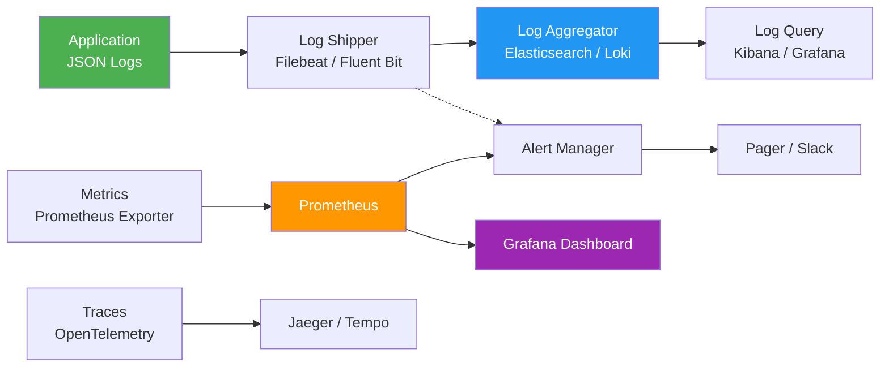
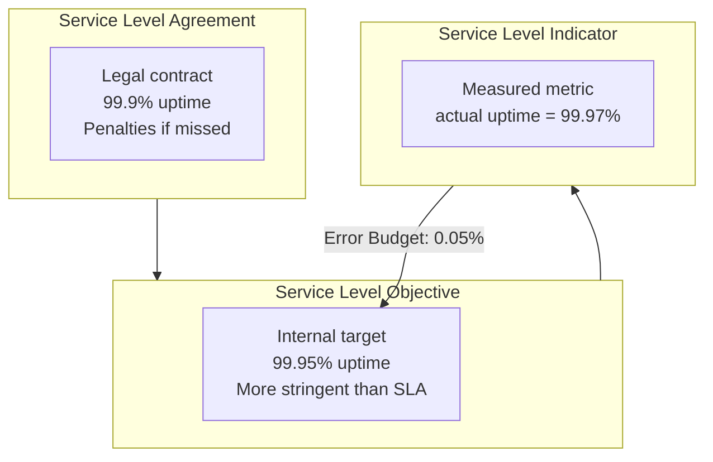

# 08 - Monitoring & Logging

## What is it?

Monitoring and logging are the observability pillars that provide visibility into system health, performance, and behavior. **Monitoring** collects and analyzes metrics (CPU, latency, error rates). **Logging** captures discrete events (requests, errors, transactions). Together with tracing, they form the three pillars of observability.

## Why it matters

- **Detect issues before users do** — proactive alerting reduces MTTR
- **Debug production problems** — structured logs provide forensic evidence
- **Capacity planning** — trends in resource usage inform scaling decisions
- **SLA compliance** — measure and report on uptime and performance
- **Audit and compliance** — immutable log trails satisfy regulatory requirements
- **Business insights** — usage patterns, feature adoption, funnel analysis

## Implementation

### Logging Pipeline



### ELK Stack (Elasticsearch, Logstash, Kibana)

```yaml
# docker-compose.yml for ELK
version: "3.8"
services:
  elasticsearch:
    image: docker.elastic.co/elasticsearch/elasticsearch:8.11.0
    environment:
      - discovery.type=single-node
      - ES_JAVA_OPTS=-Xms512m -Xmx512m
      - xpack.security.enabled=false
    ports:
      - "9200:9200"
    volumes:
      - es_data:/usr/share/elasticsearch/data

  logstash:
    image: docker.elastic.co/logstash/logstash:8.11.0
    ports:
      - "5000:5000"
      - "9600:9600"
    volumes:
      - ./logstash.conf:/usr/share/logstash/pipeline/logstash.conf:ro

  kibana:
    image: docker.elastic.co/kibana/kibana:8.11.0
    ports:
      - "5601:5601"
    environment:
      - ELASTICSEARCH_HOSTS=http://elasticsearch:9200

volumes:
  es_data:
```

```ruby
# logstash.conf
input {
  beats {
    port => 5000
  }
}

filter {
  json {
    source => "message"
  }
  date {
    match => ["timestamp", "ISO8601"]
    target => "@timestamp"
  }
  mutate {
    remove_field => ["message", "original"]
  }
}

output {
  elasticsearch {
    hosts => ["elasticsearch:9200"]
    index => "logs-%{+YYYY.MM.dd}"
  }
}
```

### Fluentd / Fluent Bit

```yaml
# fluent-bit.conf
[SERVICE]
    flush           1
    log_level       info
    parsers_file    parsers.conf

[INPUT]
    name            tail
    path            /var/log/app/*.log
    parser          json
    tag             app.*

[FILTER]
    name            modify
    match           app.*
    add             env production
    add             service myapp

[OUTPUT]
    name            es
    match           app.*
    host            elasticsearch
    port            9200
    index           fluentbit-${ENVIRONMENT}
    type            _doc
```

### Loki + Prometheus + Grafana (LPG Stack)

```yaml
# docker-compose.yml for LPG
version: "3.8"
services:
  prometheus:
    image: prom/prometheus:v2.48.0
    volumes:
      - ./prometheus.yml:/etc/prometheus/prometheus.yml
      - prometheus_data:/prometheus
    ports:
      - "9090:9090"

  loki:
    image: grafana/loki:2.9.2
    ports:
      - "3100:3100"
    volumes:
      - ./loki-config.yaml:/etc/loki/loki-config.yaml
      - loki_data:/loki

  grafana:
    image: grafana/grafana:10.2.0
    ports:
      - "3000:3000"
    environment:
      - GF_SECURITY_ADMIN_PASSWORD=admin
    volumes:
      - grafana_data:/var/lib/grafana

volumes:
  prometheus_data:
  loki_data:
  grafana_data:
```

### Structured Logging (JSON Format)

**Node.js example:**
```javascript
const pino = require("pino");

const logger = pino({
  level: process.env.LOG_LEVEL || "info",
  formatters: {
    level(label) {
      return { severity: label.toUpperCase() };
    },
  },
  redact: ["req.headers.authorization", "password", "creditCard"],
  timestamp: pino.stdTimeFunctions.isoTime,
});

// Usage
logger.info({ userId: 123, action: "login" }, "User logged in");
logger.error({ err, requestId: "abc-123" }, "Payment failed");
```

**Python example:**
```python
import structlog
import logging

structlog.configure(
    processors=[
        structlog.stdlib.filter_by_level,
        structlog.stdlib.add_log_level,
        structlog.stdlib.PositionalArgumentsFormatter(),
        structlog.processors.TimeStamper(fmt="iso"),
        structlog.processors.StackInfoRenderer(),
        structlog.processors.format_exc_info,
        structlog.processors.JSONRenderer(),
    ],
    context_class=dict,
    logger_factory=structlog.stdlib.LoggerFactory(),
    cache_logger_on_first_use=True,
)

log = structlog.get_logger()
log.info("user.login", user_id=123, ip="192.168.1.1")
```

**Go example:**
```go
import "go.uber.org/zap"

logger, _ := zap.NewProduction()
defer logger.Sync()

logger.Info("order placed",
    zap.String("order_id", "ord_123"),
    zap.Float64("amount", 49.99),
    zap.String("currency", "USD"),
)
```

### Log Levels

| Level | Numeric | Purpose | Action |
|-------|---------|---------|--------|
| TRACE | 0 | Detailed debugging | Temporary, disabled in prod |
| DEBUG | 1 | Diagnostic info | Enabled during troubleshooting |
| INFO | 2 | Normal operations | Always on in production |
| WARN | 3 | Unexpected but handled | Investigate if persistent |
| ERROR | 4 | Failure, partial outage | Page on-call |
| FATAL | 5 | Process will exit | Immediate incident response |

**Production log level:** `INFO`. Never log sensitive data at any level — use redaction.

### Prometheus Metrics and Alerting

```yaml
# prometheus.yml
global:
  scrape_interval: 15s
  evaluation_interval: 15s

alerting:
  alertmanagers:
    - static_configs:
        - targets: ["alertmanager:9093"]

rule_files:
  - "alerts.yml"

scrape_configs:
  - job_name: "kubernetes"
    kubernetes_sd_configs:
      - role: pod
    relabel_configs:
      - source_labels: [__meta_kubernetes_pod_label_app]
        regex: myapp
        action: keep

  - job_name: "node"
    static_configs:
      - targets: ["localhost:9100"]  # node_exporter

  - job_name: "app"
    static_configs:
      - targets: ["myapp:3000"]      # application metrics
```

```yaml
# alerts.yml
groups:
  - name: infrastructure
    rules:
      - alert: HighCpuUsage
        expr: 100 - (avg by(instance) (rate(node_cpu_seconds_total{mode="idle"}[5m])) * 100) > 80
        for: 10m
        labels:
          severity: warning
        annotations:
          summary: "CPU usage > 80% for 10 minutes"
          description: "Instance {{ $labels.instance }} has high CPU ({{ $value }}%)"

      - alert: DiskSpaceLow
        expr: (node_filesystem_avail_bytes / node_filesystem_size_bytes) * 100 < 10
        for: 5m
        labels:
          severity: critical
        annotations:
          summary: "Disk space < 10% on {{ $labels.mountpoint }}"

  - name: application
    rules:
      - alert: HighErrorRate
        expr: |
          sum(rate(http_requests_total{status=~"5.."}[5m]))
          /
          sum(rate(http_requests_total[5m])) * 100 > 5
        for: 3m
        labels:
          severity: critical
        annotations:
          summary: "Error rate > 5% in last 5 minutes"

      - alert: ServiceDown
        expr: up{job="app"} == 0
        for: 1m
        labels:
          severity: critical
        annotations:
          summary: "Service {{ $labels.instance }} is down"

      - alert: HighLatency
        expr: histogram_quantile(0.99, rate(http_request_duration_seconds_bucket[5m])) > 2
        for: 5m
        labels:
          severity: warning
        annotations:
          summary: "p99 latency > 2s"
```

### SLI / SLO / SLA Definitions



| Term | Definition | Example |
|------|------------|---------|
| **SLI** | A quantitative measure of a service property | Request latency, error rate, uptime |
| **SLO** | Target value or range for an SLI | 99.9% of requests complete in < 200ms |
| **SLA** | Contractual commitment to meet SLOs; has penalties | 99.95% uptime guarantee; 5% credit if missed |
| **Error Budget** | 100% - SLO; allowable failure before consequences | With 99.9% SLO, error budget = 0.1% (8.76h/year) |

**Recording rules for SLIs (Prometheus):**
```yaml
groups:
  - name: sli
    interval: 1m
    rules:
      - record: sli:availability:ratio_rate5m
        expr: |
          sum(rate(http_requests_total{status!~"5.."}[5m]))
          /
          sum(rate(http_requests_total[5m]))

      - record: sli:latency_p99:seconds_rate5m
        expr: |
          histogram_quantile(0.99,
            sum(rate(http_request_duration_seconds_bucket[5m])) by (le)
          )
```

**See also:** [SRE](../15-SRE/README.md) for error budgets, toil, and on-call practices; [Docker](../08-Docker/README.md) for container logging drivers; [Kubernetes](../09-Kubernetes/README.md) for pod-level monitoring.

## Best Practices

1. **Log in JSON** — structured logs enable automated parsing, querying, and alerting
2. **Don't log secrets** — use log redaction/pino `redact` to strip PII, tokens, passwords
3. **Use correlation IDs** — trace requests across services with a unique `request_id`
4. **Alert on symptoms, not causes** — alert when users are impacted (high error rate), not on CPU spikes
5. **Avoid alert fatigue** — tune thresholds, use `for:` duration, and route alerts appropriately
6. **Cardinality limits** — avoid unbounded label values in Prometheus (user IDs, email addresses)
7. **Log rotation** — configure logrotate or use stdout (container logs handled by runtime)
8. **Centralized logging** — ship logs to a central store; never `ssh` into instances to read logs
9. **Dashboard as documentation** — Grafana dashboards should tell the system's story at a glance
10. **Runbook integration** — every alert should link to a runbook with diagnosis and remediation steps

## Interview Questions

**Q1: What is the three pillars of observability?**
A: Logs (discrete events), Metrics (aggregated numerical data), and Traces (request flow across services). Together they provide complete visibility into system behavior. OpenTelemetry is the emerging standard that unifies all three.

**Q2: How do you design an alerting strategy?**
A: Define SLOs first, then alert when error budget is burning (rate of SLO violation is high). Use multi-window, multi-burn-rate alerts. Page on-call only for symptom-based alerts (high error rate, degraded latency). Use warning-level alerts for cause-based issues (CPU, disk) that don't warrant paging.

**Q3: What's the difference between Prometheus and ELK for monitoring?**
A: Prometheus is optimized for metrics — time-series numeric data with powerful query language (PromQL). ELK is optimized for log search and analysis — full-text search on unstructured or semi-structured log data. They are complementary; many organizations use Prometheus + Grafana for metrics and ELK (or Loki) for logs.

**Q4: Explain structured logging and why it matters.**
A: Structured logging outputs logs as structured data (JSON) instead of plain text. Each log event has typed fields (user_id, duration, status_code) that can be indexed, filtered, and aggregated. Tools like Elasticsearch and Loki can query these fields efficiently, enabling dashboards and alerts on log data.

**Q5: What is an error budget and how do you use it?**
A: Error budget = 100% - SLO. It represents the permissible amount of failure. If error budget is full, teams can deploy new features. If error budget is depleted, teams freeze deployments and focus on reliability. This aligns innovation velocity with reliability.
