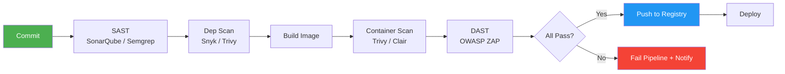

# 09 - DevSecOps

## What is it?

DevSecOps (Development, Security, and Operations) is the practice of integrating security into every phase of the DevOps lifecycle — "shift left" by finding and fixing vulnerabilities as early as possible. It automates security checks in CI/CD pipelines, enforces policies as code, and treats security as a shared responsibility across Dev, Ops, and Security teams.

## Why it matters

- **Shift left** — catch vulnerabilities during development, not after deployment
- **Compliance automation** — policy-as-code satisfies PCI-DSS, SOC 2, HIPAA requirements
- **Supply chain security** — prevent dependency confusion, typosquatting, and poisoned packages
- **Faster remediation** — automated scanning provides immediate feedback to developers
- **Breach cost reduction** — fixing a vulnerability in production costs 100x more than in design

## Implementation

### Security Scanning in CI/CD Pipelines



### SAST — Static Application Security Testing

**SonarQube with GitHub Actions:**
```yaml
name: SAST Scan
on:
  push:
    branches: [main]
  pull_request:
    branches: [main]

jobs:
  sonarqube:
    runs-on: ubuntu-latest
    steps:
      - uses: actions/checkout@v4
        with:
          fetch-depth: 0
      - name: SonarQube Scan
        uses: sonarsource/sonarqube-scan-action@v2
        env:
          SONAR_TOKEN: ${{ secrets.SONAR_TOKEN }}
          SONAR_HOST_URL: ${{ secrets.SONAR_HOST_URL }}
        with:
          args: >
            -Dsonar.projectKey=myapp
            -Dsonar.qualitygate.wait=true
            -Dsonar.qualitygate.timeout=300
```

**Semgrep (lightweight SAST):**
```yaml
- name: Semgrep Analysis
  uses: semgrep/semgrep-action@v1
  with:
    config: >-
      p/default
      p/javascript
      p/owasp-top-ten
    severity: WARNING
```

### DAST — Dynamic Application Security Testing

**OWASP ZAP in CI/CD:**
```yaml
- name: OWASP ZAP Full Scan
  uses: zaproxy/action-full-scan@v0.11.0
  with:
    target: "https://staging.myapp.com"
    rules_file_name: ".zap/rules.tsv"
    cmd_options: "-a -j"
    issue_title: "ZAP Scan Report"
    fail_action: true
```

```yaml
# .zap/rules.tsv — customize severity thresholds
10010	IGNORE	(Cookie set without HttpOnly flag)
10015	WARN	(Application error disclosure)
10020	FAIL	(SQL Injection)
10021	FAIL	(XSS)
10055	WARN	(CSP issues)
```

### Dependency Scanning

**Snyk:**
```yaml
- name: Snyk Monitor
  uses: snyk/actions/node@master
  env:
    SNYK_TOKEN: ${{ secrets.SNYK_TOKEN }}
  with:
    command: monitor
    args: --severity-threshold=high --org=myorg
```

**Trivy (filesystem scan):**
```yaml
- name: Trivy vulnerability scan (repo)
  uses: aquasecurity/trivy-action@master
  with:
    scan-type: fs
    scan-ref: .
    format: sarif
    output: trivy-results.sarif
    severity: HIGH,CRITICAL
    exit-code: 1
```

**`.snyk` policy file:**
```yaml
# Snyk policy to suppress known issues
version: v1.25.0
ignore:
  SNYK-JS-PATHTRICK-3118021:
    - '*':
        reason: Risk accepted — no user input reaches this path
        expires: 2025-12-31T00:00:00.000Z
patch: {}
```

### Container Scanning

**Trivy (image scan):**
```yaml
- name: Trivy container scan
  uses: aquasecurity/trivy-action@master
  with:
    image-ref: "ghcr.io/myorg/myapp:latest"
    format: sarif
    output: trivy-image.sarif
    severity: HIGH,CRITICAL
    exit-code: 1
    ignore-unfixed: true
```

**Clair (via Klar or clairctl):**
```yaml
# docker-compose for Clair
version: "3.8"
services:
  clair:
    image: quay.io/projectclair/clair:latest
    restart: always
    ports:
      - "6060:6060"
      - "6061:6061"
    volumes:
      - ./clair-config.yaml:/config/config.yaml
```

**Docker Scout (Docker Desktop / CLI):**
```bash
# Analyze an image
docker scout quickview ghcr.io/myorg/myapp:latest

# Compare with base image
docker scout compare ghcr.io/myorg/myapp:latest --base nginx:alpine

# Output SBOM
docker scout sbom ghcr.io/myorg/myapp:latest > sbom.spdx
```

### Secret Management

**HashiCorp Vault:**
```hcl
# vault policy for CI
path "secret/data/ci/*" {
  capabilities = ["read", "list"]
}

path "secret/data/production/*" {
  capabilities = ["deny"]
}
```

```yaml
# GitHub Actions with Vault OIDC
- name: Authenticate to Vault
  id: vault-auth
  uses: hashicorp/vault-action@v2
  with:
    url: https://vault.mycompany.com
    method: jwt
    role: ci-role
    secrets: |
      secret/data/ci/database db_password | DB_PASSWORD ;
      secret/data/ci/aws access_key | AWS_ACCESS_KEY_ID ;
      secret/data/ci/aws secret_key | AWS_SECRET_ACCESS_KEY ;

- name: Build with secrets
  run: make build
  env:
    DB_PASSWORD: ${{ steps.vault-auth.outputs.DB_PASSWORD }}
```

**AWS Secrets Manager (via OIDC):**
```yaml
- name: Configure AWS credentials
  uses: aws-actions/configure-aws-credentials@v4
  with:
    role-to-assume: arn:aws:iam::123456789012:role/github-actions-role
    aws-region: us-east-1

- name: Fetch secrets
  run: |
    DB_PASSWORD=$(aws secretsmanager get-secret-value \
      --secret-id prod/myapp/db \
      --query SecretString \
      --output text | jq -r '.password')
    echo "DB_PASSWORD=$DB_PASSWORD" >> $GITHUB_ENV
```

**SOPS (Secrets OPerationS):**
```bash
# Encrypt a file with age key
sops --encrypt --age age1abc... secrets.enc.yaml > secrets.yaml

# Decrypt in CI
sops --decrypt secrets.yaml > config.yaml
```

```yaml
# secrets.enc.yaml (encrypted with SOPS)
api_key: ENC[AES256_GCM,data:abc123...,iv:...,tag:...]
db_password: ENC[AES256_GCM,data:xyz789...,iv:...,tag:...]
sops:
  age:
    - recipient: age1abc...
      enc: |
        -----BEGIN AGE ENCRYPTED FILE-----
        ...
        -----END AGE ENCRYPTED FILE-----
```

### SBOM Generation (CycloneDX)

```yaml
# Generate SBOM during build
- name: Generate SBOM
  uses: CycloneDX/gh-node-module-generatebom@master
  with:
    path: .
    output: ./bom.xml

- name: Upload SBOM as artifact
  uses: actions/upload-artifact@v4
  with:
    name: sbom-bom.xml
    path: ./bom.xml
```

```bash
# CLI generation
npm install -g @cyclonedx/bom
cyclonedx-bom -o bom.json

# Trivy SBOM generation
trivy filesystem --format cyclonedx --output bom.cdx.json .
```

### Supply Chain Security — SLSA Framework

| SLSA Level | Requirements | Achieved By |
|------------|--------------|-------------|
| **L1** | Build process documented | CI/CD pipeline definition |
| **L2** | Build service runs on hosted runner; provenance generated | GitHub Actions provenance |
| **L3** | Hardened builds; no user-defined steps; provenance verification | Trusted builder, Sigstore |
| **L4** | Two-person review; reproducible builds; hermetic | Fully isolated build |

**SLSA provenance generation:**
```yaml
# GitHub Actions generates SLSA provenance automatically for reusable workflows
- name: Generate SLSA provenance
  uses: slsa-framework/slsa-github-generator@v2.0.0
  with:
    artifact_path: "dist/*"
    sign: true
```

**Sigstore / Cosign for signing:**
```bash
# Sign container image
cosign sign --key cosign.key ghcr.io/myorg/myapp:latest

# Verify
cosign verify --key cosign.pub ghcr.io/myorg/myapp:latest
```

**See also:** [Docker](../08-Docker/README.md) for secure image building, [Kubernetes](../09-Kubernetes/README.md) for pod security policies, [AWS](../10-AWS/README.md) for IAM and KMS, [Terraform](../13-Terraform/README.md) for policy-as-code with Sentinel.

## Best Practices

1. **Shift left** — run SAST on every commit, not just before release
2. **Fail the pipeline** — configure scanners with `exit-code: 1` to block vulnerable builds
3. **Don't ignore fixable** — prioritize fixing over ignoring; set expiry on accepted risks
4. **Use OIDC for secrets** — avoid long-lived credentials; use OIDC for Git→Vault/AWS auth
5. **Pin base images** — use digest pinning (`nginx@sha256:...`) not floating tags (`latest`)
6. **Distroless images** — minimize attack surface with Google distroless or scratch images
7. **Secret rotation** — rotate secrets automatically; Vault dynamic secrets are ideal
8. **SBOM in artifacts** — attach SBOM to every release artifact for transparency
9. **Policy as code** — use OPA (Open Policy Agent) or Kyverno to enforce security rules
10. **Least privilege** — CI runners should have minimal permissions; no write access to production

## Interview Questions

**Q1: What's the difference between SAST and DAST?**
A: SAST (Static Analysis) scans source code without executing it — it finds vulnerabilities in code paths, patterns, and dependencies early in development. DAST (Dynamic Analysis) scans a running application — it finds runtime vulnerabilities (XSS, SQLi, misconfigurations) that only manifest when the app is live. SAST is "white box," DAST is "black box."

**Q2: How do you manage secrets in CI/CD pipelines?**
A: Never hardcode secrets. Use OIDC-based authentication to retrieve secrets from a vault (HashiCorp Vault, AWS Secrets Manager) at runtime. Store only the OIDC role/ARN in GitHub secrets. For local development, use SOPS-encrypted files committed to the repo with age/PGP keys.

**Q3: What is an SBOM and why is it important?**
A: A Software Bill of Materials (SBOM) is a machine-readable inventory of all open-source and third-party components in an application. It enables rapid vulnerability assessment — when a new CVE is published, you can immediately check which of your artifacts are affected. CycloneDX and SPDX are standard formats.

**Q4: Explain the SLSA framework.**
A: SLSA (Supply-chain Levels for Software Artifacts) is a security framework with 4 levels that increase confidence in artifact integrity. Level 1 requires build documentation. Level 2 requires hosted builds and provenance. Level 3 requires hardened builds and verification. Level 4 requires hermetic, reproducible builds with two-person review.

**Q5: How do you handle a critical vulnerability found in a dependency?**
A: If a fix exists, update the dependency and release a patch version. If no fix exists, evaluate exploitability (is the vulnerable code path reachable?), and either add a WAF rule, suppress if risk-accepted with expiry, or pin to a known-safe version. Alert the team via security channel.
