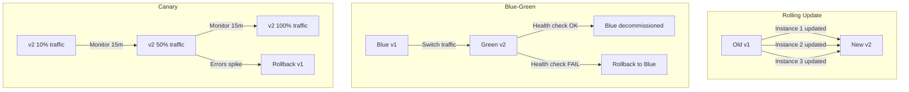

# 10 - Release Management

## What is it?

Release management is the process of planning, scheduling, and controlling software releases across environments. It encompasses release strategies, versioning, changelog generation, deployment patterns, and rollback procedures to deliver changes safely and predictably.

## Why it matters

- **Risk reduction** — controlled rollouts limit blast radius of bad releases
- **User experience** — zero-downtime deployments keep users happy
- **Auditability** — every release is versioned, tagged, and traceable to commits
- **Release velocity** — automated release pipelines enable frequent, confident deployments
- **Team coordination** — clear release process aligns dev, QA, and ops teams

## Implementation

### Release Strategies



#### Rolling Update

Gradually replaces instances of the old version with the new version. Common in Kubernetes and ASG-based deployments.

```yaml
# Kubernetes deployment with rolling update
apiVersion: apps/v1
kind: Deployment
metadata:
  name: myapp
spec:
  replicas: 5
  strategy:
    type: RollingUpdate
    rollingUpdate:
      maxSurge: 1        # can spin up 1 extra pod
      maxUnavailable: 0  # keep all pods available during update
  template:
    spec:
      containers:
        - name: myapp
          image: ghcr.io/myorg/myapp:v2.0.0
          readinessProbe:
            httpGet:
              path: /health
              port: 3000
            initialDelaySeconds: 5
            periodSeconds: 10
```

#### Blue-Green Deployment

Maintains two identical environments. Traffic is switched from blue (old) to green (new) atomically.

```yaml
# kubernetes services for blue-green
---
apiVersion: v1
kind: Service
metadata:
  name: myapp
spec:
  selector:
    app: myapp
    version: blue  # toggle between blue/green
  ports:
    - port: 80
      targetPort: 3000

---
apiVersion: v1
kind: Service
metadata:
  name: myapp-green
spec:
  selector:
    app: myapp
    version: green
  ports:
    - port: 80
      targetPort: 3000
```

```bash
# Switch traffic from blue to green
kubectl patch service myapp -p '{"spec":{"selector":{"version":"green"}}}'
```

#### Canary Deployment

Sends a small percentage of traffic to the new version, gradually increasing.

```yaml
# Istio VirtualService for canary
apiVersion: networking.istio.io/v1beta1
kind: VirtualService
metadata:
  name: myapp
spec:
  hosts:
    - myapp
  http:
    - match:
        - headers:
            x-canary:
              exact: "true"
      route:
        - destination:
            host: myapp
            subset: canary
    - route:
        - destination:
            host: myapp
            subset: stable
          weight: 90
        - destination:
            host: myapp
            subset: canary
          weight: 10
```

**Progressive delivery with Flagger:**
```yaml
apiVersion: flagger.app/v1beta1
kind: Canary
metadata:
  name: myapp
spec:
  targetRef:
    apiVersion: apps/v1
    kind: Deployment
    name: myapp
  service:
    port: 3000
  analysis:
    interval: 1m
    threshold: 5
    maxWeight: 50
    stepWeight: 10
    metrics:
      - name: request-success-rate
        threshold: 99
      - name: request-duration
        threshold: 500
    webhooks:
      - name: acceptance-test
        url: http://tester.myapp/run
        timeout: 30s
```

### Feature Flags

Decouple deployment from release — deploy code anytime, release features on demand.

**Flagsmith / LaunchDarkly:**
```javascript
// LaunchDarkly SDK
const ldClient = await launchdarkly.initialize("sdk-key", { key: user.id });

const showNewCheckout = await ldClient.variation("new-checkout-ui", false);

if (showNewCheckout) {
  renderNewCheckout();
} else {
  renderLegacyCheckout();
}
```

**Feature flag strategy matrix:**
| Flag Type | Lifecycle | Example |
|-----------|-----------|---------|
| Release toggle | Days to weeks | New UI rollout |
| Experiment toggle | Hours to days | A/B test variant |
| Ops toggle | Minutes to hours | Kill switch for degraded feature |
| Permission toggle | Permanent | Beta features for specific users |

### Semantic Versioning (vX.Y.Z)

```
vMAJOR.MINOR.PATCH

v2.1.3

MAJOR = breaking change (incompatible API)
MINOR = new feature (backward-compatible)
PATCH = bug fix (backward-compatible)

Pre-release labels: v2.0.0-alpha.1, v2.0.0-beta.2, v2.0.0-rc.1
Build metadata: v2.0.0+build.20240101
```

**Version management with `npm` / `yarn`:**
```bash
# Automatic version bump
npm version patch   # 1.0.0 -> 1.0.1
npm version minor   # 1.0.1 -> 1.1.0
npm version major   # 1.1.0 -> 2.0.0

# Pre-release
npm version prepatch --preid alpha  # 1.0.0 -> 1.0.1-alpha.0
```

### Changelog Generation (git-cliff)

```toml
# cliff.toml
[changelog]
header = "# Changelog\n\n"
body = """

### {{ group | upper_first }}

  - {{ commit.message | upper_first }}\


"""
trim = true

[git]
conventional_commits = true
filter_unconventional = true
commit_parsers = [
  { message = "^feat", group = "Features" },
  { message = "^fix", group = "Bug Fixes" },
  { message = "^docs", group = "Documentation" },
  { message = "^refactor", group = "Refactoring" },
  { message = "^test", group = "Testing" },
  { message = "^chore", group = "Miscellaneous Tasks" },
]
filter_commits = false
```

```bash
# Generate changelog from last tag
git-cliff -o CHANGELOG.md

# Generate for specific range
git-cliff v1.0.0..v2.0.0 -o CHANGELOG.md

# Bump version and generate changelog
git-cliff --bump --unreleased -o CHANGELOG.md
```

### Git Tagging Strategy

```bash
# Create annotated tag
git tag -a v2.0.0 -m "Release v2.0.0: New checkout flow"

# Sign tag with GPG
git tag -s v2.0.0 -m "Release v2.0.0"

# Push tags
git push origin v2.0.0
git push origin --tags

# List tags
git tag --list "v2*"
```

**Tag naming conventions:**
- `v1.0.0` — stable release
- `v1.0.0-rc.1` — release candidate
- `v1.0.0-beta.2` — beta pre-release
- `v1.0.1` — patch

### Release Branches vs Trunk-Based

| Aspect | Release Branches | Trunk-Based |
|--------|-----------------|-------------|
| Branch model | `main` → `release/v2.0` → `hotfix` | Single `main` branch |
| Cadence | Scheduled releases (weekly/monthly) | Continuous (many deploys/day) |
| Cherry-picks | Common for hotfixes | Rare; fix forward |
| Complexity | High — merging across branches | Low — single source of truth |
| Risk | Lower — stabilization phase | Higher — always moving |
| Best for | Regulated, enterprise, SaaS with versioned releases | Web apps, SRE-mature teams |

### Zero-Downtime Deployment Checklist

- [ ] Database migrations are backward-compatible (add columns, don't remove)
- [ ] Health checks and readiness probes configured
- [ ] Graceful shutdown (SIGTERM handling, drain connections)
- [ ] Session persistence (external session store, sticky sessions)
- [ ] Static assets versioned (cache-busting)
- [ ] API versioning (v1, v2) for backward compatibility
- [ ] Rollback plan documented and tested
- [ ] Feature flags for risky changes
- [ ] Monitoring dashboards reviewed before deployment
- [ ] Runbook for deployment failure scenarios

**See also:** [CI/CD Pipeline Design](07-ci-cd-pipeline-design.md) for pipeline architecture; [Git Workflows](01-git-workflows.md) for branching strategies; [ArgoCD](04-argocd.md) for GitOps deployments; [Helm](05-helm.md) for Kubernetes chart versioning; [Kubernetes](../09-Kubernetes/README.md) for rollout strategies.

## Best Practices

1. **One version, one artifact** — each version produces an immutable artifact that flows through environments
2. **Version everything** — tag code, image, Helm chart, and Terraform module with the same version
3. **Automate changelogs** — generate changelogs from conventional commits; never write manually
4. **Small, frequent releases** — reduce risk by deploying small, reversible changes often
5. **Feature flags over branches** — decouple deployment from release; avoid long-lived feature branches
6. **Canary before full rollout** — validate with real traffic before 100% rollout
7. **Rollback rehearsals** — practice rollbacks in staging so they're muscle memory in production
8. **Lock deployments during incidents** — no releases during ongoing incidents (error budget depleted)
9. **Post-release monitoring** — watch dashboards for 30 minutes after every production deployment
10. **Database-first** — ensure database changes are backward-compatible with both old and new code

## Interview Questions

**Q1: Compare blue-green vs canary deployments.**
A: Blue-green switches traffic entirely between two environments — simple, instant rollback by flipping back. Canary gradually shifts a percentage of traffic — slower but detects issues with real traffic before full rollout. Blue-green requires double infrastructure; canary works with existing capacity. Use blue-green for internal tools and canary for customer-facing features.

**Q2: What is semantic versioning and when would you bump each segment?**
A: Semantic versioning (semver) uses MAJOR.MINOR.PATCH. Bump MAJOR for breaking API changes (users must modify code). Bump MINOR for backward-compatible new features. Bump PATCH for backward-compatible bug fixes. Pre-release labels (alpha, beta, rc) indicate stability. Semver enables dependency resolution and communicates change impact clearly.

**Q3: How do feature flags help release management?**
A: Feature flags decouple deployment from release — you can deploy code with a flag off and release it later by flipping the flag on. This enables trunk-based development, gradual rollouts, instant kill switches, and A/B testing. Flags reduce the risk of releases and give product teams control over feature availability.

**Q4: What's your rollback strategy for a failed production deployment?**
A: For blue-green, flip traffic back to the old environment. For rolling update, use `kubectl rollout undo`. For canary, route 100% traffic back to stable. After rollback, verify health, alert the team, and create a postmortem. A database rollback may require running a down-migration script — always test rollback scripts in staging first.

**Q5: How do you achieve zero-downtime deployments?**
A: Combine rolling updates (or blue-green), readiness probes that wait for the app to be healthy, graceful shutdown (SIGTERM + drain), and backward-compatible database migrations. Use session affinity or external session stores. Version static assets with content hashes. Monitor error rates during rollout — auto-rollback if they spike.
