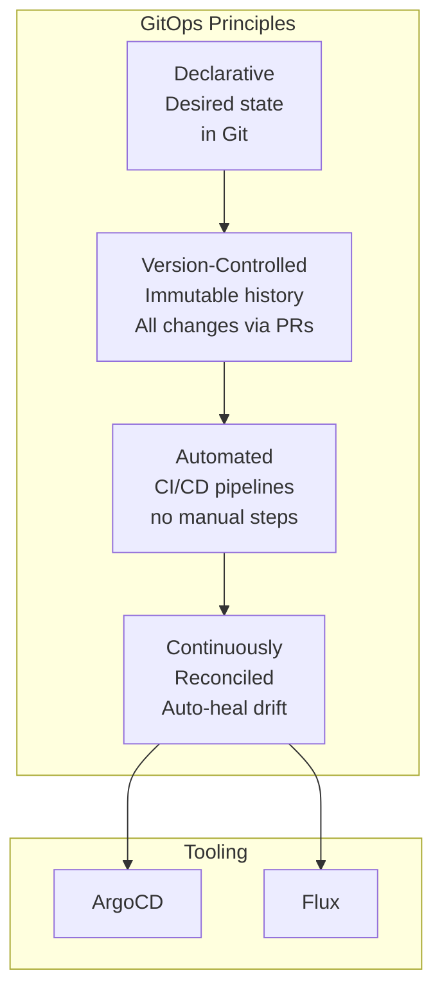
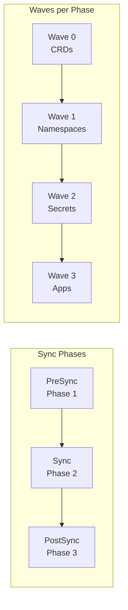
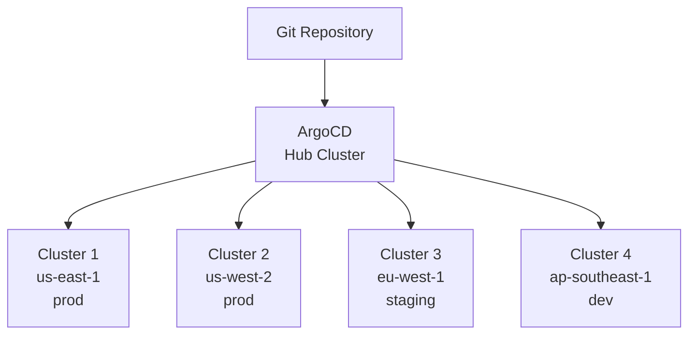

# 11 — GitOps Deep Dive

## What is it?

GitOps is an operational framework that applies DevOps best practices — version control, code review, CI/CD — to infrastructure automation. The Git repository is the single source of truth for both application code and infrastructure configuration. A GitOps operator continuously reconciles the live system state with the desired state declared in Git. ArgoCD and Flux are the two dominant Kubernetes-native GitOps operators.

## Why it matters

- Single source of truth eliminates configuration drift between environments
- Git history provides a complete audit trail of every change
- Pull request workflow applies code review to infrastructure changes
- Automated rollback by reverting a Git commit
- Self-healing infrastructure reverts manual changes automatically
- Multi-cluster management becomes declarative and repeatable

## GitOps Principles



## ArgoCD ApplicationSets

ApplicationSets generate Applications dynamically using generators:

### Git Generator

```yaml
apiVersion: argoproj.io/v1alpha1
kind: ApplicationSet
metadata:
  name: kustomize-apps
spec:
  generators:
    - git:
        repoURL: https://github.com/myorg/app-config.git
        revision: HEAD
        directories:
          - path: apps/*
  template:
    metadata:
      name: '{{path.basename}}'
    spec:
      project: default
      source:
        repoURL: https://github.com/myorg/app-config.git
        targetRevision: HEAD
        path: '{{path}}'
      destination:
        server: https://kubernetes.default.svc
        namespace: '{{path.basename}}'
```

### Cluster Generator

```yaml
apiVersion: argoproj.io/v1alpha1
kind: ApplicationSet
metadata:
  name: multi-cluster-apps
spec:
  generators:
    - clusters:
        selector:
          matchLabels:
            env: production
  template:
    metadata:
      name: '{{name}}-app'
    spec:
      source:
        repoURL: https://github.com/myorg/app-config.git
        targetRevision: HEAD
        path: overlays/production
      destination:
        server: '{{server}}'
        namespace: default
```

### SCM Provider Generator

```yaml
spec:
  generators:
    - scmProvider:
        github:
          organization: myorg
          allBranches: true
          # Automatically creates Applications for every repo in the org
  template:
    metadata:
      name: '{{repository}}'
    spec:
      source:
        repoURL: '{{url}}'
        path: deploy
      destination:
        server: https://kubernetes.default.svc
```

### Pull Request Generator

```yaml
spec:
  generators:
    - pullRequest:
        github:
          owner: myorg
          repo: my-app
          labels:
            - preview
  template:
    metadata:
      name: 'preview-{{branch}}'
    spec:
      source:
        repoURL: https://github.com/myorg/my-app.git
        targetRevision: '{{head_sha}}'
        path: k8s/overlays/preview
      destination:
        server: https://kubernetes.default.svc
        namespace: 'preview-{{head_sha}}'
      syncPolicy:
        automated:
          prune: true
```

### Matrix Generator

```yaml
spec:
  generators:
    - matrix:
        generators:
          - clusters:
              selector:
                matchLabels:
                  env: staging
          - git:
              repoURL: https://github.com/myorg/app-config.git
              revision: HEAD
              directories:
                - path: apps/*
```

## Sync Strategies, Phases, and Waves



```yaml
apiVersion: argoproj.io/v1alpha1
kind: Application
metadata:
  name: my-app
spec:
  source:
    repoURL: https://github.com/myorg/my-app.git
    path: k8s
  syncPolicy:
    automated:
      prune: true
      selfHeal: true
    syncOptions:
      - Validate=true
      - PruneLast=true
      - ApplyOutOfSyncOnly=true
```

### Resource Hooks

```yaml
apiVersion: batch/v1
kind: Job
metadata:
  name: db-migration
  annotations:
    argocd.argoproj.io/hook: PreSync
    argocd.argoproj.io/hook-delete-policy: HookSucceeded
spec:
  template:
    spec:
      containers:
        - name: migration
          image: myapp/migration:v1.0
      restartPolicy: Never
```

Common hooks: `PreSync`, `Sync`, `PostSync`, `Skip`, `SyncFail`.

## Diffing Customizations

```yaml
apiVersion: argoproj.io/v1alpha1
kind: Application
metadata:
  name: my-app
spec:
  ignoreDifferences:
    - group: apps
      kind: Deployment
      jsonPointers:
        - /spec/replicas    # Ignore HPA-driven replica changes
        - /status           # Ignore runtime status
    - group: ""
      kind: Secret
      jsonPointers:
        - /data             # Ignore secret data content (managed externally)
  syncPolicy:
    syncOptions:
      - RespectIgnoreDifferences=true
```

## Config Management Plugins (CMPs)

CMPs extend ArgoCD to render manifests from any configuration tool:

```yaml
# argocd-cm ConfigMap
data:
  configManagementPlugins: |
    - name: kustomize-with-secrets
      generate:
        command:
          - kustomize
          - build
          - --enable-alpha-plugins
    - name: helmfile
      generate:
        command:
          - helmfile
          - template
```

```yaml
apiVersion: argoproj.io/v1alpha1
kind: Application
metadata:
  name: helmfile-app
spec:
  source:
    repoURL: https://github.com/myorg/helmfile-config.git
    path: environments/production
    plugin:
      name: helmfile
```

## Multi-Cluster Management



Register clusters as Kubernetes Secrets:

```yaml
apiVersion: v1
kind: Secret
metadata:
  name: prod-us-east
  namespace: argocd
  labels:
    argocd.argoproj.io/secret-type: cluster
    env: production
    region: us-east-1
type: Opaque
stringData:
  name: prod-us-east
  server: https://api.prod-us-east.eks.amazonaws.com
  config: |
    {
      "bearerToken": "...",
      "tlsClientConfig": {"insecure": false, "caData": "..."}
    }
```

## ArgoCD vs Flux

| Feature | ArgoCD | Flux v2 |
|---------|--------|---------|
| **Architecture** | Hub-and-spoke (central ArgoCD manages clusters) | Agent-per-cluster or hub |
| **UI** | Rich web UI + CLI | CLI + Dashboard (optional) |
| **ApplicationSets** | Generators: git, cluster, SCM, PR, matrix | Not built-in (Kustomize or Helm overlay) |
| **Multi-tenancy** | AppProjects with RBAC | Kustomize overlays + namespace scoping |
| **Secrets** | External Secrets, SealedSecrets, SOPS | SOPS, sops-age, External Secrets |
| **Image updates** | Not built-in (Argo CD Image Updater as separate project) | Image automation built-in |
| **Notification** | ArgoCD Notifications (triggers, templates, Slack, email) | Flux notification-controller |
| **Progressive delivery** | Argo Rollouts (separate CRD) | Flagger (separate project) |
| **Promotion** | Sync waves, hooks, manual promotion | Kustomize/Helm overlay promotion |

## Best Practices

- Use ApplicationSets with cluster generators for multi-cluster deployments
- Configure webhooks (GitHub/GitLab) for instant sync on Git push
- Enable self-heal + prune on automated sync policies
- Implement PreSync hooks for database migrations and validation
- Use `ignoreDifferences` for fields managed by controllers (HPA, mutating webhooks)
- Pin production applications to specific commit SHAs, not branches
- Separate app config repos from app source repos
- Use AppProjects to enforce team-level RBAC and namespace isolation

## Interview Questions

| Question | Key points |
|----------|------------|
| *What are the four GitOps principles?* | Declarative, version-controlled, automated, continuously reconciled |
| *How do ApplicationSet generators work?* | Generators produce template parameters; template creates Applications per param set |
| *What is the purpose of sync waves?* | Ordered resource application within a sync phase (0, 1, 2, ...) |
| *When would you use resource hooks?* | PreSync for migrations, PostSync for smoke tests, SyncFail for cleanup |
| *What is diffing customization?* | `ignoreDifferences` with JSON pointers to suppress expected drift |
| *How does ArgoCD achieve multi-cluster management?* | Hub cluster with registered target clusters via Kubernetes Secrets |
| *What are the key differences between ArgoCD and Flux?* | ArgoCD: hub-spoke, rich UI, ApplicationSets; Flux: per-cluster, image automation, SOPS |

---

**Next**: [12 — Progressive Delivery](12-progressive-delivery.md)
