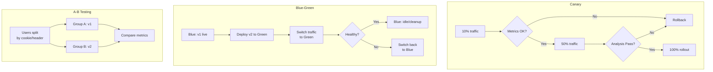
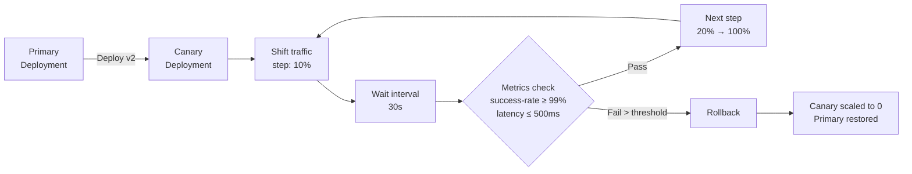
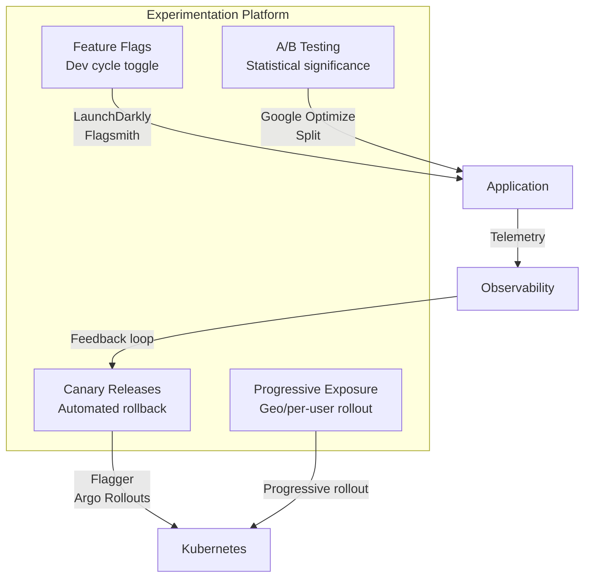

# 12 — Progressive Delivery

## What is it?

Progressive delivery is a set of deployment strategies that gradually introduce changes to users, reducing risk by limiting blast radius. It encompasses canary releases, blue-green deployments, A/B testing, feature flags, traffic mirroring, and automated rollback based on observability signals. Tools like Flagger and Argo Rollouts automate the canary analysis and promotion process on Kubernetes.

## Why it matters

- A bad deployment affects only a small percentage of users initially
- Automated rollback triggers on metric degradation within seconds
- Feature flags decouple deployment from release — ship dark code
- A/B testing enables data-driven product decisions
- Canary analysis validates production behavior before full rollout
- Reduces mean time to recover (MTTR) from deployment failures

## Deployment Strategies



## Flagger (Canary Deployments)

Flagger automates canary releases using service mesh (Istio, Linkerd) or ingress controllers (NGINX, Contour, Gloo).

```yaml
apiVersion: flagger.app/v1beta1
kind: Canary
metadata:
  name: my-app
  namespace: production
spec:
  targetRef:
    apiVersion: apps/v1
    kind: Deployment
    name: my-app
  service:
    port: 80
    portDiscovery: true
  analysis:
    interval: 30s
    threshold: 5
    iterations: 10
    metrics:
      - name: request-success-rate
        thresholdRange:
          min: 99
        interval: 1m
      - name: request-duration
        thresholdRange:
          max: 500
        interval: 1m
    webhooks:
      - name: load-test
        url: http://loadtester.flagger/
        timeout: 30s
        metadata:
          type: cmd
          cmd: "hey -z 5m -q 10 http://my-app.production:80/"
```

### Canary Analysis Flow



### Alerts

```yaml
apiVersion: flagger.app/v1beta1
kind: MetricTemplate
metadata:
  name: latency
spec:
  provider:
    type: prometheus
    address: http://prometheus:9090
  query: |
    histogram_quantile(0.99,
      sum(rate(
        http_request_duration_seconds_bucket{
          namespace="{{ namespace }}",
          app="{{ target }}"
        }[1m]
      )) by (le)
    )
```

## Argo Rollouts

Argo Rollouts provides progressive delivery as a Kubernetes CRD with traffic routing, analysis, and automated rollback.

```yaml
apiVersion: argoproj.io/v1alpha1
kind: Rollout
metadata:
  name: my-app
spec:
  replicas: 10
  strategy:
    canary:
      steps:
        - setWeight: 10
        - pause: {duration: 30s}
        - setWeight: 50
        - pause: {duration: 30s}
        - setWeight: 100
      trafficRouting:
        istio:
          virtualService:
            name: my-app-vsvc
            routes:
              - primary
            # OR with nginx:
            # nginx:
            #   stableIngress: my-app-stable
            #   canaryIngress: my-app-canary
      analysis:
        templates:
          - templateName: success-rate
        startingStep: 1
        args:
          - name: service-name
            value: my-app
  revisionHistoryLimit: 3
```

### Analysis Templates

```yaml
apiVersion: argoproj.io/v1alpha1
kind: AnalysisTemplate
metadata:
  name: success-rate
spec:
  metrics:
    - name: error-rate
      interval: 30s
      successCondition: result < 0.01   # < 1% errors
      failureLimit: 5
      provider:
        prometheus:
          address: http://prometheus:9090
          query: |
            sum(rate(
              http_requests_total{
                namespace="{{args.service-name}}",
                status=~"5.*"
              }[1m]
            ))
            /
            sum(rate(
              http_requests_total{
                namespace="{{args.service-name}}"
              }[1m]
            ))
    - name: latency-p99
      interval: 30s
      successCondition: result < 500
      failureLimit: 3
      provider:
        prometheus:
          address: http://prometheus:9090
          query: |
            histogram_quantile(0.99,
              sum(rate(
                http_request_duration_seconds_bucket{
                  namespace="{{args.service-name}}"
                }[1m]
              )) by (le)
            )
```

## Traffic Mirroring (Shadowing)

```yaml
apiVersion: flagger.app/v1beta1
kind: Canary
spec:
  analysis:
    mirror: true          # Mirror a copy of traffic to canary
    iterations: 5
    metrics:
      - name: request-duration
        thresholdRange:
          max: 500
```

Traffic mirroring sends a copy of live traffic to the canary without serving it to users. Response comparison validates correctness in production conditions without risk.

## Feature Flags

### LaunchDarkly

```javascript
// Application code
const client = LaunchDarkly.initialize("sdk-key-123abc", user);

client.variation("new-checkout-flow", false, (isEnabled) => {
  if (isEnabled) {
    renderNewCheckout();
  } else {
    renderLegacyCheckout();
  }
});
```

### Flagsmith

```python
from flagsmith import Flagsmith

flagsmith = Flagsmith(environment_key="env_key")
flags = flagsmith.get_environment_flags()

if flags.is_feature_enabled("dark_mode"):
    enable_dark_mode()
```

## Experimentation Platform



## Best Practices

- Use canary releases for all backend API changes with automated rollback
- Set meaningful analysis thresholds based on historical baseline metrics
- Combine feature flags with canary deployments — flag gating for kill switches
- Start with 1% traffic for high-risk changes, 10% for standard changes
- Run load tests against the canary during the analysis window
- Configure separate alert severity for deployment failures vs SLO breaches
- Document runbook: what to do when a canary fails and auto-rollback triggers
- Use A/B testing for product experiments, canary releases for reliability

## Interview Questions

| Question | Key points |
|----------|------------|
| *What is the difference between canary and blue-green?* | Canary: gradual traffic shift with monitoring; Blue-green: instant switch with idle environment |
| *How does Flagger determine if a canary is healthy?* | Metric thresholds (success rate, latency) evaluated per interval with failure limit |
| *What is traffic mirroring?* | Send copy of live traffic to canary for validation without user impact |
| *How do feature flags complement progressive delivery?* | Decouple deployment from release; enable kill switches without redeploy |
| *What are Argo Rollouts analysis templates?* | Reusable metric queries with success/failure conditions for automated gating |
| *What metrics should you monitor during a canary?* | Error rate, p99 latency, request throughput, saturation, business metrics |

---

**Next**: [13 — Platform Engineering & Backstage](13-platform-engineering-backstage.md)
