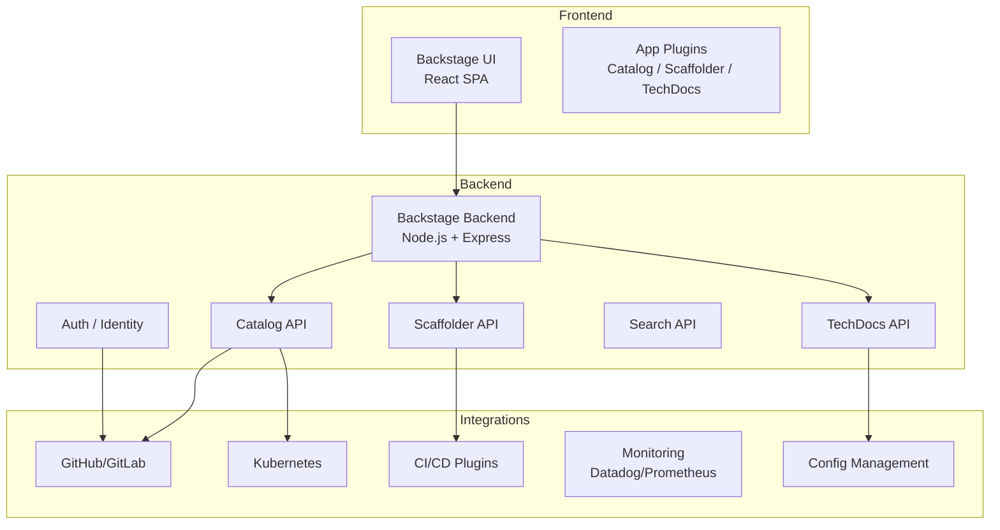
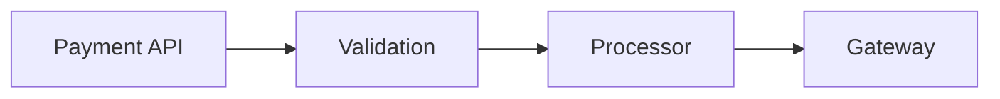

# 13 — Platform Engineering & Backstage

## What is it?

Platform engineering is the practice of building an Internal Developer Platform (IDP) — a layer of tooling, services, and abstractions that enables development teams to self-serve infrastructure, deploy applications, and manage production environments without requiring deep operations expertise. Backstage, created by Spotify, is the leading open-source developer portal that serves as the front end of an IDP.

## Why it matters

- Developers waste 30-40% of their time on infrastructure and tooling overhead
- Platform teams eliminate bottlenecks by providing paved roads and golden paths
- Self-service reduces ticket queues and accelerates developer onboarding
- Backstage unifies fragmented tools (CI/CD, monitoring, docs, services) into one portal
- Platform-as-product thinking treats developers as customers with SLAs

## IDP Concept

```mermaid
graph TB
    subgraph Developer Portal (Backstage)
        CAT[Service Catalog]
        SCA[Software Scaffolder]
        TEC[TechDocs]
        PLU[Plugins]
        SEA[Search]
    end
    subgraph Orchestration Layer
        CROSS[Crossplane<br/>Control Plane]
        HUMAN[Humaitec<br/>Workload Orchestration]
        PORT[Port<br/>Self-Service Actions]
    end
    subgraph Infrastructure Layer
        K8S[Kubernetes]
        TF[Terraform]
        CICD[CI/CD Pipelines]
        CLOUD[Cloud Providers]
    end
    CAT --> CROSS
    SCA --> CROSS
    PLU --> K8S
    CROSS --> CLOUD
    HUMAN --> K8S
    PORT --> TF
```

## Backstage Architecture



### Service Catalog

The catalog registers all software components (services, libraries, websites, APIs):

```yaml
# catalog-info.yaml
apiVersion: backstage.io/v1alpha1
kind: Component
metadata:
  name: payment-service
  description: Handles payment processing
  annotations:
    github.com/project-slug: myorg/payment-service
    backstage.io/techdocs-ref: dir:.
    jenkins.io/github-folder: myorg/payment-service
    prometheus.io/alert: payment-service-alerts
    pagerduty.com/service-id: PD12345
    datadoghq.com/site: datadoghq.com
    datadoghq.com/dashboard-url: https://app.datadoghq.com/dashboard/abc123
spec:
  type: service
  lifecycle: production
  owner: team-payments
  system: payment-platform
  dependsOn:
    - Component:transaction-db
    - Resource:payment-gateway-api
  providesApis:
    - payment-api
  consumesApis:
    - fraud-detection-api
```

### Software Scaffolder

Templates for creating new services with built-in best practices:

```yaml
# templates/new-service/template.yaml
apiVersion: scaffolder.backstage.io/v1beta3
kind: Template
metadata:
  name: new-node-service
  title: Node.js Microservice
  description: Create a new Node.js service with CI/CD, monitoring, and docs
spec:
  owner: platform-team
  type: service
  parameters:
    - title: Service Details
      required: [name, description, owner]
      properties:
        name:
          type: string
          description: Service name
          pattern: '^[a-z0-9-]+$'
        description:
          type: string
          description: Service description
        owner:
          type: string
          description: Team owning this service
          enum: [team-payments, team-checkout, team-identity]
  steps:
    - id: fetch-base
      name: Fetch Template
      action: fetch:template
      input:
        url: ./skeleton
        values:
          name: ${{ parameters.name }}
    - id: create-repo
      name: Create Repository
      action: publish:github
      input:
        repoUrl: github.com?owner=myorg&repo=${{ parameters.name }}
        defaultBranch: main
    - id: register-catalog
      name: Register in Catalog
      action: catalog:register
      input:
        repoContentsUrl: ${{ steps['create-repo'].output.repoContentsUrl }}
        catalogInfoPath: /catalog-info.yaml
```

### TechDocs

Documentation-as-code built into Backstage:

```markdown
# Payment Service

## Overview

Handles payment processing for the checkout flow.

## Architecture



## Runbooks

### High Error Rate

1. Check Datadog dashboard: `payment-service-overview`
2. Verify gateway connectivity: `curl -v https://gateway.example.com/health`
3. Restart if needed: `kubectl rollout restart deployment/payment-service`
```

### Plugins

| Plugin | Function | Integration |
|--------|----------|-------------|
| **Kubernetes** | View pods, deployments, services | `@backstage/plugin-kubernetes` |
| **Datadog** | Dashboards, monitors inside Backstage | `@roadiehq/backstage-plugin-datadog` |
| **PagerDuty** | On-call schedules, incidents | `@backstage/plugin-pagerduty` |
| **AWS** | Account resources, EKS clusters | `@roadiehq/backstage-plugin-aws` |
| **Lighthouse** | Audits and scores | `@backstage/plugin-lighthouse` |
| **GitHub Actions** | Workflow status, re-runs | `@backstage/plugin-github-actions` |
| **Jenkins** | Job status and triggers | `@backstage/plugin-jenkins` |
| **SonarQube** | Code quality metrics | `@backstage/plugin-sonarqube` |
| **Dynatrace** | Monitor problems, metrics | `@backstage/plugin-dynatrace` |
| **Cost Insights** | Cloud cost per service/team | `@backstage/plugin-cost-insights` |

## Alternative Tools

### Port

Port provides a developer portal with a software catalog and self-service actions:

```yaml
# port.yaml
blueprint:
  name: Microservice
  properties:
    - name: language
      type: string
    - name: owner
      type: string
    - name: sla
      type: string
  relations:
    - name: deployed-on
      target: Environment
```

### Humanitec

Workload orchestration platform that abstracts Kubernetes complexity:

```yaml
# resource-definition.yaml
apiVersion: humanitec.io/v1alpha1
kind: Definition
metadata:
  name: postgres-db
spec:
  type: postgres
  driver: terraform
  driverInputs:
    values:
      region: us-east-1
      instance_class: db.t3.small
      storage_gb: 100
```

### Crossplane

Control plane that composes cloud infrastructure into custom APIs:

```yaml
apiVersion: apiextensions.crossplane.io/v1
kind: CompositeResourceDefinition
metadata:
  name: xpostgresqlinstances.database.example.org
spec:
  group: database.example.org
  names:
    kind: XPostgreSQLInstance
  claimNames:
    kind: PostgreSQLInstance
  versions:
    - name: v1
      schema:
        openAPIV3Schema:
          type: object
          properties:
            spec:
              type: object
              properties:
                region:
                  type: string
                storageGB:
                  type: integer
```

## Platform as Product

| Principle | Implementation |
|-----------|---------------|
| **Treat developers as customers** | Surveys, usage analytics, NPS scores |
| **Paved roads, not gatekeeping** | Golden path templates with escape hatches |
| **Self-service first** | Portal UI for all common operations |
| **Documentation integrated** | TechDocs alongside the code |
| **Feedback loops** | Feature requests, issue tracking, office hours |
| **SLA for the platform** | Uptime, latency, request fulfillment time |
| **Versioned APIs** | Platform APIs with deprecation policies |

## Best Practices

- Start with the software catalog — register all services before building anything else
- Build golden path templates for your most common service types (Node.js, Python, Go)
- Use TechDocs to consolidate documentation scattered across wikis and READMEs
- Integrate monitoring plugins (Datadog, PagerDuty) for operational context
- Implement ownership metadata — every service must have an owner and lifecycle status
- Use scaffolder actions to enforce standards (linters, CI configs, security scanning)
- Run Backstage as a service with high availability — your developers depend on it
- Measure portal adoption: active users, templates used, services registered

## Interview Questions

| Question | Key points |
|----------|------------|
| *What is an Internal Developer Platform (IDP)?* | Abstraction layer enabling developer self-service for infrastructure and deployments |
| *How does Backstage implement the service catalog?* | YAML metadata files (`catalog-info.yaml`) registered via Git integration |
| *What is the scaffolder used for?* | Create new projects from templates with built-in best practices |
| *How do plugins extend Backstage?* | React frontend + Node.js backend plugins; ecosystem includes monitoring, CI/CD, cost tools |
| *What differentiates Backstage from Port/Humanitec?* | Backstage: open-source catalog + scaffolder; Port: catalog + actions; Humanitec: workload orchestration |
| *What is Crossplane and how does it relate?* | Cloud control plane composing resources into custom APIs; used by IDPs as the orchestration backend |
| *What does platform-as-product mean?* | Treat internal developers as customers; measure adoption, satisfaction, and platform SLAs |

---

**Next**: [14 — Shift-Left Deep Dive](14-shift-left-deep-dive.md)
