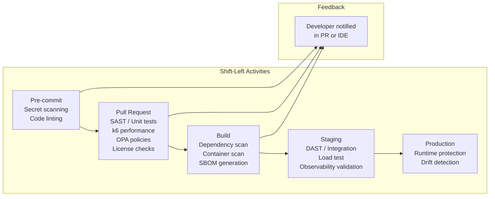

# 14 — Shift-Left Deep Dive

## What is it?

Shift-left is the practice of moving testing, security, compliance, and quality assurance activities earlier in the software development lifecycle — from post-deployment (right) to design, commit, and build stages (left). The goal is to catch defects, vulnerabilities, and policy violations when they are cheapest and fastest to fix. Modern shift-left covers security scanning (SAST/DAST/SCA), performance testing, compliance policy checks, and observability validation.

## Why it matters

- Fixing a vulnerability in production costs 30x more than during development
- Security reviews after deployment create release bottlenecks and friction
- Performance regressions caught post-deployment require expensive rollbacks
- Compliance violations found late can block regulatory approvals
- Developer feedback loops shorten when issues surface in the PR, not in the pager

## Shift-Left SDLC



## 1. Security Shift-Left

### SAST (Static Application Security Testing)

```yaml
# .github/workflows/sast.yml
name: SAST
on: [pull_request]
jobs:
  semgrep:
    runs-on: ubuntu-latest
    steps:
      - uses: actions/checkout@v3
      - uses: returntocorp/semgrep-action@v1
        with:
          config: p/default
  codeql:
    uses: github/codeql-action/analyze@v2
    with:
      languages: javascript, python
```

```bash
# Local pre-commit
semgrep --config p/default --error .
```

### DAST (Dynamic Application Security Testing)

```yaml
# DAST against staging environment
- name: ZAP Scan
  uses: zaproxy/action-full-scan@v0
  with:
    target: 'https://staging.myapp.com'
    rules_file_name: '.zap/rules.tsv'
    cmd_options: '-a'
    issue_title: 'ZAP Scan Report'
```

### IAST (Interactive Application Security Testing)

IAST instruments the running application during functional tests, combining SAST depth with DAST runtime context:

```java
// Contrast Security / Hdiv agent monitors during integration tests
@SpringBootTest
@AutoConfigureMockMvc
class PaymentControllerTest {
    @Autowired
    private MockMvc mockMvc;

    @Test
    void whenValidPayment_thenAccepted() throws Exception {
        // IAST agent analyzes code paths and data flow in real time
        mockMvc.perform(post("/payments")
            .content("{\"amount\":100,\"currency\":\"USD\"}"))
            .andExpect(status().isAccepted());
    }
}
```

### SCA (Software Composition Analysis)

```yaml
- name: Dependency Review
  uses: actions/dependency-review-action@v3
  with:
    fail-on-severity: high

- name: Trivy Scan
  uses: aquasecurity/trivy-action@master
  with:
    scan-type: fs
    scan-ref: .
    format: sarif
    output: trivy-results.sarif
    severity: HIGH,CRITICAL

- name: SBOM Generation
  uses: anchore/sbom-action@v0
  with:
    path: .
    format: spdx-json
    output-file: sbom.spdx.json
```

### Container Scanning

```yaml
- name: Build and Scan Container
  run: |
    docker build -t myapp:$GITHUB_SHA .
    trivy image --severity HIGH,CRITICAL --exit-code 1 myapp:$GITHUB_SHA
  # Fails the build if HIGH/CRITICAL vulnerabilities found
```

## 2. Performance Shift-Left

### k6 Load Testing in CI

```javascript
// tests/performance/checkout.test.js
import http from 'k6/http';
import { check, sleep } from 'k6';

export const options = {
  vus: 10,
  duration: '30s',
  thresholds: {
    http_req_duration: ['p(95)<500'],  // 95% of requests under 500ms
    http_req_failed: ['rate<0.01'],    // < 1% failure rate
  },
};

export default function () {
  const res = http.get('https://staging.myapp.com/api/health');
  check(res, {
    'status is 200': (r) => r.status === 200,
    'response time < 300ms': (r) => r.timings.duration < 300,
  });
}
```

```yaml
# CI integration
- name: k6 Load Test
  uses: grafana/k6-action@v0.3.1
  with:
    filename: tests/performance/checkout.test.js
    flags: --out json=loadtest-results.json
```

### Artillery

```yaml
# artillery/test.yml
config:
  target: 'https://staging.myapp.com'
  phases:
    - duration: 60
      arrivalRate: 5
scenarios:
  - flow:
      - get:
          url: '/api/search?q=test'
          expect:
            statusCode: 200
            contentType: json
            maxResponseTime: 1000
```

### Lighthouse CI (Web Performance)

```yaml
- name: Lighthouse CI
  uses: treosh/lighthouse-ci-action@v9
  with:
    urls: |
      https://staging.myapp.com
      https://staging.myapp.com/checkout
    uploadArtifacts: true
    temporaryPublicStorage: true
    budgetPath: ./lighthouse-budget.json
```

```json
// lighthouse-budget.json
[{
  "path": "/",
  "timings": [{"resourceType": "total", "maxNumericValue": 3000}],
  "scores": [
    {"name": "performance", "maxNumericValue": 0.9},
    {"name": "accessibility", "maxNumericValue": 0.9}
  ]
}]
```

## 3. Compliance Shift-Left

### OPA/Rego in CI Pipeline

```rego
# policy/deploy.rego
package deploy

# Reject deployments without required labels
deny[msg] {
    input.kind == "Deployment"
    not input.metadata.labels["security-tier"]
    msg := "All deployments must have 'security-tier' label"
}

# Reject containers running as root
deny[msg] {
    input.kind == "Deployment"
    container := input.spec.template.spec.containers[_]
    not container.securityContext.runAsNonRoot
    msg := sprintf("Container %v must run as non-root", [container.name])
}
```

```bash
# In CI: validate Kubernetes manifests against policies
kustomize build overlays/staging > manifests.yaml
opa eval --data policy --input manifests.yaml "data.deploy.deny"
```

### Conftest

```yaml
- name: Conftest Policy Check
  run: |
    conftest test manifests.yaml \
      --policy policy/ \
      --namespace deploy \
      --all-namespaces
```

## 4. Observability Shift-Left

### OTel in Integration Tests

```go
// tests/integration/otel_test.go
func TestObservabilitySignals(t *testing.T) {
    // Start test application with OTel SDK
    app := startTestApp()

    // Make a request
    resp, _ := http.Get("http://localhost:8080/api/orders")

    // Assert metrics were emitted
    metrics := app.MetricExporter.GetMetrics()
    assert.Contains(t, metrics, "http.server.request_count")
    assert.Greater(t, metrics["http.server.request_count"], 0)

    // Assert traces were emitted
    spans := app.SpanExporter.GetSpans()
    assert.Len(t, spans, 1)
    assert.Equal(t, "GET /api/orders", spans[0].Name)

    // Assert correct span attributes
    assert.Equal(t, "200", spans[0].Attributes["http.status_code"])
    assert.Equal(t, "GET", spans[0].Attributes["http.method"])
}
```

### SLO Validation in CI

```python
# tests/sli_validation.py
from prometheus_api_client import PrometheusConnect

def test_sli_after_deploy():
    prom = PrometheusConnect(url="http://prometheus-staging:9090")
    query = """
        sum(rate(http_requests_total{status=~"5.."}[5m]))
        / sum(rate(http_requests_total[5m]))
    """
    error_rate = float(prom.custom_query(query=query)[0]["value"][1])
    assert error_rate < 0.01, f"Error rate {error_rate} exceeds SLO threshold"
```

## Developer Feedback Loops

```mermaid
graph TB
    subgraph Immediate (Seconds)
        IDE[IDE Plugin<br/>lint / format / secret]
        PH[Pre-commit Hook<br/>tflint / gitleaks]
    end
    subgraph Fast (Minutes)
        PR[PR Check<br/>SAST / test / OPA]
        CI[CI Pipeline<br/>build / scan / k6]
    end
    subgraph Deliberate (Hours)
        QA[QA Review<br/>DAST / penetration]
        PERF[Perf Test<br/>Load test / budget]
    end
    IDE --> PH --> PR --> CI --> QA --> PERF
```

## Culture and Adoption

| Barrier | Solution |
|---------|----------|
| **"Security slows us down"** | Automate checks in CI — zero manual overhead |
| **"Too many false positives"** | Tune rule severity; use baseline exceptions |
| **"Tests take too long"** | Run fast tests in PR, slow tests async |
| **"My code is fine"** | Blameless culture; security champions in each team |
| **"We've never done this"** | Start with one team, prove value, expand |

## Best Practices

- Run SAST and dependency scanning in every pull request — fail on critical severity
- Shift container scanning to build time, not runtime
- Use OPA/Conftest to validate Kubernetes manifests before deployment
- Add performance budgets (Lighthouse, k6 thresholds) to CI gate
- Validate observability signals (metrics, traces, logs) in integration tests
- Surface results inline in PR comments — don't require a separate tool access
- Start with 5-10 high-value policies; expand based on real incidents
- Measure shift-left maturity: mean time to detection, % issues caught pre-production

## Interview Questions

| Question | Key points |
|----------|------------|
| *What does shift-left mean in DevOps?* | Moving testing, security, and compliance earlier in the SDLC — from production to CI/IDE |
| *How does SAST differ from DAST?* | SAST analyzes source code statically; DAST tests running application dynamically |
| *What is SCA and when should it run?* | Software Composition Analysis scans dependencies for known vulnerabilities; run at build time |
| *How do you shift-left performance testing?* | Use k6/Artillery in CI with pass/fail thresholds; Lighthouse budgets for web |
| *What role does OPA play in shift-left?* | Policy-as-code validates Kubernetes manifests, Terraform plans, and CI configs against compliance rules |
| *How do you validate observability in tests?* | Start app with OTel SDK, emit metrics/traces, assert they're captured correctly |
| *How do you measure shift-left maturity?* | % of issues caught pre-production, MTD (mean time to detection), PR feedback time |

---

**Next**: [15-SRE/01-slo-sli-error-budgets.md](../15-SRE/01-slo-sli-error-budgets.md)
